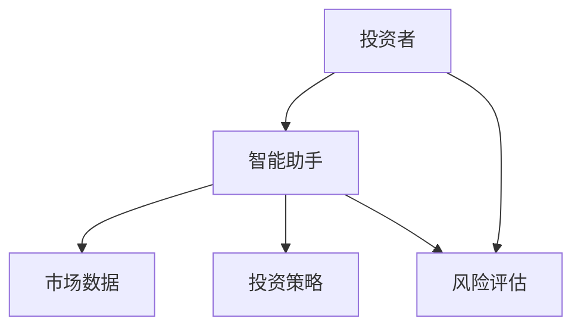
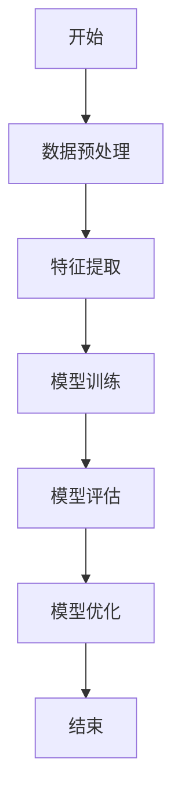
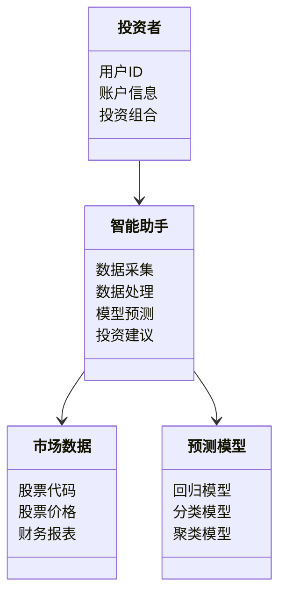
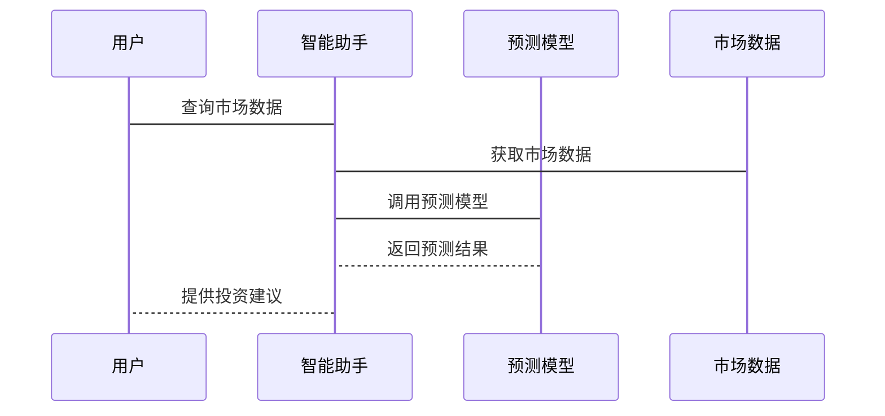

                 


# 投资理财智能助手的基本概念

## 关键词：投资理财、智能助手、人工智能、算法原理、系统设计、项目实战

## 摘要：  
投资理财智能助手是一种结合人工智能技术的工具，旨在帮助用户做出更科学的投资决策。本文将从背景、核心概念、算法原理、系统设计、项目实战等多个方面详细探讨投资理财智能助手的基本概念，帮助读者全面理解其工作原理和实际应用。

---

# 第1章: 投资理财智能助手的背景与问题背景

## 1.1 问题背景

### 1.1.1 传统投资理财的痛点
传统投资理财过程中，投资者面临诸多痛点，包括：
- **信息不对称**：市场数据复杂且更新频繁，普通投资者难以快速获取和分析有效信息。
- **决策难度大**：投资决策需要考虑市场趋势、个人风险承受能力等多方面因素，过程复杂且耗时。
- **情绪化决策**：投资者容易受到市场波动和个人情绪的影响，导致非理性决策。

### 1.1.2 人工智能在投资理财中的应用潜力
人工智能（AI）技术的快速发展为投资理财领域带来了新的可能性。AI可以通过以下方式提升投资决策的效率和准确性：
- **数据处理能力**：AI能够快速分析大量市场数据，发现潜在的投资机会。
- **预测模型**：基于历史数据，AI可以构建预测模型，帮助投资者预判市场趋势。
- **个性化建议**：通过机器学习，AI可以为不同风险偏好的投资者提供定制化的投资建议。

### 1.1.3 智能助手在投资理财中的价值
智能助手通过整合AI技术，能够为投资者提供以下价值：
- **实时监控**：实时跟踪市场动态，及时提醒用户潜在的投资机会或风险。
- **风险评估**：基于大数据分析，评估投资组合的风险，帮助用户做出更明智的决策。
- **个性化服务**：根据用户的财务状况和投资目标，提供个性化的投资建议。

## 1.2 问题描述

### 1.2.1 投资者的需求分析
投资者的核心需求包括：
- **信息获取**：快速获取准确的市场数据和行业动态。
- **决策支持**：通过数据分析和预测模型，辅助投资决策。
- **风险控制**：实时监控投资组合的风险，降低损失。

### 1.2.2 理财工具的局限性
传统理财工具的局限性主要体现在：
- **数据处理能力有限**：传统工具难以处理海量数据，且更新速度较慢。
- **缺乏个性化**：大多数工具提供的是通用建议，难以满足个性化需求。
- **交互性差**：传统工具通常不具备实时互动功能，用户体验较差。

### 1.2.3 人工智能如何解决这些问题
人工智能技术的应用可以有效解决传统理财工具的局限性：
- **数据处理能力提升**：AI能够快速处理和分析大量数据，提供实时的市场动态。
- **个性化服务**：通过机器学习，AI可以根据用户的财务状况和投资目标，提供定制化的投资建议。
- **交互性增强**：智能助手可以通过自然语言处理（NLP）与用户互动，提供更便捷的服务。

## 1.3 问题解决

### 1.3.1 智能助手的核心功能
投资理财智能助手的核心功能包括：
- **市场数据监控**：实时跟踪股票、基金、债券等市场的动态。
- **投资组合分析**：根据用户的投资组合，评估风险和收益。
- **个性化建议**：基于用户的风险偏好和财务状况，提供定制化的投资建议。

### 1.3.2 技术实现路径
实现投资理财智能助手的技术路径主要包括：
1. **数据采集**：从多个数据源获取市场数据，包括股票价格、财务报表等。
2. **数据预处理**：清洗和整理数据，去除噪声数据。
3. **模型构建**：基于机器学习算法，构建预测模型。
4. **用户交互**：通过自然语言处理技术，与用户进行互动，提供实时建议。

### 1.3.3 用户体验优化
用户体验是智能助手成功的关键，优化措施包括：
- **简洁的用户界面**：设计直观的界面，方便用户操作。
- **实时反馈**：快速响应用户查询，提供即时建议。
- **个性化提醒**：根据用户的投资目标，设置提醒功能。

## 1.4 边界与外延

### 1.4.1 智能助手的功能边界
智能助手的功能边界包括：
- **数据范围**：仅限于市场数据和用户提供的财务信息。
- **服务范围**：不涉及实际的交易操作，仅提供决策支持。
- **使用场景**：适用于个人投资者，不支持机构投资者。

### 1.4.2 与传统理财工具的区别
与传统理财工具相比，智能助手的优势在于：
- **数据处理能力**：能够快速分析海量数据。
- **个性化服务**：提供定制化的投资建议。
- **实时互动**：支持实时查询和互动。

### 1.4.3 与其他智能工具的对比
与其他智能工具的对比：
- **与智能音箱**：智能助手专注于投资理财，而智能音箱主要用于日常生活控制。
- **与聊天机器人**：智能助手结合了投资理财的专业知识，而聊天机器人主要用于日常对话。

## 1.5 概念结构与核心要素

### 1.5.1 核心概念组成
投资理财智能助手的核心概念组成包括：
- **市场数据**：包括股票价格、财务报表等。
- **用户数据**：包括用户的财务状况和投资目标。
- **预测模型**：基于机器学习的预测模型。

### 1.5.2 核心要素的层次结构
核心要素的层次结构如下：
1. **市场数据**：底层数据，包括股票价格、财务报表等。
2. **用户数据**：用户的财务状况和投资目标。
3. **预测模型**：基于机器学习算法构建的预测模型。
4. **智能助手**：整合上述要素，提供投资建议。

### 1.5.3 概念之间的关系
概念之间的关系可以用以下表格表示：

| 概念 | 关系 | 说明 |
|------|------|------|
| 市场数据 | 输入 | 预测模型的输入数据 |
| 用户数据 | 输入 | 预测模型的输入数据 |
| 预测模型 | 输出 | 智能助手的投资建议 |

## 1.6 本章小结
本章从问题背景、问题描述、问题解决等多个方面探讨了投资理财智能助手的基本概念。通过分析传统投资理财的痛点和人工智能的应用潜力，明确了智能助手的核心功能和价值。同时，通过对比传统理财工具和其他智能工具，界定了智能助手的功能边界。

---

# 第2章: 投资理财智能助手的核心概念与联系

## 2.1 核心概念原理

### 2.1.1 人工智能在投资理财中的应用原理
人工智能在投资理财中的应用原理主要包括：
1. **数据采集与处理**：从多个数据源获取市场数据，进行清洗和整理。
2. **模型构建与训练**：基于机器学习算法，构建预测模型，并进行训练。
3. **预测与建议**：根据预测结果，生成投资建议。

### 2.1.2 数据驱动的投资决策模型
数据驱动的投资决策模型基于以下步骤：
1. **数据采集**：获取市场数据和用户数据。
2. **数据预处理**：清洗数据，去除噪声。
3. **模型构建**：基于机器学习算法，构建预测模型。
4. **预测与分析**：根据预测结果，分析投资机会和风险。

### 2.1.3 智能助手的算法基础
智能助手的算法基础主要包括：
- **监督学习**：用于分类和回归问题。
- **无监督学习**：用于聚类分析。
- **强化学习**：用于动态决策。

## 2.2 核心概念属性特征对比

### 2.2.1 概念属性表格对比
以下是核心概念属性特征的对比表格：

| 概念 | 属性 | 特征 |
|------|------|------|
| 市场数据 | 数据类型 | 股票价格、财务报表 |
| 用户数据 | 数据类型 | 财务状况、投资目标 |
| 预测模型 | 算法类型 | 回归、分类、聚类 |

### 2.2.2 概念之间的关系分析
概念之间的关系分析：
- **市场数据与用户数据**：市场数据是预测模型的输入，用户数据是预测模型的另一个输入。
- **预测模型与智能助手**：预测模型是智能助手的核心部分，智能助手根据预测模型的结果提供投资建议。

### 2.2.3 属性特征的优缺点
属性特征的优缺点：
- **市场数据**：优点是实时性强，缺点是数据量大，处理复杂。
- **用户数据**：优点是个性化强，缺点是数据获取难度大。
- **预测模型**：优点是准确性高，缺点是模型复杂，需要大量数据支持。

## 2.3 ER实体关系图架构



## 2.4 本章小结
本章详细探讨了投资理财智能助手的核心概念与联系，包括人工智能的应用原理、数据驱动的投资决策模型以及核心概念之间的关系。通过对比分析，明确了各概念的属性特征和关系，为后续章节的系统设计和项目实现奠定了基础。

---

# 第3章: 投资理财智能助手的算法原理

## 3.1 算法原理概述

### 3.1.1 基于机器学习的投资决策模型
基于机器学习的投资决策模型主要包括：
1. **数据预处理**：清洗和整理数据，去除噪声。
2. **特征提取**：提取有用的特征，如股票的市盈率、市净率等。
3. **模型训练**：基于机器学习算法，训练预测模型。
4. **模型评估**：评估模型的准确性和稳定性。

### 3.1.2 算法选择与优化
算法选择与优化的关键点：
- **算法选择**：根据问题类型选择合适的算法，如回归、分类、聚类等。
- **模型优化**：通过交叉验证、网格搜索等方法优化模型参数。
- **性能评估**：通过准确率、召回率、F1值等指标评估模型性能。

### 3.1.3 算法实现步骤
算法实现步骤如下：
1. **数据预处理**：清洗和整理数据。
2. **特征提取**：提取有用的特征。
3. **模型训练**：选择合适的算法，训练模型。
4. **模型评估**：评估模型的性能。
5. **模型优化**：优化模型参数，提高准确率。

## 3.2 算法流程图



## 3.3 算法实现的数学模型和公式

### 3.3.1 回归模型
回归模型用于预测连续型变量，如股票价格。线性回归的数学公式为：
$$ y = \beta_0 + \beta_1 x + \epsilon $$
其中，$y$ 是目标变量，$x$ 是自变量，$\beta_0$ 是截距，$\beta_1$ 是回归系数，$\epsilon$ 是误差项。

### 3.3.2 分类模型
分类模型用于预测分类变量，如股票的涨跌。逻辑回归的数学公式为：
$$ P(y=1|x) = \frac{e^{\beta_0 + \beta_1 x}}{1 + e^{\beta_0 + \beta_1 x}} $$

### 3.3.3 聚类模型
聚类模型用于将数据分成不同的类别，如客户分群。K-means算法的目标函数为：
$$ \min_{K} \sum_{i=1}^{n} \sum_{j=1}^{K} (x_i - \mu_j)^2 $$

## 3.4 本章小结
本章详细探讨了投资理财智能助手的算法原理，包括基于机器学习的投资决策模型、算法选择与优化以及具体的数学模型和公式。通过流程图和公式分析，明确了算法实现的关键步骤和数学基础。

---

# 第4章: 投资理财智能助手的系统分析与架构设计

## 4.1 系统分析

### 4.1.1 项目介绍
投资理财智能助手是一个基于人工智能的工具，旨在帮助投资者做出更科学的投资决策。项目目标包括：
- 提供实时的市场数据监控。
- 提供个性化的投资建议。
- 实现用户友好的交互界面。

### 4.1.2 项目场景介绍
项目场景包括：
1. **用户登录与注册**：用户通过登录或注册使用智能助手。
2. **数据查询**：用户可以查询市场数据和历史数据。
3. **投资建议**：用户可以根据预测结果获得投资建议。
4. **风险评估**：用户可以评估投资组合的风险。

## 4.2 系统功能设计

### 4.2.1 领域模型类图
以下是领域模型类图：



### 4.2.2 系统架构设计
系统架构设计包括：
1. **数据层**：包括市场数据和用户数据。
2. **模型层**：包括预测模型和数据处理逻辑。
3. **服务层**：包括智能助手的核心功能，如数据查询和投资建议。
4. **用户界面层**：包括前端界面和用户交互逻辑。

### 4.2.3 系统接口设计
系统接口设计包括：
1. **数据接口**：用于获取市场数据和用户数据。
2. **预测接口**：用于调用预测模型。
3. **建议接口**：用于生成投资建议。

## 4.3 系统交互序列图



## 4.4 本章小结
本章从系统分析和架构设计的角度，详细探讨了投资理财智能助手的实现方案。通过领域模型类图和系统架构图，明确了系统的各个部分及其交互关系，为后续的项目实现奠定了基础。

---

# 第5章: 投资理财智能助手的项目实战

## 5.1 环境安装

### 5.1.1 安装Python
安装Python的步骤如下：
1. 访问Python官网（https://www.python.org/）。
2. 下载并安装适合的Python版本。
3. 验证安装：打开命令行，输入`python --version`。

### 5.1.2 安装依赖库
安装依赖库的步骤如下：
1. 安装NumPy：`pip install numpy`
2. 安装Pandas：`pip install pandas`
3. 安装Scikit-learn：`pip install scikit-learn`
4. 安装Matplotlib：`pip install matplotlib`

## 5.2 系统核心实现源代码

### 5.2.1 数据预处理代码
以下是数据预处理的Python代码：

```python
import pandas as pd
import numpy as np

# 加载数据
data = pd.read_csv('market_data.csv')

# 数据清洗
data = data.dropna()
data = data.replace({np.nan: 0})

# 特征提取
features = data[['open', 'high', 'low', 'volume']]
label = data['close']
```

### 5.2.2 模型训练代码
以下是模型训练的Python代码：

```python
from sklearn.model_selection import train_test_split
from sklearn.linear_model import LinearRegression

# 划分数据集
X_train, X_test, y_train, y_test = train_test_split(features, label, test_size=0.2)

# 训练模型
model = LinearRegression()
model.fit(X_train, y_train)

# 预测结果
y_pred = model.predict(X_test)
```

### 5.2.3 模型评估代码
以下是模型评估的Python代码：

```python
from sklearn.metrics import mean_squared_error

# 计算均方误差
mse = mean_squared_error(y_test, y_pred)
print('均方误差:', mse)

# 计算决定系数
r2 = model.score(X_test, y_test)
print('决定系数:', r2)
```

## 5.3 代码解读与分析
代码解读与分析：
- **数据预处理**：加载数据，清洗数据，提取特征。
- **模型训练**：使用线性回归算法训练模型。
- **模型评估**：计算均方误差和决定系数，评估模型性能。

## 5.4 案例分析与详细讲解
案例分析：
假设我们有一个包含股票价格数据的数据集，我们可以使用上述代码进行数据预处理和模型训练。通过模型预测股票价格，评估模型的准确性和稳定性。

## 5.5 项目小结
本章通过实际项目案例，详细讲解了投资理财智能助手的实现过程，包括环境安装、数据预处理、模型训练和模型评估。通过代码示例，帮助读者理解智能助手的核心实现逻辑。

---

# 第6章: 投资理财智能助手的最佳实践与总结

## 6.1 最佳实践

### 6.1.1 数据处理
- 确保数据来源的可靠性和时效性。
- 定期更新数据，保持模型的准确性。

### 6.1.2 模型优化
- 使用交叉验证优化模型参数。
- 定期重新训练模型，适应市场变化。

### 6.1.3 用户体验
- 提供简洁直观的用户界面。
- 提供个性化的投资建议。

## 6.2 项目总结

### 6.2.1 核心内容回顾
投资理财智能助手的核心内容包括：
- 数据采集与处理。
- 机器学习模型的构建与训练。
- 智能助手的系统设计与实现。

### 6.2.2 项目价值
投资理财智能助手的价值体现在：
- 提高投资决策的效率和准确性。
- 降低投资风险，优化投资组合。
- 提供个性化的投资建议。

## 6.3 未来展望

### 6.3.1 技术发展趋势
未来，人工智能技术在投资理财领域的应用将更加广泛和深入，包括：
- 更加复杂的预测模型。
- 更加个性化的投资建议。
- 更加智能化的交互方式。

### 6.3.2 应用场景扩展
投资理财智能助手的应用场景将更加多样化，包括：
- 机构投资者的应用。
- 跨平台的应用，如移动应用和网页应用。

## 6.4 注意事项

### 6.4.1 数据隐私
- 保护用户数据隐私，确保数据安全。
- 遵守相关法律法规，合法合规地处理数据。

### 6.4.2 模型风险
- 定期评估模型性能，及时优化模型。
- 避免过度拟合，确保模型的泛化能力。

## 6.5 拓展阅读

### 6.5.1 推荐书籍
- 《Python机器学习实战》。
- 《投资学原理》。

### 6.5.2 推荐博客
- TensorFlow官方博客。
- Keras官方博客。

## 6.6 本章小结
本章总结了投资理财智能助手的最佳实践，回顾了项目的核心内容和价值，并展望了未来的技术发展趋势和应用场景。同时，提出了数据隐私和模型风险的注意事项，并推荐了相关的拓展阅读资料。

---

# 结语

投资理财智能助手是一项结合人工智能技术的创新应用，旨在帮助投资者做出更科学的投资决策。通过本文的探讨，我们深入了解了智能助手的核心概念、算法原理和系统设计，并通过实际项目案例，验证了其可行性和实用性。未来，随着人工智能技术的不断发展，投资理财智能助手将在投资决策中发挥越来越重要的作用。

---

# 关键词：投资理财、智能助手、人工智能、算法原理、系统设计、项目实战

