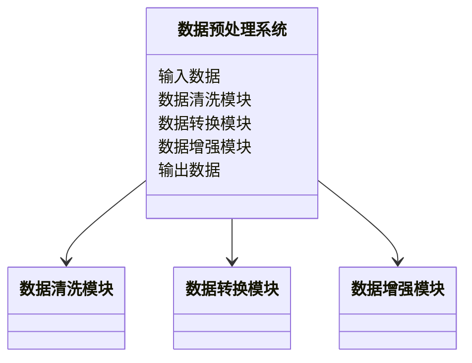
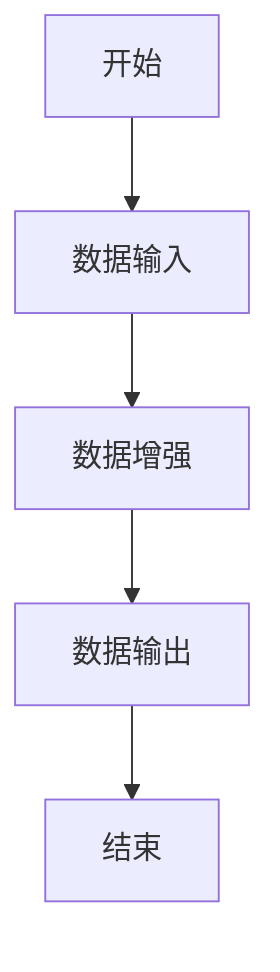

                 


# 投资理财智能助手的数据收集与预处理技巧

## 关键词：投资理财，数据收集，数据预处理，智能助手，机器学习，数据清洗，数据转换

## 摘要：本文深入探讨了投资理财智能助手在数据收集与预处理过程中的关键技巧，从背景、核心概念到算法原理、系统架构，再到实战案例，全面解析了如何高效、准确地进行数据处理，为投资决策提供可靠支持。

---

# 第一部分: 投资理财智能助手的背景与数据收集基础

## 第1章: 投资理财智能助手的背景与目标

### 1.1 投资理财领域的数据化趋势

#### 1.1.1 数据驱动的投资决策
在现代投资理财中，数据已成为最重要的决策依据。通过分析历史市场数据、用户行为数据和经济指标，智能助手能够为投资者提供个性化的建议。

#### 1.1.2 智能化投资助手的定义与目标
智能化投资助手通过整合多源数据，利用机器学习算法，为用户提供实时市场监控、风险评估和投资策略建议。

#### 1.1.3 数据在投资理财中的核心作用
数据是智能助手的基石。通过数据处理技术，助手能够从海量信息中提取有价值的信息，帮助用户做出明智的投资决策。

### 1.2 数据收集的必要性与挑战

#### 1.2.1 数据收集的必要性
数据收集是构建智能助手的第一步，它决定了后续分析的质量和准确性。

#### 1.2.2 数据收集的主要挑战
- 数据源的多样性与复杂性
- 数据质量的参差不齐
- 数据隐私与合规性问题

#### 1.2.3 数据隐私与合规性问题
在数据收集过程中，必须严格遵守相关法律法规，保护用户隐私，确保数据安全。

### 1.3 本章小结
本章介绍了投资理财智能助手的背景及其在数据驱动决策中的重要性，同时分析了数据收集的主要挑战和隐私问题。

---

## 第2章: 数据收集与预处理的核心概念

### 2.1 数据收集的基本原理

#### 2.1.1 数据来源的分类
- 市场数据：股票价格、指数、交易量等
- 用户数据：用户行为、投资偏好
- 新闻数据：财经新闻、市场评论

#### 2.1.2 数据收集的流程
1. 确定数据需求
2. 选择数据源
3. 设计数据采集方案
4. 实施数据采集

#### 2.1.3 数据收集的关键属性对比表
| 属性 | 定义 | 示例 |
|------|------|------|
| 数据源类型 | 数据的来源 | 股票市场、新闻网站 |
| 数据格式 | 数据的组织形式 | CSV、JSON、数据库 |
| 数据频率 | 数据的更新频率 | 实时、每日、每周 |

### 2.2 数据预处理的定义与目标

#### 2.2.1 数据预处理的定义
数据预处理是将收集到的数据进行清洗、转换和增强，以提高数据质量和适用性。

#### 2.2.2 数据预处理的主要目标
- 提高数据准确性
- 增强数据一致性
- 丰富数据特征

#### 2.2.3 数据预处理与数据收集的关系
数据预处理是对数据收集的补充和完善，确保数据的可用性和分析价值。

### 2.3 数据预处理的关键步骤

#### 2.3.1 数据清洗
- 删除重复数据
- 填补缺失值
- 删除异常值

#### 2.3.2 数据转换
- 标准化与归一化
- 特征编码
- 时间序列数据处理

#### 2.3.3 数据增强
- 数据扩展
- 数据模拟

### 2.4 数据预处理的系统架构

#### 2.4.1 数据预处理系统类图（Mermaid）


### 2.5 本章小结
本章详细介绍了数据收集与预处理的核心概念，包括数据来源、预处理步骤和系统架构。

---

## 第3章: 数据收集与预处理的算法原理

### 3.1 数据清洗算法

#### 3.1.1 缺失值处理
- 删除法：直接删除有缺失值的样本
- 填充法：使用均值、中位数或特定值填充缺失值

#### 3.1.2 重复值处理
- 识别重复值
- 删除重复值

#### 3.1.3 异常值处理
- 统计方法：Z-score、IQR
- 机器学习方法：Isolation Forest

### 3.2 数据转换算法

#### 3.2.1 标准化与归一化
- 标准化公式：
$$ x_{标准化} = \frac{x - \mu}{\sigma} $$
- 归一化公式：
$$ x_{归一化} = \frac{x - x_{min}}{x_{max} - x_{min}} $$

#### 3.2.2 特征编码
- 独热编码：将分类变量转换为二进制向量
- 标签编码：将分类变量映射为整数

#### 3.2.3 时间序列数据处理
- 数据平滑：移动平均、指数平滑
- 数据分解：趋势、季节性、噪声

### 3.3 数据增强算法

#### 3.3.1 数据增强的基本原理
通过生成新的数据样本，增加数据多样性，提高模型泛化能力。

#### 3.3.2 基于机器学习的增强方法
- 数据扩展：使用数据增强库（如Keras ImageDataGenerator）
- 数据模拟：生成合成数据

#### 3.3.3 数据增强的实现流程图（Mermaid）


### 3.4 算法实现的数学模型

#### 3.4.1 数据标准化公式
$$ x_{标准化} = \frac{x - \mu}{\sigma} $$

#### 3.4.2 数据归一化公式
$$ x_{归一化} = \frac{x - x_{min}}{x_{max} - x_{min}} $$

#### 3.4.3 异常值检测的Z-score公式
$$ Z = \frac{x - \mu}{\sigma} $$

### 3.5 本章小结
本章详细讲解了数据清洗、转换和增强的算法原理，并通过公式和流程图展示了实现步骤。

---

## 第4章: 数据预处理的系统架构与实战

### 4.1 系统架构设计

#### 4.1.1 项目介绍
开发一个投资理财智能助手，通过数据预处理提高数据分析的准确性。

#### 4.1.2 系统功能设计
- 数据采集模块
- 数据清洗模块
- 数据转换模块
- 数据增强模块

#### 4.1.3 系统架构设计（Mermaid）


### 4.2 项目实战

#### 4.2.1 环境安装
- 安装Python和相关库（pandas、numpy、scikit-learn）

#### 4.2.2 系统核心实现源代码

```python
import pandas as pd
import numpy as np

# 数据清洗
def clean_data(df):
    # 删除重复值
    df.drop_duplicates(inplace=True)
    # 填充缺失值
    df.fillna(df.mean(), inplace=True)
    # 删除异常值
    df = df[(np.abs(df - df.mean()) <= 3 * df.std())]
    return df

# 数据转换
def preprocess_data(df):
    # 标准化处理
    from sklearn.preprocessing import StandardScaler
    scaler = StandardScaler()
    df_scaled = pd.DataFrame(scaler.fit_transform(df), columns=df.columns)
    return df_scaled

# 数据增强
def data_augmentation(X, y):
    from sklearn.model_selection import train_test_split
    X_train, X_test, y_train, y_test = train_test_split(X, y, test_size=0.2)
    return X_train, y_train
```

#### 4.2.3 代码应用解读与分析
- 数据清洗：删除重复值、填充缺失值、删除异常值
- 数据转换：标准化处理
- 数据增强：数据分割

#### 4.2.4 实际案例分析
通过具体的投资数据案例，展示数据预处理前后的变化，评估预处理效果。

### 4.3 本章小结
本章通过系统架构设计和实战案例，展示了数据预处理在投资理财智能助手中的具体应用。

---

## 第5章: 最佳实践与小结

### 5.1 最佳实践 tips
- 数据收集要全面，确保数据的代表性和多样性
- 数据预处理要灵活，根据不同场景选择合适的方法
- 数据安全要重视，确保数据的隐私和合规性

### 5.2 小结
数据收集与预处理是投资理财智能助手的核心环节，通过合理的数据处理，可以显著提高投资决策的准确性和可靠性。

### 5.3 注意事项
- 数据预处理要避免过度清洗，防止信息损失
- 数据增强要适度，避免引入噪声
- 数据隐私保护要贯穿整个数据处理过程

### 5.4 拓展阅读
建议阅读《机器学习实战》和《数据挖掘导论》，深入理解数据处理技术。

---

通过本文的详细讲解，读者可以全面掌握投资理财智能助手的数据收集与预处理技巧，为构建高效的投资决策系统打下坚实基础。

