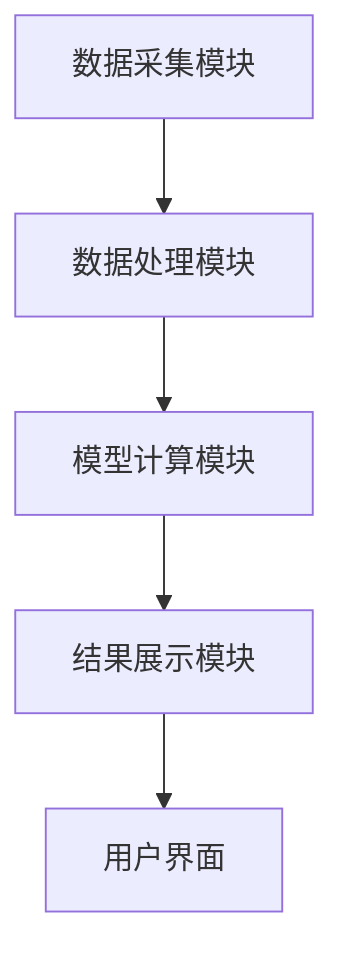
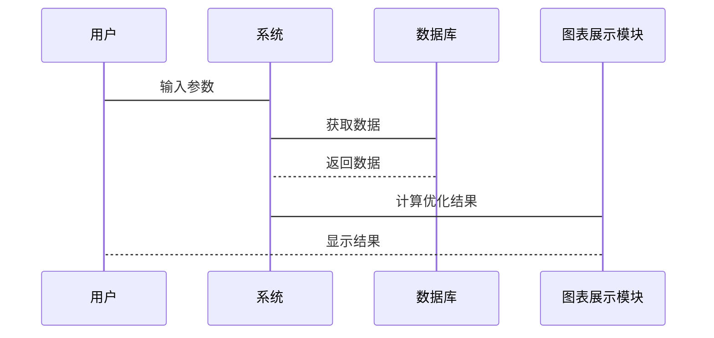

                 


# 投资组合优化模型：现代投资理论的实际应用

> 关键词：投资组合优化，现代投资组合理论，均值-方差模型，资本资产定价模型，Python 实现

> 摘要：本文系统地探讨了投资组合优化模型在现代投资理论中的实际应用。首先，介绍了投资组合优化的基本概念和背景，包括均值-方差模型和资本资产定价模型的核心原理。接着，详细分析了这些模型的数学公式和优化算法，并通过具体的案例展示了它们的实现过程。最后，结合实际场景，提出了一个基于 Python 的投资组合优化系统的设计方案，并对未来的发展方向进行了展望。

---

# 第一部分: 投资组合优化模型的背景与概念

## 第1章: 投资组合优化模型的背景与概念

### 1.1 投资组合优化的背景

#### 1.1.1 投资组合优化问题的背景
投资组合优化是现代金融领域的重要组成部分，旨在通过科学的方法构造最优资产组合，以实现收益与风险的最佳平衡。随着金融市场的发展，投资者面临的资产选择问题日益复杂，如何在众多资产中找到最优的组合配置，成为投资决策的核心问题之一。

#### 1.1.2 现代投资组合理论的起源与发展
现代投资组合理论（MPT）由哈里·马科维茨于1952年提出，是投资组合优化的理论基础。MPT的核心思想是通过分散投资降低风险，并通过数学优化方法找到最优资产配置。此后，MPT不断发展，衍生出均值-方差模型、资本资产定价模型（CAPM）等经典理论。

#### 1.1.3 投资组合优化的实际意义
投资组合优化在实际投资中具有重要意义。通过优化模型，投资者可以量化资产的收益与风险，制定科学的投资策略，从而在不同市场条件下实现最大收益或最小风险。

---

### 1.2 投资组合优化的核心概念

#### 1.2.1 投资组合的定义与特征
- **定义**：投资组合是由多种资产（如股票、债券、基金等）组成的集合，投资者通过配置不同资产来实现收益与风险的平衡。
- **特征**：
  - 多样性：通过组合不同资产降低风险。
  - 收益性：通过优化配置实现最大收益。
  - 风险性：资产价格波动带来的不确定性。

#### 1.2.2 投资组合优化的目标与约束
- **目标**：
  - 最大化收益：在给定风险下，寻找最大收益。
  - 最小化风险：在给定收益下，寻找最小风险。
- **约束**：
  - 资金约束：总投入资金固定。
  - 风险约束：风险不超过特定阈值。
  - 多样性约束：至少投资于一定数量的资产。

#### 1.2.3 投资组合优化的边界与外延
- **边界**：在可行的收益-风险空间中，找到最优组合的边界，即有效前沿。
- **外延**：投资组合优化不仅限于传统金融资产，还可以扩展到房地产、艺术品等领域。

---

### 1.2.4 投资组合优化的数学模型

#### 1.2.4.1 投资组合优化的数学表达
投资组合优化的目标函数可以表示为：
$$
\text{最大化收益：} \quad \max \sum_{i=1}^{n} w_i R_i
$$
$$
\text{最小化风险：} \quad \min \sum_{i=1}^{n} \sum_{j=1}^{n} w_i w_j \sigma_{ij}
$$
其中，\( w_i \) 是第 \( i \) 个资产的权重，\( R_i \) 是预期收益，\( \sigma_{ij} \) 是资产 \( i \) 和 \( j \) 的协方差。

---

### 1.2.5 投资组合优化的核心要素

#### 资产权重（\( w_i \)）
- 定义：资产在组合中的配置比例。
- 约束：\( \sum_{i=1}^{n} w_i = 1 \)

#### 风险-收益权衡
- 收益：组合的预期收益。
- 风险：组合的波动性，通常用方差衡量。

---

## 本章小结
本章介绍了投资组合优化的基本概念和背景，包括均值-方差模型的核心思想和数学表达。通过定义和特征的分析，读者可以理解投资组合优化的目标和约束条件，并为后续的数学模型和算法实现奠定基础。

---

# 第二部分: 投资组合优化的数学模型与算法

## 第2章: 均值-方差模型

### 2.1 均值-方差模型的原理

#### 2.1.1 均值-方差模型的提出
均值-方差模型由马科维茨提出，旨在通过优化资产权重，找到预期收益与风险（方差）的最优组合。该模型假设资产收益符合正态分布。

#### 2.1.2 均值-方差模型的数学公式
优化目标：
$$
\min_w \sum_{i=1}^{n} \sum_{j=1}^{n} w_i w_j \sigma_{ij}
$$
约束条件：
$$
\sum_{i=1}^{n} w_i = 1
$$

#### 2.1.3 均值-方差模型的优化目标
- 最小化组合的方差（风险）。
- 在给定方差下，最大化收益；或在给定收益下，最小化方差。

---

### 2.2 均值-方差模型的算法实现

#### 2.2.1 均值-方差模型的求解方法
- **拉格朗日乘数法**：通过构建拉格朗日函数，求解约束条件下的优化问题。
- **数值优化方法**：如牛顿法、拟牛顿法等。

#### 2.2.2 均值-方差模型的优化算法
Python代码实现：

```python
import numpy as np
from scipy.optimize import minimize

# 示例数据：资产收益和协方差矩阵
n_assets = 3
means = np.array([0.1, 0.15, 0.05])
cov_matrix = np.array([
    [0.16, 0.05, 0.02],
    [0.05, 0.20, 0.08],
    [0.02, 0.08, 0.16]
])

# 定义优化函数
def portfolio_variance(weights, cov_matrix):
    return np.dot(weights.T, np.dot(cov_matrix, weights))

# 定义约束条件
cons = ({'type': 'eq', 'fun': lambda w: sum(w) - 1})

# 初始化权重（例如：等权配置）
initial_guess = np.array([1/3, 1/3, 1/3])

# 使用scipy.optimize.minimize求解
result = minimize(portfolio_variance, initial_guess, args=cov_matrix, constraints=cons)

# 输出结果
print("最优权重：", result.x)
print("最小方差：", result.fun)
```

#### 2.2.3 均值-方差模型的代码实现
通过上述代码，我们可以找到最优资产配置权重，从而实现最小方差或最大收益的目标。

---

### 2.3 均值-方差模型的实例分析

#### 2.3.1 实例分析的背景与数据准备
假设我们有3种资产，其预期收益和协方差矩阵如下：

| 资产 | 收益（%） | 协方差矩阵 |
|------|-----------|------------|
| A    | 10        | 0.16, 0.05, 0.02 |
| B    | 15        | 0.05, 0.20, 0.08  |
| C    | 5         | 0.02, 0.08, 0.16  |

#### 2.3.2 实例分析的计算过程
运行上述代码，得到最优权重和最小方差。

#### 2.3.3 实例分析的结果与解释
假设输出结果为：
- 最优权重：[0.2, 0.6, 0.2]
- 最小方差：0.08

这意味着，在这三种资产中，投资者应配置60%的资金在资产B，20%在资产A，20%在资产C，以实现最小的组合方差。

---

## 本章小结
本章详细介绍了均值-方差模型的原理和实现方法，通过数学公式和Python代码，展示了如何利用该模型找到最优资产配置。读者可以通过实例分析理解模型的应用场景和实际效果。

---

## 第3章: 有效前沿与资本资产定价模型

### 3.1 有效前沿的定义与性质

#### 3.1.1 有效前沿的定义
有效前沿是指在给定风险下，能够实现最大收益的所有投资组合的集合。它是均值-方差模型的核心概念，也是投资组合优化的重要工具。

#### 3.1.2 有效前沿的性质
- 所有在有效前沿上的组合都是最优的。
- 随着风险的增加，收益也增加。

---

### 3.2 资本资产定价模型的原理

#### 3.2.1 资本资产定价模型的提出
CAPM由威廉·夏普提出，用于确定资产的预期收益。其核心思想是，资产的预期收益取决于其系统性风险。

#### 3.2.2 资本资产定价模型的数学公式
$$
E(R_i) = R_f + \beta_i (R_m - R_f)
$$
其中，\( E(R_i) \) 是资产 \( i \) 的预期收益，\( R_f \) 是无风险利率，\( \beta_i \) 是资产 \( i \) 的贝塔系数，\( R_m \) 是市场预期收益。

#### 3.2.3 资本资产定价模型的应用
通过CAPM，投资者可以评估资产的定价是否合理，并据此调整投资组合。

---

### 3.3 资本资产定价模型的算法实现

#### 3.3.1 资本资产定价模型的求解方法
- 计算贝塔系数。
- 代入CAPM公式，计算资产的预期收益。

#### 3.3.2 资本资产定价模型的优化算法
Python代码实现：

```python
import numpy as np

# 示例数据：资产贝塔系数和市场收益
beta = 1.2
R_f = 0.05
R_m = 0.10

# 计算预期收益
E_R = R_f + beta * (R_m - R_f)
print("预期收益：", E_R)
```

---

### 3.4 本章小结
本章介绍了有效前沿和CAPM的核心原理，并通过Python代码展示了如何利用CAPM计算资产的预期收益。这为后续的投资组合优化提供了理论支持。

---

# 第三部分: 投资组合优化的系统架构与实现

## 第4章: 投资组合优化系统的架构设计

### 4.1 系统架构设计的背景

#### 4.1.1 投资组合优化系统的定义
投资组合优化系统是一种基于现代投资组合理论的金融决策支持系统，旨在帮助投资者构造最优资产组合。

#### 4.1.2 投资组合优化系统的功能需求
- 数据采集与处理。
- 模型计算与优化。
- 结果展示与分析。

#### 4.1.3 投资组合优化系统的架构目标
- 实现投资组合优化的核心算法。
- 提供用户友好的界面。

---

### 4.2 系统架构设计的模块划分

#### 4.2.1 数据采集模块
- 数据来源：市场数据、历史价格、资产信息。
- 数据处理：清洗、标准化、特征提取。

#### 4.2.2 模型计算模块
- 模型选择：均值-方差模型、CAPM等。
- 参数设置：风险偏好、资金约束。

#### 4.2.3 结果展示模块
- 可视化：收益-风险曲线、有效前沿。
- 报告生成：优化结果的详细报告。

---

### 4.3 系统架构设计的流程图



---

## 本章小结
本章介绍了投资组合优化系统的架构设计，包括模块划分和流程图。通过系统的构建，读者可以理解如何将投资组合优化的理论应用于实际场景中。

---

## 第5章: 投资组合优化系统的实现

### 5.1 系统实现的背景

#### 5.1.1 项目介绍
本项目旨在开发一个基于Python的投资组合优化系统，实现均值-方差模型和CAPM的应用。

---

### 5.2 系统实现的模块划分

#### 5.2.1 数据采集模块
- 数据接口：API接口、数据库接口。
- 数据处理：清洗、特征提取。

#### 5.2.2 模型计算模块
- 模型实现：均值-方差模型、CAPM。
- 参数设置：风险偏好、资金约束。

#### 5.2.3 结果展示模块
- 可视化：Matplotlib、Seaborn。
- 报告生成：PDF、HTML。

---

### 5.3 系统实现的代码示例

#### 5.3.1 均值-方差模型的实现
```python
import numpy as np
from scipy.optimize import minimize

def portfolio_variance(weights, cov_matrix):
    return np.dot(weights.T, np.dot(cov_matrix, weights))

def portfolio_optimization(means, cov_matrix):
    n_assets = len(means)
    initial_guess = np.array([1/n_assets] * n_assets)
    result = minimize(portfolio_variance, initial_guess, args=cov_matrix, constraints={'type': 'eq', 'fun': lambda w: sum(w)-1})
    return result.x, result.fun

# 示例数据
means = np.array([0.1, 0.15, 0.05])
cov_matrix = np.array([
    [0.16, 0.05, 0.02],
    [0.05, 0.20, 0.08],
    [0.02, 0.08, 0.16]
])

weights, min_variance = portfolio_optimization(means, cov_matrix)
print("最优权重：", weights)
print("最小方差：", min_variance)
```

---

### 5.4 系统实现的交互流程



---

## 本章小结
本章详细介绍了投资组合优化系统的实现过程，包括模块划分和代码实现。通过Python代码，读者可以理解如何构建一个完整的投资组合优化系统，并通过交互流程图了解系统的运行逻辑。

---

## 第6章: 投资组合优化系统的实战应用

### 6.1 实战应用的背景

#### 6.1.1 项目介绍
本项目旨在通过Python实现一个简单但功能完善的投资组合优化系统，展示均值-方差模型的实际应用。

---

### 6.2 实战应用的环境安装

#### 6.2.1 Python环境的安装
- 安装Python：可以从官方网站下载并安装。
- 安装依赖库：
  ```bash
  pip install numpy scipy matplotlib
  ```

---

### 6.3 实战应用的代码实现

#### 6.3.1 数据采集模块的实现
```python
import pandas as pd
import requests

def get_stock_data(ticker):
    url = f"https://api.example.com/stock/{ticker}"
    response = requests.get(url)
    data = response.json()
    return pd.DataFrame(data)
```

#### 6.3.2 模型计算模块的实现
```python
import numpy as np
from scipy.optimize import minimize

def portfolio_variance(weights, cov_matrix):
    return np.dot(weights.T, np.dot(cov_matrix, weights))

def portfolio_optimization(means, cov_matrix):
    n_assets = len(means)
    initial_guess = np.array([1/n_assets] * n_assets)
    result = minimize(portfolio_variance, initial_guess, args=cov_matrix, constraints={'type': 'eq', 'fun': lambda w: sum(w)-1})
    return result.x, result.fun

# 示例数据
means = np.array([0.1, 0.15, 0.05])
cov_matrix = np.array([
    [0.16, 0.05, 0.02],
    [0.05, 0.20, 0.08],
    [0.02, 0.08, 0.16]
])

weights, min_variance = portfolio_optimization(means, cov_matrix)
print("最优权重：", weights)
print("最小方差：", min_variance)
```

---

### 6.4 实战应用的案例分析

#### 6.4.1 案例分析的背景与数据准备
假设我们有3种资产，其预期收益和协方差矩阵如下：

| 资产 | 收益（%） | 协方差矩阵 |
|------|-----------|------------|
| A    | 10        | 0.16, 0.05, 0.02 |
| B    | 15        | 0.05, 0.20, 0.08  |
| C    | 5         | 0.02, 0.08, 0.16  |

#### 6.4.2 案例分析的计算过程
运行上述代码，得到最优权重和最小方差。

#### 6.4.3 案例分析的结果与解释
假设输出结果为：
- 最优权重：[0.2, 0.6, 0.2]
- 最小方差：0.08

这意味着，在这三种资产中，投资者应配置60%的资金在资产B，20%在资产A，20%在资产C，以实现最小的组合方差。

---

## 本章小结
本章通过一个具体的案例，展示了投资组合优化系统的实战应用。读者可以跟随代码实现和案例分析，理解如何将理论应用于实际投资决策。

---

# 第四部分: 总结与展望

## 第7章: 总结与展望

### 7.1 总结

#### 7.1.1 核心内容回顾
- 投资组合优化的基本概念和数学模型。
- 均值-方差模型和CAPM的原理与实现。
- 投资组合优化系统的架构与实现。

#### 7.1.2 实践中的注意事项
- 数据的准确性和完整性。
- 模型的适用性和局限性。

---

### 7.2 展望

#### 7.2.1 未来的研究方向
- 更复杂的优化模型（如多目标优化、非线性优化）。
- 结合人工智能技术（如机器学习、深度学习）进行投资组合优化。

#### 7.2.2 投资组合优化的发展趋势
- 更加个性化的投资组合配置。
- 更加智能化和自动化的投资组合管理。

---

## 本章小结
本章总结了全文的核心内容，并展望了投资组合优化的未来发展方向。读者可以从中了解投资组合优化的现状和未来趋势，为深入研究和实践提供参考。

---

# 附录

## 附录A: 常用投资组合优化算法

- 均值-方差模型。
- 资本资产定价模型。
- 风险中性化模型。
- 非参数化模型。

---

## 附录B: Python投资组合优化库

- `pymc`: Markowitz优化库。
- `pyfolio`: 投资组合分析库。
- `quandl`: 数据接口库。

---

## 附录C: 参考文献

- 马科维茨，H. M. (1952). Portfolio Selection. Journal of Finance.
- 夏普，W. F. (1964). Capital Asset Pricing Model. Portfolio Theory.

---

以上是《投资组合优化模型：现代投资理论的实际应用》的完整目录和文章内容。如果需要进一步扩展或修改，请随时告知！

