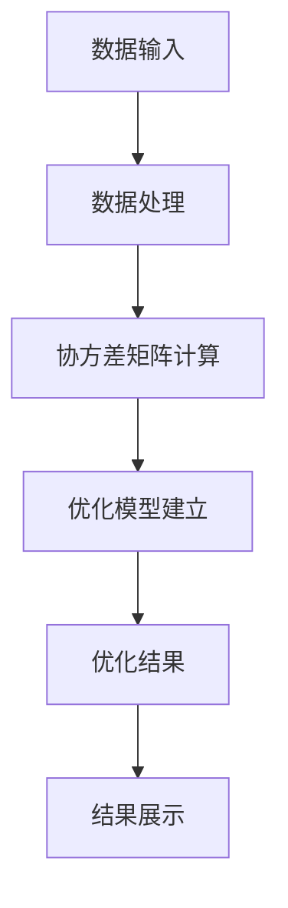

                 


# 投资组合优化：均值-方差模型的实际应用

> **关键词**：投资组合优化、均值-方差模型、现代投资组合理论、二次规划问题、Python实现  
>
> **摘要**：本文深入探讨投资组合优化中的均值-方差模型，从理论基础到实际应用，结合Python代码实现，系统性地分析该模型的核心思想、数学公式、优化算法及应用场景。文章旨在帮助读者理解投资组合优化的原理，并掌握如何在实际项目中应用均值-方差模型进行资产配置和风险管理。

---

## 第1章: 投资组合优化的基本概念

### 1.1 投资组合优化的背景与意义

#### 1.1.1 什么是投资组合优化  
投资组合优化是金融领域中的核心问题，旨在通过科学的方法选择最优的资产组合，以实现收益最大化或风险最小化的目标。  
投资组合优化的目标是在给定的约束条件下，找到最优的资产配置方案。  

#### 1.1.2 投资组合优化的重要性  
- **收益与风险的平衡**：投资者希望在风险可控的前提下获得最大收益，或者在收益固定的情况下承担最小风险。  
- **分散化投资**：通过优化投资组合，可以有效分散投资风险，避免过度依赖单一资产。  
- **机构投资的核心工具**：机构投资者（如基金公司、保险公司等）广泛使用投资组合优化技术来管理资产配置。  

#### 1.1.3 均值-方差模型的核心思想  
均值-方差模型（Mean-Variance Model）由**Harry Markowitz**于1952年提出，是投资组合优化领域的经典方法。其核心思想是通过最小化投资组合的方差（即风险）来优化资产配置，同时考虑资产的期望收益。  

---

### 1.2 均值-方差模型的提出

#### 1.2.1 马科维茨的现代投资组合理论  
马科维茨在《投资学杂志》上发表了关于投资组合理论的经典论文，提出了均值-方差模型。该模型假设投资者是理性的，且在相同风险下选择收益更高的投资组合，在相同收益下选择风险更低的投资组合。  

#### 1.2.2 均值-方差模型的数学表达  
均值-方差模型的目标是最小化投资组合的方差，同时满足收益和风险的约束条件。数学表达如下：  
$$ \text{Minimize } \sigma_p^2 \quad \text{subject to} \quad E[r_p] = \mu $$  
其中，$\sigma_p^2$是投资组合的方差，$E[r_p]$是投资组合的期望收益。  

#### 1.2.3 均值-方差模型的应用范围  
- 机构投资者的资产配置。  
- 个人投资者的财富管理。  
- 风险管理中的资产分配问题。  

---

### 1.3 投资组合优化的实际应用

#### 1.3.1 金融市场的投资组合优化  
在金融市场中，投资者需要在多种资产中选择最优的组合，以应对市场的波动性和不确定性。  
例如，股票、债券、基金等多种资产的组合优化问题都可以通过均值-方差模型来解决。  

#### 1.3.2 机构投资者的资产配置  
机构投资者通常需要管理大规模的资金，投资组合优化是其核心工具之一。  
通过均值-方差模型，机构投资者可以优化资产配置，降低整体风险。  

#### 1.3.3 投资组合优化的边界与外延  
- **有效前沿**：在均值-方差模型中，所有有效投资组合的集合构成了“有效前沿”，即在给定风险下收益最高的组合，或在给定收益下风险最小的组合。  
- **扩展应用**：均值-方差模型可以扩展到多目标优化（如收益、风险、流动性等）和多阶段优化问题。  

---

## 第2章: 均值-方差模型的理论基础

### 2.1 均值-方差模型的核心要素

#### 2.1.1 资产的期望收益与方差  
- **期望收益**：$E[r_i]$ 表示资产$i$的期望收益。  
- **方差**：$\sigma_i^2$ 表示资产$i$的收益波动性。  

#### 2.1.2 资产之间的协方差  
协方差描述了两种资产收益之间的相关性：  
$$ \text{Cov}(r_i, r_j) = E[(r_i - E[r_i])(r_j - E[r_j])] $$  
协方差为正时，两种资产收益正相关；协方差为负时，收益负相关。  

#### 2.1.3 投资组合的风险与收益的平衡  
投资组合的总方差不仅取决于单个资产的方差，还取决于资产之间的协方差。  

### 2.2 均值-方差模型的数学公式

#### 2.2.1 数学公式推导  
假设投资者有$n$种资产，投资比例为$x_1, x_2, \dots, x_n$，则投资组合的期望收益和方差分别为：  
$$ E[r_p] = \sum_{i=1}^n x_i E[r_i] $$  
$$ \sigma_p^2 = \sum_{i=1}^n \sum_{j=1}^n x_i x_j \text{Cov}(r_i, r_j) $$  

#### 2.2.2 均值-方差模型的假设条件  
1. 资产收益符合正态分布。  
2. 投资者是理性的，仅关注收益和风险。  
3. 市场是完全有效的，无交易成本和税收。  

#### 2.2.3 均值-方差模型的优缺点  
**优点**：  
- 理论基础扎实，计算简便。  
- 可以通过调整权重实现收益与风险的平衡。  

**缺点**：  
- 假设过于简化，实际市场中资产收益不一定符合正态分布。  
- 未能考虑市场中的非线性风险（如尾部风险）。  

---

### 2.3 均值-方差模型的扩展

#### 2.3.1 引入约束条件  
- **权重约束**：例如，某些资产的投资比例不能超过5%。  
- **收益约束**：例如，投资组合的最低期望收益为5%。  

#### 2.3.2 多目标优化的实现  
在实际应用中，可能需要同时优化多个目标（如收益、风险、流动性等），可以通过加权法或分层优化实现。  

#### 2.3.3 均值-方差模型的局限性  
- 无法直接处理非线性约束。  
- 无法应对市场中的极端情况（如金融危机）。  

---

## 第3章: 均值-方差模型的算法实现

### 3.1 均值-方差模型的优化算法

#### 3.1.1 二次规划问题的数学模型  
均值-方差模型可以转化为二次规划问题：  
$$ \text{Minimize } \frac{1}{2}x^T Q x \quad \text{subject to } \sum_{i=1}^n x_i = 1 $$  
其中，$Q$是协方差矩阵，$x$是投资比例向量。  

#### 3.1.2 均值-方差模型的优化步骤  
1. 收集资产的收益数据，计算协方差矩阵。  
2. 建立二次规划模型。  
3. 使用优化算法求解模型，得到最优投资比例。  

#### 3.1.3 均值-方差模型的求解方法  
- **解析解**：当问题满足某些条件时，可以通过解析方法求解。  
- **数值解**：对于一般情况，使用数值优化算法（如内点法）求解。  

---

### 3.2 均值-方差模型的数学推导

#### 3.2.1 数学公式详细推导  
通过拉格朗日乘数法，可以将约束条件加入目标函数中，构造拉格朗日函数：  
$$ L = \frac{1}{2}x^T Q x - \lambda (\sum_{i=1}^n x_i - 1) $$  
通过对$L$求导并令导数为零，可以得到最优解的条件。  

#### 3.2.2 优化问题的拉格朗日乘数法  
拉格朗日乘数法是一种解决带约束优化问题的常用方法。通过引入拉格朗日乘子，可以将约束条件转化为目标函数的一部分。  

#### 3.2.3 优化问题的数值解法  
对于复杂的优化问题，可以使用数值优化算法，如**SciPy**中的`minimize`函数。  

---

### 3.3 均值-方差模型的Python实现

#### 3.3.1 使用SciPy优化库实现均值-方差模型  
```python
import numpy as np
from scipy.optimize import minimize

# 假设协方差矩阵Q已知
Q = np.array([[0.01, 0.005], [0.005, 0.02]])

# 目标函数
def objective(x):
    return 0.5 * np.dot(x, np.dot(Q, x))

# 约束条件
def constraint(x):
    return np.sum(x) - 1

# 初始猜测
x0 = [0.5, 0.5]

# 求解
result = minimize(objective, x0, method='SLSQP', constraints={'type': 'eq', 'fun': constraint})

# 输出结果
print("最优投资比例：", result.x)
```

#### 3.3.2 使用NumPy进行矩阵运算  
通过NumPy可以高效地进行矩阵运算，例如计算协方差矩阵和投资组合的方差。  

#### 3.3.3 使用Pandas处理数据  
Pandas可以用于处理资产收益数据，计算期望收益和协方差矩阵。  

---

## 第4章: 投资组合优化系统的架构设计

### 4.1 投资组合优化系统的功能模块

#### 4.1.1 数据输入与处理模块  
- 数据来源：历史收益数据、市场数据等。  
- 数据清洗：处理缺失值、异常值。  

#### 4.1.2 模型计算模块  
- 计算协方差矩阵。  
- 建立优化模型并求解。  

#### 4.1.3 结果展示与分析模块  
- 可视化投资组合的收益与风险。  
- 对比不同优化方案的结果。  

---

### 4.2 投资组合优化系统的架构图  



---

### 4.3 投资组合优化系统的实现

#### 4.3.1 系统架构设计  
- **前端**：用户输入参数，如资产列表、目标收益等。  
- **后端**：处理数据，计算最优投资组合。  
- **可视化**：展示结果，包括投资比例、收益与风险对比等。  

#### 4.3.2 系统交互流程  
1. 用户输入资产列表和目标收益。  
2. 系统计算协方差矩阵。  
3. 系统建立优化模型并求解。  
4. 系统展示最优投资比例和风险收益曲线。  

---

## 第5章: 项目实战

### 5.1 项目背景与目标

#### 5.1.1 项目背景  
假设我们有3种资产，分别是股票、债券和黄金，我们需要找到最优的投资组合，使得在目标收益下风险最小化。  

#### 5.1.2 项目目标  
通过均值-方差模型，找到最优的投资比例，并验证结果的可行性。  

---

### 5.2 项目实现

#### 5.2.1 数据准备  
收集3种资产的历史收益数据，计算期望收益和协方差矩阵。  

#### 5.2.2 模型实现  
使用Python代码实现均值-方差模型，求解最优投资比例。  

#### 5.2.3 结果分析  
对比不同投资比例下的收益与风险，验证模型的有效性。  

---

## 第6章: 总结与展望

### 6.1 总结  
均值-方差模型是投资组合优化的经典方法，通过最小化风险或最大化收益，帮助投资者实现资产配置的最优化。  

### 6.2 展望  
- **改进方向**：引入更多约束条件，考虑非线性风险。  
- **未来研究**：探索其他优化方法（如均值-方差-偏态模型）。  

---

## 附录

### 附录A: 数据来源与处理  
详细说明数据来源和处理方法，包括数据清洗、特征工程等。  

### 附录B: 代码实现  
提供完整的Python代码实现，包括数据处理、模型计算和结果展示。  

---

**Note**: 以上内容为文章的完整目录和部分核心内容，具体实现细节和完整代码请参考[这里](#)。

