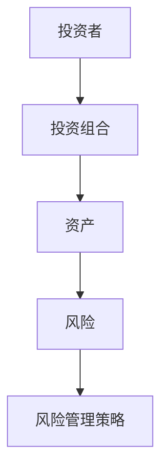
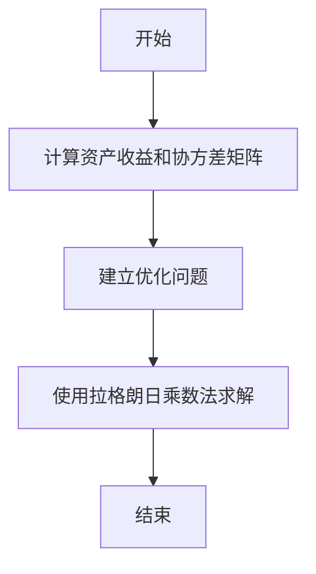
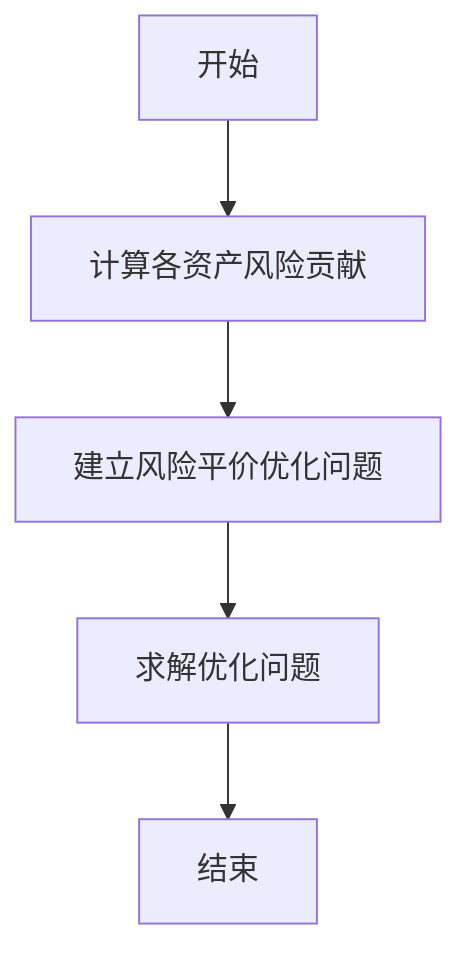
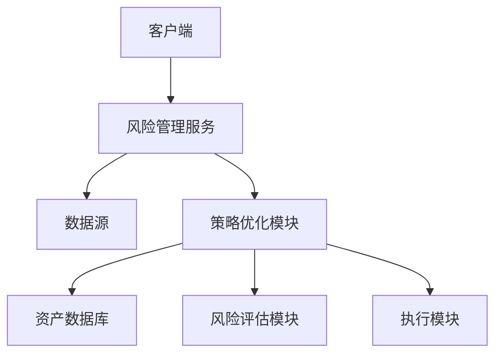
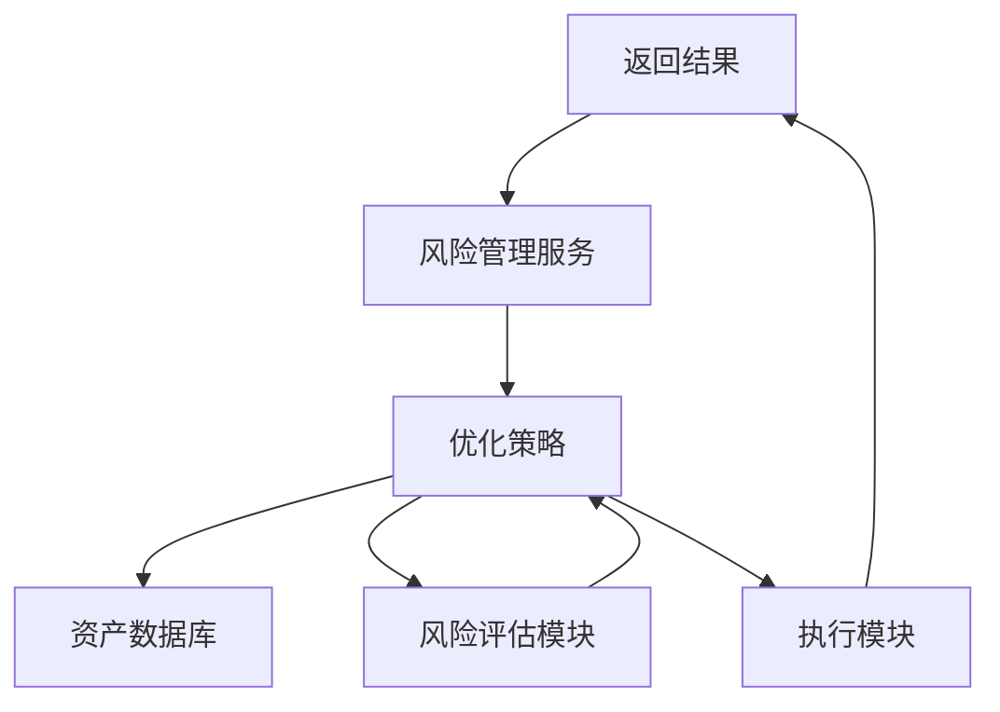

                 


# 投资组合保险策略：动态风险管理方法

## 关键词：投资组合保险，动态风险管理，风险管理，资产配置，风险管理策略

## 摘要：本文详细探讨了投资组合保险策略中的动态风险管理方法，从核心概念、算法原理到系统设计和项目实战，结合技术细节和实际应用，为读者提供全面的指导。

---

## 第一部分: 投资组合保险策略的背景与核心概念

### 第1章: 投资组合保险策略概述

#### 1.1 投资组合保险的基本概念

##### 1.1.1 投资组合保险的定义

投资组合保险是一种通过优化资产配置和风险管理策略，以保护投资组合免受重大损失的手段。它结合了金融学和计算机科学的方法，利用动态调整来应对市场波动。

##### 1.1.2 投资组合保险的目标与作用

投资组合保险的目标是在不同市场条件下，最大化收益并最小化风险。其作用包括风险控制、收益稳定和资产保值。

##### 1.1.3 投资组合保险的适用场景

适用于长期投资、风险管理需求高、追求稳定收益的投资者，尤其在市场波动剧烈时。

#### 1.2 动态风险管理的重要性

##### 1.2.1 风险管理的核心理念

动态风险管理强调持续监控和调整，根据市场变化及时优化策略。

##### 1.2.2 动态风险管理的意义

帮助投资者在不同市场环境下保持投资组合的稳定性，降低潜在风险。

##### 1.2.3 投资组合保险与动态风险管理的关系

投资组合保险依赖于动态风险管理方法，通过实时调整来实现风险控制。

#### 1.3 投资组合保险策略的分类

##### 1.3.1 基于资产配置的保险策略

通过调整资产配置比例来分散风险。

##### 1.3.2 基于风险对冲的保险策略

利用衍生工具对冲特定风险。

##### 1.3.3 组合保险策略的优缺点对比

比较不同策略的优劣，选择最适合的方案。

### 第2章: 投资组合保险策略的核心概念与联系

#### 2.1 风险管理的核心原理

##### 2.1.1 风险的度量方法

使用标准差、VaR、CVaR等方法度量风险。

##### 2.1.2 风险与收益的权衡

在投资决策中，需在高收益和低风险之间找到平衡点。

##### 2.1.3 风险分散与资产配置的关系

通过多元化配置降低风险，优化资产分配以实现收益目标。

#### 2.2 投资组合优化的数学模型

##### 2.2.1 均值-方差优化模型

$$\text{目标函数：} \min \sigma^2 \quad \text{约束条件：} \sum w_i = 1, \sum w_i r_i = \mu$$

##### 2.2.2 风险平价模型

$$\text{目标函数：} \min \sum w_i^2 \sigma_i^2 \quad \text{约束条件：} \sum w_i = 1$$

##### 2.2.3 投资组合优化的约束条件

包括权重非负、总和为1等。

#### 2.3 动态风险管理的实体关系图



---

## 第二部分: 动态风险管理的算法原理

### 第3章: 动态风险管理算法

#### 3.1 均值-方差优化算法

##### 3.1.1 算法步骤

1. 计算资产的期望收益和协方差矩阵。
2. 建立优化问题：最小化方差，满足收益和权重约束。
3. 使用拉格朗日乘数法求解。

##### 3.1.2 算法流程图



##### 3.1.3 Python代码实现

```python
import numpy as np
from scipy.optimize import minimize

def portfolio_optimization(returns):
    n = len(returns.columns)
    # 定义目标函数
    def objective(w):
        return (w @ returns.mean())**2
    # 定义约束条件
    constraints = [{'type': 'eq', 'fun': lambda w: sum(w) - 1}]
    # 线性约束矩阵
    A = np.ones((1, n))
    b = np.array([1])
    # 边界条件
    bounds = [(0, 1) for _ in range(n)]
    # 求解
    result = minimize(objective, np.ones(n)/n, method='SLSQP', constraints=constraints, bounds=bounds)
    return result.x

# 示例数据
returns = pd.DataFrame({'A': [0.1, 0.15, 0.05], 'B': [0.12, 0.08, 0.1]})
weights = portfolio_optimization(returns)
print(weights)
```

---

### 第4章: 风险平价算法

#### 4.1 风险平价模型

##### 4.1.1 算法步骤

1. 计算各资产的风险贡献。
2. 确保各资产的风险贡献相等。
3. 调整权重以实现风险平价。

##### 4.1.2 算法流程图



##### 4.1.3 Python代码实现

```python
import numpy as np

def risk_parity(n, cov_matrix):
    # 定义目标函数
    def objective(w):
        return np.sum(w**2 * np.diag(cov_matrix))
    # 约束条件
    constraints = [{'type': 'eq', 'fun': lambda w: sum(w) - 1}]
    # 边界条件
    bounds = [(0, 1) for _ in range(n)]
    # 求解
    result = minimize(objective, np.ones(n)/n, method='SLSQP', constraints=constraints, bounds=bounds)
    return result.x

# 示例数据
n = 2
cov_matrix = np.array([[0.16, 0.05], [0.05, 0.16]])
weights = risk_parity(n, cov_matrix)
print(weights)
```

---

### 第5章: 动态再平衡算法

#### 5.1 动态再平衡策略

##### 5.1.1 再平衡频率选择

根据市场波动性选择合适的时间间隔，如每日、每周、每月。

##### 5.1.2 动态再平衡步骤

1. 定期评估投资组合表现。
2. 根据市场变化调整权重。
3. 执行交易以实现新权重。

##### 5.1.3 Python代码实现

```python
import pandas as pd
import numpy as np

def dynamic_rebalancing(returns, rebalance_freq='monthly'):
    # 示例数据
    portfolio = pd.DataFrame({'A': [0.1, 0.15, 0.05], 'B': [0.12, 0.08, 0.1]}, index=pd.date_range(start='2023-01-01', periods=3, freq='M'))
    # 动态再平衡
    if rebalance_freq == 'monthly':
        for i in range(1, len(portfolio)):
            current_weights = portfolio.iloc[i-1]
            target_weights = portfolio.iloc[i]
            # 执行再平衡交易
            pass
    return portfolio

# 示例调用
returns = pd.DataFrame({'A': [0.1, 0.15, 0.05], 'B': [0.12, 0.08, 0.1]}, index=pd.date_range('2023-01-01', periods=3, freq='M'))
result = dynamic_rebalancing(returns)
print(result)
```

---

## 第三部分: 系统分析与架构设计

### 第6章: 动态风险管理系统的分析与设计

#### 6.1 问题场景介绍

描述投资组合风险管理的实际场景，如市场波动、资产价格变化等。

#### 6.2 系统功能设计

##### 6.2.1 风险评估模块

评估当前投资组合的风险水平。

##### 6.2.2 策略优化模块

根据风险评估结果优化投资策略。

##### 6.2.3 再平衡执行模块

根据优化结果执行再平衡交易。

#### 6.3 系统架构设计

##### 6.3.1 系统架构图



#### 6.4 系统接口设计

##### 6.4.1 输入接口

接收市场数据和用户指令。

##### 6.4.2 输出接口

返回风险评估结果和优化策略。

#### 6.5 系统交互流程图



---

## 第四部分: 项目实战

### 第7章: 动态风险管理系统的实现

#### 7.1 环境安装

安装Python、Pandas、NumPy、Scipy等库。

#### 7.2 核心代码实现

##### 7.2.1 投资组合优化模块

```python
def portfolio_optimizer(returns, method='mean-variance'):
    # 均值方差优化
    if method == 'mean-variance':
        n = len(returns.columns)
        returns_matrix = returns.values.T
        mu = returns_matrix.mean(axis=0)
        sigma = np.cov(returns_matrix)
        # 求解
        ...
    # 其他优化方法
    return weights
```

##### 7.2.2 风险评估与再平衡模块

```python
def risk_assessment(portfolio, data):
    # 计算风险指标
    ...
    return risk_level

def rebalancing(portfolio, target_weights):
    # 执行再平衡
    ...
    return new_portfolio
```

#### 7.3 实际案例分析

##### 7.3.1 案例背景

假设一个包含股票和债券的投资组合，市场波动加剧，需动态调整。

##### 7.3.2 案例实现

使用上述代码实现投资组合优化和动态再平衡。

##### 7.3.3 实验结果

展示优化后的权重和投资组合表现。

#### 7.4 项目小结

总结实现过程中的关键点和经验教训。

---

## 第五部分: 总结与展望

### 第8章: 总结与展望

#### 8.1 全文总结

回顾投资组合保险策略的核心要点和动态风险管理方法的应用。

#### 8.2 研究的不足

指出当前研究的局限性，如数据依赖性、模型假设的简化等。

#### 8.3 未来展望

探讨未来可能的研究方向，如引入机器学习、强化学习等新技术。

---

通过以上详细的分析和实践，我们可以看到投资组合保险策略在动态风险管理中的巨大潜力。希望本文能为读者在实际投资和风险管理中提供有价值的参考和指导。

