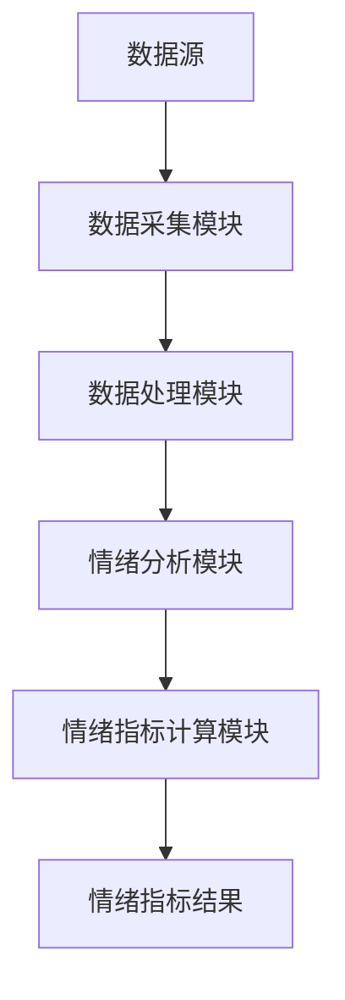

                 

# 投资者情绪指标：市场心理学的量化应用

> 关键词：投资者情绪指标、市场心理学、量化分析、情绪量化、金融数据分析、自然语言处理

> 摘要：本文系统地探讨了投资者情绪指标的量化应用，从理论基础到实际操作，深入分析了情绪如何影响市场行为，以及如何通过量化方法捕捉和分析投资者情绪。文章结合数学模型、算法原理和系统架构设计，展示了如何利用投资者情绪指标进行金融数据分析和预测，为投资者提供科学决策依据。

---

## 第1章：投资者情绪指标的背景与意义

### 1.1 投资者情绪的基本概念

#### 1.1.1 投资者情绪的定义
投资者情绪是指投资者在金融市场中基于心理因素所表现出的乐观、悲观、贪婪或恐慌等情绪状态。这些情绪会影响投资者的决策行为，进而对市场走势产生影响。

#### 1.1.2 情绪在投资决策中的作用
情绪在投资决策中起着关键作用。例如，过度乐观可能导致投资者高位买入，而过度悲观可能导致低位卖出，从而引发市场的波动。

#### 1.1.3 情绪指标的定义与特点
情绪指标是通过量化方法，将投资者的情绪状态转化为可量化的指标，用于分析市场走势和投资决策。

---

### 1.2 投资者情绪指标的重要性

#### 1.2.1 情绪指标在金融市场中的应用
情绪指标可以帮助投资者预测市场趋势，优化投资组合，并在市场波动中做出更明智的决策。

#### 1.2.2 情绪指标对投资决策的影响
情绪指标可以揭示市场的非理性行为，帮助投资者避免情绪驱动的错误决策。

#### 1.2.3 情绪指标与市场波动的关系
情绪指标可以预测市场的波动性，特别是在市场出现极端情绪时，情绪指标的变化往往预示着市场的转折点。

---

### 1.3 情绪指标的类型与数据来源

#### 1.3.1 市场情绪指标的分类
市场情绪指标可以分为以下几类：
- **市场情绪指数（Market Sentiment Index）**：通过整合多个数据源，量化市场的整体情绪。
- **投资者情绪指数（Investor Sentiment Index）**：通过调查或数据分析，量化投资者的情绪状态。
- **媒体情绪指数（Media Sentiment Index）**：通过分析媒体新闻和评论，量化市场情绪。

#### 1.3.2 数据来源：新闻、社交媒体、市场数据
情绪指标的数据来源主要包括：
- **新闻和媒体**：通过分析新闻标题和内容，提取市场情绪信息。
- **社交媒体**：通过分析社交媒体上的帖子、评论和情绪表达，量化市场情绪。
- **市场数据**：通过分析股票价格、成交量等市场数据，间接反映投资者情绪。

#### 1.3.3 情绪指标的构建方法
情绪指标的构建方法包括：
- **文本分析**：使用自然语言处理技术，分析文本中的情绪倾向。
- **数据整合**：将多个数据源的数据进行整合和加权，构建综合情绪指标。
- **机器学习**：通过训练模型，预测市场情绪的变化。

---

## 第2章：投资者情绪与市场行为

### 2.1 情绪如何影响市场行为

#### 2.1.1 情绪周期与市场波动
市场情绪会经历周期性变化，从乐观到悲观，再到乐观，这种情绪周期往往与市场的波动性密切相关。

#### 2.1.2 情绪与投资者决策的关系
投资者的情绪状态会影响其决策行为，例如：
- **乐观情绪**：投资者倾向于买入股票，推高股价。
- **悲观情绪**：投资者倾向于卖出股票，压低股价。

#### 2.1.3 情绪对资产价格的影响
情绪指标可以通过影响投资者的决策行为，间接影响资产价格的变化。

---

### 2.2 投资者情绪的群体特征

#### 2.2.1 羊群效应与情绪传染
投资者的情绪往往具有传染性，例如，当一部分投资者开始抛售股票时，其他投资者也可能跟随抛售，导致市场恐慌。

#### 2.2.2 不同投资者群体的情绪差异
不同类型的投资者（如机构投资者和个人投资者）在情绪表达和行为上可能存在差异。

#### 2.2.3 情绪的季节性与周期性
市场情绪往往具有季节性和周期性特征，例如在市场牛市中，投资者情绪通常较为乐观。

---

### 2.3 情绪指标与市场参与者的互动

#### 2.3.1 情绪指标对机构投资者的影响
机构投资者可以通过情绪指标优化投资策略，例如在市场情绪过热时减少投资。

#### 2.3.2 情绪指标对散户投资者的影响
散户投资者可以通过情绪指标了解市场的整体情绪，避免情绪驱动的错误决策。

#### 2.3.3 情绪指标在市场预测中的应用
情绪指标可以作为市场预测的重要依据，例如在预测市场拐点时，情绪指标的变化往往具有前瞻性。

---

## 第3章：情绪指标的量化方法

### 3.1 情绪指标的量化基础

#### 3.1.1 情绪指标的数学模型
情绪指标的量化通常基于数学模型，例如：
$$ \text{情绪指数} = \alpha \cdot \text{正面情绪} + \beta \cdot \text{负面情绪} $$
其中，$\alpha$ 和 $\beta$ 是权重系数。

#### 3.1.2 情绪强度的计算方法
情绪强度可以通过以下步骤计算：
1. 收集文本数据。
2. 使用自然语言处理技术提取情绪倾向。
3. 对情绪倾向进行加权计算，得到情绪强度。

#### 3.1.3 情绪指标的标准化处理
情绪指标通常需要进行标准化处理，例如将情绪指数标准化到0-1区间。

---

### 3.2 情绪指标的构建与优化

#### 3.2.1 情绪指标的构建方法
情绪指标的构建方法包括：
- **文本分析**：通过自然语言处理技术，分析新闻和社交媒体文本，提取情绪倾向。
- **数据整合**：将多个数据源的数据进行整合，构建综合情绪指标。
- **机器学习**：通过训练机器学习模型，预测市场情绪的变化。

#### 3.2.2 情绪指标的优化策略
情绪指标的优化策略包括：
- **数据清洗**：去除噪声数据，提高情绪指标的准确性。
- **模型调优**：通过调整模型参数，提高情绪指标的预测精度。
- **实时更新**：根据市场变化，实时更新情绪指标。

---

### 3.3 情绪指标的验证与评估

#### 3.3.1 情绪指标的验证方法
情绪指标的验证方法包括：
- **回测分析**：通过历史数据验证情绪指标的有效性。
- **分组对比**：将情绪指标与市场实际表现进行对比，评估情绪指标的预测能力。

#### 3.3.2 情绪指标的评估指标
情绪指标的评估指标包括：
- **准确率**：情绪指标预测的准确率。
- **波动率**：情绪指标的波动程度。
- **相关性**：情绪指标与市场实际表现的相关性。

---

## 第4章：投资者情绪指标的数学模型与算法

### 4.1 情绪指标的数学模型

#### 4.1.1 情绪指标的数学表达
情绪指标的数学表达可以表示为：
$$ S(t) = \sum_{i=1}^{n} w_i \cdot E_i(t) $$
其中，$S(t)$ 是情绪指标，$w_i$ 是情绪因子的权重，$E_i(t)$ 是情绪因子在时间 $t$ 的值。

#### 4.1.2 情绪因子的权重分配
情绪因子的权重分配可以通过以下方法实现：
- **等权分配**：每个情绪因子的权重相同。
- **最优分配**：通过优化算法，确定情绪因子的最优权重。

---

### 4.2 情绪指标的算法流程

#### 4.2.1 数据采集
数据采集是情绪指标构建的第一步，通常包括以下步骤：
1. 收集新闻、社交媒体和市场数据。
2. 对数据进行清洗和预处理。

#### 4.2.2 情绪分析
情绪分析是情绪指标构建的核心步骤，通常包括：
1. 使用自然语言处理技术分析文本数据，提取情绪倾向。
2. 对情绪倾向进行分类，例如正面、负面或中性。

#### 4.2.3 情绪指标计算
情绪指标计算是情绪指标构建的最后一步，通常包括：
1. 对情绪倾向进行加权计算，得到情绪指标。
2. 对情绪指标进行标准化处理，确保指标的可比性。

---

### 4.3 情绪指标的优化与调优

#### 4.3.1 情绪指标的优化方法
情绪指标的优化方法包括：
- **参数调优**：通过调整模型参数，提高情绪指标的预测精度。
- **模型优化**：通过优化算法，提高情绪指标的计算效率。

#### 4.3.2 情绪指标的评估与验证
情绪指标的评估与验证可以通过以下方法实现：
- **回测分析**：通过历史数据验证情绪指标的有效性。
- **分组对比**：将情绪指标与市场实际表现进行对比，评估情绪指标的预测能力。

---

## 第5章：投资者情绪指标的系统架构设计

### 5.1 系统功能设计

#### 5.1.1 数据采集模块
数据采集模块负责从多种数据源采集数据，包括新闻、社交媒体和市场数据。

#### 5.1.2 数据处理模块
数据处理模块负责对采集到的数据进行清洗和预处理，确保数据的准确性和完整性。

#### 5.1.3 情绪分析模块
情绪分析模块负责对数据进行情绪分析，提取情绪倾向。

#### 5.1.4 情绪指标计算模块
情绪指标计算模块负责根据情绪倾向计算情绪指标，并进行标准化处理。

---

### 5.2 系统架构设计

#### 5.2.1 系统架构图
以下是一个投资者情绪指标系统的架构图：

#### 5.2.2 模块交互流程
模块交互流程如下：
1. 数据源向数据采集模块发送数据。
2. 数据采集模块将数据传输到数据处理模块。
3. 数据处理模块对数据进行清洗和预处理。
4. 数据处理模块将数据传输到情绪分析模块。
5. 情绪分析模块对数据进行情绪分析，提取情绪倾向。
6. 情绪分析模块将情绪倾向传输到情绪指标计算模块。
7. 情绪指标计算模块根据情绪倾向计算情绪指标，并将结果传输到结果模块。

---

### 5.3 系统接口设计

#### 5.3.1 数据接口
数据接口用于与外部数据源进行交互，通常包括API接口和文件接口。

#### 5.3.2 情绪指标接口
情绪指标接口用于与外部系统进行交互，通常包括API接口和消息队列接口。

---

## 第6章：投资者情绪指标的项目实战

### 6.1 项目背景与目标

#### 6.1.1 项目背景
本项目旨在通过量化方法，构建一个投资者情绪指标系统，帮助投资者更好地理解市场情绪，优化投资决策。

#### 6.1.2 项目目标
项目目标包括：
- 构建一个投资者情绪指标系统。
- 实现情绪指标的实时计算与更新。
- 提供可视化界面，展示市场情绪的变化。

---

### 6.2 项目核心实现

#### 6.2.1 环境搭建
项目环境搭建包括：
- 安装Python编程语言。
- 安装必要的Python库，例如自然语言处理库（如NLTK、spaCy）和机器学习库（如scikit-learn、XGBoost）。

#### 6.2.2 数据预处理
数据预处理包括：
- 数据清洗：去除噪声数据。
- 数据转换：将文本数据转换为可计算的数值。
- 数据增强：通过数据增强技术，提高数据的质量。

#### 6.2.3 情绪分析模块实现
情绪分析模块实现包括：
- 使用自然语言处理库，对文本数据进行情绪分析。
- 对情绪分析结果进行分类，例如正面、负面或中性。

#### 6.2.4 情绪指标计算模块实现
情绪指标计算模块实现包括：
- 根据情绪分析结果，计算情绪指标。
- 对情绪指标进行标准化处理，确保指标的可比性。

---

### 6.3 项目结果与分析

#### 6.3.1 项目结果展示
项目结果展示包括：
- 情绪指标的时间序列图。
- 情绪指标与市场实际表现的对比图。
- 情绪指标的预测结果与实际结果的对比图。

#### 6.3.2 项目效果分析
项目效果分析包括：
- 情绪指标的预测精度分析。
- 情绪指标与市场实际表现的相关性分析。
- 情绪指标对投资决策的影响分析。

---

## 第7章：总结与展望

### 7.1 全文总结

#### 7.1.1 情绪指标的重要性
投资者情绪指标在金融市场中具有重要的作用，可以帮助投资者更好地理解市场情绪，优化投资决策。

#### 7.1.2 情绪指标的应用前景
情绪指标的应用前景广阔，可以通过不断优化算法和模型，提高情绪指标的预测精度。

---

### 7.2 小结与注意事项

#### 7.2.1 小结
投资者情绪指标是金融市场中重要的量化工具，可以通过情绪指标帮助投资者更好地理解市场情绪，优化投资决策。

#### 7.2.2 注意事项
在实际应用中，需要注意以下几点：
- 数据的准确性和完整性。
- 情绪指标的实时性和动态性。
- 情绪指标的局限性和不足。

---

### 7.3 未来研究方向

#### 7.3.1 情绪指标的优化与改进
未来可以进一步优化情绪指标的算法和模型，提高情绪指标的预测精度。

#### 7.3.2 情绪指标的多维度分析
未来可以进一步拓展情绪指标的分析维度，例如引入更多的数据源和分析方法。

#### 7.3.3 情绪指标的实时应用
未来可以进一步研究情绪指标的实时应用，例如实时监控市场情绪变化，提供实时的投资建议。

---

### 7.4 拓展阅读

#### 7.4.1 推荐书籍
- 《投资者情绪指标：市场心理学的量化应用》
- 《金融市场中的情绪分析与预测》
- 《自然语言处理与金融数据分析》

#### 7.4.2 推荐学术论文
- "Emotion-based Sentiment Analysis in Financial Markets"
- "The Role of Investor Sentiment in Stock Market Prediction"
- "Machine Learning for Financial Market Sentiment Analysis"

---

## 参考文献

（此处可以列出相关的参考文献，包括书籍、学术论文和在线资源等。）

