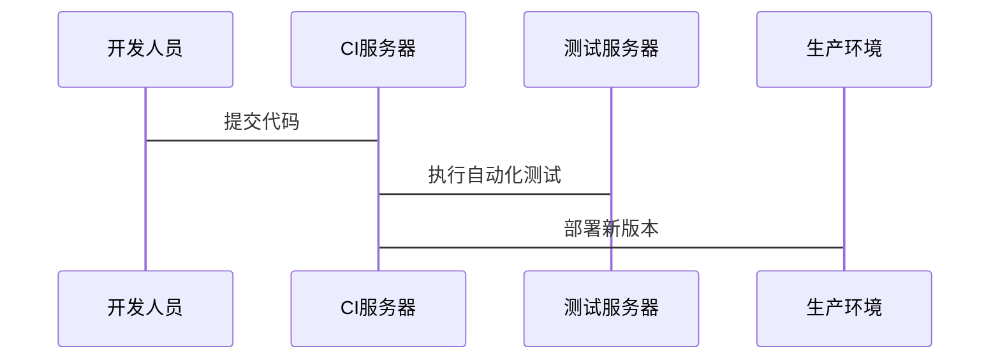

                 


# 持续集成/持续部署：自动化AI Agent的更新流程

> 关键词：持续集成, 持续部署, AI Agent, 自动化更新, 强化学习, 系统架构, DevOps

> 摘要：本文详细探讨了如何利用持续集成/持续部署（CI/CD）技术实现AI Agent的自动化更新流程。通过分析CI/CD与AI Agent的结合，本文介绍了从系统设计到算法实现的最佳实践，帮助读者掌握AI Agent在现代软件开发中的高效更新方法。

---

## 第一章 引言

### 1.1 背景介绍

随着人工智能技术的迅速发展，AI Agent（智能代理）在各个领域的应用日益广泛。AI Agent是一种能够感知环境并自主决策的智能系统，广泛应用于推荐系统、自动化控制、机器人等领域。然而，AI Agent的更新和维护却是一个复杂的挑战。传统的手动更新方式效率低下，容易出错，且难以保证系统的实时性和稳定性。

与此同时，持续集成/持续部署（CI/CD）作为一种高效的软件开发和部署方法，已经成为现代软件开发的标准流程。CI/CD通过自动化构建、测试和部署，能够快速发现和修复问题，显著提高了软件开发的效率和质量。

结合AI Agent的更新需求，CI/CD提供了一种自动化、标准化的解决方案。本文将探讨如何将CI/CD技术应用于AI Agent的更新流程，实现自动化、高效稳定的AI Agent版本管理。

---

## 第二章 核心概念与术语解析

### 2.1 持续集成（CI）的核心概念

持续集成是一种软件开发实践，通过频繁地将代码合并到主分支，并自动化执行构建、测试和验证，以确保代码的健康状态。其核心特点包括：

- **频繁集成**：开发人员每天多次将代码合并到主分支。
- **自动化构建与测试**：通过工具自动执行构建和测试，确保代码质量。
- **快速反馈**：及时发现和修复集成过程中的问题。

### 2.2 持续部署（CD）的定义与流程

持续部署是CI的延伸，指将代码从测试环境自动部署到生产环境。其流程包括：

- **单元测试**：对代码进行详细测试，确保模块功能正常。
- **集成测试**：验证模块之间的协作和交互。
- **端到端测试**：模拟真实环境，测试系统整体功能。
- **自动化部署**：通过脚本将代码部署到目标环境。

### 2.3 AI Agent的基本概念

AI Agent是一种能够感知环境并自主决策的智能系统，通常由以下核心模块组成：

- **感知模块**：接收环境输入，提取有用信息。
- **决策模块**：基于感知信息，执行决策算法，生成行动方案。
- **执行模块**：将决策结果转化为实际操作。

### 2.4 CI/CD与AI Agent的结合

AI Agent的更新需要考虑以下问题：

- **版本控制**：AI Agent的代码和模型需要版本化管理。
- **自动化测试**：确保新版本的稳定性和兼容性。
- **无缝部署**：将新版本快速、安全地部署到生产环境。

通过CI/CD技术，可以实现AI Agent的自动化更新流程，包括代码提交、模型训练、测试验证、部署上线等步骤。

---

## 第三章 CI/CD与AI Agent的结合

### 3.1 CI/CD在AI Agent更新中的作用

CI/CD为AI Agent的更新提供了以下优势：

- **自动化构建与测试**：AI Agent的代码和模型可以在CI阶段自动构建和测试，确保每次更新的质量。
- **快速反馈机制**：通过CD流程，可以快速发现并修复更新中的问题。
- **版本控制与回滚**：支持版本回滚机制，确保在出现问题时能够快速恢复。

### 3.2 AI Agent更新的CI/CD流程

AI Agent的更新流程可以分为以下几个阶段：

1. **代码提交**：开发人员将代码提交到版本控制系统（如Git）。
2. **模型训练**：CI工具自动触发模型训练任务，生成新的AI模型。
3. **自动化测试**：对新模型进行单元测试、集成测试和端到端测试。
4. **部署上线**：通过CD流程将新版本的AI Agent部署到生产环境。

### 3.3 CI/CD工具的选择与配置

选择合适的CI/CD工具是实现AI Agent自动化更新的关键。常用工具包括：

- **Jenkins**：功能强大，支持多种插件扩展。
- **GitLab CI/CD**：与GitLab集成，提供端到端的CI/CD支持。
- **CircleCI**：简单易用，支持多种开发环境。

---

## 第四章 AI Agent更新的算法原理

### 4.1 强化学习在AI Agent更新中的应用

强化学习是一种通过试错方式优化决策模型的算法。在AI Agent的更新中，强化学习可以用于优化决策策略。核心算法包括Q-learning和Deep Q-Network（DQN）。

### 4.2 Q-learning算法原理

Q-learning是一种经典的强化学习算法，其核心公式为：

$$ Q(s, a) = Q(s, a) + \alpha \cdot [r + \gamma \cdot \max Q(s', a') - Q(s, a)] $$

其中：
- \( Q(s, a) \) 表示状态 \( s \) 下采取动作 \( a \) 的价值。
- \( \alpha \) 是学习率。
- \( r \) 是奖励值。
- \( \gamma \) 是折扣因子。
- \( s' \) 是下一个状态。

### 4.3 深度强化学习的实现

深度强化学习通过神经网络来逼近Q值函数。常用的神经网络结构包括卷积神经网络（CNN）和长短时记忆网络（LSTM）。

---

## 第五章 系统架构与设计

### 5.1 系统架构设计

AI Agent的更新系统可以分为以下几个模块：

1. **版本控制系统**：管理AI Agent的代码和模型。
2. **CI/CD管道**：自动化执行构建、测试和部署。
3. **模型训练模块**：负责AI模型的训练和优化。
4. **测试模块**：执行自动化测试，确保系统稳定性。

### 5.2 系统交互设计

以下是系统交互的Mermaid序列图：



---

## 第六章 项目实战与实现

### 6.1 项目实战：AI推荐系统的CI/CD流程

#### 6.1.1 环境安装

```bash
# 安装Jenkins和Docker
sudo apt-get update
sudo apt-get install jenkins
sudo apt-get install docker.io
```

#### 6.1.2 核心代码实现

以下是一个简单的AI推荐系统代码示例：

```python
# 模型训练代码
import numpy as np
from sklearn.neural_network import MLPClassifier

# 数据准备
X = np.array([[0, 0], [1, 1], [2, 2], [3, 3]])
y = np.array([0, 1, 2, 3])

# 模型训练
model = MLPClassifier()
model.fit(X, y)

# 模型保存
import joblib
joblib.dump(model, 'model.pkl')
```

#### 6.1.3 CI/CD脚本

以下是一个Jenkins pipeline脚本示例：

```groovy
pipeline {
    stages {
        stage('构建') {
            steps {
                sh 'git clone https://github.com/your-repo.git'
                sh 'pip install -r requirements.txt'
            }
        }
        stage('测试') {
            steps {
                sh 'pytest --cov .'
            }
        }
        stage('部署') {
            steps {
                sh 'docker build -t your-image .'
                sh 'docker run -p 8080:8080 your-image'
            }
        }
    }
}
```

---

## 第七章 总结与展望

### 7.1 最佳实践

- **工具选择**：根据项目需求选择合适的CI/CD工具。
- **自动化测试**：确保测试覆盖所有关键路径。
- **版本回滚**：确保能够快速回滚到稳定版本。

### 7.2 未来展望

随着AI技术的不断发展，AI Agent的更新流程将更加智能化和自动化。未来的挑战包括如何进一步优化CI/CD流程，以及如何处理更复杂的AI模型更新问题。

---

## 参考文献

- [1]《持续集成、持续交付、持续部署》，Jenkins中文社区
- [2]《强化学习实战》，李航
- [3]《机器学习实战》，周志华

---

通过本文的详细讲解，读者可以掌握如何利用CI/CD技术实现AI Agent的自动化更新流程，从而提高AI系统的开发效率和稳定性。

