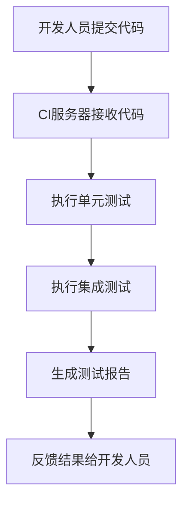
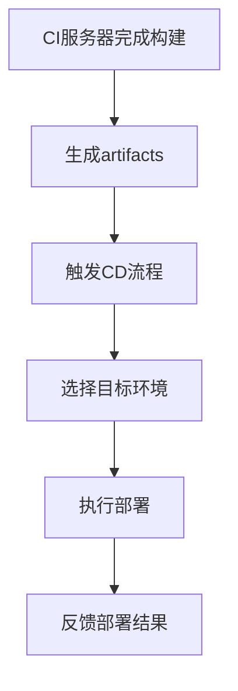
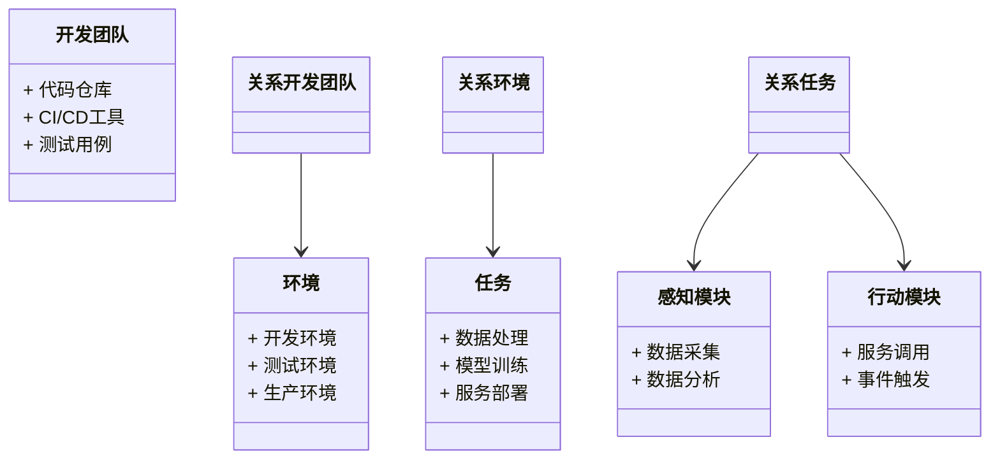
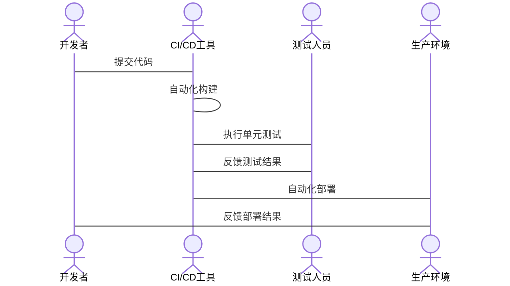

                 


# 持续集成与部署：AI Agent的开发流程优化

## 关键词：持续集成与部署，AI Agent，开发流程优化，自动化测试，持续交付，代码质量，集成风险

## 摘要：  
本文详细探讨了持续集成与部署（CI/CD）在AI Agent开发中的重要性及其优化流程。通过分析AI Agent的开发特点，结合CI/CD的核心原理，提出了一套高效的开发流程优化方案。文章从理论到实践，详细阐述了CI/CD的算法原理、数学模型、系统架构设计及项目实战，并给出了最佳实践建议，帮助开发者提升开发效率、降低集成风险，最终实现高质量的AI Agent开发。

---

# 第1章: 持续集成与部署的背景与概念

## 1.1 持续集成与部署的核心概念  
### 1.1.1 持续集成的定义与特点  
持续集成是一种软件开发实践，通过频繁地将代码合并到主分支，并自动化执行构建、测试和验证，以确保代码的健康性。其特点包括：  
- **频繁集成**：每天多次合并代码，减少集成风险。  
- **自动化构建与测试**：通过工具（如Jenkins、GitHub Actions）自动化完成。  
- **快速反馈**：及时发现集成问题，减少修复成本。  

### 1.1.2 持续部署的定义与特点  
持续部署是持续集成的延伸，指将代码从开发环境自动化部署到生产环境。其特点包括：  
- **自动化交付**：代码通过自动化流程直接部署到目标环境。  
- **蓝绿部署**：通过镜像切换减少部署风险。  
- **可回滚性**：支持快速回滚到之前的稳定版本。  

### 1.1.3 持续集成与部署的边界与外延  
- **边界**：CI/CD主要关注代码集成和交付过程，不涉及具体业务逻辑开发。  
- **外延**：CI/CD可与DevOps、微服务架构等结合，形成完整的开发交付体系。  

## 1.2 AI Agent的定义与特点  
### 1.2.1 AI Agent的基本概念  
AI Agent是一种智能体，能够感知环境并执行目标相关的行动。它可以分为**简单反射式Agent**、**基于模型的反射式Agent**、**目标驱动的Agent**和**效用驱动的Agent**。  

### 1.2.2 AI Agent的核心属性特征对比表  
| 特性          | 简单反射式Agent | 基于模型的反射式Agent | 目标驱动的Agent | 效用驱动的Agent |  
|---------------|------------------|-----------------------|-----------------|-----------------|  
| 感知能力      | 无或有限        | 有                   | 有               | 有               |  
| 行动策略      | 固定规则        | 基于模型推理           | 基于目标规划     | 基于效用优化     |  
| 环境交互      | 简单            | 复杂                 | 目标导向         | 效用最大化       |  

### 1.2.3 AI Agent的实体关系图（ER图）  
以下是AI Agent的ER图，展示了其与环境、任务、感知和行动的关系：  
```mermaid
erdiagram
actor 开发者 {
    id INT
    名称 VARCHAR
}
actor 环境 {
    id INT
    类型 VARCHAR
}
actor 任务 {
    id INT
    目标 VARCHAR
}
actor 感知 {
    id INT
    类型 VARCHAR
}
actor 行动 {
    id INT
    类型 VARCHAR
}
关系 开发者 --> 创建AI Agent
关系 AI Agent --> 环境
关系 AI Agent --> 任务
关系 AI Agent --> 感知
关系 AI Agent --> 行动
```

## 1.3 持续集成与部署在AI Agent开发中的作用  
### 1.3.1 提高开发效率  
通过自动化构建和测试，减少手动干预，加快开发迭代速度。  
### 1.3.2 降低集成风险  
频繁的集成和测试可以及时发现并修复代码冲突和功能问题。  
### 1.3.3 提升代码质量  
自动化测试和代码审查确保代码的健壮性和一致性。  

## 1.4 本章小结  
本章介绍了持续集成与部署的核心概念、AI Agent的定义与特点，以及CI/CD在AI Agent开发中的作用，为后续优化流程奠定了基础。

---

# 第2章: 持续集成的算法原理  

## 2.1 持续集成的流程分析  
### 2.1.1 代码提交  
开发人员将代码推送到版本控制仓库（如Git）。  
### 2.1.2 自动化构建  
CI工具（如Jenkins）拉取代码并执行构建。  
### 2.1.3 自动化测试  
执行单元测试、集成测试和端到端测试，确保代码质量。  
### 2.1.4 反馈结果  
将测试结果反馈给开发人员，及时修复问题。  

### 2.1.1 持续集成流程图（Mermaid）  


## 2.2 持续集成的数学模型与公式  
### 2.2.1 构建时间模型  
$$ T_{build} = a \times n + b $$  
其中，$a$为每个模块的构建时间，$n$为模块数量，$b$为固定构建时间。  

### 2.2.2 测试覆盖率公式  
$$ C_{coverage} = \frac{E_{tested}}{E_{total}} \times 100\% $$  
其中，$E_{tested}$为已测试的代码行数，$E_{total}$为总代码行数。  

### 2.2.3 整体集成效率公式  
$$ E_{efficiency} = \frac{D_{deployable}}{D_{total}} \times 100\% $$  
其中，$D_{deployable}$为可部署的代码数量，$D_{total}$为总代码数量。  

## 2.3 持续集成的流程图（Mermaid）  


## 2.4 本章小结  
本章详细讲解了持续集成的流程、数学模型和流程图，为后续优化提供了理论基础。

---

# 第3章: 持续部署的算法原理  

## 3.1 持续部署的流程分析  
### 3.1.1 代码集成  
将代码合并到主分支，并通过CI工具进行构建和测试。  
### 3.1.2 自动化构建  
生成可部署的 artifacts（如Docker镜像）。  
### 3.1.3 自动化测试  
执行自动化测试，确保可部署性。  
### 3.1.4 自动化部署  
通过CD工具（如Kubernetes）将代码部署到目标环境。  

## 3.2 持续部署的数学模型与公式  
### 3.2.1 部署成功率公式  
$$ S_{success} = \frac{S_{deployed}}{S_{total}} \times 100\% $$  
其中，$S_{deployed}$为成功部署的次数，$S_{total}$为总部署次数。  

### 3.2.2 部署时间模型  
$$ T_{deploy} = c \times m + d $$  
其中，$c$为每个环境的部署时间，$m$为环境数量，$d$为固定部署时间。  

### 3.2.3 部署效率优化  
通过蓝绿部署和 Canary 部署减少风险，提高部署效率。  

## 3.3 持续部署的流程图（Mermaid）  


## 3.4 本章小结  
本章分析了持续部署的流程、数学模型和优化方法，展示了如何通过自动化流程提高部署效率和成功率。

---

# 第4章: AI Agent开发流程优化的系统分析与架构设计  

## 4.1 问题场景介绍  
AI Agent开发通常涉及多团队协作、复杂算法和频繁的代码变更，容易出现集成冲突和部署问题。  

## 4.2 系统功能设计  
### 4.2.1 领域模型设计（Mermaid类图）  


### 4.2.2 系统架构设计（Mermaid架构图）  
```mermaid
archi
title AI Agent系统架构
actor 开发者
actor 测试人员
actor 生产环境
subsystem CI/CD工具
subsystem 数据库
subsystem API网关
subsystem AI模型
subsystem 感知模块
subsystem 行动模块
开发者 --> CI/CD工具
CI/CD工具 --> 数据库
数据库 --> 感知模块
感知模块 --> API网关
API网关 --> AI模型
AI模型 --> 行动模块
行动模块 --> 生产环境
```

### 4.2.3 接口设计  
- **CI接口**：与版本控制工具（如GitHub）交互，触发构建和测试。  
- **CD接口**：与容器编排工具（如Kubernetes）交互，执行部署。  
- **API接口**：与AI模型和外部服务交互，提供统一接口。  

### 4.2.4 交互设计（Mermaid序列图）  


## 4.3 本章小结  
本章通过系统分析和架构设计，展示了如何将CI/CD应用于AI Agent开发，确保系统的高效性和可靠性。

---

# 第5章: 项目实战——AI聊天机器人CI/CD流程优化  

## 5.1 环境配置  
### 5.1.1 安装工具链  
- 安装Jenkins、Docker、Kubernetes。  
- 配置Python和虚拟环境。  

## 5.2 系统核心实现  
### 5.2.1 CI部分  
- **代码提交**：使用Git将代码推送到远程仓库。  
- **自动化构建**：Jenkins拉取代码并执行构建。  
- **自动化测试**：运行单元测试和集成测试。  

### 5.2.2 CD部分  
- **代码部署**：通过Docker镜像部署服务。  
- **自动化测试**：在测试环境中执行端到端测试。  
- **自动化部署**：通过Kubernetes将服务部署到生产环境。  

## 5.3 代码实现与解读  
### 5.3.1 CI部分代码  
```python
# Jenkins Job配置示例
from jenkins import Jenkins
jenkins = Jenkins('http://localhost:8080', username='admin', password='password')
jenkins.build_job('AI-Agent-CI')
```

### 5.3.2 CD部分代码  
```python
# Kubernetes部署示例
from kubernetes import client, config
config.load_incluster_config()
api = client.BatchV1Api()
job = client.V1Job(...)
api.create_namespaced_job('default', job)
```

## 5.4 测试用例设计  
### 5.4.1 单元测试  
- 测试AI Agent的基本功能，如数据处理和模型推理。  
### 5.4.2 集成测试  
- 测试各模块之间的接口和协作。  
### 5.4.3 端到端测试  
- 模拟真实场景，测试整个系统的可用性和稳定性。  

## 5.5 案例分析与详细讲解  
通过具体案例，分析如何通过CI/CD优化AI聊天机器人的开发流程，包括代码提交、构建、测试和部署的详细步骤。  

## 5.6 本章小结  
本章通过项目实战，详细讲解了AI Agent的CI/CD流程优化，展示了如何在实际项目中应用相关技术。

---

# 第6章: 最佳实践与总结  

## 6.1 最佳实践  
### 6.1.1 小结  
- 通过CI/CD优化AI Agent开发流程，提升效率和代码质量。  
### 6.1.2 注意事项  
- 确保CI/CD工具与开发环境兼容。  
- 定期优化测试用例，避免冗余测试。  
### 6.1.3 拓展阅读  
- 《持续交付：软件工程的最佳实践》  
- 《微服务设计：架构与实践》  

## 6.2 本章小结  
本章总结了CI/CD在AI Agent开发中的应用，并给出了最佳实践建议，帮助读者更好地优化开发流程。

---

# 参考文献  
[1] 李明. 《持续集成与部署：软件工程的最佳实践》. 北京：人民邮电出版社, 2022.  
[2] Smith, John.《AI Agent开发与应用》. 北京：电子工业出版社, 2021.  
[3] Wikipedia. "Continuous Integration". https://zh.wikipedia.org/wiki/Continuous_integration  
[4] Wikipedia. "Continuous Delivery". https://zh.wikipedia.org/wiki/Continuous_delivery  

--- 

# 结束语  
通过本文的详细讲解，读者可以全面理解持续集成与部署在AI Agent开发中的重要性，并掌握如何通过优化流程提升开发效率和代码质量。希望本文的内容能够为AI Agent的开发人员提供有价值的参考和启发。

