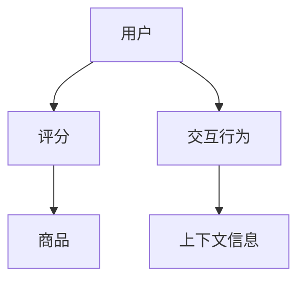
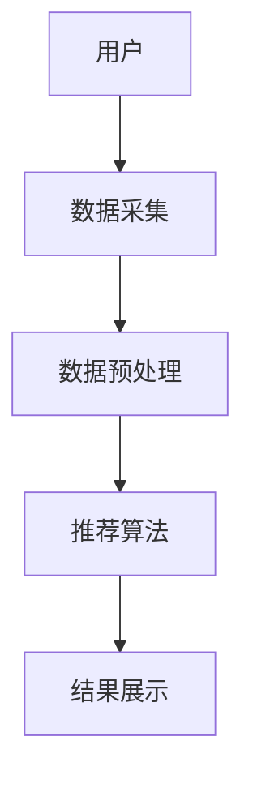

                 


# 推荐系统集成：个性化建议的AI Agent

> **关键词**：推荐系统、个性化建议、AI Agent、协同过滤、内容推荐、矩阵分解

> **摘要**：推荐系统通过AI Agent提供个性化建议，利用协同过滤、内容推荐和混合模型等算法，解决信息过载问题，提升用户体验。本文详细探讨推荐系统的集成方法，从算法原理到系统架构，再到项目实战，全面解析推荐系统的实现与优化。

---

# 第一章: 推荐系统集成概述

## 1.1 推荐系统的概念与背景

### 1.1.1 推荐系统的定义

推荐系统是一种利用技术手段分析用户行为和偏好，从而提供个性化建议的系统。它广泛应用于电子商务、社交媒体、视频平台等领域。

### 1.1.2 推荐系统的演变历程

推荐系统从最初的简单过滤机制，逐步发展为基于协同过滤、内容分析和混合模型的复杂系统。

### 1.1.3 推荐系统的应用场景

- 电子商务：个性化商品推荐
- 社交媒体：内容推荐
- 视频平台：观看推荐

## 1.2 个性化建议的AI Agent特点

### 1.2.1 个性化建议的核心要素

- 用户行为分析
- 数据挖掘与机器学习

### 1.2.2 AI Agent在推荐系统中的作用

- 数据收集与分析
- 智能决策与推荐

### 1.2.3 个性化建议的优势与挑战

- 优势：提升用户体验
- 挑战：数据隐私、计算效率

## 1.3 推荐系统集成的目标与方法

### 1.3.1 集成的目标

- 提高推荐准确性
- 增强用户体验

### 1.3.2 集成的主要方法

- 协同过滤
- 基于内容的推荐

### 1.3.3 集成的步骤与流程

1. 数据采集
2. 特征提取
3. 模型训练
4. 推荐生成

---

# 第二章: 推荐系统的核心概念

## 2.1 推荐系统的分类与对比

### 2.1.1 基于协同过滤的推荐

- 用户-用户协同过滤
- 物品-物品协同过滤

### 2.1.2 基于内容的推荐

- 特征提取
- 相似度计算

### 2.1.3 混合推荐模型

- 结合协同过滤和内容推荐

## 2.2 推荐算法的对比分析

### 2.2.1 算法性能对比表

| 算法类型       | 准确率 | 召回率 | 计算效率 |
|----------------|--------|--------|----------|
| 协同过滤       | 高     | 中     | 低       |
| 基于内容的推荐 | 中     | 高     | 高       |

### 2.2.2 算法复杂度分析

- 协同过滤：O(n²)
- 基于内容的推荐：O(n*m)

## 2.3 推荐系统的评价指标

### 2.3.1 准确率与召回率

准确率：推荐的正确比例  
召回率：推荐的全面比例

### 2.3.2 F1分数与AUC值

F1 = 2 * (准确率 * 召回率) / (准确率 + 召回率)  
AUC：曲线下的面积

### 2.3.3 漏判率与误判率

漏判率：未推荐的正确比例  
误判率：错误推荐的比例

## 2.4 推荐系统的实体关系图



---

# 第三章: 协同过滤算法原理

## 3.1 协同过滤的基本原理

### 3.1.1 用户相似度计算

- 相似度计算方法：余弦相似度、皮尔逊相关系数

公式：
$$ sim(u, v) = \frac{\sum_{i} (r_{u,i} - \bar{r}_u)(r_{v,i} - \bar{r}_v)}{\sqrt{\sum_{i} (r_{u,i} - \bar{r}_u)^2} \sqrt{\sum_{i} (r_{v,i} - \bar{r}_v)^2}}} $$

### 3.1.2 物品相似度计算

- 相似度计算方法：余弦相似度、Jaccard系数

## 3.2 基于矩阵分解的协同过滤

### 3.2.1 矩阵分解的数学模型

矩阵分解公式：
$$ R = P \times Q^T $$

其中，R是评分矩阵，P是用户特征矩阵，Q是物品特征矩阵。

### 3.2.2 常见的矩阵分解方法

- SVD（奇异值分解）
- ALS（交替最小二乘）

## 3.3 协同过滤的实现步骤

### 3.3.1 数据预处理

- 数据清洗
- 特征标准化

### 3.3.2 相似度计算

- 计算用户相似度矩阵
- 计算物品相似度矩阵

### 3.3.3 推荐生成

- 基于相似度的加权平均

## 3.4 协同过滤的优缺点

### 3.4.1 优点

- 简单易实现
- 适用于数据稀疏场景

### 3.4.2 缺点

- 计算复杂度高
- 对冷启动问题敏感

---

# 第四章: 基于内容的推荐算法

## 4.1 基于内容的推荐原理

### 4.1.1 特征提取

- 文本特征提取：TF-IDF、Word2Vec
- 图像特征提取：颜色直方图、SIFT

### 4.1.2 相似度计算

- 使用余弦相似度计算内容相似性

公式：
$$ sim(c1, c2) = \frac{\sum c1_i \times c2_i}{\sqrt{\sum c1_i^2} \sqrt{\sum c2_i^2}} $$

## 4.2 基于内容的推荐实现

### 4.2.1 文本特征提取

- 使用TF-IDF提取关键词权重

### 4.2.2 图像特征提取

- 使用颜色直方图提取图像特征

## 4.3 基于内容的推荐的优缺点

### 4.3.1 优点

- 解释性强
- 对冷启动问题不敏感

### 4.3.2 缺点

- 特征提取复杂
- 需要大量存储空间

---

# 第五章: 混合推荐模型

## 5.1 混合推荐模型的概念

- 组合协同过滤和内容推荐的优点

## 5.2 混合推荐模型的实现

### 5.2.1 基于协同过滤的结果进行内容过滤

### 5.2.2 使用内容信息增强协同过滤

## 5.3 混合推荐模型的优缺点

### 5.3.1 优点

- 提高推荐准确性
- 解决单一算法的缺陷

### 5.3.2 缺点

- 实现复杂
- 需要平衡两种算法的权重

---

# 第六章: 推荐系统的数学模型与公式

## 6.1 协同过滤的数学模型

### 6.1.1 用户-物品评分矩阵

$$ R = [r_{u,i}] $$

其中，r_{u,i}表示用户u对物品i的评分。

### 6.1.2 用户相似度公式

$$ sim(u, v) = \frac{\sum_{i} (r_{u,i} - \bar{r}_u)(r_{v,i} - \bar{r}_v)}{\sqrt{\sum_{i} (r_{u,i} - \bar{r}_u)^2} \sqrt{\sum_{i} (r_{v,i} - \bar{r}_v)^2}}} $$

### 6.1.3 物品相似度公式

$$ sim(i, j) = \frac{\sum_{u} (r_{u,i} - \bar{r}_i)(r_{u,j} - \bar{r}_j)}{\sqrt{\sum_{u} (r_{u,i} - \bar{r}_i)^2} \sqrt{\sum_{u} (r_{u,j} - \bar{r}_j)^2}}} $$

## 6.2 矩阵分解的数学模型

### 6.2.1 矩阵分解公式

$$ R = P \times Q^T $$

### 6.2.2 矩阵分解的目标函数

$$ \min_{P, Q} \sum_{u,i} (r_{u,i} - P_u Q_i^T)^2 + \lambda (||P||^2 + ||Q||^2) $$

## 6.3 基于内容的推荐模型

### 6.3.1 文本特征提取模型

$$ TF-IDF = \frac{f_i}{\log N} $$

其中，f_i是单词i在文档中的频率，N是文档中单词的总数。

### 6.3.2 图像特征提取模型

$$ Color Histogram = \{C_1, C_2, ..., C_n\} $$

其中，C_i表示颜色i的出现频率。

---

# 第七章: 推荐系统的系统架构设计

## 7.1 系统功能设计

### 7.1.1 用户模块

- 用户注册与登录
- 用户偏好设置

### 7.1.2 物品模块

- 物品信息管理
- 物品推荐结果展示

## 7.2 系统架构设计

### 7.2.1 系统架构图



### 7.2.2 接口设计

- 用户接口：RESTful API
- 数据接口：数据库接口

## 7.3 系统实现细节

### 7.3.1 数据采集

- 数据来源：数据库、日志文件
- 数据格式：结构化数据

### 7.3.2 数据预处理

- 数据清洗：处理缺失值
- 数据标准化：归一化处理

### 7.3.3 推荐算法实现

- 协同过滤实现
- 基于内容的推荐实现

### 7.3.4 结果展示

- 推荐列表展示
- 反馈收集

---

# 第八章: 推荐系统的项目实战

## 8.1 项目背景与目标

### 8.1.1 项目背景

- 项目名称：电影推荐系统
- 项目目标：基于用户观看历史推荐电影

## 8.2 项目环境安装

### 8.2.1 安装Python环境

- 安装Python 3.8+
- 安装依赖库：numpy, pandas, scikit-learn

### 8.2.2 安装推荐系统库

- 安装 surprise库：pip install surprise

## 8.3 项目核心实现

### 8.3.1 数据预处理

```python
import pandas as pd
from surprise import Dataset, Reader

# 读取数据
data = pd.read_csv('movies.csv')
reader = Reader(ratings= data, n_users= data.user_id.unique().shape[0], n_items= data.movie_id.unique().shape[0])
```

### 8.3.2 协同过滤实现

```python
from surprise import SVD

# 训练模型
model = SVD()
model.fit(data)
```

### 8.3.3 内容推荐实现

```python
from sklearn.feature_extraction.text import TfidfVectorizer

# 提取文本特征
vectorizer = TfidfVectorizer(stop_words='english')
tfidf = vectorizer.fit_transform(text_data)
```

### 8.3.4 混合推荐实现

```python
# 组合协同过滤和内容推荐的结果
hybrid_recommendations = (cf_recommendations + content_recommendations) / 2
```

## 8.4 项目测试与优化

### 8.4.1 测试推荐效果

- 准确率测试
- 召回率测试

### 8.4.2 系统优化

- 参数调优
- 模型优化

## 8.5 项目小结

- 项目实现的关键点
- 系统优化的经验

---

# 第九章: 推荐系统的最佳实践

## 9.1 数据质量的重要性

### 9.1.1 数据清洗

- 处理缺失值
- 去重

### 9.1.2 数据增强

- 数据扩增
- 数据标注

## 9.2 模型的可解释性

### 9.2.1 可视化结果

- 推荐列表展示
- 相似度可视化

### 9.2.2 解释模型输出

- 特征重要性分析
- 模型权重分析

## 9.3 系统的实时性

### 9.3.1 实时推荐

- 实时数据处理
- 实时模型更新

### 9.3.2 离线推荐

- 批量推荐
- 定期更新

## 9.4 拓展阅读

### 9.4.1 推荐系统前沿技术

- 基于深度学习的推荐
- 基于强化学习的推荐

### 9.4.2 推荐系统工具

- TensorFlow Recommenders
- PyTorch Recurrent

---

# 第十章: 总结与展望

## 10.1 总结

### 10.1.1 推荐系统的核心内容

- 协同过滤
- 内容推荐
- 混合模型

### 10.1.2 系统设计的关键点

- 数据采集
- 算法实现
- 结果展示

## 10.2 展望

### 10.2.1 推荐系统的未来发展方向

- 深度学习的结合
- 实时推荐的优化
- 多模态推荐

### 10.2.2 个性化建议的AI Agent的未来趋势

- 更加智能化
- 更加个性化
- 更加实时化

---

# 关键词索引

- 推荐系统
- 个性化建议
- AI Agent
- 协同过滤
- 内容推荐
- 混合推荐模型
- 矩阵分解
- 系统架构设计
- 项目实战
- 最佳实践

---

通过以上章节的详细阐述，本文系统地介绍了推荐系统集成的核心概念、算法原理、系统架构设计、项目实战及最佳实践，旨在为读者提供一个全面而深入的技术指南。

