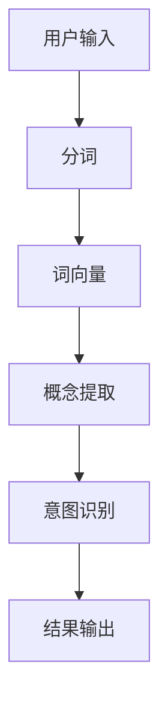
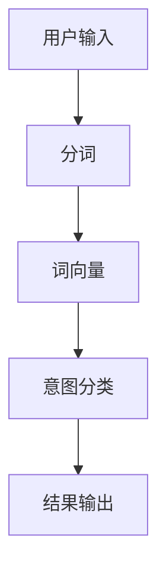
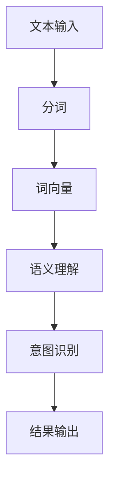
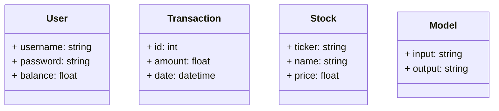
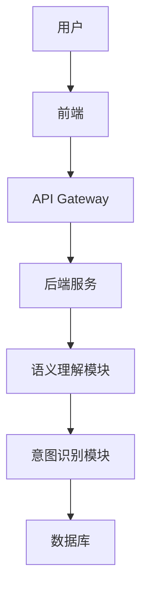
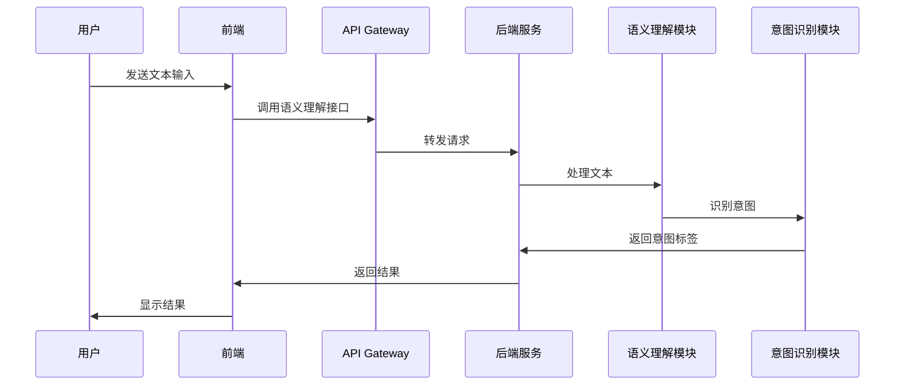

                 


# 提升金融领域语义理解与意图识别的准确性

> 关键词：金融领域，语义理解，意图识别，NLP，机器学习，深度学习，自然语言处理

> 摘要：本文详细探讨了提升金融领域语义理解与意图识别准确性的关键技术和方法。从背景介绍到核心概念，从算法原理到系统架构设计，再到项目实战，全面分析了如何在金融场景中提高语义理解的准确性，并通过实际案例展示了技术的应用和优化。

---

# 第1章: 金融领域语义理解与意图识别的背景与核心概念

## 1.1 问题背景

### 1.1.1 金融领域语义理解的重要性
在金融领域，语义理解（Semantic Understanding）和意图识别（Intention Recognition）是实现智能金融系统的核心技术。例如，在智能客服、股票分析、风险管理等领域，准确理解用户意图和文本含义至关重要。

### 1.1.2 当前语义理解技术的局限性
当前的语义理解技术在金融领域仍存在以下问题：
- 专业术语和复杂句式的处理能力不足。
- 数据稀疏性导致模型泛化能力有限。
- 对上下文依赖的处理不够精准。

### 1.1.3 提升语义理解准确性的必要性
提升准确性可以减少误判和误解，提高金融系统的智能化水平，从而增强用户体验和业务效率。

## 1.2 问题描述

### 1.2.1 金融领域语义理解的典型场景
- 股票市场分析：解析用户的市场评论，识别情绪和趋势。
- 金融新闻解读：从新闻中提取关键信息，辅助投资决策。
- 客户咨询处理：准确理解客户的问题，提供精准的解答。

### 1.2.2 意图识别在金融交易中的作用
- 交易指令解析：识别用户的交易意图，确保准确执行。
- 风险评估：通过分析用户的意图和行为，评估潜在风险。
- 客户行为预测：基于意图识别，预测客户的未来行为。

### 1.2.3 当前技术面临的挑战
- 数据多样性：金融领域的数据类型多样，包括文本、数值、时间序列等。
- 高精度要求：金融交易对准确性的要求极高，任何错误都可能造成重大损失。
- 模型可解释性：复杂的金融决策需要模型具有较高的可解释性。

## 1.3 问题解决

### 1.3.1 提升语义理解准确性的关键因素
- 数据质量：使用高质量、标注化的金融数据进行训练。
- 模型优化：采用深度学习模型，如BERT、Transformer等，提升语义理解能力。
- 领域知识结合：将金融领域的专业知识融入模型，增强领域适应性。

### 1.3.2 意图识别的核心技术改进方向
- 使用更先进的模型结构，如预训练语言模型。
- 引入领域特定的数据增强技术。
- 结合上下文信息，提高意图识别的准确性。

### 1.3.3 优化方案的设计思路
- 数据层面：构建领域特定的语料库，增加数据的多样性和相关性。
- 模型层面：引入预训练模型，并在金融领域数据上进行微调。
- 应用层面：结合业务规则和领域知识，优化意图识别的结果。

## 1.4 边界与外延

### 1.4.1 语义理解的边界条件
- 仅处理文本和语音输入，不涉及图像或视频。
- 主要关注显式意图，不涉及隐含意图的深度推理。

### 1.4.2 意图识别的适用范围
- 适用于明确的用户指令和常见场景，不适用于模糊或复杂的意图。
- 依赖高质量的训练数据和领域知识。

### 1.4.3 与相关技术的区分与联系
- 与自然语言处理（NLP）的关系：语义理解是NLP的核心任务之一。
- 与机器学习的关系：意图识别是机器学习在NLP中的典型应用。
- 与领域知识的关系：金融领域的语义理解依赖于对金融专业知识的掌握。

## 1.5 概念结构与核心要素

### 1.5.1 语义理解的基本概念框架
语义理解是一个将自然语言文本转换为计算机可理解的概念或实体的过程。其核心要素包括：
- 文本输入：用户提供的文本或语音。
- 分词处理：将文本分割成词语或短语。
- 词向量表示：将词语映射到向量空间。
- 概念提取：从文本中提取关键概念或实体。

### 1.5.2 意图识别的核心要素分析
意图识别是通过分析文本或语音，确定用户的意图或目标。其核心要素包括：
- 文本输入：用户提供的文本或语音。
- 意图分类：将文本映射到预定义的意图类别。
- 模型训练：使用标注数据训练意图分类模型。
- 输出结果：用户意图的标签或描述。

### 1.5.3 核心概念之间的关系
语义理解是意图识别的基础，通过语义理解提取文本中的概念和实体，为意图识别提供输入。意图识别则基于语义理解的结果，进一步确定用户的意图或目标。

---

# 第2章: 核心概念与联系

## 2.1 核心概念原理

### 2.1.1 语义理解的基本原理
语义理解的过程包括以下几个步骤：
1. **分词**：将文本分割成词语或短语。
2. **词向量表示**：将词语映射到向量空间，常用的技术包括Word2Vec、GloVe、BERT等。
3. **概念提取**：从文本中提取关键概念或实体，如公司名称、股票代码、市场情绪等。

### 2.1.2 意图识别的实现机制
意图识别的过程包括以下几个步骤：
1. **文本输入**：用户提供的文本或语音。
2. **语义理解**：将文本转换为概念或实体。
3. **意图分类**：基于语义理解的结果，确定用户的意图。
4. **结果输出**：输出用户的意图标签或描述。

### 2.1.3 金融领域语义理解的特殊性
金融领域的语义理解具有以下特点：
- 专业术语多：如“股票”、“债券”、“风险管理”等。
- 句式复杂：金融文本中常出现长句和复杂结构。
- 上下文依赖性强：某些术语在特定上下文中才有意义。

## 2.2 概念属性特征对比

### 2.2.1 概念对比表格
| 概念 | 属性 | 特征 |
|------|------|------|
| 语义理解 | 输入 | 文本/语音 |
| 语义理解 | 输出 | 概念/实体 |
| 意图识别 | 输入 | 文本/语音 |
| 意图识别 | 输出 | 用户意图 |

### 2.2.2 实体关系图


## 2.3 实体关系图



---

# 第3章: 金融领域语义理解与意图识别的应用场景

## 3.1 金融领域语义理解的典型场景

### 3.1.1 股票市场分析
- 从新闻、评论中提取市场情绪，预测股票价格走势。
- 示例：解析用户输入“近期科技股表现强劲，建议买入苹果股票”，提取关键词“科技股”、“苹果”、“买入”。

### 3.1.2 金融新闻解读
- 从新闻标题和正文提取关键信息，如公司财报、市场动态等。
- 示例：解析新闻“美联储加息政策出台，导致美元走强”，提取关键词“美联储”、“加息”、“美元走强”。

### 3.1.3 客户咨询处理
- 理解客户的问题，提供精准的解答。
- 示例：解析用户输入“如何配置我的投资组合”，提取关键词“投资组合”、“配置”。

## 3.2 意图识别在金融交易中的应用

### 3.2.1 交易指令解析
- 识别用户的交易意图，如买入、卖出、持有等。
- 示例：解析用户输入“我想买入微软股票”，识别意图“买入”和实体“微软股票”。

### 3.2.2 风险评估
- 基于用户意图和行为，评估潜在风险。
- 示例：解析用户输入“我计划投资科技股”，评估其投资风险。

### 3.2.3 客户行为预测
- 基于历史行为和意图，预测未来的客户行为。
- 示例：解析用户输入“最近频繁交易比特币”，预测其可能进行高风险投资。

---

# 第4章: 语义理解与意图识别的算法原理

## 4.1 常见算法介绍

### 4.1.1 TF-IDF
- **原理**：TF-IDF是一种衡量一个词在文本中重要性的统计方法。
- **公式**：
  - $$TF = \frac{1}{1 + \log(1 + \text{term count in document})}$$
  - $$IDF = \log\left(\frac{N}{N_i}\right)$$
  - $$TF-IDF = TF \times IDF$$
- **示例**：在一篇关于股票市场的文章中，计算关键词“股票”、“市场”的TF-IDF值。

### 4.1.2 Word2Vec
- **原理**：通过词嵌入技术，将词语映射到低维向量空间。
- **模型**：包括CBOW（连续词袋）和Skip-Gram两种模型。
- **示例**：训练一个金融领域的Word2Vec模型，生成金融术语的词向量。

### 4.1.3 BERT
- **原理**：基于Transformer的预训练语言模型，通过掩码和上下文信息生成词向量。
- **优势**：能够捕捉到长距离依赖关系，适合处理复杂金融文本。
- **示例**：使用BERT模型对金融新闻进行语义理解，提取关键词和实体。

## 4.2 算法流程图



---

# 第5章: 系统分析与架构设计

## 5.1 问题场景介绍

### 5.1.1 问题场景
- 用户输入：金融领域的文本或语音。
- 业务目标：准确理解用户意图，提供精准的金融服务。
- 约束条件：高准确性、低延迟、高可解释性。

## 5.2 项目介绍

### 5.2.1 项目目标
- 提升金融领域语义理解与意图识别的准确性。
- 实现一个高效的智能金融系统。

## 5.3 系统功能设计

### 5.3.1 领域模型


### 5.3.2 系统架构


### 5.3.3 系统接口设计
- API接口：RESTful API，支持POST请求，输入文本，输出意图标签。
- 数据接口：与金融数据库对接，获取实时股票价格、市场数据等。

### 5.3.4 系统交互


---

# 第6章: 项目实战

## 6.1 环境安装

### 6.1.1 安装Python
```bash
# 安装Python 3.8及以上版本
sudo apt-get update
sudo apt-get install python3.8
```

### 6.1.2 安装依赖库
```bash
pip install numpy
pip install scikit-learn
pip install transformers
pip install mermaid
```

## 6.2 系统核心实现

### 6.2.1 语义理解实现
```python
from sklearn.feature_extraction.text import TfidfVectorizer

# 初始化TF-IDF模型
vectorizer = TfidfVectorizer(max_features=1000)
```

### 6.2.2 意图识别实现
```python
from transformers import pipeline

# 初始化意图识别模型
classifier = pipeline("text-classification", model="bert-base-uncased")
```

## 6.3 代码应用解读

### 6.3.1 语义理解代码解读
```python
import numpy as np
from sklearn.feature_extraction.text import TfidfVectorizer

# 示例文本
texts = ["买入股票", "卖出债券", "持有基金"]

# 计算TF-IDF
vectorizer = TfidfVectorizer()
tfidf_matrix = vectorizer.fit_transform(texts)

# 提取关键词
feature_names = vectorizer.get_feature_names_out()
print(feature_names)
```

### 6.3.2 意图识别代码解读
```python
from transformers import pipeline

# 示例文本
texts = ["我想买入苹果股票", "请卖出持有的比特币"]

# 意图识别
classifier = pipeline("text-classification", model="bert-base-uncased")
results = classifier(texts)
print(results)
```

## 6.4 实际案例分析

### 6.4.1 案例一：股票市场分析
- 输入文本：用户询问“如何配置我的投资组合？”
- 语义理解：提取关键词“投资组合”、“配置”。
- 意图识别：识别意图“投资建议”。

### 6.4.2 案例二：风险管理
- 输入文本：用户询问“我应该如何管理我的投资风险？”
- 语义理解：提取关键词“投资风险”、“管理”。
- 意图识别：识别意图“风险管理”。

---

# 第7章: 提升金融领域语义理解与意图识别准确性的最佳实践

## 7.1 小结

### 7.1.1 核心要点总结
- 语义理解是意图识别的基础。
- 金融领域的语义理解需要结合领域知识。
- 预训练模型在金融领域具有广阔的应用前景。

## 7.2 注意事项

### 7.2.1 数据处理
- 确保数据的多样性和代表性。
- 处理金融领域的专业术语和复杂句式。

### 7.2.2 模型优化
- 使用领域特定的数据增强技术。
- 在金融领域数据上进行模型微调。

### 7.2.3 模型可解释性
- 确保模型的可解释性，便于分析和优化。

## 7.3 拓展阅读

### 7.3.1 推荐书籍
- 《金融风险管理》
- 《自然语言处理实战》

### 7.3.2 推荐论文
- "BERT: Pre-training of Deep Bidirectional Transformers for NLP"
- "Attention Is All You Need"

---

# 附录: 金融领域语义理解与意图识别的未来展望

## 附录1: 新技术的发展

### 1.1 大模型的应用
- 使用更大的预训练模型，如GPT-3、GPT-4，提升语义理解的准确性。
- 在金融领域进行模型微调，增强领域适应性。

### 1.2 多模态技术的结合
- 结合文本、图像、语音等多种模态信息，提高语义理解的全面性。

### 1.3 知识图谱的应用
- 建立金融领域的知识图谱，辅助语义理解和意图识别。

## 附录2: 项目代码

### 2.1 语义理解代码
```python
from sklearn.feature_extraction.text import TfidfVectorizer

texts = ["买入股票", "卖出债券", "持有基金"]
vectorizer = TfidfVectorizer()
tfidf_matrix = vectorizer.fit_transform(texts)
feature_names = vectorizer.get_feature_names_out()
print(feature_names)
```

### 2.2 意图识别代码
```python
from transformers import pipeline

texts = ["我想买入苹果股票", "请卖出持有的比特币"]
classifier = pipeline("text-classification", model="bert-base-uncased")
results = classifier(texts)
print(results)
```

---

# 结语

通过本文的详细讲解，我们深入探讨了提升金融领域语义理解与意图识别准确性的关键技术。从背景介绍到核心概念，从算法原理到系统设计，再到项目实战，我们为读者提供了一个全面的技术视角。未来，随着技术的不断进步，金融领域的语义理解和意图识别将更加精准和智能化，为金融行业的发展注入新的活力。

---

