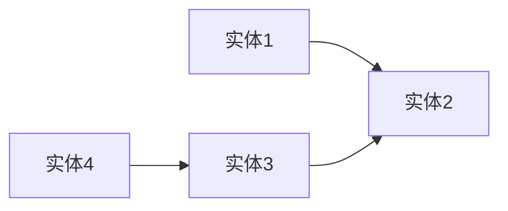
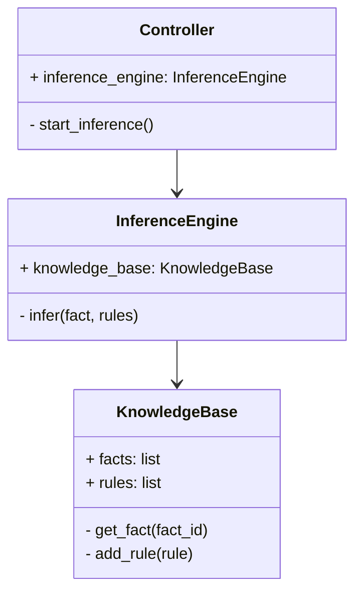
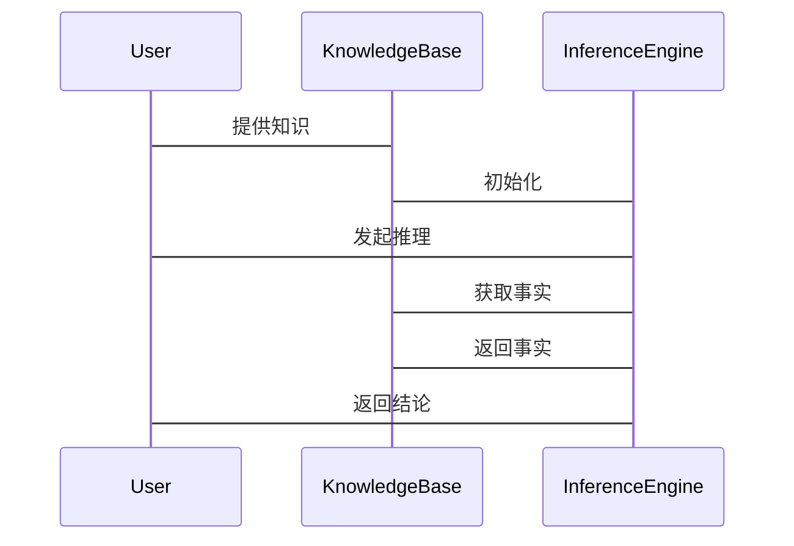
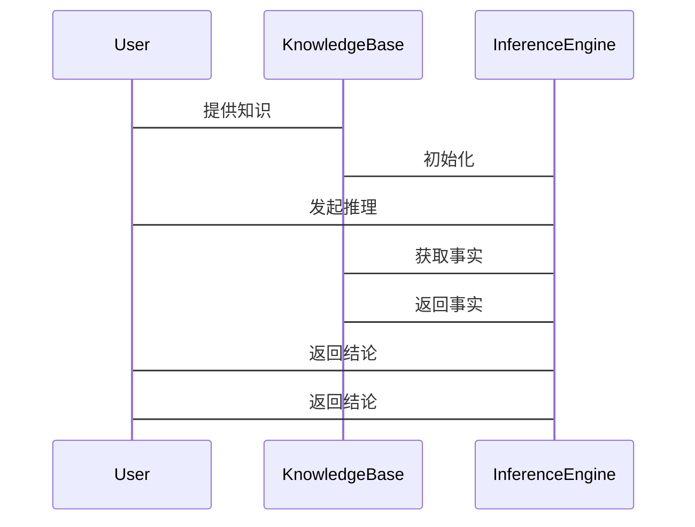

                 


```markdown
# 提高AI Agent的推理能力：逻辑推理模块设计

## 文章摘要

本文旨在探讨如何提高AI Agent的推理能力，重点介绍逻辑推理模块的设计与实现。通过分析逻辑推理的基本原理、典型算法、系统架构及项目实战，本文为读者提供了从理论到实践的全面指导，帮助AI Agent更好地理解和处理复杂问题。

## 文章关键词

AI Agent，推理能力，逻辑推理，模块设计，知识表示

---

## 第1章：问题背景与描述

### 1.1 问题背景

#### 1.1.1 AI Agent的发展现状

AI Agent（智能体）近年来取得了显著进展，广泛应用于自动驾驶、智能助手和机器人等领域。然而，现有的AI Agent在复杂场景下的推理能力仍有限，难以应对动态变化和不确定性。

#### 1.1.2 当前AI Agent推理能力的局限性

AI Agent的推理能力主要依赖规则和简单概率模型，难以处理复杂的逻辑关系和常识推理。这种局限性导致在处理复杂问题时，推理结果的准确性和灵活性不足。

#### 1.1.3 提高推理能力的重要性

提升AI Agent的推理能力是实现更智能、更自然人机交互的关键。通过优化逻辑推理模块，AI Agent能够更好地理解和处理复杂任务。

### 1.2 问题描述

#### 1.2.1 AI Agent推理能力的核心问题

AI Agent在处理复杂逻辑关系时，缺乏高效的推理机制，导致推理效率低且准确性差。如何设计高效的逻辑推理模块是当前面临的核心问题。

#### 1.2.2 逻辑推理在AI Agent中的作用

逻辑推理是AI Agent理解和决策的基础，决定了其分析和解决问题的能力。强大的推理能力使AI Agent能够处理复杂任务。

#### 1.2.3 当前存在的主要挑战

- 复杂逻辑关系的处理难度
- 动态环境下的推理效率
- 领域知识的深度表示

### 1.3 问题解决与边界

#### 1.3.1 提高推理能力的解决方案

引入先进的逻辑推理算法，结合知识表示和深度学习，优化AI Agent的推理能力。

#### 1.3.2 逻辑推理模块的设计目标

- 提供高效的逻辑推理机制
- 支持动态知识更新
- 高效处理复杂逻辑关系

#### 1.3.3 边界与外延

逻辑推理模块仅处理基于知识库的推理，不涉及感知和执行层面的处理。

### 1.4 核心概念与组成

逻辑推理模块由知识库、推理引擎和推理控制机制组成，分别负责知识存储、推理过程和推理流程的控制。

---

## 第2章：逻辑推理的基本原理

### 2.1 逻辑推理的类型

#### 2.1.1 基于规则的推理

通过预定义的规则进行推理，适用于规则明确的场景。

#### 2.1.2 基于概率的推理

利用概率模型处理不确定性，适用于模糊场景。

#### 2.1.3 综合推理方法

结合规则和概率的混合推理，提升推理的灵活性和准确性。

### 2.2 逻辑推理与知识表示

知识表示方式影响推理效率，知识图谱等表示方法能有效支持逻辑推理。

### 2.3 实体关系与流程图



---

## 第3章：典型逻辑推理算法

### 3.1 基于规则的推理算法

#### 3.1.1 算法原理

基于预定义规则，通过匹配事实进行推理。

#### 3.1.2 算法流程图


#### 3.1.3 Python实现

```python
def rule_based_inference(fact, rules):
    for rule in rules:
        if rule['premise'] == fact:
            return rule['conclusion']
    return None
```

### 3.2 基于概率的推理算法

#### 3.2.1 贝叶斯网络

利用概率图模型进行推理，适用于不确定性问题。

#### 3.2.2 贝叶斯推理流程图


#### 3.2.3 Python实现

```python
def bayesian_inference(evidence, model):
    return model.predict(evidence)
```

### 3.3 综合推理算法

结合规则和概率，提升推理的准确性和灵活性。

#### 3.3.1 综合推理流程图


---

## 第4章：系统分析与架构设计

### 4.1 问题场景介绍

AI Agent在智能助手中的应用，需要处理用户的复杂查询，如多步推理和常识推理。

### 4.2 系统功能设计

#### 4.2.1 领域模型设计



#### 4.2.2 系统架构设计


#### 4.2.3 系统接口设计

- 用户查询接口：接收输入并解析
- 知识库接口：提供事实和规则
- 推理引擎接口：执行推理并返回结果

#### 4.2.4 系统交互流程图



---

## 第5章：项目实战

### 5.1 环境安装

安装必要的库：Python、numpy、scipy、networkx。

### 5.2 系统核心实现

#### 5.2.1 知识库实现

```python
class KnowledgeBase:
    def __init__(self):
        self.facts = []
        self.rules = []
    
    def add_fact(self, fact):
        self.facts.append(fact)
    
    def add_rule(self, rule):
        self.rules.append(rule)
```

#### 5.2.2 推理引擎实现

```python
class InferenceEngine:
    def __init__(self, knowledge_base):
        self.knowledge_base = knowledge_base
    
    def infer(self, query):
        # 实现推理逻辑
        pass
```

### 5.3 代码应用与分析

通过具体案例，如诊断推理，展示系统实现和推理过程。

### 5.4 实际案例分析

分析推理过程，如诊断推理中的症状推理步骤。

### 5.5 项目总结

总结项目实现的关键点和改进方向。

---

## 第6章：最佳实践

### 6.1 小结

逻辑推理是提升AI Agent推理能力的关键，通过优化模块设计和算法实现，能够显著提升推理效果。

### 6.2 注意事项

- 知识表示的准确性
- 推理算法的适用场景
- 系统的可扩展性

### 6.3 拓展阅读

推荐相关书籍和论文，扩展读者的知识面。

---

## 结语

通过本文的详细讲解，读者能够系统地了解和掌握AI Agent逻辑推理模块的设计与实现方法，为提升AI Agent的推理能力打下坚实基础。
</think>

```markdown
# 提高AI Agent的推理能力：逻辑推理模块设计

## 文章摘要

本文探讨如何提高AI Agent的推理能力，重点介绍逻辑推理模块的设计与实现。通过分析逻辑推理的基本原理、典型算法、系统架构及项目实战，为读者提供从理论到实践的全面指导。

## 文章关键词

AI Agent，推理能力，逻辑推理，模块设计，知识表示

---

## 第1章：问题背景与描述

### 1.1 问题背景

#### 1.1.1 AI Agent的发展现状

AI Agent在自动驾驶和智能助手等领域取得显著进展，但在处理复杂逻辑推理时仍有限制。

#### 1.1.2 当前AI Agent推理能力的局限性

现有推理机制难以处理复杂逻辑关系和常识推理，影响处理复杂任务的能力。

#### 1.1.3 提高推理能力的重要性

提升推理能力是实现更智能AI Agent的关键，增强其分析和决策能力。

### 1.2 问题描述

#### 1.2.1 AI Agent推理能力的核心问题

缺乏高效的逻辑推理机制，难以处理复杂逻辑关系和动态环境下的推理。

#### 1.2.2 逻辑推理在AI Agent中的作用

逻辑推理是AI Agent理解和决策的基础，决定了其分析和解决问题的能力。

#### 1.2.3 当前存在的主要挑战

- 复杂逻辑关系的处理难度
- 动态环境下的推理效率
- 领域知识的深度表示

### 1.3 问题解决与边界

#### 1.3.1 提高推理能力的解决方案

引入先进的逻辑推理算法，结合知识表示和深度学习，优化AI Agent的推理能力。

#### 1.3.2 逻辑推理模块的设计目标

提供高效的逻辑推理机制，支持动态知识更新，高效处理复杂逻辑关系。

#### 1.3.3 边界与外延

逻辑推理模块仅处理基于知识库的推理，不涉及感知和执行层面的处理。

### 1.4 核心概念与组成

逻辑推理模块由知识库、推理引擎和推理控制机制组成，分别负责知识存储、推理过程和流程控制。

---

## 第2章：逻辑推理的基本原理

### 2.1 逻辑推理的类型

#### 2.1.1 基于规则的推理

通过预定义规则进行推理，适用于规则明确的场景。

#### 2.1.2 基于概率的推理

利用概率模型处理不确定性，适用于模糊场景。

#### 2.1.3 综合推理方法

结合规则和概率的混合推理，提升推理的灵活性和准确性。

### 2.2 逻辑推理与知识表示

知识表示方式影响推理效率，知识图谱等表示方法能有效支持逻辑推理。

### 2.3 实体关系与流程图


---

## 第3章：典型逻辑推理算法

### 3.1 基于规则的推理算法

#### 3.1.1 算法原理

基于预定义规则，通过匹配事实进行推理。

#### 3.1.2 算法流程图


#### 3.1.3 Python实现

```python
def rule_based_inference(fact, rules):
    for rule in rules:
        if rule['premise'] == fact:
            return rule['conclusion']
    return None
```

### 3.2 基于概率的推理算法

#### 3.2.1 贝叶斯网络

利用概率图模型进行推理，适用于不确定性问题。

#### 3.2.2 贝叶斯推理流程图


#### 3.2.3 Python实现

```python
def bayesian_inference(evidence, model):
    return model.predict(evidence)
```

### 3.3 综合推理算法

结合规则和概率，提升推理的准确性和灵活性。

#### 3.3.1 综合推理流程图


---

## 第4章：系统分析与架构设计

### 4.1 问题场景介绍

AI Agent在智能助手中的应用，需要处理用户的复杂查询，如多步推理和常识推理。

### 4.2 系统功能设计

#### 4.2.1 领域模型设计


#### 4.2.2 系统架构设计


#### 4.2.3 系统接口设计

- 用户查询接口：接收输入并解析
- 知识库接口：提供事实和规则
- 推理引擎接口：执行推理并返回结果

#### 4.2.4 系统交互流程图



---

## 第5章：项目实战

### 5.1 环境安装

安装必要的库：Python、numpy、scipy、networkx。

### 5.2 系统核心实现

#### 5.2.1 知识库实现

```python
class KnowledgeBase:
    def __init__(self):
        self.facts = []
        self.rules = []
    
    def add_fact(self, fact):
        self.facts.append(fact)
    
    def add_rule(self, rule):
        self.rules.append(rule)
```

#### 5.2.2 推理引擎实现

```python
class InferenceEngine:
    def __init__(self, knowledge_base):
        self.knowledge_base = knowledge_base
    
    def infer(self, query):
        # 实现推理逻辑
        pass
```

### 5.3 代码应用与分析

通过具体案例，如诊断推理，展示系统实现和推理过程。

### 5.4 实际案例分析

分析推理过程，如诊断推理中的症状推理步骤。

### 5.5 项目总结

总结项目实现的关键点和改进方向。

---

## 第6章：最佳实践

### 6.1 小结

逻辑推理是提升AI Agent推理能力的关键，通过优化模块设计和算法实现，能够显著提升推理效果。

### 6.2 注意事项

- 知识表示的准确性
- 推理算法的适用场景
- 系统的可扩展性

### 6.3 拓展阅读

推荐相关书籍和论文，扩展读者的知识面。

---

## 结语

通过本文的详细讲解，读者能够系统地了解和掌握AI Agent逻辑推理模块的设计与实现方法，为提升AI Agent的推理能力打下坚实基础。
```

