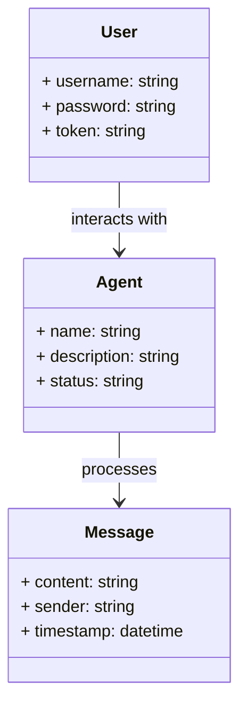
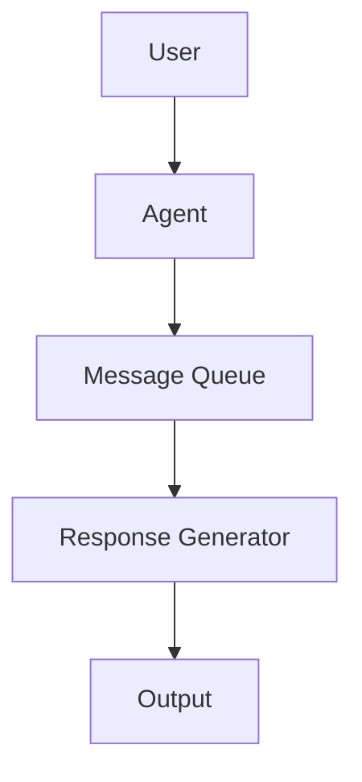
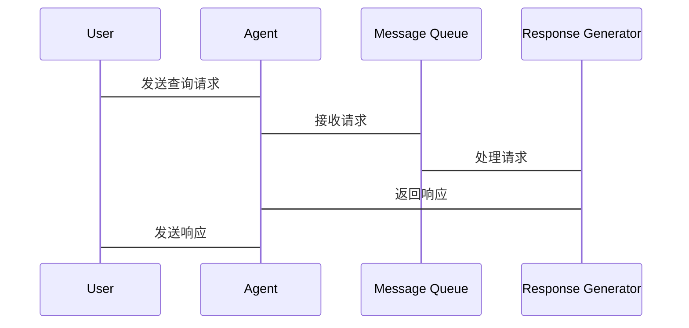

                 


# 搭建AI Agent开发环境：必要工具与框架

> 关键词：AI Agent，开发环境，工具，框架，自然语言处理，机器学习，知识图谱

> 摘要：本文将详细介绍如何搭建AI Agent的开发环境，包括必要的工具和框架。从基本概念到系统架构设计，再到项目实战，我们将逐步引导读者完成AI Agent的开发流程。通过本文，读者将掌握AI Agent的核心技术，了解开发环境的搭建方法，并能够独立完成AI Agent的开发工作。

---

# 第一部分: AI Agent开发环境概述

## 第1章: AI Agent的基本概念

### 1.1 AI Agent的定义与分类

#### 1.1.1 什么是AI Agent
AI Agent（人工智能代理）是一种能够感知环境并采取行动以实现特定目标的智能实体。它可以是一个软件程序、一个机器人，或者任何能够与环境交互的智能系统。AI Agent的核心在于其自主性、反应性和目标导向性。

#### 1.1.2 AI Agent的主要类型
AI Agent可以分为以下几类：
- **简单反射型Agent**：基于当前感知做出反应，没有内部状态。
- **基于模型的反射型Agent**：维护内部状态，并基于状态和感知做出决策。
- **目标驱动型Agent**：根据目标选择行动。
- **效用驱动型Agent**：通过最大化效用函数来选择行动。

#### 1.1.3 AI Agent与传统程序的区别
AI Agent与传统程序的主要区别在于其智能性和自主性。传统程序通常是响应式程序，而AI Agent具备学习、推理和自适应能力，能够在复杂环境中做出决策。

---

### 1.2 AI Agent的核心技术

#### 1.2.1 自然语言处理
自然语言处理（NLP）是AI Agent与人类交互的核心技术。它使AI Agent能够理解并生成人类语言，例如通过聊天机器人与用户进行对话。

#### 1.2.2 机器学习
机器学习是AI Agent的核心技术之一。它使AI Agent能够从数据中学习模式，并基于这些模式做出预测或决策。

#### 1.2.3 知识图谱
知识图谱是一种结构化的知识表示方法，用于存储和管理AI Agent所需的知识，例如实体、属性和关系。

---

### 1.3 AI Agent的应用场景

#### 1.3.1 智能助手
智能助手（如Siri、Alexa）是AI Agent最常见的应用场景，它们通过自然语言处理与用户交互，提供信息查询、任务执行等服务。

#### 1.3.2 自动化系统
在工业自动化领域，AI Agent可以用于监控生产线、优化生产流程等。

#### 1.3.3 游戏AI
在电子游戏中，AI Agent可以用于控制非玩家角色（NPC），使其具备智能行为，例如路径规划、决策制定等。

---

## 第2章: AI Agent开发环境的背景与需求

### 2.1 开发AI Agent的基本要求

#### 2.1.1 计算能力
AI Agent的开发通常需要高性能计算能力，尤其是涉及到大规模数据处理和复杂算法时。

#### 2.1.2 数据存储
AI Agent需要处理大量的数据，包括文本、图像、语音等，因此需要高效的数据存储和管理方案。

#### 2.1.3 开发工具
开发工具的选择对AI Agent的开发效率和质量至关重要，包括编程语言、框架、调试工具等。

---

### 2.2 当前AI Agent开发的主要挑战

#### 2.2.1 技术复杂性
AI Agent的开发涉及多种技术，如自然语言处理、机器学习、知识图谱等，技术复杂性较高。

#### 2.2.2 资源需求
AI Agent的开发通常需要大量的计算资源和数据资源，尤其是在训练大型模型时。

#### 2.2.3 安全与隐私
AI Agent需要处理敏感数据，如何确保数据的安全性和隐私性是一个重要的挑战。

---

### 2.3 开发环境搭建的目标

#### 2.3.1 提供必要的工具支持
开发环境需要提供高效的开发工具和框架，以简化AI Agent的开发过程。

#### 2.3.2 简化开发流程
通过合理的工具和框架选择，可以显著简化AI Agent的开发流程，提高开发效率。

#### 2.3.3 优化资源利用
开发环境需要优化资源利用，例如通过虚拟化技术减少计算资源的浪费。

---

## 第3章: AI Agent开发环境的核心工具与框架

### 3.1 Python编程语言

#### 3.1.1 Python的优势
Python是AI Agent开发中最常用的编程语言，具有语法简洁、库丰富、跨平台等优点。

#### 3.1.2 常用Python库介绍
- **numpy**：用于科学计算和数组操作。
- **pandas**：用于数据分析和数据处理。
- **scikit-learn**：用于机器学习算法实现。
- **transformers**：用于自然语言处理模型的加载和使用。

#### 3.1.3 安装与配置
```bash
# 安装Python
# 安装常用库
pip install numpy pandas scikit-learn transformers
```

---

### 3.2 开发框架

#### 3.2.1 框架的选择标准
选择开发框架时，需要考虑其支持的功能、社区支持、文档丰富性等因素。

#### 3.2.2 常用框架介绍
- **spaCy**：用于自然语言处理。
- **Rasa**：用于对话式AI Agent的开发。
- **TensorFlow**：用于机器学习模型的训练和部署。

#### 3.2.3 框架的安装与配置
```bash
# 安装Rasa框架
pip install rasa
```

---

### 3.3 依赖管理工具

#### 3.3.1 依赖管理的重要性
依赖管理是开发过程中不可忽视的一部分，它确保所有依赖项的版本一致。

#### 3.3.2 常用工具介绍
- **pipenv**：用于管理Python项目的依赖和虚拟环境。
- **poetry**：用于管理Python项目的依赖和虚拟环境。

#### 3.3.3 工具的安装与使用
```bash
# 安装pipenv
pip install pipenv
# 创建虚拟环境并安装依赖
pipenv install
```

---

### 3.4 开发环境的优化

#### 3.4.1 虚拟环境的使用
使用虚拟环境可以避免不同项目之间的依赖冲突，提高开发效率。

#### 3.4.2 代码格式化工具
代码格式化工具（如black）可以确保代码风格一致，减少团队协作中的冲突。

#### 3.4.3 调试与日志工具
调试工具（如pdb）和日志工具（如logging）是开发过程中不可或缺的辅助工具。

---

## 第4章: AI Agent开发环境的系统架构

### 4.1 系统架构设计的原则

#### 4.1.1 可扩展性
系统架构应具备良好的可扩展性，以适应未来的需求变化。

#### 4.1.2 可维护性
系统架构应具备良好的可维护性，方便开发人员进行后续的维护和优化。

#### 4.1.3 高可用性
系统架构应具备高可用性，确保在部分节点故障时，系统仍能正常运行。

---

### 4.2 模块划分

#### 4.2.1 感知模块
感知模块负责接收外部输入，例如用户的语音或文本输入。

#### 4.2.2 处理模块
处理模块负责对输入进行解析和处理，生成相应的输出。

#### 4.2.3 执行模块
执行模块负责根据处理模块的输出，执行具体的行动。

---

### 4.3 通信机制

#### 4.3.1 共享内存
共享内存是一种高效的通信机制，适用于进程间通信。

#### 4.3.2 RPC（远程过程调用）
RPC是一种远程调用机制，适用于分布式系统中的通信。

#### 4.3.3 消息队列
消息队列是一种异步通信机制，适用于高并发场景。

---

### 4.4 数据存储

#### 4.4.1 关系型数据库
关系型数据库（如MySQL）适用于结构化数据的存储。

#### 4.4.2 非关系型数据库
非关系型数据库（如MongoDB）适用于非结构化数据的存储。

#### 4.4.3 文件存储
文件存储适用于图片、视频等大文件的存储。

---

### 4.5 安全机制

#### 4.5.1 认证与授权
认证用于验证用户身份，授权用于控制用户的访问权限。

#### 4.5.2 加密技术
加密技术用于保护数据在传输和存储过程中的安全性。

#### 4.5.3 安全审计
安全审计用于记录和分析系统的安全事件，及时发现潜在的安全漏洞。

---

## 第5章: AI Agent开发环境的项目实战

### 5.1 需求分析

#### 5.1.1 项目背景
我们以开发一个智能助手为例，该项目的目标是实现一个能够与用户进行自然语言对话的AI Agent。

#### 5.1.2 功能需求
- 用户可以通过文本或语音与AI Agent交互。
- AI Agent能够理解用户意图，并提供相应的服务。

---

### 5.2 功能设计

#### 5.2.1 领域模型


#### 5.2.2 系统架构


#### 5.2.3 系统接口
- **输入接口**：接收用户的输入，例如文本或语音。
- **输出接口**：生成并发送AI Agent的响应，例如文本、语音或动作指令。

#### 5.2.4 系统交互


---

### 5.3 技术实现

#### 5.3.1 环境安装
```bash
# 安装Python和常用库
python -m pip install --upgrade pip
pip install python-dotenv python-Levenshtein
```

#### 5.3.2 核心实现
```python
# 示例代码：AI Agent的主逻辑
class Agent:
    def __init__(self):
        self.name = "AI Assistant"
        self.available = True

    def receive_message(self, message):
        # 处理接收到的消息
        pass

    def send_message(self, message):
        # 发送消息
        pass

if __name__ == "__main__":
    agent = Agent()
    while True:
        message = input("User: ")
        agent.receive_message(message)
```

---

### 5.4 部署优化

#### 5.4.1 环境配置
确保开发环境和生产环境的一致性，可以通过配置文件或环境变量进行管理。

#### 5.4.2 性能优化
通过优化算法、减少不必要的计算、使用缓存技术等方法提高系统的性能。

#### 5.4.3 安全优化
通过加密通信、访问控制等方法提高系统的安全性。

---

## 第6章: 总结与扩展

### 6.1 本章总结
通过本文的介绍，读者可以全面了解AI Agent开发环境的搭建过程，包括工具选择、系统架构设计、项目实战等内容。

### 6.2 最佳实践 tips
- 在开发过程中，建议使用虚拟环境管理依赖，确保项目的独立性和可维护性。
- 在系统架构设计时，注重模块的解耦和高可用性，以提高系统的灵活性和可靠性。
- 在实际应用中，注重数据的安全性和隐私保护，确保系统的合规性。

### 6.3 扩展阅读
- 《机器学习实战》
- 《深度学习入门：基于Python和Keras的实践》
- 《自然语言处理入门：基于Python和spaCy的实践》

---

通过本文的详细讲解，读者可以系统地掌握AI Agent开发环境的搭建方法，并能够在实际项目中灵活运用这些知识。希望本文对您的AI Agent开发之路有所帮助！

