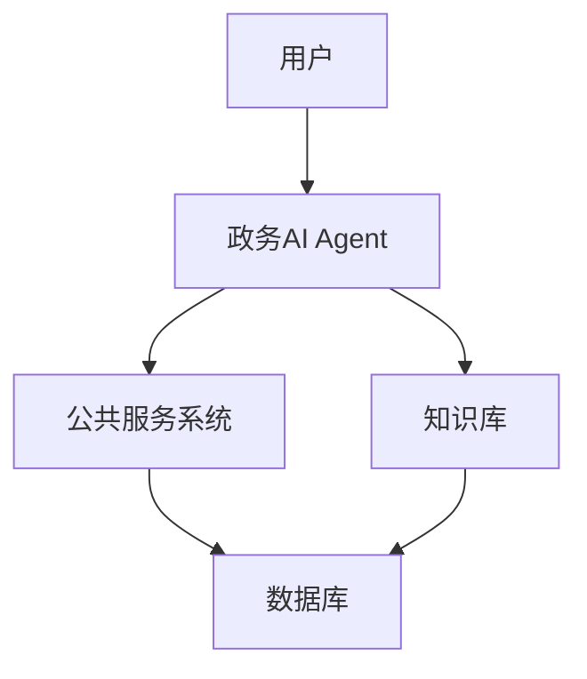

                 


# 政务AI Agent：提升公共服务效率

---

## 关键词  
政务AI Agent, 公共服务, 自然语言处理, 意图识别, 对话生成, 知识库构建, 系统架构

---

## 摘要  
随着人工智能技术的快速发展，政务AI Agent（智能代理）正在成为提升公共服务效率的重要工具。本文从政务AI Agent的核心概念出发，详细阐述其在公共服务中的应用场景、算法原理、系统架构设计以及实际项目实现。通过案例分析和最佳实践，本文为政府机构和技术开发者提供了一套系统化的解决方案，以帮助他们更好地理解和应用政务AI Agent技术，从而提升公共服务的智能化水平和效率。

---

## 第一部分: 政务AI Agent的背景与核心概念

### 第1章: 政务AI Agent概述

#### 1.1 政务AI Agent的基本概念
- **定义与范围**  
  政务AI Agent是一种基于人工智能技术的智能代理系统，能够理解和处理用户的需求，通过自动化流程提供高效的公共服务。它结合了自然语言处理（NLP）、机器学习（ML）和知识库管理等技术，能够实现智能化的交互和问题解决。

- **核心属性与目标**  
  政务AI Agent的核心属性包括智能性、适应性和高效性。其目标是通过智能化的交互方式，优化公共服务流程，提升用户体验，降低人工成本。

- **价值与意义**  
  政务AI Agent的应用不仅能够提高公共服务的效率，还能通过数据分析和智能决策支持，优化资源配置，提升政府治理能力。

---

#### 1.2 政务AI Agent的应用场景
- **公共服务领域的痛点**  
  公共服务领域普遍存在效率低下、资源浪费、用户体验差等问题。传统的基于规则的系统难以应对复杂多变的用户需求，且缺乏灵活性。

- **典型应用场景**  
  1. 公民咨询与问题解答  
  2. 政府信息查询与发布  
  3. 公共服务流程自动化（如申请、审批等）  
  4. 紧急事件处理与应急响应  

- **对公共服务效率的提升作用**  
  政务AI Agent通过自动化处理、智能决策和实时反馈，显著提高了公共服务的响应速度和处理效率，同时降低了人工成本。

---

### 第2章: 政务AI Agent的核心概念与联系

#### 2.1 政务AI Agent的核心原理
- **意图识别**  
  政务AI Agent通过自然语言处理技术，识别用户的意图和需求。例如，用户输入“如何申请营业执照”，系统需要准确识别用户的需求是“营业执照申请”相关的服务。

- **对话生成**  
  在识别用户意图后，政务AI Agent需要生成自然流畅的对话回复，确保用户体验良好。例如，针对用户的申请需求，系统会提供具体的步骤指导或链接。

- **知识库构建**  
  政务AI Agent依赖于庞大的知识库，包括法律法规、政策文件、公共服务流程等信息。知识库的构建和维护是政务AI Agent正常运行的基础。

---

#### 2.2 政务AI Agent与传统IT系统的区别
- **传统IT系统的局限性**  
  传统IT系统基于规则和流程，缺乏灵活性和智能性。例如，面对用户的模糊需求或非标准化输入，传统系统难以准确理解和处理。

- **政务AI Agent的优势**  
  政务AI Agent具有高度的智能性和适应性。它能够理解用户的意图，主动提供解决方案，并通过学习不断优化自身的服务能力。

- **与RPA（机器人流程自动化）的对比**  
  RPA主要关注流程自动化，而政务AI Agent则更注重智能交互和问题解决。两者结合可以实现更高效的公共服务流程。

---

#### 2.3 政务AI Agent的核心要素对比表
| 核心要素       | 传统IT系统                     | 政务AI Agent                     |
|----------------|-------------------------------|-----------------------------------|
| 智能性         | 低                           | 高                               |
| 适应性         | 低                           | 高                               |
| 响应速度       | 中                           | 高                               |
| 交互方式       | 单向、基于规则               | 双向、基于意图和对话生成         |
| 知识库依赖     | 依赖预定义规则               | 依赖动态知识库和学习能力         |

---

#### 2.4 政务AI Agent的实体关系图


---

## 第二部分: 政务AI Agent的算法原理

### 第3章: 政务AI Agent的意图识别算法

#### 3.1 意图识别的基本原理
- **定义与作用**  
  意图识别是政务AI Agent的核心任务之一，旨在理解用户输入的自然语言文本背后的真实需求。

- **基于自然语言处理的意图识别**  
  通过分词、词性标注、句法分析等NLP技术，结合预训练语言模型（如BERT），进行意图分类。

- **基于规则的意图识别**  
  针对特定场景，可以通过预设的关键词和规则来识别用户的意图。

---

#### 3.2 意图识别的数学模型
- **概率模型**  
  $$ P(y|x) = \frac{P(x|y)P(y)}{P(x)} $$
  其中，$y$ 表示意图类别，$x$ 表示用户输入的文本。

- **逻辑回归模型**  
  假设输入特征为 $x_1, x_2, ..., x_n$，则：
  $$ y = \sigma(w_1x_1 + w_2x_2 + ... + w_nx_n + b) $$
  其中，$\sigma$ 表示sigmoid函数。

---

### 第4章: 政务AI Agent的对话生成算法

#### 4.1 对话生成的基本原理
- **基于模板的对话生成**  
  针对特定场景，使用预设的模板生成回复。例如，针对“如何申请营业执照”，系统可以使用模板生成“请访问当地工商局网站进行申请”。

- **基于生成模型的对话生成**  
  使用如Transformer架构的生成模型（如GPT），根据上下文生成自然流畅的回复。

---

#### 4.2 对话生成的数学模型
- **生成模型的损失函数**  
  $$ \mathcal{L} = -\sum_{i=1}^{n} \log P(y_i|x_{<i}) $$
  其中，$y_i$ 表示生成的第 $i$ 个词，$x_{<i}$ 表示输入序列。

---

## 第三部分: 政务AI Agent的系统分析与架构设计

### 第5章: 政务AI Agent的系统架构设计

#### 5.1 问题场景介绍
- **用户需求**  
  用户希望通过自然语言查询公共服务信息，例如“如何申请社保？”。

- **系统目标**  
  构建一个能够理解用户需求、提供准确信息的智能代理系统。

---

#### 5.2 系统功能设计
- **领域模型类图**  
  ```mermaid
  classDiagram
      class 用户 {
          string 输入文本
          string 查询历史
      }
      class 政务AI Agent {
          string 用户意图
          string 回复内容
      }
      class 公共服务系统 {
          string 服务信息
          string 状态
      }
      用户 --> 政务AI Agent: 提交查询
      政务AI Agent --> 公共服务系统: 获取信息
  ```

---

#### 5.3 系统架构设计
- **架构图**  
  ```mermaid
  box {
      政务AI Agent
      + 意图识别模块
      + 对话生成模块
      + 知识库接口
  }
  政务AI Agent --> 公共服务系统: API调用
  ```

---

## 第四部分: 政务AI Agent的项目实战

### 第6章: 政务AI Agent的实现与案例分析

#### 6.1 环境安装
- **Python版本**  
  Python 3.8+

- **依赖库安装**  
  ```bash
  pip install numpy pandas transformers
  ```

---

#### 6.2 核心代码实现
- **意图识别模块**  
  ```python
  import torch
  from transformers import BertTokenizer, BertModel

  tokenizer = BertTokenizer.from_pretrained('bert-base-uncased')
  model = BertModel.from_pretrained('bert-base-uncased')

  def get_intentions(text):
      inputs = tokenizer(text, return_tensors='pt')
      outputs = model(**inputs)
      # 处理输出，生成意图
      return "意图识别结果"
  ```

---

#### 6.3 案例分析
- **案例背景**  
  某市政府希望优化市民的社保查询流程。

- **系统实现**  
  通过政务AI Agent，市民可以通过自然语言查询社保信息，系统自动匹配知识库中的相关内容并生成回复。

---

### 第7章: 政务AI Agent的项目小结

#### 7.1 项目总结
- **项目目标**  
  提供高效的公共服务查询方式，提升用户体验。

- **实现成果**  
  成功构建了一个基于AI的公共服务查询系统，显著提高了响应速度和准确性。

---

## 第五部分: 最佳实践与注意事项

### 第8章: 政务AI Agent的最佳实践

#### 8.1 小结与反思
- **技术总结**  
  政务AI Agent的实现依赖于自然语言处理、机器学习和知识库管理等技术，需要综合考虑系统的智能性、适应性和高效性。

- **经验总结**  
  在实际项目中，知识库的构建和维护是关键，需要结合人工标注和自动化学习。

---

#### 8.2 注意事项
- **数据隐私与安全**  
  政务AI Agent处理大量敏感数据，需严格遵守数据隐私法规。

- **用户体验优化**  
  需要不断优化对话生成模块，确保用户体验流畅自然。

---

## 结语

通过本文的详细讲解，读者可以系统地了解政务AI Agent的核心概念、算法原理、系统架构以及实际项目实现。政务AI Agent作为一种智能化的公共服务工具，正在逐步改变传统的政务服务模式，为提升公共服务效率和用户体验提供了新的可能性。

