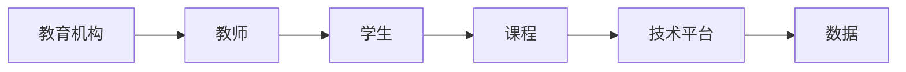
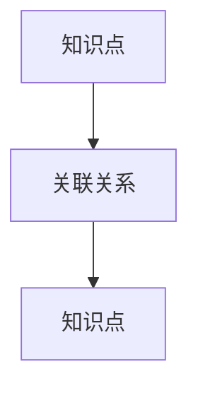
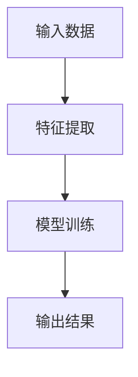

                 


# 教育科技（EdTech）的发展前景与投资价值

> 关键词：教育科技，人工智能，投资分析，教育信息化，在线学习，教育模式创新

> 摘要：教育科技（EdTech）作为教育与技术深度融合的产物，正在迅速改变传统教育模式。本文将从EdTech的核心概念、技术原理、商业模式、投资价值分析以及未来发展趋势等方面进行详细探讨，揭示其在教育领域的潜力与价值。

---

## 第1章: 教育科技（EdTech）的定义与背景

### 1.1 教育科技的核心概念

#### 1.1.1 教育科技的定义
教育科技（EdTech）是指利用技术手段（如人工智能、大数据、云计算等）来优化、增强或重构传统教育过程的工具、平台和方法。它不仅包括在线学习平台，还包括智能教学工具、教育管理系统的开发与应用。

#### 1.1.2 教育科技与传统教育的区别
- **传统教育**：依赖教师面对面授课，学生被动接受知识，教学资源有限，难以个性化。
- **EdTech**：通过技术手段实现个性化学习、实时反馈、大规模传播，教学资源丰富且可扩展。

#### 1.1.3 教育科技的核心要素与组成
1. **技术层**：AI、大数据、云计算等技术支持。
2. **内容层**：课程设计与知识传递。
3. **用户层**：学生、教师与机构的交互。

### 1.2 当前教育领域的痛点与挑战

#### 1.2.1 传统教育模式的局限性
- 教学资源分配不均。
- 个性化学习难以实现。
- 教学效果难以量化。

#### 1.2.2 技术如何解决教育问题
- **个性化学习**：通过AI分析学生学习情况，提供定制化教学方案。
- **实时反馈**：利用大数据分析学生表现，及时调整教学策略。
- **资源共享**：通过在线平台实现优质教育资源的广泛传播。

#### 1.2.3 教育科技的发展现状与趋势
- **现状**：在线教育平台快速发展，AI辅助教学工具逐渐普及。
- **趋势**：向智能化、个性化和全球化方向发展。

---

## 第2章: 教育科技的核心概念与联系

### 2.1 教育科技的技术架构

#### 2.1.1 技术层：AI、大数据、云计算等技术的融合
- **AI**：用于智能推荐、自适应学习。
- **大数据**：分析学生行为数据，优化教学策略。
- **云计算**：提供弹性计算资源，支持大规模在线教育。

#### 2.1.2 内容层：课程设计与知识传递
- **课程设计**：结合技术工具，设计个性化学习路径。
- **知识传递**：通过多种媒介形式，如视频、互动练习等，提高学习效果。

#### 2.1.3 用户层：学生、教师与机构的交互
- **学生**：通过平台进行学习，获得个性化指导。
- **教师**：利用技术工具进行教学管理，实时监控学生学习进度。
- **机构**：通过平台管理教育资源，优化运营效率。

### 2.2 实体关系图



---

## 第3章: 教育科技的核心技术与算法

### 3.1 人工智能在教育中的应用

#### 3.1.1 知识图谱构建
- **知识图谱**：通过构建教育领域的知识网络，帮助学生更好地理解和掌握知识。
- **构建过程**：从课程内容中提取关键知识点，建立它们之间的关联关系。

#### 3.1.2 自然语言处理在教育中的应用
- **智能问答系统**：通过NLP技术，学生可以与系统进行自然语言交互，解决学习中的疑问。
- **文本分析**：分析学生作业，提供反馈和改进建议。

#### 3.1.3 个性化推荐算法
- **基于内容的推荐**：根据学生的学习兴趣和能力，推荐相关的学习资源。
- **协同过滤推荐**：基于其他学生的相似行为，推荐学习内容。

### 3.2 算法原理

#### 3.2.1 知识图谱构建算法


#### 3.2.2 个性化推荐算法


### 3.3 代码实现

#### 3.3.1 简单的个性化推荐算法示例
```python
import pandas as pd
from sklearn.metrics.pairwise import cosine_similarity

# 假设我们有一个学生的学习数据
students = pd.DataFrame({
    'student_id': [1, 2, 3],
    'subjects': ['math', 'physics', 'chemistry']
})

# 计算相似性
similarity_matrix = cosine_similarity(students)
```

---

## 第4章: 教育科技的商业模式与市场分析

### 4.1 教育科技的主要商业模式

#### 4.1.1 订阅制
- **模式特点**：用户按月或按年支付费用，获得平台上的课程资源。
- **优势**：收入稳定，用户粘性高。

#### 4.1.2 广告模式
- **模式特点**：通过免费使用平台，吸引大量用户，投放教育相关广告。
- **优势**：用户获取成本低，广告收入可扩展。

#### 4.1.3 数据变现
- **模式特点**：收集学生学习数据，分析后提供给教育机构或企业。
- **优势**：数据价值高，变现潜力大。

### 4.2 市场格局与主要参与者

#### 4.2.1 在线教育平台
- **代表企业**：Coursera、Udemy、VIPKid等。
- **核心业务**：提供在线课程，覆盖K12教育、职业培训等多个领域。

#### 4.2.2 智能教育工具
- **代表企业**：Grammarly、Duolingo等。
- **核心业务**：通过AI技术，提供个性化学习辅助工具。

### 4.3 未来发展方向

#### 4.3.1 跨界融合
- **趋势**：教育科技与其他行业的深度融合，如教育+游戏、教育+娱乐。

#### 4.3.2 技术驱动
- **趋势**：AI、VR/AR等技术将进一步推动教育模式的创新。

---

## 第5章: 教育科技的投资价值分析

### 5.1 投资价值分析框架

#### 5.1.1 市场规模
- **数据来源**：全球教育科技市场规模持续增长，预计2025年将达到数千亿美元。
- **增长驱动**：技术进步、政策支持、疫情推动在线教育普及。

#### 5.1.2 用户需求
- **需求多样化**：学生、教师、机构等不同用户群体的需求多样化。
- **痛点明确**：个性化学习、高效教学、资源分配不均等问题亟待解决。

#### 5.1.3 技术可行性
- **技术成熟度**：AI、大数据等技术逐渐成熟，为教育科技的发展提供了坚实基础。
- **技术门槛**：需要结合教育领域的专业知识，技术实现复杂度较高。

### 5.2 投资机会与风险

#### 5.2.1 投资机会
- **技术创新**：AI驱动的个性化学习工具。
- **市场空白**：针对特定教育阶段或领域的解决方案。

#### 5.2.2 风险分析
- **技术风险**：技术实现难度大，算法优化需要大量投入。
- **市场风险**：市场竞争激烈，用户需求变化快。

---

## 第6章: 未来趋势与挑战

### 6.1 未来发展趋势

#### 6.1.1 元宇宙教育
- **概念**：在虚拟环境中实现沉浸式学习体验。
- **潜力**：提供全新的教学方式，增强学习互动性。

#### 6.1.2 AI与教育的深度融合
- **趋势**：AI将更广泛地应用于教育场景，实现真正意义上的个性化学习。

### 6.2 挑战与应对策略

#### 6.2.1 技术挑战
- **问题**：AI算法的优化、数据隐私保护。
- **应对**：加大研发投入，提升技术能力。

#### 6.2.2 政策监管
- **问题**：教育科技产品需符合教育部门的监管要求。
- **应对**：与政策制定者保持沟通，确保合规性。

#### 6.2.3 用户接受度
- **问题**：部分用户对新技术的接受度较低。
- **应对**：加强宣传与教育，提升用户认知。

---

## 结语

教育科技作为教育与技术深度融合的产物，正在重塑传统教育模式。随着技术的不断进步和市场需求的增加，教育科技的投资价值日益凸显。然而，投资者也需关注技术风险、市场风险和政策监管等挑战。未来，教育科技将在个性化学习、智能化管理等方面发挥更大的作用，为教育行业带来更多的创新与变革。

--- 

### Best Practices (最佳实践)
1. **技术驱动**：始终关注AI、大数据等技术的发展，及时应用到教育场景中。
2. **用户为中心**：深入了解用户需求，设计更贴合用户习惯的产品。
3. **合规性**：密切关注政策变化，确保产品符合教育部门的要求。
4. **持续创新**：保持对教育科技领域的关注，抓住新兴趋势。

---

### 小结
教育科技的发展前景广阔，投资价值显著。通过技术创新和商业模式优化，EdTech将为教育行业带来更大的变革。投资者需结合市场趋势和技术可行性，选择合适的切入点进行投资。

---

### 注意事项
1. **数据隐私**：在收集和使用学生数据时，需严格遵守隐私保护法规。
2. **技术实现**：AI算法的实现需要结合教育领域的专业知识，避免技术与教育需求脱节。
3. **用户体验**：注重用户体验设计，确保产品易用性和学习效果。

---

### 拓展阅读
1. **《人工智能在教育中的应用》**
2. **《在线教育平台的商业模式分析》**
3. **《教育科技投资指南》**

--- 

如果需要进一步探讨某一部分或添加更多内容，请随时告知！

