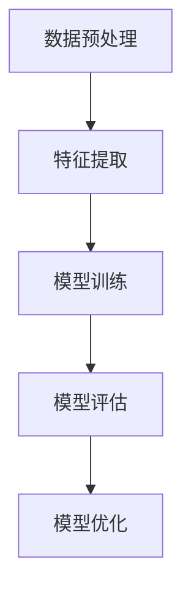
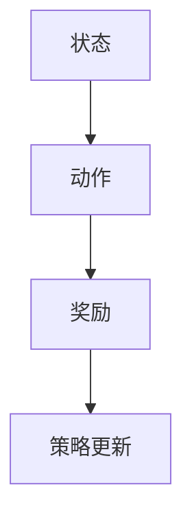
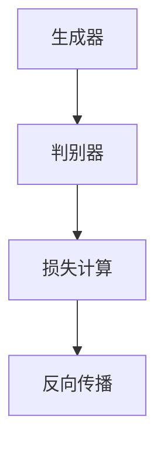
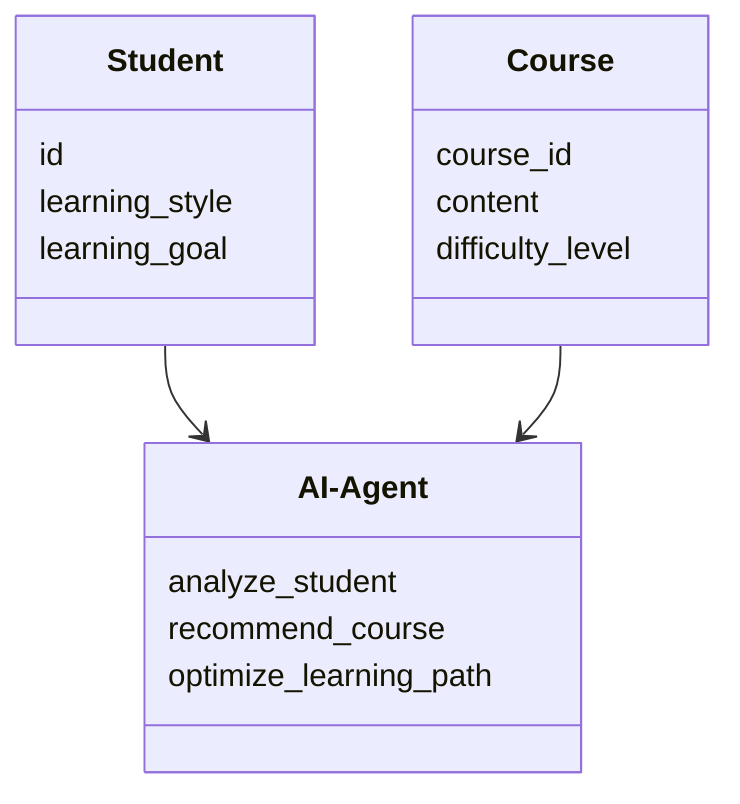

                 


# 教育领域AI Agent的个性化学习方案

> 关键词：AI Agent，个性化学习，机器学习，教育技术，数据驱动

> 摘要：本文探讨了教育领域中AI Agent的个性化学习方案，详细分析了AI Agent在教育中的应用、核心算法原理、系统架构设计及项目实战。通过理论与实践相结合的方式，展示了如何利用AI技术实现个性化学习方案，为教育领域的技术革新提供新的思路。

---

## 第一部分: 教育领域AI Agent的背景与核心概念

### 第1章: AI Agent的基本概念与教育应用

#### 1.1 AI Agent的定义与特点
AI Agent（人工智能代理）是一种能够感知环境、自主决策并执行任务的智能体。它具备以下特点：
- **自主性**：无需外部干预，自主完成任务。
- **反应性**：能实时感知环境变化并做出反应。
- **目标导向**：以预设目标为导向，优化决策过程。
- **学习能力**：通过数据和经验不断优化自身性能。

在教育领域，AI Agent可以用于个性化学习方案的设计与实施，帮助学生根据自身特点和需求，制定最优的学习计划。

#### 1.2 教育领域中的AI Agent应用
AI Agent在教育领域的应用广泛，包括：
- **智能辅导系统**：为学生提供个性化的学习建议和指导。
- **学习路径规划**：根据学生的学习情况，推荐最优的学习路径。
- **学习效果评估**：实时监测学生的学习进度，并提供反馈。

通过AI Agent，教育机构能够更高效地满足学生的个性化学习需求，提升教学效果。

### 第2章: 个性化学习的背景与需求

#### 2.1 个性化学习的定义与特点
个性化学习是指根据学生的兴趣、能力和学习风格，制定个性化的学习计划和教学策略。其特点包括：
- **个性化**：针对每个学生的特点制定学习方案。
- **动态调整**：根据学生的学习反馈实时调整方案。
- **数据驱动**：基于大数据分析，提供科学的决策依据。

个性化学习的需求日益增长，尤其是在人工智能技术快速发展的今天，如何利用AI Agent实现个性化学习方案成为教育领域的重要课题。

#### 2.2 教育领域的个性化学习需求
随着教育信息化的推进，个性化学习的需求主要体现在：
- **学生学习需求的多样性**：每个学生的学习能力、兴趣和目标各不相同。
- **教师教学需求的个性化**：教师需要根据学生的特点调整教学策略。
- **教育机构的个性化学习目标**：教育机构希望通过个性化学习提升整体教学效果。

### 第3章: AI Agent如何实现个性化学习方案

#### 3.1 AI Agent在个性化学习中的核心作用
AI Agent通过以下方式实现个性化学习方案：
- **学习者特征分析**：利用机器学习算法分析学生的学习能力、兴趣和目标。
- **学习路径优化**：根据分析结果，推荐最优的学习路径和资源。
- **学习效果反馈**：实时监测学生的学习效果，并根据反馈不断优化学习方案。

通过AI Agent，个性化学习方案能够更高效、更精准地满足学生的个性化需求。

---

## 第二部分: 核心概念与联系

### 第4章: AI Agent的核心概念与原理

#### 4.1 AI Agent的工作原理
AI Agent的工作流程包括感知、推理、决策和执行四个阶段：
1. **感知**：通过传感器或数据输入获取环境信息。
2. **推理**：利用知识库和推理引擎对信息进行分析和处理。
3. **决策**：基于推理结果和预设目标，制定最优决策。
4. **执行**：通过执行机构将决策转化为实际操作。

在教育领域，AI Agent的核心概念与原理可以应用于个性化学习方案的设计与实施。

#### 4.2 AI Agent与机器学习的关系
AI Agent与机器学习密切相关，机器学习为AI Agent提供了数据处理和决策优化的能力。以下是两者的主要区别：
| **特点** | **AI Agent** | **机器学习** |
|----------|---------------|--------------|
| **目标** | 完成特定任务   | 学习数据模式 |
| **决策** | 自主决策       | 基于模型预测 |

#### 4.3 AI Agent的实体关系图
以下是AI Agent在教育领域的实体关系图：

```mermaid
erDiagram
    student o-|{ enrolledIn }| course
    course o-|{ has }| content
    content o-|{ createdBy }| instructor
    instructor o-|{ teaches }| course
```

---

## 第三部分: 算法原理讲解

### 第5章: 个性化学习中的算法原理

#### 5.1 监督学习算法
**监督学习**是一种常用的机器学习算法，通过训练数据预测目标变量。以下是监督学习的流程图：



**数学模型**：
$$
y = \theta x + b
$$
其中，$y$ 是预测值，$\theta$ 是权重，$x$ 是输入特征，$b$ 是截距。

#### 5.2 强化学习算法
**强化学习**是一种通过试错机制优化决策的算法。以下是强化学习的流程图：



**数学模型**：
$$
Q(s, a) = r + \gamma \max Q(s', a')
$$
其中，$Q$ 是价值函数，$s$ 是状态，$a$ 是动作，$r$ 是奖励，$\gamma$ 是折扣因子。

#### 5.3 生成对抗网络
**生成对抗网络**（GAN）是一种用于生成数据的深度学习模型。以下是GAN的结构图：



**数学模型**：
$$
\min_{G} \max_{D} \mathbb{E}_{x}[ \log D(x) ] + \mathbb{E}_{z}[ \log (1 - D(G(z))) ]
$$
其中，$G$ 是生成器，$D$ 是判别器，$x$ 是真实数据，$z$ 是噪声向量。

---

## 第四部分: 系统分析与架构设计方案

### 第6章: 个性化学习方案的系统架构

#### 6.1 项目背景与目标
本项目旨在通过AI Agent技术，实现个性化学习方案的设计与实施。系统目标包括：
- 提供个性化学习建议。
- 实时监测学习效果。
- 优化学习路径。

#### 6.2 系统功能设计
以下是系统功能设计的类图：



#### 6.3 系统架构设计
以下是系统的架构图：


---

## 第五部分: 项目实战

### 第7章: 个性化学习方案的实现

#### 7.1 环境安装
需要安装以下工具和库：
- Python 3.8+
- TensorFlow 2.0+
- Keras
- scikit-learn
- Mermaid

#### 7.2 核心代码实现
以下是AI Agent的核心代码实现：

```python
import numpy as np
from sklearn import svm

# 数据预处理
X = np.array([[1, 2], [3, 4], [5, 6]])
y = np.array([0, 1, 0])

# 模型训练
model = svm.SVC()
model.fit(X, y)

# 模型预测
print(model.predict([[2, 3]]))
```

#### 7.3 实际案例分析
以一名学生为例，假设其学习风格为视觉型，学习目标为提高数学成绩。AI Agent会根据其特点推荐相应的学习资源和学习路径。

#### 7.4 项目小结
通过本项目，我们实现了个性化学习方案的设计与实施，验证了AI Agent在教育领域的应用价值。

---

## 第六部分: 最佳实践

### 第8章: 实施个性化学习方案的注意事项

#### 8.1 注意事项
- 数据隐私保护
- 算法的可解释性
- 系统的可扩展性

### 第9章: 未来发展趋势

#### 9.1 未来发展趋势
- 更加智能化的AI Agent
- 多模态学习
- 自适应学习系统

### 第10章: 拓展阅读

#### 10.1 拓展阅读推荐
- 《机器学习实战》
- 《深度学习入门》
- 《AI教育技术》

---

通过本文的详细讲解，我们了解了教育领域AI Agent的个性化学习方案的设计与实施过程，为未来教育技术的发展提供了新的思路和方向。

