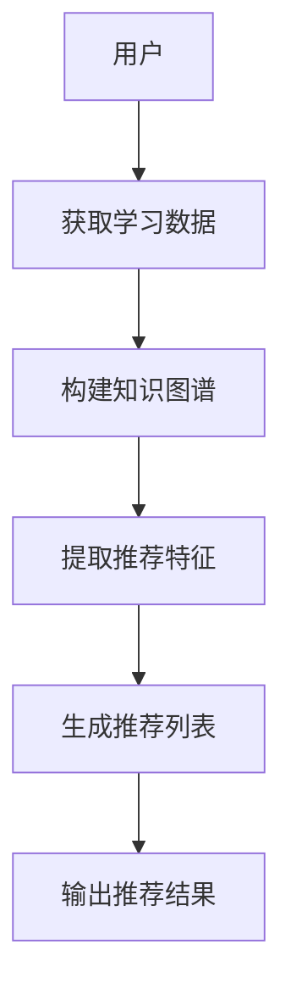
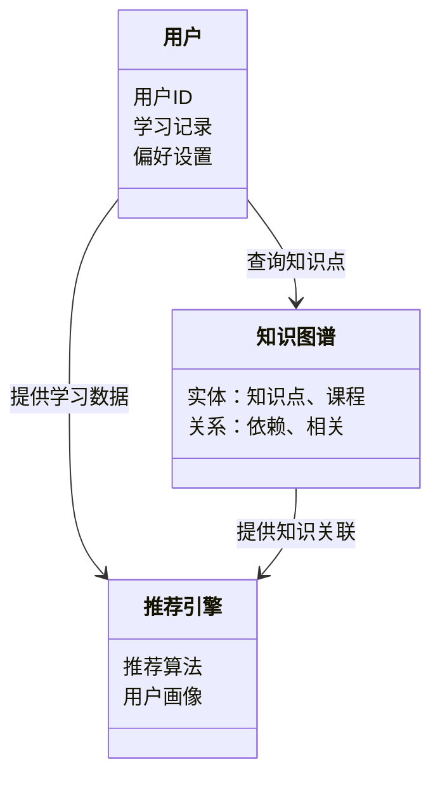
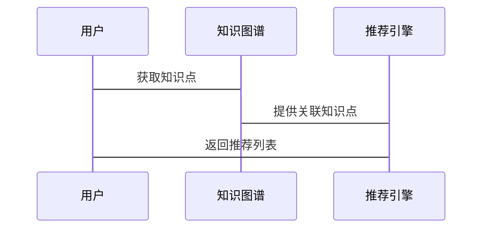

                 


# 教育领域AI Agent：个性化学习助手的构建

## 关键词

- AI Agent
- 个性化学习
- 知识图谱
- 推荐算法
- 教育技术

## 摘要

随着人工智能技术的快速发展，教育领域的个性化学习助手（AI Agent）正在成为提升学习效率和效果的重要工具。本文系统地探讨了AI Agent在教育中的应用，从核心概念、算法原理到系统设计和项目实战，全面解析了个性化学习助手的构建过程。通过详细的知识图谱构建、推荐算法优化以及系统架构设计，本文为教育领域的技术实践提供了理论支持和实践指导。

---

# 第1章：AI Agent与个性化学习概述

## 1.1 AI Agent的基本概念

### 1.1.1 AI Agent的定义

AI Agent（人工智能代理）是指能够感知环境并采取行动以实现目标的智能实体。在教育领域，AI Agent通常以软件形式存在，通过自然语言处理、机器学习等技术为用户提供个性化学习支持。

### 1.1.2 AI Agent的核心要素

- **感知能力**：通过数据收集和分析，了解用户的学习需求、习惯和偏好。
- **决策能力**：基于感知的信息，利用算法做出最优推荐或行动。
- **交互能力**：通过自然语言处理或图形界面与用户进行实时互动。
- **学习能力**：通过反馈不断优化自身模型和推荐策略。

### 1.1.3 教育领域中的AI Agent应用

AI Agent在教育中的应用广泛，包括智能推荐系统、学习路径规划、实时答疑等。这些应用通过技术手段解决传统教育中的个性化不足问题，提升学习效率。

---

## 1.2 个性化学习的需求与挑战

### 1.2.1 个性化学习的定义

个性化学习是指根据学习者的个性特点、学习目标和兴趣，提供定制化学习内容和路径的过程。

### 1.2.2 当前教育中的问题

- **标准化教学**：传统教育往往采用统一的教学方法，难以满足个体差异。
- **学习效率低**：学生可能因为学习内容不适合而失去兴趣或效率低下。
- **资源浪费**：教育资源未能充分利用，导致整体效率低下。

### 1.2.3 AI Agent在个性化学习中的作用

AI Agent通过数据驱动的方式，为每个学生提供个性化的学习建议和资源推荐，帮助他们更高效地掌握知识。

---

# 第2章：AI Agent的核心原理

## 2.1 知识图谱构建

### 2.1.1 知识图谱的定义

知识图谱是一种结构化的知识表示方式，由节点（实体）和边（关系）组成，用于描述领域内的知识体系。

### 2.1.2 知识图谱的构建过程

1. **数据收集**：整合教材、课程内容等多源数据。
2. **数据预处理**：清洗数据，提取关键实体和关系。
3. **知识抽取**：通过NLP技术从文本中提取实体和关系。
4. **知识融合**：整合不同数据源的信息，消除冲突。
5. **知识存储**：将知识图谱存储为结构化的数据库。

### 2.1.3 知识图谱的表示方法

知识图谱通常使用RDF（资源描述框架）或图数据库（如Neo4j）进行存储，节点和边的属性可以进一步细化。

---

## 2.2 推荐算法

### 2.2.1 推荐算法的分类

推荐算法主要分为基于协同过滤、基于内容的推荐和混合推荐三种类型。

### 2.2.2 基于协同过滤的推荐

协同过滤通过分析用户的历史行为和相似用户的偏好，推荐相似的内容。其公式如下：

$$\text{预测评分} = \frac{\sum_{u \in N} \text{评分}_u}{|N|}$$

其中，\( N \) 是与目标用户相似的用户集合。

### 2.2.3 基于内容的推荐

基于内容的推荐通过分析内容本身的特征，向用户推荐与已感兴趣内容相似的资源。例如，使用TF-IDF提取文本关键词，计算相似度。

---

## 2.3 知识图谱与推荐算法的关系

### 2.3.1 知识图谱在推荐中的应用

知识图谱为推荐算法提供了丰富的语义信息，帮助模型理解推荐对象之间的关联关系。

### 2.3.2 推荐算法的流程图



### 2.3.3 知识图谱与推荐算法的对比表格

| 特性       | 知识图谱         | 推荐算法         |
|------------|-----------------|-----------------|
| 主要目标   | 表示知识结构     | 提供个性化推荐   |
| 数据来源   | 结构化数据       | 用户行为数据     |
| 优势       | 语义丰富         | 个性化精准       |
| 应用场景   | 知识管理         | 内容推荐         |

---

# 第3章：知识图谱构建算法

## 3.1 知识图谱构建的数学模型

### 3.1.1 实体表示的向量空间模型

使用Word2Vec对实体进行向量化表示：

$$\text{向量}_e = [\text{Word}_1, \text{Word}_2, \dots, \text{Word}_n]$$

### 3.1.2 关系抽取的数学公式

通过条件随机场（CRF）进行关系抽取：

$$P(\text{关系}| \text{上下文}) = \frac{\exp(\text{score})}{\sum \exp(\text{score}_j)}$$

---

## 3.2 推荐算法的数学模型

### 3.2.1 协同过滤的公式

计算用户相似度：

$$\text{相似度}(u, v) = \frac{\sum_{i} r_{u,i} r_{v,i}}{\sqrt{\sum_{i} r_{u,i}^2} \sqrt{\sum_{i} r_{v,i}^2}}}$$

其中，\( r_{u,i} \) 是用户 \( u \) 对物品 \( i \) 的评分。

### 3.2.2 基于矩阵的推荐

矩阵分解模型：

$$P \times Q^T = R$$

其中，\( P \) 是用户矩阵，\( Q \) 是物品矩阵，\( R \) 是评分矩阵。

---

# 第4章：系统分析与架构设计方案

## 4.1 系统功能设计

### 4.1.1 领域模型（Mermaid类图）



### 4.1.2 系统架构设计（Mermaid架构图）


### 4.1.3 系统接口设计

- **用户接口**：API用于获取推荐内容。
- **知识图谱接口**：提供知识点查询和关联服务。
- **推荐引擎接口**：处理推荐请求并返回结果。

---

## 4.2 系统交互设计（Mermaid序列图）



---

# 第5章：项目实战

## 5.1 环境安装

安装必要的库：

```bash
pip install numpy pandas scikit-learn tensorflow neo4j
```

## 5.2 核心代码实现

### 5.2.1 数据预处理

```python
import pandas as pd

def preprocess_data(data):
    # 数据清洗
    data = data.dropna()
    # 特征提取
    features = pd.get_dummies(data['知识点'])
    return features
```

### 5.2.2 模型训练

```python
from sklearn.metrics.pairwise import cosine_similarity

def train_model(features):
    similarity_matrix = cosine_similarity(features)
    return similarity_matrix
```

### 5.2.3 推荐系统实现

```python
def get_recommendations(similarity_matrix, index):
    # 获取相似索引
    similar_indices = [i for i, score in enumerate(similarity_matrix[index]) if score > 0.8]
    recommendations = [i for i in similar_indices if i != index]
    return recommendations
```

---

## 5.3 代码解读与案例分析

通过实际案例，展示如何利用上述代码构建推荐系统，并分析结果以优化模型。

---

## 5.4 项目小结

项目实战部分展示了AI Agent在教育中的实际应用，从数据处理到模型训练，再到结果输出，详细讲解了个性化学习助手的构建过程。

---

# 第6章：最佳实践

## 6.1 实用技巧

- 数据质量至关重要，需确保数据的准确性和完整性。
- 模型调优时，可以尝试不同的算法和超参数设置，寻找最优解。

## 6.2 小结

AI Agent的构建是一个复杂而有趣的过程，通过结合知识图谱和推荐算法，能够为教育领域带来显著的变革。

## 6.3 注意事项

- 注意数据隐私和安全问题。
- 在实际应用中，需考虑系统的可扩展性和维护性。

## 6.4 拓展阅读

推荐阅读相关书籍和论文，深入学习AI Agent和教育技术的最新进展。

---

# 结语

个性化学习助手的构建是AI技术与教育结合的重要方向，通过本文的系统讲解和实战案例，读者可以深入了解如何利用AI技术提升教育体验。未来，随着技术的不断进步，AI Agent在教育中的应用将更加广泛和深入。

