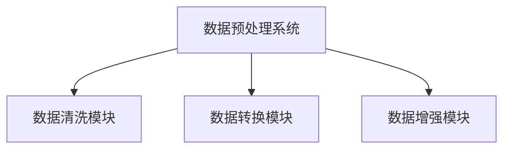

                 


# 数据收集与预处理：为AI Agent准备高质量训练集

> 关键词：数据收集，数据预处理，AI Agent，训练集，数据清洗，特征工程

> 摘要：  
本文系统地探讨了如何为AI Agent准备高质量的训练集，重点分析了数据收集与预处理的关键步骤。从数据收集的基本概念到预处理的核心方法，再到实际项目中的系统设计，本文为读者提供了从理论到实践的全面指导。通过详细讲解数据清洗、特征工程、数据增强等技术，结合具体案例和代码实现，帮助读者掌握构建高效AI训练数据集的实用技能。

---

# 引言

在AI Agent的开发过程中，数据是燃料，而数据的质量决定了AI模型的能力。高质量的数据训练集是构建智能AI Agent的核心，而数据收集与预处理是确保数据质量的两大基石。本文将从数据收集的基本原理出发，深入探讨预处理的关键技术，并通过实战案例展示如何构建高效的数据处理系统。

---

# 第1章: 数据收集与预处理概述

## 1.1 数据收集的重要性

数据收集是AI Agent训练的第一步，决定了后续模型的性能。高质量的数据能够帮助模型更好地理解任务场景，而低质量或不完整的数据可能导致模型性能下降甚至失效。

### 1.1.1 数据在AI Agent中的核心地位

AI Agent的任务执行能力高度依赖数据。例如，在自然语言处理任务中，数据不仅包含语言信息，还可能包含上下文、情感倾向等关键特征。数据的质量直接影响模型的泛化能力和鲁棒性。

### 1.1.2 数据质量对AI模型的影响

数据质量包括完整性、一致性、准确性等多个维度。高质量的数据能够减少模型训练中的偏差，提高预测的准确性。例如，在图像识别任务中，干净的数据集能够帮助模型更快收敛，减少过拟合的风险。

### 1.1.3 数据收集的基本原则

数据收集需要遵循以下原则：
1. **合法性**：确保数据来源合法，避免侵犯隐私或违反法律。
2. **相关性**：数据应与任务目标相关，避免收集无关信息。
3. **多样性**：数据应涵盖多种场景和类别，避免模型过拟合某一特定情况。

---

## 1.2 数据预处理的目标与流程

数据预处理是数据收集后的关键步骤，旨在将原始数据转化为适合模型训练的形式。

### 1.2.1 数据预处理的基本目标

数据预处理的目标包括：
1. **数据清洗**：去除噪声，处理缺失值。
2. **数据转换**：将数据转换为适合模型输入的格式。
3. **数据增强**：通过扩展数据集来提高模型的泛化能力。

### 1.2.2 数据预处理的典型流程

数据预处理的流程通常包括以下几个步骤：
1. 数据清洗：处理缺失值、重复值和异常值。
2. 数据转换：对数据进行归一化、标准化等处理。
3. 数据增强：通过数据扩展技术增加数据多样性。

### 1.2.3 数据预处理的常见挑战

数据预处理过程中常见的挑战包括：
1. 处理缺失值时的策略选择。
2. 数据转换方法对模型性能的影响。
3. 数据增强技术的多样性和有效性。

---

## 1.3 本书的核心内容与结构

本书将从数据收集的基本概念出发，逐步深入到预处理的核心技术，并通过实战案例展示如何构建高效的数据处理系统。

---

# 第2章: 数据收集的核心概念与方法

## 2.1 数据收集的背景与问题背景

### 2.1.1 数据收集的背景介绍

数据收集是AI Agent训练的第一步，涉及从多种来源获取数据。例如，可以从数据库、API、爬虫等多种渠道获取数据。

### 2.1.2 数据收集的核心问题

数据收集过程中常见的问题包括：
1. 数据来源的多样性。
2. 数据格式的多样性。
3. 数据质量的不确定性。

### 2.1.3 数据收集的边界与外延

数据收集的边界包括数据来源的合法性、数据格式的适配性等。数据收集的外延则涉及数据存储、数据管理等后续步骤。

---

## 2.2 数据收集的核心要素与组成

### 2.2.1 数据来源的多样性

数据来源可以包括：
1. **结构化数据**：如数据库中的表格数据。
2. **非结构化数据**：如文本、图像、视频等。
3. **半结构化数据**：如JSON、XML格式的数据。

### 2.2.2 数据格式的多样性

数据格式包括：
1. 文本文件（如CSV、Excel）。
2. 数据库（如MySQL、MongoDB）。
3. 网页内容（如HTML、XML）。

### 2.2.3 数据质量的关键指标

数据质量的关键指标包括：
1. 完整性：数据是否完整。
2. 一致性：数据是否符合特定格式。
3. 准确性：数据是否真实反映实际情况。

---

## 2.3 数据收集的方法与工具

### 2.3.1 数据抓取工具（如爬虫）

常用的数据抓取工具包括：
1. **BeautifulSoup**：用于解析HTML结构。
2. **requests**：用于发送HTTP请求。
3. **scrapy**：用于构建爬虫框架。

### 2.3.2 数据库查询工具

常用数据库查询工具包括：
1. **SQLAlchemy**：用于与数据库交互。
2. **pymysql**：用于连接MySQL数据库。
3. ** pymongo**：用于连接MongoDB数据库。

### 2.3.3 数据API的使用

数据API的使用步骤包括：
1. 获取API访问令牌。
2. 发送请求获取数据。
3. 处理返回的数据。

---

## 2.4 数据收集的流程与步骤

### 2.4.1 数据需求分析

在数据收集之前，需要明确数据的需求，包括数据的类型、格式、数量等。

### 2.4.2 数据来源选择

根据数据需求选择合适的数据来源，例如选择公开数据集或爬取网页数据。

### 2.4.3 数据收集策略制定

制定数据收集策略，包括数据获取的频率、批量大小等。

---

## 2.5 本章小结

本章从数据收集的基本概念出发，详细介绍了数据收集的核心要素、方法和工具，并给出了数据收集的流程与步骤。

---

# 第3章: 数据预处理的核心概念与联系

## 3.1 数据预处理的背景与问题背景

### 3.1.1 数据预处理的背景介绍

数据预处理是数据收集后的关键步骤，旨在将原始数据转化为适合模型训练的形式。

### 3.1.2 数据预处理的核心问题

数据预处理的核心问题包括：
1. 数据清洗：处理缺失值、重复值和异常值。
2. 数据转换：将数据转换为适合模型输入的格式。
3. 数据增强：通过扩展数据集来提高模型的泛化能力。

### 3.1.3 数据预处理的边界与外延

数据预处理的边界包括数据清洗的范围、数据转换的方法等。数据预处理的外延则涉及数据存储、数据管理等后续步骤。

---

## 3.2 数据预处理的核心要素与组成

### 3.2.1 数据清洗的基本概念

数据清洗的目标是去除噪声数据，处理缺失值和异常值。

### 3.2.2 数据转换的核心要素

数据转换包括归一化、标准化等技术，旨在将数据转化为适合模型输入的格式。

### 3.2.3 数据增强的关键组成

数据增强技术通过扩展数据集来提高模型的泛化能力，例如图像旋转、翻转等。

---

## 3.3 数据预处理的核心概念与联系

### 3.3.1 数据清洗与数据转换的联系

数据清洗是数据转换的前提，数据转换需要基于清洗后的数据进行。

### 3.3.2 数据增强与数据标准化的关系

数据增强可以与数据标准化结合使用，进一步提高数据的多样性。

### 3.3.3 数据预处理与数据收集的互动

数据预处理需要根据数据收集的结果进行调整，数据收集的结果也影响数据预处理的策略。

---

## 3.4 数据预处理的流程与步骤

### 3.4.1 数据清洗的基本流程

1. **识别缺失值**：检查数据中是否有缺失值。
2. **处理缺失值**：使用填充、删除等方法处理缺失值。
3. **识别异常值**：使用统计方法或可视化工具识别异常值。
4. **处理异常值**：对异常值进行清洗或标记。

### 3.4.2 数据转换的典型步骤

1. **归一化**：将数据缩放到0-1范围内。
2. **标准化**：将数据转换为均值为0，方差为1的标准正态分布。
3. **特征编码**：将分类变量转换为数值形式。

### 3.4.3 数据增强的具体方法

1. **图像旋转**：对图像进行旋转以增加数据多样性。
2. **图像翻转**：对图像进行水平或垂直翻转。
3. **添加噪声**：在图像中添加噪声以提高模型的鲁棒性。

---

## 3.5 本章小结

本章详细介绍了数据预处理的核心概念、流程和步骤，并通过具体的案例展示了如何进行数据清洗、数据转换和数据增强。

---

# 第4章: 数据预处理的算法原理与数学模型

## 4.1 数据清洗的算法原理

### 4.1.1 数据清洗的基本算法

数据清洗的基本算法包括：
1. **删除法**：删除包含缺失值的样本。
2. **填充法**：使用均值、中位数等方法填充缺失值。
3. **插值法**：使用回归等方法预测缺失值。

### 4.1.2 数据去重的数学模型

数据去重可以通过哈希表或排序后检查重复值的方法实现。

### 4.1.3 数据填补的算法实现

数据填补的算法包括：
1. **均值填补**：使用特征的均值填补缺失值。
2. **中位数填补**：使用特征的中位数填补缺失值。
3. **回归填补**：使用回归模型预测缺失值。

---

## 4.2 数据转换的数学模型

### 4.2.1 数据标准化的公式

$$ z = \frac{x - \mu}{\sigma} $$

其中，$\mu$是均值，$\sigma$是标准差。

### 4.2.2 数据归一化的公式

$$ y = \frac{x - \min(x)}{\max(x) - \min(x)} $$

---

## 4.3 数据增强的算法实现

### 4.3.1 图像旋转

使用图像处理库（如OpenCV）对图像进行旋转。

### 4.3.2 图像翻转

使用图像处理库对图像进行水平或垂直翻转。

### 4.3.3 添加噪声

通过随机噪声生成器在图像中添加噪声。

---

## 4.4 本章小结

本章详细介绍了数据清洗、数据转换和数据增强的算法原理，并给出了具体的数学公式和实现方法。

---

# 第5章: 数据预处理的系统设计与实现

## 5.1 系统设计背景与目标

### 5.1.1 系统设计背景

数据预处理系统需要处理大量数据，保证数据质量。

### 5.1.2 系统设计目标

数据预处理系统的目标包括：
1. **高效处理**：快速处理大规模数据。
2. **灵活扩展**：支持多种数据格式和处理方法。
3. **易于维护**：代码结构清晰，便于维护。

---

## 5.2 系统功能设计

### 5.2.1 数据清洗模块

1. **缺失值处理**：支持多种缺失值处理方法。
2. **异常值检测**：使用统计方法或机器学习模型检测异常值。

### 5.2.2 数据转换模块

1. **归一化处理**：支持多种归一化方法。
2. **特征编码**：支持One-Hot编码、Label编码等方法。

### 5.2.3 数据增强模块

1. **图像增强**：支持旋转、翻转、添加噪声等操作。
2. **文本增强**：支持同义词替换、数据扩展等操作。

---

## 5.3 系统架构设计

### 5.3.1 系统架构图



### 5.3.2 接口设计

1. **数据清洗接口**：提供缺失值处理和异常值检测接口。
2. **数据转换接口**：提供归一化和特征编码接口。
3. **数据增强接口**：提供图像和文本增强接口。

---

## 5.4 系统实现

### 5.4.1 数据清洗模块实现

```python
import pandas as pd

def handle_missing_data(df):
    # 删除包含缺失值的行
    df.dropna(inplace=True)
    return df
```

### 5.4.2 数据转换模块实现

```python
from sklearn.preprocessing import StandardScaler

def standardize_data(X):
    scaler = StandardScaler()
    X_scaled = scaler.fit_transform(X)
    return X_scaled
```

### 5.4.3 数据增强模块实现

```python
import cv2
import numpy as np

def add_noise(image):
    noise = np.random.normal(0, 0.1, image.shape)
    noisy_image = image + noise
    return noisy_image
```

---

## 5.5 本章小结

本章从系统设计的角度，详细介绍了数据预处理系统的功能设计、架构设计和实现方法，并给出了具体的代码实现。

---

# 第6章: 数据预处理实战：构建高质量训练集

## 6.1 项目背景与目标

### 6.1.1 项目背景

本项目旨在构建一个高质量的图像分类训练集。

### 6.1.2 项目目标

通过数据收集与预处理，构建一个包含1000张图片的图像分类数据集。

---

## 6.2 项目实施步骤

### 6.2.1 数据收集

1. **数据来源**：从公开数据集获取图像数据。
2. **数据格式**：图像文件为JPEG格式。

### 6.2.2 数据清洗

1. **检查缺失值**：确保所有图像文件完整。
2. **删除异常值**：删除损坏的图像文件。

### 6.2.3 数据转换

1. **归一化处理**：将图像缩放到224x224大小。
2. **数据增强**：对图像进行旋转、翻转等操作。

---

## 6.3 项目代码实现

### 6.3.1 数据清洗代码

```python
import os
import cv2
import numpy as np

def collect_data(root_dir):
    images = []
    for dir_name in os.listdir(root_dir):
        for file_name in os.listdir(os.path.join(root_dir, dir_name)):
            if file_name.endswith('.jpg'):
                img = cv2.imread(os.path.join(root_dir, dir_name, file_name))
                images.append(img)
    return images
```

### 6.3.2 数据增强代码

```python
def augment_data(images):
    augmented_images = []
    for img in images:
        # 随机旋转
        angle = np.random.randint(-15, 15)
        img_rotated = cv2.rotate(img, cv2.ROTATE_90_CLOCKWISE)
        augmented_images.append(img_rotated)
        # 随机翻转
        img_flipped = cv2.flip(img, 1)
        augmented_images.append(img_flipped)
    return augmented_images
```

---

## 6.4 项目小结

本章通过一个具体的项目案例，展示了如何通过数据收集与预处理构建高质量的训练集，并给出了具体的代码实现。

---

# 第7章: 数据预处理的最佳实践与未来展望

## 7.1 数据预处理的最佳实践

### 7.1.1 数据收集阶段

1. **确保数据合法性**：避免侵犯隐私或违反法律。
2. **选择合适的数据来源**：根据任务目标选择合适的数据来源。
3. **记录数据元信息**：记录数据的时间戳、来源等信息。

### 7.1.2 数据预处理阶段

1. **采用自动化工具**：使用自动化工具提高数据预处理效率。
2. **结合业务需求**：根据业务需求选择合适的数据处理方法。
3. **持续优化**：根据模型表现持续优化数据预处理策略。

---

## 7.2 未来展望

随着AI技术的不断发展，数据预处理技术也将不断进步。未来，可能会出现更加智能化的数据预处理工具，能够自动识别数据问题并进行优化。

---

## 7.3 本章小结

本章总结了数据预处理的最佳实践，并展望了未来的发展方向。

---

# 结语

数据收集与预处理是构建高质量AI Agent训练集的关键步骤。通过本文的系统讲解，读者可以掌握数据收集与预处理的核心技术，并能够将其应用到实际项目中。未来，随着AI技术的不断发展，数据预处理技术也将不断进步，为AI模型的性能提升提供更有力的支持。

---

# 参考文献

（此处列出相关文献和资源）

---

# 附录

（此处可以放置代码示例、工具安装指南等补充材料）

---

通过以上详细的内容，我们系统地探讨了数据收集与预处理的核心技术，并通过具体案例展示了如何构建高质量的训练集。希望本文能够为读者提供有价值的参考，帮助他们在AI Agent的开发中取得更好的成果。

