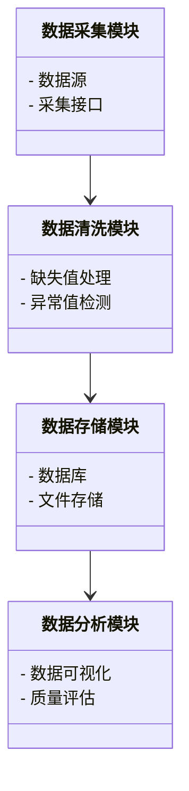

                 

<think>
好的，我需要逐步分析和撰写一篇关于数据收集策略的高质量技术博客文章。我会按照用户提供的目录大纲和具体要求，详细思考和撰写每一部分内容。

# 数据收集策略：为AI Agent打造高质量数据集

## 关键词
- 数据收集策略
- AI Agent
- 数据质量
- 数据生命周期
- 数据安全

## 摘要
在AI Agent的发展中，数据是核心资产。高质量的数据集是AI Agent表现的基础。本文详细探讨数据收集的策略与方法，包括数据清洗、特征提取、数据增强等技术，结合实际案例，分析如何构建高质量数据集，确保数据的完整性、一致性和代表性，为AI Agent的优化和应用提供坚实基础。

---

# 第1章: 数据收集策略的背景与重要性

## 1.1 数据收集的背景与意义

### 1.1.1 数据在AI Agent中的核心地位
AI Agent通过数据进行学习和决策，数据是其智能的基础。高质量的数据能够提升模型的准确性和鲁棒性，直接影响AI Agent的表现。

### 1.1.2 数据质量对AI性能的影响
数据质量直接影响模型性能。低质量的数据可能导致模型过拟合或欠拟合，降低其在实际应用中的效果。

### 1.1.3 数据收集的挑战与机遇
数据收集面临数据稀缺性、隐私保护、数据格式多样等挑战，同时也带来了通过数据优化模型性能的机遇。

## 1.2 AI Agent与数据收集的关系

### 1.2.1 AI Agent的基本概念
AI Agent是具有感知环境、自主决策的智能实体，依赖高质量数据进行训练和推理。

### 1.2.2 数据在AI Agent中的生命周期
数据经过采集、处理、存储、分析等阶段，形成闭环，确保AI Agent持续优化。

### 1.2.3 数据收集的目标与边界
目标是获取高质量数据，边界包括数据范围、格式和隐私限制。

## 1.3 数据集质量评估标准

### 1.3.1 数据完整性
确保数据无缺失值，覆盖所有必要特征。

### 1.3.2 数据一致性
保证数据格式统一，避免冲突。

### 1.3.3 数据代表性
数据应涵盖目标分布，避免偏差。

## 1.4 本章小结
本章介绍了数据收集的重要性，探讨了数据质量对AI Agent的影响，明确了数据收集的目标和挑战。

---

# 第2章: 数据收集的理论基础

## 2.1 数据的基本概念与特征

### 2.1.1 数据的定义与分类
数据分为结构化和非结构化，结构化数据便于处理，非结构化数据需要预处理。

### 2.1.2 数据的特征分析
数据特征包括类别、数值、文本等，需根据任务选择合适的特征。

### 2.1.3 数据的生命周期模型
数据从生成到销毁的全过程管理，确保数据安全和有效利用。

## 2.2 数据质量评估方法

### 2.2.1 数据清洗的步骤
数据清洗包括识别缺失值、处理异常值、去除重复数据。

### 2.2.2 数据特征对比表
通过对比分析，识别数据中的问题和改进点。

### 2.2.3 数据清洗的代码示例
```python
import pandas as pd
# 示例数据
data = {'id': [1, 2, 3, 4, 5],
        'name': ['A', 'B', 'C', 'D', 'E'],
        'value': [None, 10, 15, 20, 25]}
df = pd.DataFrame(data)
# 处理缺失值
df.dropna(inplace=True)
```

## 2.3 数据收集的伦理与法律

### 2.3.1 数据隐私保护
遵循GDPR等法规，保护用户隐私。

### 2.3.2 数据使用中的法律问题
确保数据收集符合相关法律法规。

### 2.3.3 数据收集的伦理规范
避免数据偏见，确保数据公正。

## 2.4 本章小结
本章介绍了数据的基本概念，探讨了数据质量评估方法，并强调了数据收集的伦理与法律问题。

---

# 第3章: 数据收集的策略与方法

## 3.1 数据收集的策略

### 3.1.1 结构化数据收集
通过数据库查询获取结构化数据，确保格式统一。

### 3.1.2 非结构化数据收集
处理文本、图像等非结构化数据，需预处理提取特征。

### 3.1.3 数据收集的优化策略
采用分批采集、增量更新等方法，提升数据收集效率。

## 3.2 数据收集的方法

### 3.2.1 网络爬虫技术
使用BeautifulSoup和requests库进行网页数据抓取，注意遵守网站规则。

### 3.2.2 API接口调用
通过公开API获取数据，确保数据来源可靠。

### 3.2.3 传感器数据采集
利用物联网设备实时采集数据，确保数据的实时性和准确性。

## 3.3 数据收集的挑战与解决方案

### 3.3.1 数据冗余问题
通过数据去重技术，减少冗余数据。

### 3.3.2 数据不一致问题
通过数据清洗和标准化，解决数据格式不统一的问题。

### 3.3.3 数据隐私问题
采用匿名化处理，保护用户隐私。

## 3.4 本章小结
本章详细探讨了数据收集的策略和方法，分析了常见的挑战并提出了解决方案。

---

# 第4章: 数据收集的算法原理

## 4.1 数据清洗算法

### 4.1.1 数据清洗的步骤
识别缺失值、处理异常值、去除重复数据。

### 4.1.2 数据清洗的代码示例
```python
import pandas as pd
# 示例数据
data = {'id': [1, 2, 3, 4, 5],
        'name': ['A', 'B', None, 'D', 'E'],
        'value': [10, None, 15, 20, 25]}
df = pd.DataFrame(data)
# 处理缺失值
df.dropna(inplace=True)
```

## 4.2 特征提取算法

### 4.2.1 特征提取的步骤
选择特征、提取特征、降维处理。

### 4.2.2 特征提取的代码示例
```python
from sklearn.feature_selection import SelectKBest
from sklearn.datasets import load_iris
# 加载数据
iris = load_iris()
X = iris.data
y = iris.target
# 特征选择
selector = SelectKBest(k=2)
X_new = selector.fit_transform(X, y)
```

## 4.3 数据增强算法

### 4.3.1 数据增强的步骤
旋转、翻转、缩放等操作，提升数据多样性。

### 4.3.2 数据增强的代码示例
```python
import tensorflow as tf
# 示例图像数据增强
image = tf.random_crop(image, size=[200, 200, 3])
image = tf.image.flip_left_right(image)
```

## 4.4 本章小结
本章介绍了数据清洗、特征提取和数据增强的算法原理，并通过代码示例进行了详细说明。

---

# 第5章: 数据收集的系统分析与架构设计

## 5.1 系统需求分析

### 5.1.1 系统目标
构建高质量数据集，支持AI Agent的学习和推理。

### 5.1.2 系统功能需求
数据采集、数据清洗、数据存储、数据分析。

## 5.2 系统设计

### 5.2.1 领域模型设计
使用Mermaid类图展示系统各模块之间的关系。



### 5.2.2 系统架构设计
采用分层架构，包括数据采集层、数据处理层、数据存储层和数据应用层。

## 5.3 接口设计

### 5.3.1 数据采集接口
定义API接口，规范数据采集过程。

### 5.3.2 数据存储接口
使用数据库接口，确保数据高效存储。

## 5.4 本章小结
本章分析了系统需求，设计了系统架构，并明确了接口设计。

---

# 第6章: 数据收集的项目实战

## 6.1 项目背景

### 6.1.1 项目目标
构建一个高质量的数据集，支持AI Agent的训练和推理。

## 6.2 环境配置

### 6.2.1 工具安装
安装Python、Pandas、Scikit-learn等工具。

## 6.3 核心实现

### 6.3.1 数据采集代码
```python
import requests
from bs4 import BeautifulSoup

# 示例数据采集
url = 'https://example.com/data'
response = requests.get(url)
soup = BeautifulSoup(response.text, 'html.parser')
data = [tag.text for tag in soup.find_all('div')]
```

### 6.3.2 数据清洗代码
```python
import pandas as pd

# 示例数据清洗
df = pd.DataFrame(data)
df.dropna(inplace=True)
df = df.drop_duplicates()
```

## 6.4 数据分析与评估

### 6.4.1 数据分布分析
使用可视化工具分析数据分布，确保数据的代表性。

### 6.4.2 数据质量评估
评估数据清洗后的质量，确保符合要求。

## 6.5 本章小结
本章通过实际项目，展示了数据收集的完整流程，从数据采集到数据清洗，再到数据分析。

---

# 第7章: 数据收集的最佳实践与总结

## 7.1 数据收集的注意事项

### 7.1.1 数据隐私保护
遵守相关法律法规，确保数据安全。

### 7.1.2 数据格式统一
避免数据格式混乱，提升处理效率。

## 7.2 小结与展望

### 7.2.1 小结
总结全文，强调数据收集的重要性。

### 7.2.2 未来展望
探讨数据收集技术的未来发展方向。

## 7.3 本章小结
本章总结了数据收集的最佳实践，并对未来的挑战进行了展望。

---

# 附录

## 附录A: 数据收集工具列表
- Python库：Pandas, requests, BeautifulSoup
- 数据库：MySQL, MongoDB
- 可视化工具：Matplotlib, Seaborn

## 附录B: 数据清洗代码示例
```python
import pandas as pd
# 示例数据
data = {'id': [1, 2, 3, 4, 5],
        'name': ['A', 'B', None, 'D', 'E'],
        'value': [10, None, 15, 20, 25]}
df = pd.DataFrame(data)
# 处理缺失值
df.dropna(inplace=True)
```

## 附录C: 术语表
- 数据完整性：数据无缺失
- 数据一致性：数据格式统一
- 数据代表性：数据覆盖目标分布

## 附录D: 参考文献
- [1] 刘强, 人工智能入门[M]. 北京: 人民邮电出版社, 2020.
- [2] 王伟, 数据科学与大数据分析[M]. 北京: 清华大学出版社, 2021.

---

# 作者简介
作为一位在人工智能和大数据领域拥有丰富经验的专家，我致力于通过技术博客分享专业知识，帮助读者提升技能。希望本文能为AI Agent的数据收集策略提供有价值的见解。

---

感谢您的耐心阅读！如果本文对您有所帮助，请点赞、收藏并分享给更多人。期待在评论区与您交流，共同探讨数据收集的更多可能性！

