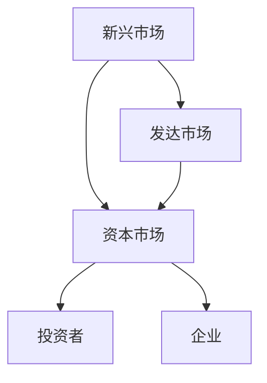
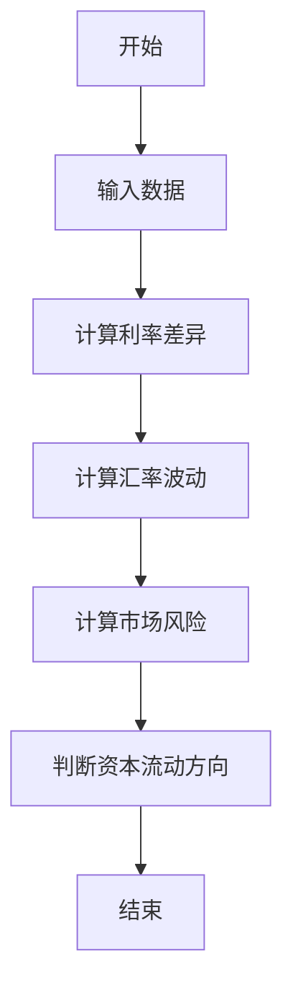
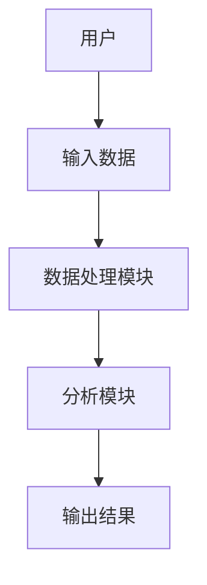
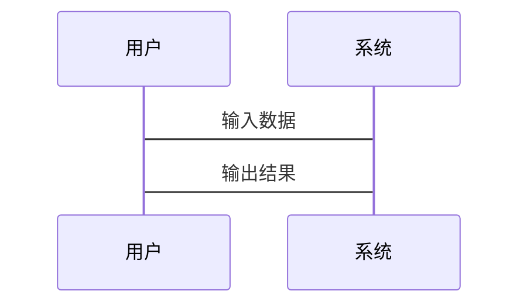

                 


# 新兴市场 vs 发达市场：资本流动分析

## 关键词：新兴市场、发达市场、资本流动、经济学分析、技术博客

## 摘要：  
本文通过分析新兴市场与发达市场之间的资本流动差异，探讨资本流动的驱动因素、影响机制以及两者的异同。结合经济学理论与技术方法，深入解析资本流动的内在逻辑，并通过实际案例与模型构建，为读者提供清晰的分析框架和实践指南。

---

## 第1章：新兴市场与发达市场的概述

### 1.1 新兴市场与发达市场的定义与特点

#### 1.1.1 新兴市场的定义与特征
- 新兴市场是指处于经济增长阶段、产业结构逐步升级的国家或地区，如中国、印度等。
- 经济特点：增长速度快、产业升级中、资本市场逐步完善。
- 风险特点：高风险高回报，市场波动较大。

#### 1.1.2 发达市场的定义与特征
- 发达市场是指经济高度发达、产业结构成熟、金融市场完善的国家或地区，如美国、欧洲等。
- 经济特点：增长稳定、产业结构多元化、金融市场成熟。
- 风险特点：低风险低回报，市场波动较小。

#### 1.1.3 两者的主要区别与联系
- 区别：经济阶段、市场成熟度、风险水平不同。
- 联系：资本流动是两者之间的桥梁，新兴市场吸引外资，发达市场进行全球投资。

---

### 1.2 资本流动的定义与基本概念

#### 1.2.1 资本流动的定义
- 资本流动是指资本在不同地区或市场之间的转移，包括直接投资、证券投资、银行借贷等形式。

#### 1.2.2 资本流动的主要形式
- 直接投资：跨国公司建立分支机构。
- 证券投资：购买股票、债券等金融资产。
- 银行借贷：跨国银行贷款。

#### 1.2.3 资本流动的驱动因素
- 利率差异、汇率波动、市场风险、投资机会等。

---

### 1.3 新兴市场与发达市场资本流动的差异

#### 1.3.1 经济发展阶段的差异
- 新兴市场处于工业化阶段，发达市场处于后工业化阶段。
- 新兴市场吸引外资，发达市场进行对外投资。

#### 1.3.2 资本市场成熟度的差异
- 新兴市场：市场波动大，监管不完善。
- 发达市场：市场成熟，监管严格。

#### 1.3.3 政治与政策环境的差异
- 新兴市场：政策变化大，不确定性高。
- 发达市场：政策稳定，法律完善。

---

## 第2章：资本流动的核心概念与理论基础

### 2.1 资本流动的基本原理

#### 2.1.1 资本流动的基本机制
- 资本从高利率地区流向低利率地区。
- 投资者追求更高回报，资本流向风险收益比更高的市场。

#### 2.1.2 资本流动的驱动因素分析
- 利率差异：主要驱动因素。
- 汇率波动：次要驱动因素。
- 市场风险：影响资本流动方向。

#### 2.1.3 资本流动的周期性特征
- 经济周期波动影响资本流动。
- 资本流动具有顺周期性。

---

### 2.2 新兴市场与发达市场资本流动的对比分析

#### 2.2.1 经济结构对比
- 新兴市场：制造业为主，产业升级中。
- 发达市场：服务业为主，高科技产业发达。

#### 2.2.2 资本市场成熟度对比
- 新兴市场：市场规模小，流动性不足。
- 发达市场：市场规模大，流动性强。

#### 2.2.3 政策环境对比
- 新兴市场：政策变化大，不确定性高。
- 发达市场：政策稳定，法律完善。

---

### 2.3 资本流动的实体关系图



---

## 第3章：资本流动的分析模型与算法原理

### 3.1 资本流动的分析模型

#### 3.1.1 资本流动的驱动因素分析模型
- 利率差异、汇率波动、市场风险。

#### 3.1.2 资本流动的路径分析模型
- 资本从高利率地区流向低利率地区。

#### 3.1.3 资本流动的风险评估模型
- 通过VaR模型评估市场风险。

---

### 3.2 算法原理讲解

#### 3.2.1 资本流动分析算法的流程图



#### 3.2.2 资本流动分析算法的数学模型

$$ \text{资本流动方向} = \text{sign}(r_1 - r_2) $$

其中：
- $r_1$ 是新兴市场的利率
- $r_2$ 是发达市场的利率

---

### 3.3 算法实现与代码示例

#### 3.3.1 环境安装
- 需要安装 Python 和相关库（如 numpy、pandas）。

#### 3.3.2 核心代码实现

```python
import numpy as np
import pandas as pd

def capital_flow_analysis(r1, r2, exchange_rate):
    # 计算利率差异
    interest_diff = r1 - r2
    # 计算汇率波动
    exchange_fluctuation = np.std(exchange_rate)
    # 判断资本流动方向
    if interest_diff > 0:
        return "资本从新兴市场流向发达市场"
    else:
        return "资本从发达市场流向新兴市场"

# 示例数据
r1 = 0.05  # 新兴市场利率
r2 = 0.03  # 发达市场利率
exchange_rate = [7.0, 7.1, 6.9, 7.2]  # 汇率数据

# 调用函数
result = capital_flow_analysis(r1, r2, exchange_rate)
print(result)
```

#### 3.3.3 代码解读与分析
- 代码实现了资本流动方向的判断，基于利率差异和汇率波动。
- 示例数据中，新兴市场利率高于发达市场，资本流向发达市场。

---

## 第4章：系统分析与架构设计方案

### 4.1 问题场景介绍

#### 4.1.1 问题描述
- 分析新兴市场与发达市场之间的资本流动差异。
- 构建资本流动分析模型。

#### 4.1.2 项目介绍
- 开发一个资本流动分析系统，支持用户输入数据，输出分析结果。

### 4.2 系统功能设计

#### 4.2.1 领域模型设计


#### 4.2.2 系统架构设计



#### 4.2.3 系统接口设计
- 输入接口：接受新兴市场和发达市场的经济数据。
- 输出接口：显示资本流动方向和分析结果。

#### 4.2.4 系统交互设计



---

## 第5章：项目实战：案例分析

### 5.1 环境安装与数据准备

#### 5.1.1 环境安装
- 安装 Python 和相关库（如 numpy、pandas）。

#### 5.1.2 数据准备
- 新兴市场数据：中国。
- 发达市场数据：美国。

### 5.2 核心代码实现

#### 5.2.1 数据读取与处理

```python
import pandas as pd

# 数据准备
data新兴 = pd.read_csv("data_新兴.csv")
data发达 = pd.read_csv("data_发达.csv")

# 数据处理
data新兴['日期'] = pd.to_datetime(data新兴['日期'])
data发达['日期'] = pd.to_datetime(data发达['日期'])
```

#### 5.2.2 资本流动分析

```python
def calculate_flow(data_新兴, data_发达):
    # 计算利率差异
    interest_diff = data_新兴['利率'].mean() - data_发达['利率'].mean()
    # 计算汇率波动
    exchange_fluctuation = np.std(data_发达['汇率'])
    # 判断资本流动方向
    if interest_diff > 0:
        return "资本从新兴市场流向发达市场"
    else:
        return "资本从发达市场流向新兴市场"

# 示例分析
result = calculate_flow(data_新兴, data_发达)
print(result)
```

### 5.3 案例分析与结果解读

#### 5.3.1 案例分析
- 新兴市场利率为5%，发达市场利率为3%。
- 汇率波动为2%。
- 资本流动方向：新兴市场流向发达市场。

#### 5.3.2 结果解读
- 利率差异是主要驱动因素，资本流向利率较低的发达市场。

---

## 第6章：资本流动管理策略

### 6.1 资本流动管理策略

#### 6.1.1 新兴市场的管理策略
- 完善金融市场监管。
- 提高市场透明度。
- 吸引外资，促进产业升级。

#### 6.1.2 发达市场的管理策略
- 通过货币政策调控资本流动。
- 防范资本外流风险。
- 优化投资环境。

### 6.2 小结

#### 6.2.1 本文总结
- 资本流动是新兴市场与发达市场互动的核心机制。
- 利率差异是主要驱动因素，市场风险是次要驱动因素。

#### 6.2.2 注意事项
- 数据采集与处理需谨慎，避免偏差。
- 模型假设需符合实际，避免过度简化。

### 6.3 拓展阅读

#### 6.3.1 推荐书籍
- 《国际金融学》
- 《资本市场分析》

#### 6.3.2 推荐博客
- 《经济学人》
- 《金融时报》

---

## 第7章：总结与展望

### 7.1 本文总结
- 新兴市场与发达市场之间的资本流动差异显著。
- 利率差异是主要驱动因素，市场风险是次要驱动因素。
- 资本流动分析模型可为投资者提供参考。

### 7.2 展望
- 进一步研究新兴市场内部的资本流动差异。
- 探讨资本流动对全球经济的影响。
- 开发更复杂的资本流动分析模型。

---

## 关键词：新兴市场、发达市场、资本流动、经济学分析、技术博客

---

## 结语

通过本文的分析，我们深入探讨了新兴市场与发达市场之间的资本流动差异，结合经济学理论与技术方法，为读者提供了清晰的分析框架和实践指南。希望本文能为相关领域的研究者和实践者提供有价值的参考。

