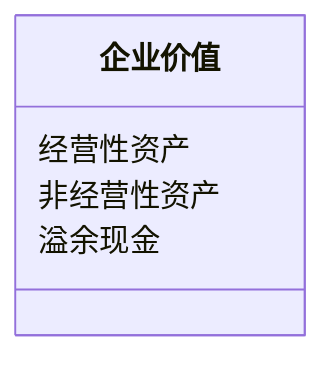
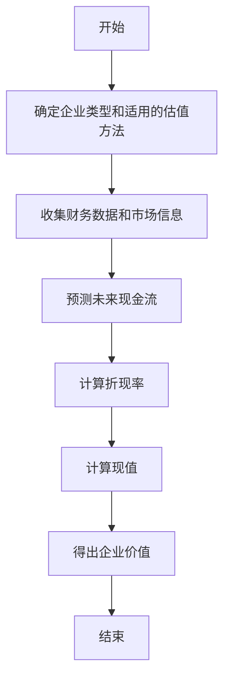

                 

# 新兴市场企业估值的特殊考虑

## 关键词：新兴市场，企业估值，DCF模型，相对估值法，政策风险，信息不对称，市场波动

## 摘要：  
新兴市场由于其独特的经济环境、政策风险和信息不对称问题，使得企业估值具有特殊性和复杂性。本文将系统地分析新兴市场企业估值的关键挑战，探讨传统估值方法的局限性，并详细介绍现金流折现法（DCF）和相对估值法在新兴市场的应用。通过具体案例分析和最佳实践，为读者提供在新兴市场中进行企业估值的深度见解。

---

# 第一部分：新兴市场企业估值的背景与特殊性

## 第1章：新兴市场的特点与企业估值的特殊性

### 1.1 新兴市场的定义与特点

#### 1.1.1 新兴市场的定义  
新兴市场是指那些经济快速增长、但尚未完全工业化的国家或地区的金融市场。这些市场通常位于发展中国家，如中国、印度、巴西等。

#### 1.1.2 新兴市场的核心特点  
- **高增长性**：新兴市场通常具有较高的经济增长率，企业盈利能力较强。  
- **政策风险**：政府政策的变化对企业运营和估值影响较大。  
- **市场波动性**：新兴市场往往表现出较高的市场波动性，尤其是在股票市场上。  
- **信息不对称**：由于市场发展不完善，信息透明度较低，投资者难以获取准确的企业数据。  

#### 1.1.3 新兴市场与成熟市场的对比分析  
- **成熟市场**：信息透明，政策稳定，市场波动小。  
- **新兴市场**：信息不透明，政策风险高，市场波动大。  

### 1.2 企业估值的基本概念

#### 1.2.1 企业估值的定义  
企业估值是指通过对企业未来现金流的预测和折现，评估企业当前价值的过程。  

#### 1.2.2 企业估值的主要方法  
- **现金流折现法（DCF）**：通过预测企业未来现金流，使用适当的折现率计算现值。  
- **相对估值法**：基于市场指标（如市盈率、市净率）进行估值。  

#### 1.2.3 企业估值的核心要素  
- 财务数据：收入、利润、现金流等。  
- 市场环境：宏观经济、行业趋势。  
- 政策环境：政府政策对企业的影响。  

### 1.3 新兴市场企业估值的特殊性

#### 1.3.1 新兴市场的政策风险  
政府政策的变化可能对企业经营产生重大影响，从而影响企业的估值。  

#### 1.3.2 新兴市场的经济波动性  
新兴市场的经济波动较大，企业盈利和现金流可能不稳定。  

#### 1.3.3 新兴市场的信息不对称问题  
由于市场发展不完善，投资者难以获取准确的企业信息，导致估值难度增加。  

---

## 第2章：传统企业估值方法的局限性

### 2.1 常用企业估值方法概述

#### 2.1.1 现金流折现法（DCF）  
DCF模型通过预测企业未来自由现金流，使用加权平均资本成本（WACC）或其他折现率，计算企业价值。  

#### 2.1.2 相对估值法  
相对估值法基于市场指标（如市盈率、市净率）进行估值，适用于数据不完整的新兴市场。  

#### 2.1.3 股权自由现金流模型  
股权自由现金流模型是DCF模型的一种，专注于企业股权的价值。  

### 2.2 传统估值方法在新兴市场的局限性

#### 2.2.1 数据质量与完整性问题  
新兴市场中，企业财务数据可能不完整或不准确，影响估值结果。  

#### 2.2.2 市场波动对估值的影响  
新兴市场的高波动性可能导致估值结果不稳定。  

#### 2.2.3 政策变化对企业估值的干扰  
政策变化可能影响企业的盈利能力和现金流，使得传统估值方法失效。  

---

## 第3章：新兴市场企业估值的核心概念与联系

### 3.1 核心概念原理

#### 3.1.1 企业价值的构成  
企业价值包括经营性资产价值、非经营性资产价值以及溢余现金等。  

#### 3.1.2 估值模型的关键假设  
- 现金流预测：需要对企业未来现金流进行合理预测。  
- 折现率：需要考虑市场风险和企业特有风险。  

#### 3.1.3  

### 3.2 核心概念与联系的图表

#### 3.2.1 企业价值构成的类图  

#### 3.2.2 DCF模型的流程图  

---

## 第4章：现金流折现法（DCF）的算法原理

### 4.1 DCF模型的数学公式

#### 4.1.1 自由现金流公式  
$$\text{自由现金流} = \text{净利润} + \text{折旧和摊销} - \text{资本支出}$$  

#### 4.1.2 加权平均资本成本（WACC）公式  
$$\text{WACC} = w_d \times k_d \times (1 - t) + w_e \times k_e$$  
其中，\(w_d\) 为债务权重，\(k_d\) 为债务成本，\(t\) 为税率，\(w_e\) 为股权权重，\(k_e\) 为股权成本。  

#### 4.1.3 终值公式  
$$\text{终值} = \text{最后一年现金流} \times (1 + g)^{-n}$$  
其中，\(g\) 为永续增长率，\(n\) 为预测期数。  

### 4.2 DCF模型的实现步骤

#### 4.2.1 数据收集与假设设定  
- 收集企业的财务数据和行业信息。  
- 设定合理的增长率和永续增长率。  

#### 4.2.2 现金流预测  
- 预测未来5年的自由现金流。  

#### 4.2.3 折现率计算  
- 使用WACC公式计算折现率。  

#### 4.2.4 计算现值  
- 将未来现金流折现，计算总现值。  

#### 4.2.5 企业价值确定  
- 将现值与非经营性资产价值加总，得出企业整体价值。  

---

## 第5章：相对估值法在新兴市场的应用

### 5.1 相对估值法的核心原理  
相对估值法通过比较可比公司（Peer Group）的市场指标（如市盈率、市净率）来确定目标企业的估值。  

### 5.2 相对估值法的步骤  

#### 5.2.1 确定可比公司  
- 选择与目标企业相似的公司，考虑行业、规模、地理位置等因素。  

#### 5.2.2 计算可比公司的平均市场指标  
- 计算可比公司的平均市盈率或市净率。  

#### 5.2.3 确定目标企业的估值  
- 使用可比公司的平均市场指标乘以目标企业的关键财务指标（如净利润）。  

---

## 第6章：新兴市场企业估值的案例分析

### 6.1 案例背景介绍  
选取一家新兴市场的科技公司作为案例，分析其估值过程。  

### 6.2 数据收集与假设设定  
- 收集公司过去5年的财务数据。  
- 设定合理的增长率和永续增长率。  

### 6.3 DCF模型的应用  
- 预测未来5年的自由现金流。  
- 计算WACC作为折现率。  
- 计算企业整体价值。  

### 6.4 相对估值法的应用  
- 选择可比公司，计算平均市盈率。  
- 使用市盈率乘以目标企业的净利润，得出估值。  

### 6.5 结果对比与分析  
- 比较两种方法得出的估值结果，分析差异的原因。  

---

## 第7章：新兴市场企业估值的最佳实践与注意事项

### 7.1 最佳实践  
- **数据验证**：确保财务数据的准确性和完整性。  
- **模型敏感性分析**：评估关键假设对估值结果的影响。  
- **结合多种方法**：同时使用DCF和相对估值法进行交叉验证。  

### 7.2 注意事项  
- **政策风险**：密切关注政府政策变化。  
- **市场波动**：考虑市场波动对企业估值的影响。  
- **信息不对称**：尽量获取可靠的信息来源。  

---

## 第8章：总结与展望

### 8.1 总结  
新兴市场企业估值具有特殊性，需要结合多种方法和假设进行综合分析。  

### 8.2 展望  
随着新兴市场的不断发展，企业估值方法将更加多样化和精细化。  

---

通过以上内容，我们系统地探讨了新兴市场企业估值的特殊性，分析了传统估值方法的局限性，并详细介绍了现金流折现法和相对估值法的应用。希望本文能为读者在新兴市场中进行企业估值提供有价值的参考和指导。

