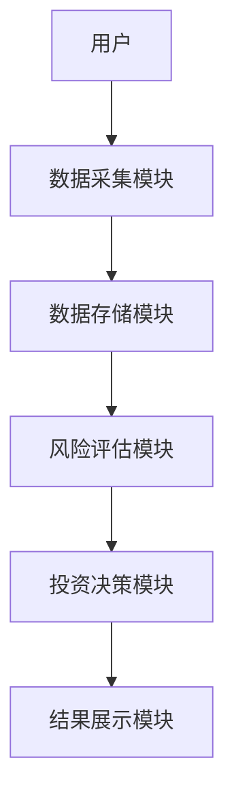

                 


# 新兴市场投资：高风险高回报的机遇与挑战

> 关键词：新兴市场，投资，高风险，高回报，机会，挑战

> 摘要：本文深入分析新兴市场的投资环境，探讨其高风险与高回报并存的特点，通过数学模型、算法优化和系统设计等方法，提供投资策略和风险管理的最佳实践。

---

## 第一部分：新兴市场投资的背景与现状

### 第1章：新兴市场的定义与特征

#### 1.1 新兴市场的概念
- 1.1.1 新兴市场的定义：指经济快速发展但尚未完全成熟的国家或地区，如中国、印度、巴西等。
- 1.1.2 新兴市场的特征：经济增长快、市场潜力大、但存在政策风险和基础设施不足等问题。

#### 1.2 新兴市场的现状
- 1.2.1 全球新兴市场的分布：亚洲、拉丁美洲、中东及非洲的新兴经济体。
- 1.2.2 新兴市场的经济表现：近年来，新兴市场GDP增速普遍高于发达市场。

#### 1.3 新兴市场对全球经济的影响
- 1.3.1 新兴市场在全球供应链中的作用：作为制造业中心和消费市场。
- 1.3.2 新兴市场对国际贸易的影响：通过出口和FDI推动全球经济增长。

### 第2章：新兴市场投资的核心概念

#### 2.1 投资机会与风险分析
- 2.1.1 投资机会：新兴市场的高增长潜力。
- 2.1.2 投资风险：政策风险、市场波动、货币风险等。

#### 2.2 投资与风险的平衡
- 2.2.1 风险调整后的投资回报模型：CAPM（资本资产定价模型）的应用。

#### 2.3 机会与风险的ER实体关系图
```mermaid
erDiagram
  market{
    id
    name
    risk_level
  }
  investment{
    id
    type
    return_rate
  }
  risk_factors{
    id
    factor_name
    impact
  }
  market --> investment : influences
  investment --> risk_factors : subject_to
```

---

## 第二部分：新兴市场投资的数学模型与算法

### 第3章：投资组合优化算法

#### 3.1 投资组合优化的数学模型
- 现代投资组合理论（MPT）：通过优化风险和收益，构建最优投资组合。
- 数学公式：$$ \text{目标函数} = \min \sigma^2, \quad \text{约束条件} = \sum w_i = 1 $$

#### 3.2 投资组合优化的实现
- 使用Python实现投资组合优化：
  ```python
  import numpy as np
  import matplotlib.pyplot as plt

  # 示例数据
  returns = np.array([0.1, 0.12, 0.08])
  weights = np.array([1/3, 1/3, 1/3])

  # 计算投资组合的预期收益和方差
  expected_return = np.sum(returns * weights)
  portfolio_variance = np.dot(weights.T, np.dot(np.cov(returns), weights))
  ```

### 第4章：风险评估与管理算法

#### 4.1 风险评估模型
- 值-at-风险（VaR）：计算投资在一定置信水平下的潜在损失。
- 公式：$$ VaR = \mu + z \cdot \sigma $$，其中 $z$ 是标准正态分布的分位数。

#### 4.2 风险调整后的投资策略
- 使用蒙特卡洛模拟评估不同市场条件下的投资组合表现。

---

## 第三部分：系统分析与架构设计

### 第5章：投资分析系统的功能设计

#### 5.1 系统功能模块
- 数据采集：获取新兴市场的经济指标、公司财务数据等。
- 风险评估：计算投资组合的风险和回报。
- 投资决策：基于模型推荐投资策略。

#### 5.2 系统架构设计


### 第6章：项目实战与案例分析

#### 6.1 环境安装与配置
- 安装Python、Pandas、NumPy等工具。
- 数据源：获取新兴市场的历史数据，如股票价格、经济指标等。

#### 6.2 核心实现
- 使用Python代码实现投资组合优化和风险评估：
  ```python
  # 示例：计算投资组合的夏普比率
  returns = pd.DataFrame(data)
  returns_mean = returns.mean()
  returns_std = returns.std()
  sharpe_ratio = returns_mean / returns_std
  ```

#### 6.3 案例分析
- 分析印度市场的投资机会，评估风险并提出投资建议。

---

## 第四部分：总结与展望

### 第7章：总结与最佳实践

#### 7.1 总结
- 新兴市场投资的关键在于平衡风险与回报，合理配置资产。

#### 7.2 最佳实践
- 定期评估投资组合，根据市场变化调整策略。
- 使用量化工具和模型优化投资决策。

### 第8章：展望与未来趋势

#### 8.1 未来趋势
- 利用人工智能和大数据技术提高投资分析的准确性。

#### 8.2 注意事项
- 保持对政策变化的敏感性，及时调整投资策略。

---

通过以上结构，本文系统地探讨了新兴市场投资的机遇与挑战，结合数学模型和系统设计，为投资者提供了科学的投资策略和风险管理方法。

