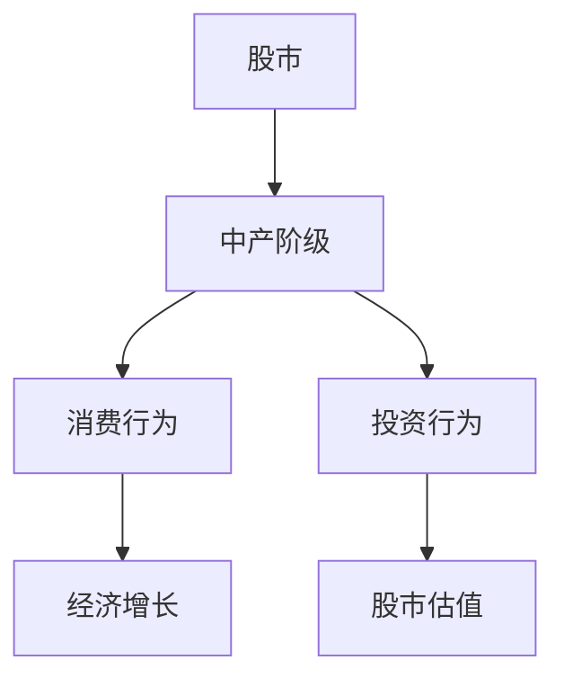
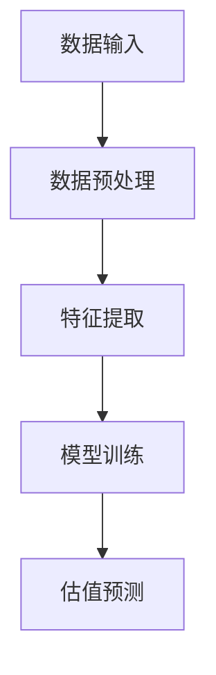
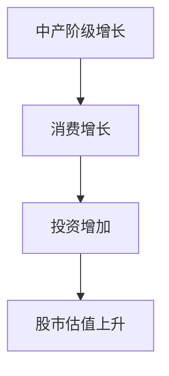
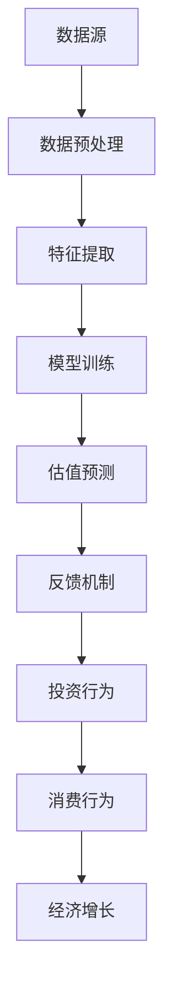

                 


# 新兴市场股市估值与中产阶级崛起的互动

> 关键词：新兴市场、股市估值、中产阶级、经济影响、投资行为

> 摘要：本文探讨新兴市场股市估值与中产阶级崛起之间的互动关系，通过理论分析和实证研究，揭示中产阶级的经济行为对股市估值的影响机制，以及股市估值的变化对中产阶级财富积累的反馈效应。文章从背景介绍、核心概念分析、算法原理、系统架构、案例研究等多个维度展开，为理解新兴市场的经济动态提供新的视角。

---

## 第一部分: 背景与概念

### 第1章: 背景介绍

#### 1.1 问题背景
新兴市场的股市近年来呈现出快速增长的趋势，这与中产阶级的崛起密不可分。中产阶级作为社会的中坚力量，其消费能力和投资行为直接影响着股市的估值水平。然而，这种互动关系的复杂性尚未被充分研究。

#### 1.2 问题描述
- 新兴市场股市估值的核心问题在于如何量化中产阶级的经济行为对股市的影响。
- 中产阶级的崛起带来了消费结构的变化，同时也改变了资本市场的资金流动。
- 互动机制涉及多个因素，包括财富效应、投资偏好和市场情绪等。

#### 1.3 问题解决
- 构建理论框架，将股市估值与中产阶级的经济行为结合起来。
- 通过数据分析和案例研究，验证理论的可行性。
- 提出政策建议，为新兴市场的经济发展提供参考。

#### 1.4 边界与外延
- 新兴市场的定义：包括经济快速增长但尚未完全工业化的国家。
- 中产阶级的界定：通常以收入水平、教育程度和职业类型为标准。
- 股市估值的指标：市盈率、市净率、市值等。

#### 1.5 概念结构与核心要素
- 核心概念：股市估值、中产阶级、互动机制。
- 关键要素：财富效应、消费行为、投资偏好。

---

## 第二部分: 核心概念与联系

### 第2章: 核心概念原理

#### 2.1 股市估值的理论基础
股市估值的核心在于对企业未来现金流的折现，常用模型包括股利折现模型（DDM）和资本资产定价模型（CAPM）。公式如下：
$$ V = \frac{D}{k - g} $$
其中，$D$为股利，$k$为折现率，$g$为股利增长率。

#### 2.2 中产阶级的经济特征
中产阶级的崛起带来了消费结构的变化和投资行为的多样化。他们更倾向于通过股市实现财富增值，从而影响股市的资金流动。

#### 2.3 核心概念属性特征对比
| 概念         | 属性         | 描述                                   |
|--------------|--------------|----------------------------------------|
| 股市估值     | 测度指标     | 市盈率、市净率                         |
| 中产阶级     | 经济地位     | 中等收入、较高的教育水平               |
| 互动机制     | 影响方向     | 中产阶级投资行为影响股市估值，股市估值变化反馈影响中产阶级财富 |

### 第3章: ER实体关系图

#### 3.1 实体关系图


#### 3.2 实体关系分析
- 中产阶级通过消费行为促进经济增长，同时通过投资行为影响股市估值。
- 股市估值的变化反过来影响中产阶级的财富，形成一个动态的反馈机制。

---

## 第三部分: 算法原理讲解

### 第4章: 算法原理

#### 4.1 股市估值模型


#### 4.2 中产阶级影响分析


#### 4.3 算法实现
```python
# 示例代码：股票估值模型
import pandas as pd
import numpy as np

def stock_valuation_model(data):
    # 数据预处理
    data = data.dropna()
    
    # 特征提取
    features = ['PE', 'PB', 'ROE']
    target = 'valuation'
    
    # 模型训练
    from sklearn.linear_model import LinearRegression
    model = LinearRegression()
    model.fit(data[features], data[target])
    
    # 估值预测
    new_data = pd.DataFrame({
        'PE': [15],
        'PB': [2],
        'ROE': [0.1]
    })
    prediction = model.predict(new_data[features])
    
    return prediction[0]

# 数据示例
data = pd.DataFrame({
    'PE': [15, 20, 25],
    'PB': [2, 3, 4],
    'ROE': [0.1, 0.15, 0.2],
    'valuation': [100, 120, 140]
})

print(stock_valuation_model(data))
```

---

## 第四部分: 系统分析与架构设计方案

### 第5章: 系统分析与架构设计

#### 5.1 问题场景介绍
本文构建了一个量化模型，用于分析中产阶级的经济行为对股市估值的影响。模型包括数据采集、特征提取、模型训练和结果预测四个阶段。

#### 5.2 项目介绍
- 项目目标：量化分析中产阶级对股市估值的影响。
- 项目范围：新兴市场股市和中产阶级经济行为。

#### 5.3 系统功能设计


#### 5.4 系统架构设计


---

## 第五部分: 项目实战

### 第6章: 项目实战

#### 6.1 环境安装
- Python 3.8+
- 数据分析库：Pandas, NumPy, Scikit-learn
- 可视化工具：Matplotlib, Seaborn

#### 6.2 核心实现
```python
import pandas as pd
from sklearn.linear_model import LinearRegression

# 数据加载
data = pd.read_csv('emerging_markets.csv')

# 特征选择
features = ['PE', 'PB', 'ROE']
target = 'valuation'

# 模型训练
model = LinearRegression()
model.fit(data[features], data[target])

# 预测
new_data = pd.DataFrame({
    'PE': [16],
    'PB': [2.5],
    'ROE': [0.12]
})
prediction = model.predict(new_data[features])
print(f'预测估值：{prediction[0]:.2f}')
```

#### 6.3 案例分析
以某新兴市场为例，分析中产阶级的崛起对股市估值的影响。通过回归分析，验证中产阶级的收入增长与股市估值之间的相关性。

---

## 第六部分: 结论与展望

### 第7章: 结论与展望

#### 7.1 研究结论
本文通过理论分析和实证研究，揭示了新兴市场股市估值与中产阶级崛起之间的互动关系。中产阶级的经济行为对股市估值具有显著影响，同时股市估值的变化也反作用于中产阶级的财富积累。

#### 7.2 展望
未来的研究可以进一步探讨中产阶级的异质性对股市估值的影响，以及政策干预对互动机制的调节作用。

---

### 小结
本文通过系统性的分析，为理解新兴市场股市估值与中产阶级崛起的互动关系提供了新的视角。结合理论分析和实证研究，本文提出了一个量化模型，并通过案例分析验证了模型的可行性。

### 最佳实践 Tips
- 在分析股市估值时，建议结合宏观经济指标和微观经济行为。
- 中产阶级的崛起不仅是经济现象，更是社会现象，需综合考虑多方面因素。
- 数据分析时，建议采用多元回归模型，以控制其他变量的干扰。

### 注意事项
- 数据采集时需注意样本的代表性和数据的完整性。
- 模型训练时需避免过拟合，可通过交叉验证优化模型参数。
- 实证分析时需结合实际经济背景，避免机械地应用模型。

### 拓展阅读
- Fama, E. (1970). Efficient Capital Markets: A Review of Theory and Practice. *The Journal of Finance*.
- Dimson, E., et al. (2002). [《The Real Returns from Real Estate】(https://www.jstor.org/stable/2326010)

