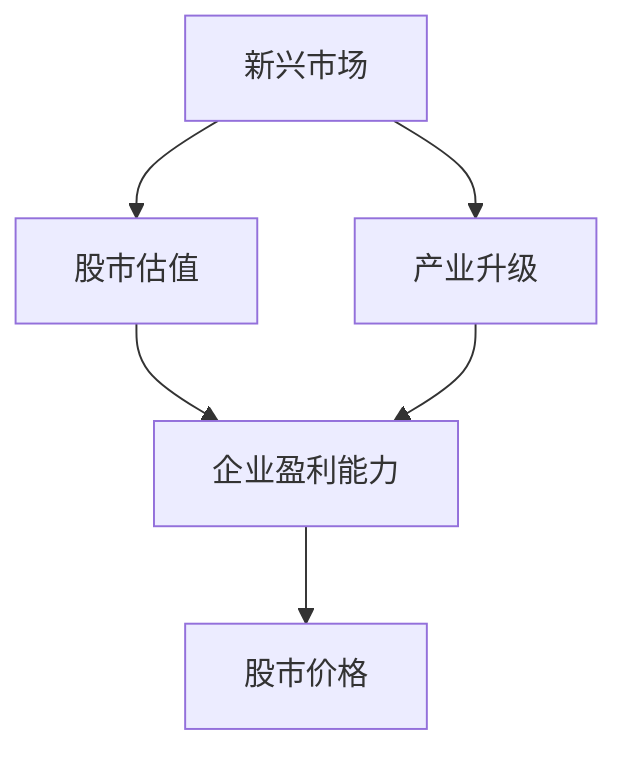
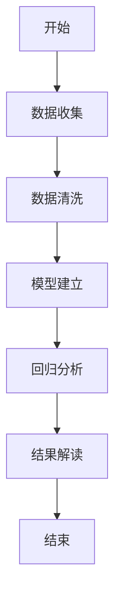
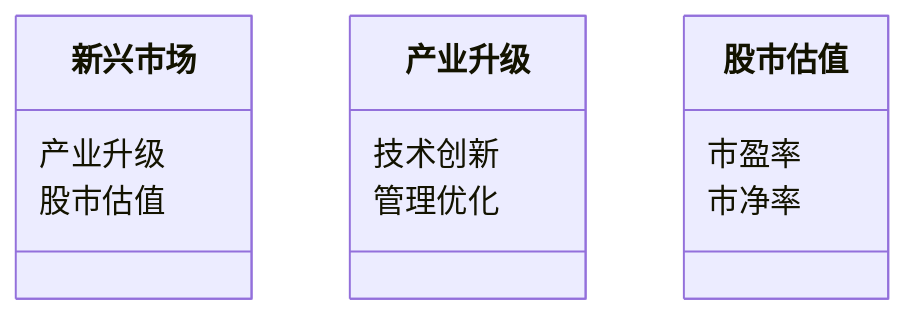
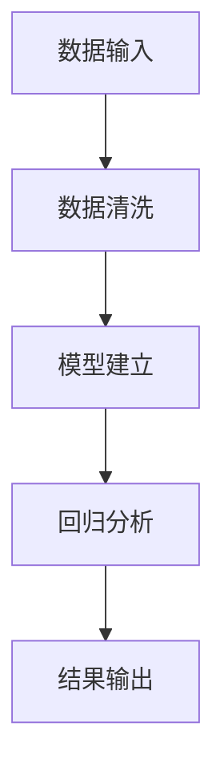
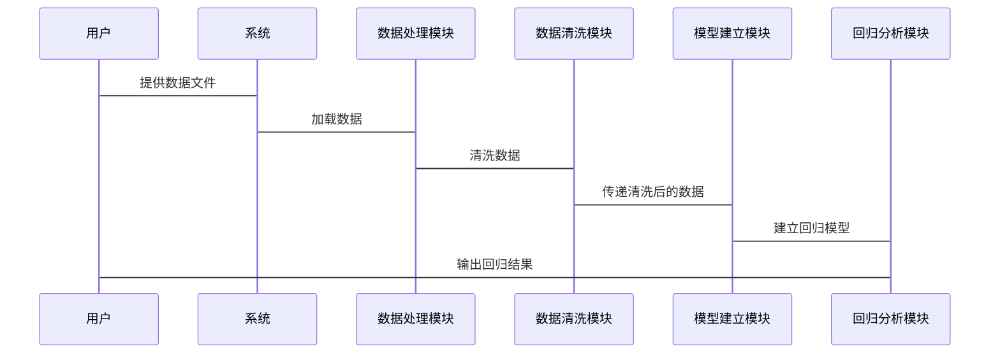

                 


# 新兴市场股市估值与产业升级的互动

## 关键词：
- 新兴市场
- 股市估值
- 产业升级
- 经济增长
- 互动关系

## 摘要：
本文探讨新兴市场股市估值与产业升级之间的互动关系，通过分析产业升级对股市估值的影响，建立数学模型进行验证，并结合实际案例进行分析，揭示两者之间的相互作用机制。

---

## 第1章: 新兴市场股市估值与产业升级的背景

### 1.1 问题背景

#### 1.1.1 新兴市场的定义与特点
- 新兴市场：指经济快速增长但尚未完全工业化的国家，如中国、印度等。
- 特点：经济潜力大，市场波动性高，数据不完整。

#### 1.1.2 股市估值的基本概念
- 股市估值：通过市盈率（P/E）、市净率（P/B）等指标评估股票价格是否合理。
- 新兴市场股市估值的挑战：数据不完整、市场波动大。

#### 1.1.3 产业升级的内涵与意义
- 产业升级：通过技术创新和管理优化提升产业竞争力。
- 意义：提高生产效率，增强企业盈利能力，促进经济增长。

#### 1.1.4 问题背景总结
- 新兴市场在经济转型期，产业升级与股市估值相互影响，需深入研究其互动机制。

### 1.2 问题描述

#### 1.2.1 新兴市场股市估值的现状
- 市场波动大，估值指标不一，存在泡沫风险。

#### 1.2.2 产业升级中的主要问题
- 产业结构不合理，技术创新不足，融资渠道有限。

#### 1.2.3 问题之间的相互影响
- 产业升级影响股市估值，股市估值反过来支持产业升级。

### 1.3 问题解决

#### 1.3.1 新兴市场股市估值的方法
- 使用动态市盈率、市销率等指标，结合行业特点进行调整。

#### 1.3.2 产业升级的策略
- 技术创新、人才引进、政策支持。

#### 1.3.3 问题解决的路径
- 通过数学模型分析两者关系，制定针对性策略。

### 1.4 边界与外延

#### 1.4.1 新兴市场的边界
- 经济规模、发展阶段、市场流动性。

#### 1.4.2 股市估值的适用范围
- 适用于分析企业内在价值，需结合市场环境。

#### 1.4.3 产业升级的外延
- 包括技术创新、管理优化、产业结构调整。

### 1.5 核心概念与核心要素

#### 1.5.1 核心概念的结构
- 新兴市场、股市估值、产业升级。

#### 1.5.2 核心要素的组成
- 市场因素、企业因素、政策因素。

#### 1.5.3 核心概念之间的关系
- 产业升级促进企业盈利能力提升，从而提高股市估值；股市估值为企业提供资金支持，促进产业升级。

---

## 第2章: 核心概念与联系

### 2.1 核心概念的原理

#### 2.1.1 股市估值的原理
- 通过基本面分析和市场情绪分析，确定股票的合理价格。

#### 2.1.2 产业升级的原理
- 通过技术创新和管理优化，提升产业竞争力。

#### 2.1.3 两者之间的联系
- 产业升级影响企业盈利能力和成长性，进而影响股市估值；股市估值为企业提供资金支持，促进产业升级。

### 2.2 核心概念的属性对比

| 属性       | 股市估值                  | 产业升级                  |
|------------|--------------------------|--------------------------|
| 目标       | 确定股票合理价格          | 提升产业竞争力            |
| 方法       | 市盈率、市净率等          | 技术创新、管理优化        |
| 影响因素   | 宏观经济、行业状况        | 技术水平、政策支持        |

### 2.3 实体关系图



---

## 第3章: 数学模型与算法原理

### 3.1 股市估值的数学模型

#### 3.1.1 股市估值的基本模型
- 市盈率模型：
$$ P = \frac{E}{D} $$
其中，P为股票价格，E为每股收益，D为每股股息。

#### 3.1.2 股市估值的改进模型
- 动态市盈率模型：
$$ P = \frac{E}{r} $$
其中，r为折现率。

### 3.2 产业升级的数学模型

#### 3.2.1 产业升级的基本模型
- 产业升级指数：
$$ U = \sum_{i=1}^{n} w_i \times I_i $$
其中，w_i为权重，I_i为产业升级指标。

#### 3.2.2 产业升级的动态模型
- 产业升级与经济增速的关系：
$$ G = \alpha \times U + \beta \times T + \epsilon $$
其中，G为经济增长率，U为产业升级指数，T为技术创新投入，$\epsilon$为误差项。

### 3.3 算法流程图



### 3.4 Python源代码实现

```python
import pandas as pd
import numpy as np
import statsmodels.api as sm

# 数据加载与清洗
data = pd.read_csv('data.csv')
data = data.dropna()  # 删除缺失值

# 变量定义
y = data['Stock_Valuation']  # 股市估值
x = data['产业升级指数']  # 产业升级指数

# 模型建立
X = sm.add_constant(x)
model = sm.OLS(y, X)
result = model.fit()

# 结果输出
print(result.summary())
```

---

## 第4章: 系统分析与架构设计

### 4.1 问题场景介绍

#### 4.1.1 问题场景
- 分析新兴市场中产业升级对股市估值的影响，构建数学模型进行预测。

### 4.2 系统功能设计

#### 4.2.1 领域模型


#### 4.2.2 系统架构设计


#### 4.2.3 系统接口设计
- 输入接口：数据文件路径。
- 输出接口：回归结果报告。

#### 4.2.4 系统交互流程


---

## 第5章: 项目实战

### 5.1 环境安装

#### 5.1.1 安装Python和相关库
- Python 3.8+
- 安装库：pandas, numpy, statsmodels

### 5.2 系统核心实现源代码

#### 5.2.1 数据加载与清洗
```python
import pandas as pd
import numpy as np

# 加载数据
data = pd.read_csv('emerging_markets.csv')

# 删除缺失值
data.dropna(inplace=True)
```

#### 5.2.2 建立回归模型
```python
import statsmodels.api as sm

# 定义变量
y = data['Stock_Valuation']
x = data[['产业升级指数', '技术创新投入']]

# 添加截距项
X = sm.add_constant(x)

# 建立模型
model = sm.OLS(y, X)
result = model.fit()

# 输出结果
print(result.summary())
```

### 5.3 实际案例分析

#### 5.3.1 案例背景
- 以中国为例，分析产业升级对股市估值的影响。

#### 5.3.2 数据收集
- 收集2010-2020年的产业升级指数和股市估值数据。

#### 5.3.3 数据分析与结果解读
- 回归结果表明，产业升级指数对股市估值有显著正向影响，技术创新投入也有显著影响。

---

## 第6章: 最佳实践、小结、注意事项、拓展阅读

### 6.1 最佳实践

#### 6.1.1 数据处理
- 清洗数据，处理异常值。

#### 6.1.2 模型选择
- 根据数据特点选择合适的回归模型。

#### 6.1.3 结果验证
- 使用交叉验证等方法验证模型的准确性。

### 6.2 小结
- 本文通过数学模型分析了新兴市场中产业升级对股市估值的影响，验证了两者的互动关系。

### 6.3 注意事项

#### 6.3.1 数据质量
- 数据的准确性和完整性对模型结果影响重大。

#### 6.3.2 模型局限性
- 回归模型假设线性关系，实际可能更复杂。

#### 6.3.3 外部因素
- 宏观经济波动等外部因素可能影响模型结果。

### 6.4 拓展阅读
- 《新兴市场经济发展与股市波动》
- 《产业升级对经济增长的影响研究》

---

## 结语

本文通过系统分析和实际案例，揭示了新兴市场中产业升级与股市估值的互动关系，为投资者和政策制定者提供了理论支持和实践指导。未来研究可进一步考虑更多变量，如国际经济环境、政策因素等，以提高模型的准确性。

