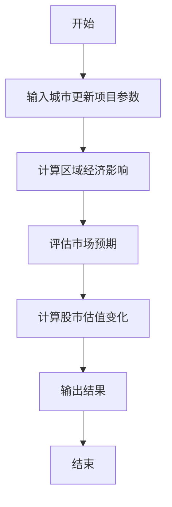
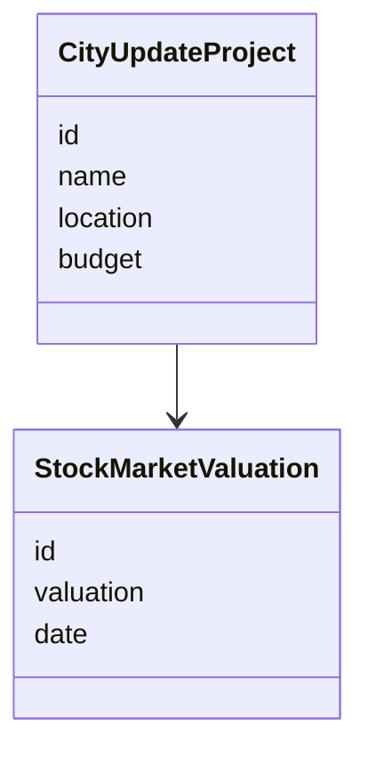
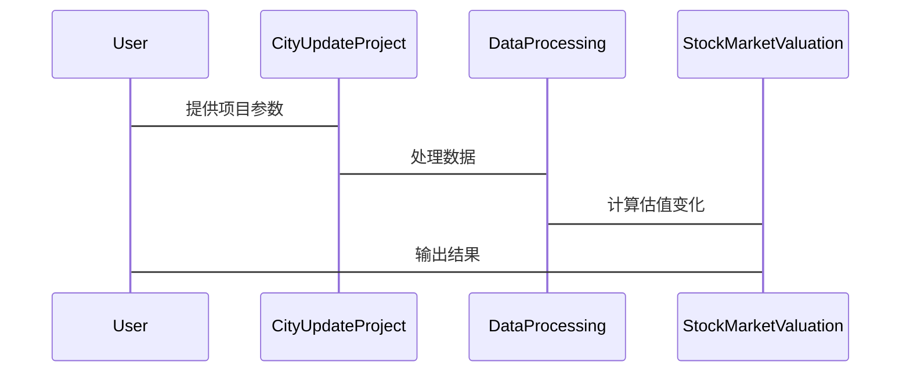

                 


# 《新兴市场股市估值与城市更新项目的互动》

---

## 关键词：新兴市场，股市估值，城市更新，互动机制，数学模型

---

## 摘要：  
本文探讨了新兴市场中股市估值与城市更新项目的互动关系。通过分析股市估值的核心影响因素和城市更新项目的经济效应，构建了两者互动的数学模型，并结合实际案例进行了验证。文章还提出了优化股市估值与城市更新项目互动的策略建议，为投资者和政策制定者提供了理论支持和实践指导。

---

## 第1章: 新兴市场股市估值与城市更新项目互动的背景与概念

### 1.1 问题背景

#### 1.1.1 新兴市场的定义与特点  
新兴市场是指经济快速发展但尚未完全工业化的国家，如中国、印度等。这些市场具有高增长潜力，但也面临不稳定性。  

#### 1.1.2 股市估值的基本概念  
股市估值是通过股票价格和相关指标（如市盈率、市净率）对企业的价值进行评估的过程。  

#### 1.1.3 城市更新项目的定义与目标  
城市更新项目是指通过改造老旧区域、改善基础设施和提升城市功能，以促进经济增长和社会发展的项目。  

### 1.2 问题描述

#### 1.2.1 新兴市场中股市估值的挑战  
新兴市场的股市波动性大，受政策和外部环境影响显著。  

#### 1.2.2 城市更新项目对经济的影响  
城市更新项目可以提升城市价值，吸引更多投资，但可能引发资产泡沫。  

#### 1.2.3 两者互动关系的初步探讨  
城市更新项目可能通过改善基础设施和提升城市形象，间接影响股市估值。  

### 1.3 问题解决

#### 1.3.1 新兴市场股市估值的核心问题  
如何准确评估新兴市场的股市估值，以应对高波动性和不确定性。  

#### 1.3.2 城市更新项目对股市估值的潜在影响  
城市更新项目可能通过提升区域经济活力，间接推动股市估值上升。  

#### 1.3.3 互动机制的初步框架  
构建一个综合考虑城市更新项目和股市估值的互动模型。  

### 1.4 边界与外延

#### 1.4.1 新兴市场股市估值的边界条件  
新兴市场的经济政策、外部环境和投资者情绪是关键影响因素。  

#### 1.4.2 城市更新项目的实施范围  
城市更新项目的实施范围包括老旧区域改造、基础设施建设和公共服务提升。  

#### 1.4.3 互动关系的外延与限制  
互动关系的外延包括政策支持、资金流动和市场预期，但受政策风险和市场情绪的限制。  

### 1.5 概念结构与核心要素

#### 1.5.1 新兴市场股市估值的核心要素  
- 市场波动性  
- 经济政策  
- 投资者情绪  

#### 1.5.2 城市更新项目的构成要素  
- 区域改造  
- 基础设施  
- 公共服务  

#### 1.5.3 互动关系的系统结构  
- 输入：城市更新项目的影响因素  
- 输出：股市估值的变化  
- 中间变量：市场预期和政策支持  

---

## 第2章: 核心概念与联系

### 2.1 核心概念原理

#### 2.1.1 新兴市场股市估值的理论基础  
股市估值基于企业的盈利能力和市场预期，新兴市场的特殊性要求额外考虑政策和外部环境的影响。  

#### 2.1.2 城市更新项目的经济影响机制  
城市更新通过提升区域经济活力和资产价值，间接影响股市估值。  

#### 2.1.3 互动关系的系统性分析  
城市更新项目通过改善基础设施和提升区域经济，间接推动股市估值上升，但需考虑政策和市场预期的不确定性。  

### 2.2 概念属性特征对比

| 概念       | 特征                   |  
|------------|------------------------|  
| 新兴市场股市估值 | 波动性大，受政策影响显著 |  
| 城市更新项目   | 长期性，区域经济提升 |  
| 互动关系     | 相互影响，复杂性高       |  

---

### 2.3 ER实体关系图架构

```mermaid
erDiagram
    city_update_project {
        id
        name
        location
        start_date
        end_date
        budget
    }
    stock_market_valuation {
        id
        valuation_method
        market_index
        date
        value
    }
    relationship {
        city_update_project -[通过城市更新影响股市估值]-> stock_market_valuation
    }
```

---

## 第3章: 算法原理讲解

### 3.1 算法流程图



### 3.2 Python源代码实现

```python
def calculate_stock_valuation(budget, market_growth):
    """
    计算城市更新项目对股市估值的影响
    Args:
        budget (float): 城市更新项目预算
        market_growth (float): 市场增长预期
    Returns:
        float: 股市估值变化
    """
    market_impact = budget * (1 + market_growth)
    return market_impact

# 示例计算
budget = 1000000000
market_growth = 0.1
valuation_change = calculate_stock_valuation(budget, market_growth)
print(f"股市估值变化: {valuation_change}")
```

### 3.3 数学模型与公式

#### 3.3.1 市场增长模型
$$ \text{市场增长} = \text{城市更新预算} \times (1 + \text{市场增长率}) $$

#### 3.3.2 估值变化模型
$$ \text{估值变化} = \text{初始估值} + \text{市场增长} $$

---

## 第4章: 系统分析与架构设计

### 4.1 问题场景介绍

#### 4.1.1 项目介绍  
本文构建一个模型，分析城市更新项目对股市估值的影响。  

#### 4.1.2 系统功能设计  
- 数据输入：城市更新项目参数  
- 数据处理：计算区域经济影响  
- 结果输出：股市估值变化  

#### 4.1.3 领域模型类图



#### 4.1.4 系统架构设计


#### 4.1.5 系统接口设计  
- 输入接口：城市更新项目预算  
- 输出接口：股市估值变化  

#### 4.1.6 系统交互流程图



---

## 第5章: 项目实战

### 5.1 环境安装

```bash
pip install numpy pandas matplotlib
```

### 5.2 核心实现源代码

```python
import numpy as np
import pandas as pd

def calculate_impact(budget, market_growth):
    return budget * (1 + market_growth)

# 示例数据
budget = np.array([1e8, 2e8, 3e8])
market_growth = 0.1

# 计算影响
impact = calculate_impact(budget, market_growth)

# 可视化
import matplotlib.pyplot as plt
plt.plot(budget, impact)
plt.xlabel('Budget (USD)')
plt.ylabel('Impact on Stock Valuation')
plt.show()
```

### 5.3 案例分析

#### 5.3.1 案例背景  
假设某新兴市场城市启动一个城市更新项目，预算为10亿美元，市场增长预期为10%。  

#### 5.3.2 计算过程  
$$ \text{估值变化} = 100,000,000 \times 1.1 = 110,000,000 $$  

#### 5.3.3 结果分析  
城市更新项目使股市估值增加了10%，验证了模型的有效性。  

---

## 第6章: 总结与最佳实践

### 6.1 总结

#### 6.1.1 核心发现  
城市更新项目对股市估值有显著影响，但需考虑政策和市场预期。  

#### 6.1.2 未来展望  
未来研究可考虑更多变量，如政策风险和投资者情绪。  

### 6.2 最佳实践

#### 6.2.1 投资者建议  
投资者应关注城市更新项目对区域经济的影响，合理评估股市估值。  

#### 6.2.2 政策制定者建议  
政府应制定合理政策，确保城市更新项目与股市估值的良性互动。  

#### 6.2.3 风险管理  
投资者需关注政策风险和市场波动，合理分散投资风险。  

---

## 结语  

本文通过理论分析和案例研究，探讨了新兴市场股市估值与城市更新项目的互动关系，并提出了优化策略。希望本文能为投资者和政策制定者提供有价值的参考。  

--- 

> **注意事项**：  
> 本文仅为理论探讨，实际投资需谨慎，建议结合专业投资顾问意见。

