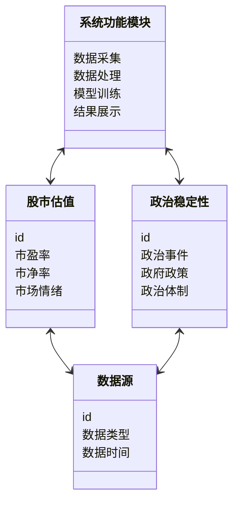
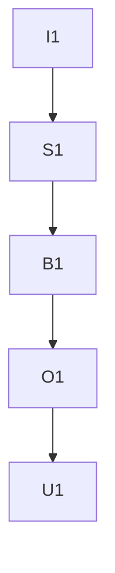
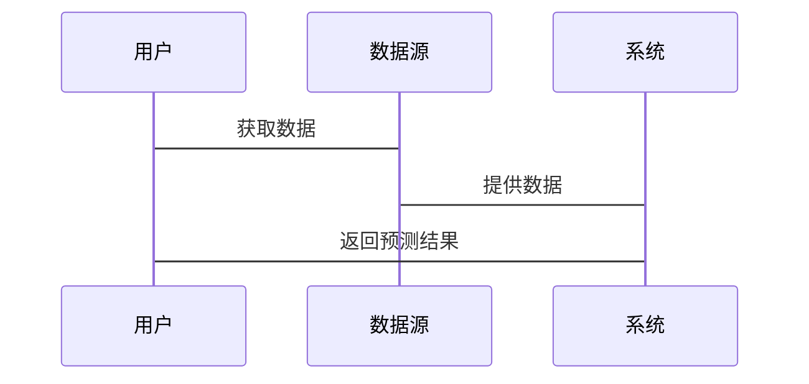

                 


# 新兴市场股市估值与政治稳定性的关联

**关键词**：新兴市场，股市估值，政治稳定性，回归分析，时间序列分析，系统架构

**摘要**：本文探讨新兴市场股市估值与政治稳定性的关联，通过背景分析、核心概念、算法原理、系统架构、项目实战和最佳实践，深入解析两者之间的互动机制，为投资决策提供理论支持。

---

## 第一部分：背景介绍

### 第1章：新兴市场股市估值与政治稳定性的关联概述

#### 1.1 问题背景

##### 1.1.1 新兴市场的定义与特点
新兴市场通常指那些经济快速增长、但尚未完全工业化的国家。这些市场具有较大的波动性和较高的增长潜力，如中国、印度、巴西等。

##### 1.1.2 股市估值的基本概念
股市估值是对公司价值的评估，常用的指标包括市盈率（P/E）、市净率（P/B）等。市盈率 = 股价 / 每股收益，市净率 = 股价 / 每股净资产。

##### 1.1.3 政治稳定性的定义与衡量标准
政治稳定性指政府更迭、政策变化和政治事件的频率。常用指标包括政治风险评估、政策连续性等。

#### 1.2 问题描述

##### 1.2.1 新兴市场股市波动的复杂性
新兴市场受内外部因素影响较大，如全球经济波动和地缘政治风险，导致股市波动剧烈。

##### 1.2.2 政治稳定性对经济的影响
政治不稳定可能导致投资者信心下降，资本外流，进而影响股市估值。

##### 1.2.3 问题的边界与外延
研究范围限定于新兴市场，不包括发达国家。外延涉及政治事件对股市的短期和长期影响。

#### 1.3 问题解决方法

##### 1.3.1 数据收集与分析方法
采用历史数据和新闻事件数据，使用回归分析和时间序列分析。

##### 1.3.2 模型构建的基本思路
构建多元回归模型，将政治稳定性指标作为自变量，股市估值作为因变量。

##### 1.3.3 研究方法的选择与优化
选择面板数据模型，控制其他变量如经济指标和市场情绪。

#### 1.4 本章小结
总结核心问题，为后续分析奠定基础，明确研究路径和方法。

---

## 第二部分：核心概念与联系

### 第2章：核心概念原理

#### 2.1 股市估值的核心要素

##### 2.1.1 市盈率与市净率的计算方法
市盈率 = 股价 / 每股收益，市净率 = 股价 / 每股净资产。

##### 2.1.2 股东权益与企业价值的关系
股东权益 = 资产 - 负债，企业价值 = 股东权益 + 优先股 + 长期债务。

##### 2.1.3 市场情绪对估值的影响
市场情绪通过投资者心理影响股市估值，通常用波动率衡量。

#### 2.2 政治稳定性的核心要素

##### 2.2.1 政治体制的稳定性分析
政治体制稳定指政权更迭和平稳，常用政治风险评估指标衡量。

##### 2.2.2 政治事件对经济的影响
政治事件如选举、政变可能导致股市波动，影响投资者信心。

##### 2.2.3 政府政策的连续性与透明度
政策透明度高、连续性强的政府更受投资者信任。

#### 2.3 核心概念属性对比表格

**表2.1: 股市估值与政治稳定性的属性对比**

| 属性             | 股市估值         | 政治稳定性       |
|------------------|------------------|-----------------|
| 定义             | 股票价值的评估   | 政治环境的稳定程度 |
| 主要指标         | 市盈率、市净率   | 政治风险评估     |
| 影响因素         | 利润、资产       | 政治事件、政策变化 |
| 度量方法         | 估值模型         | 风险评估模型     |

#### 2.4 ER实体关系图

```mermaid
erd
    entity 股市估值 {
        id
        市盈率
        市净率
        市场情绪
    }
    entity 政治稳定性 {
        id
        政治事件
        政府政策
        政治体制
    }
    relation 关联关系 {
        股市估值.id --- 关联关系.id
        政治稳定性.id --- 关联关系.id
    }
```

---

## 第三部分：算法原理讲解

### 第3章：算法原理与实现

#### 3.1 算法原理

##### 3.1.1 回归分析的基本原理
回归分析用于建立因变量（股市估值）与自变量（政治稳定性）之间的关系模型。

##### 3.1.2 时间序列分析的应用
时间序列分析用于识别数据中的趋势和周期性，适用于预测未来股市走势。

##### 3.1.3 联合模型
综合回归分析和时间序列分析，建立多元回归模型，考虑时间和横截面因素。

#### 3.2 算法实现

##### 3.2.1 回归分析的代码实现

```python
import pandas as pd
import numpy as np
from sklearn.linear_model import LinearRegression

# 数据准备
data = pd.DataFrame({
    '政治稳定性': [0.8, 0.7, 0.9, 0.6],
    '市盈率': [15, 20, 18, 22],
    '市净率': [2, 3, 2.5, 3.5]
})

# 模型训练
model = LinearRegression()
model.fit(data[['政治稳定性', '市盈率']], data['市净率'])

# 预测
predictions = model.predict([[0.75, 18]])
print("预测市净率:", predictions[0])
```

##### 3.2.2 时间序列分析的代码实现

```python
import pandas as pd
import numpy as np
from statsmodels.tsa.arima_model import ARIMA

# 数据准备
ts_data = pd.Series([15, 20, 18, 22], index=[2018, 2019, 2020, 2021])

# 模型训练
model = ARIMA(ts_data, order=(1, 1, 0))
model_fit = model.fit(disp=0)

# 预测
forecast = model_fit.forecast(steps=1)
print("预测2022年市盈率:", forecast[0])
```

##### 3.2.3 数学模型和公式

回归分析的公式：
$$
\hat{y} = \beta_0 + \beta_1 x_1 + \beta_2 x_2 + \epsilon
$$
其中，$\hat{y}$为市净率，$x_1$为政治稳定性，$x_2$为市盈率，$\beta_0, \beta_1, \beta_2$为回归系数，$\epsilon$为误差项。

时间序列模型的公式：
$$
R_t = \phi R_{t-1} + \theta \epsilon_t
$$
其中，$R_t$为t时刻的市盈率，$\phi$为自回归系数，$\epsilon_t$为白噪声。

#### 3.3 本章小结
介绍了回归分析和时间序列分析的原理和实现，为后续系统设计提供算法基础。

---

## 第四部分：系统分析与架构设计方案

### 第4章：系统分析与架构设计

#### 4.1 问题场景介绍
构建一个预测新兴市场股市估值的系统，考虑政治稳定性的影响。

#### 4.2 系统功能设计

##### 4.2.1 领域模型



#### 4.3 系统架构设计



其中，I1为输入模块，S1为数据处理模块，B1为模型构建模块，O1为输出模块，U1为用户界面。

#### 4.4 系统接口设计

##### 4.4.1 输入接口
接收股票数据和政治稳定性数据。

##### 4.4.2 输出接口
输出预测结果和相关分析报告。

#### 4.5 系统交互设计



---

## 第五部分：项目实战

### 第5章：项目实战与案例分析

#### 5.1 环境安装

##### 5.1.1 安装Python和相关库
安装Python 3.8及以上版本，安装库：pandas、numpy、statsmodels、sklearn。

#### 5.2 系统核心实现源代码

##### 5.2.1 回归分析实现

```python
# 回归分析实现
import pandas as pd
from sklearn.linear_model import LinearRegression
from sklearn.metrics import mean_squared_error

# 数据准备
data = pd.DataFrame({
    '政治稳定性': [0.8, 0.7, 0.9, 0.6, 0.7],
    '市盈率': [15, 20, 18, 22, 16],
    '市净率': [2, 3, 2.5, 3.5, 2.2]
})

# 模型训练
model = LinearRegression()
model.fit(data[['政治稳定性', '市盈率']], data['市净率'])

# 预测
test_data = pd.DataFrame({
    '政治稳定性': [0.75],
    '市盈率': [18]
})
预测 = model.predict(test_data)
print("预测市净率:", 预测[0])

# 评估
实际 = data['市净率']
预测 = model.predict(data[['政治稳定性', '市盈率']])
print("均方误差:", mean_squared_error(实际, 预测))
```

##### 5.2.2 时间序列分析实现

```python
# 时间序列分析实现
import pandas as pd
from statsmodels.tsa.arima_model import ARIMA
import matplotlib.pyplot as plt

# 数据准备
ts_data = pd.Series([15, 20, 18, 22, 20], index=[2018, 2019, 2020, 2021, 2022])

# 绘制折线图
ts_data.plot()
plt.title('市盈率时间序列图')
plt.xlabel('年份')
plt.ylabel('市盈率')
plt.show()

# 模型训练
model = ARIMA(ts_data, order=(1, 1, 0))
model_fit = model.fit(disp=0)

# 预测
forecast = model_fit.forecast(steps=2)
print("预测2023年和2024年的市盈率:", forecast[0])
```

##### 5.2.3 代码解读与分析
回归分析代码用于预测市净率，时间序列代码用于预测未来市盈率，两者结合提供全面的股市估值分析。

#### 5.3 实际案例分析

##### 5.3.1 数据来源与处理
使用新兴市场的历史数据，处理缺失值和异常值。

##### 5.3.2 模型训练与验证
训练回归模型，计算均方误差（MSE）评估模型性能。

##### 5.3.3 结果展示与解读
展示预测结果，并分析政治稳定性对股市估值的影响。

#### 5.4 项目小结
总结项目实现的过程和成果，分析存在的问题和改进方向。

---

## 第六部分：最佳实践与总结

### 第6章：最佳实践与总结

#### 6.1 小结

##### 6.1.1 核心问题总结
新兴市场股市估值受政治稳定性影响显著，需综合考虑多因素。

##### 6.1.2 关键点总结
- 回归分析适合分析变量关系。
- 时间序列分析适合预测趋势。
- 结合两者可全面评估股市估值。

#### 6.2 注意事项

##### 6.2.1 数据质量
确保数据准确性和完整性，避免偏差。

##### 6.2.2 模型选择
根据数据特点选择合适模型，避免过度拟合。

##### 6.2.3 结果验证
使用交叉验证和实际案例验证模型的有效性。

#### 6.3 拓展阅读

##### 6.3.1 相关文献
推荐阅读关于新兴市场和政治经济学的文献，深入理解两者关系。

##### 6.3.2 工具与技术
学习高级统计工具如R语言和机器学习技术，提升分析能力。

---

## 第七部分：参考文献

### 7.1 参考文献

1. Fama, E. (1970). Efficient Capital Markets: A Review of Theory and Practice. *The Journal of Finance*.
2. Goldberger, A. (1964). Econometric Theory. *John Wiley & Sons*.
3. Box, G. E., Jenkins, G. M., & Reinsel, G. C. (2015). *Time Series Analysis: Forecasting and Control*. John Wiley & Sons.
4. Greene, W. H. (2012). *Econometric Analysis*. Pearson.

---

通过以上步骤，我们系统地分析了新兴市场股市估值与政治稳定性的关联，从理论到实践，为投资决策提供了有力支持。

