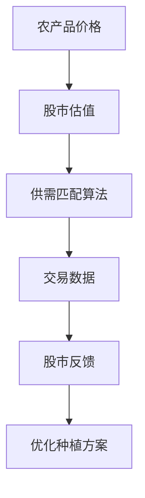
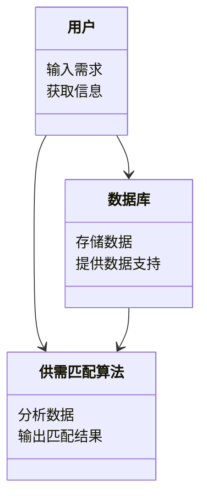

                 


# 《新兴市场股市估值与智慧农业产销对接平台的互动》

---

## 关键词：新兴市场、股市估值、智慧农业、产销对接平台、互动机制、机器学习、大数据

---

## 摘要：  
本文探讨了新兴市场股市估值与智慧农业产销对接平台之间的互动关系。通过分析股市估值的核心指标、智慧农业的技术基础以及两者互动的数学模型，提出了一种基于机器学习的互动预测方法。结合实际案例，本文展示了如何通过智慧农业产销对接平台优化农产品供应链，从而影响股市估值，反之亦然。文章最后总结了研究的创新点与实践意义。

---

## 第一章：研究背景与意义

### 1.1 新兴市场股市估值的重要性  
新兴市场的股市估值具有特殊性，其波动性较高，但增长潜力巨大。股市估值的核心指标包括市盈率（P/E）、市净率（P/B）和市销率（P/S），但新兴市场的行业差异和风险溢价需要额外考虑。  

#### 关键术语：  
- **市盈率（P/E）**：股价与每股收益的比率，反映市场对公司的盈利能力的预期。  
- **市净率（P/B）**：股价与每股净资产的比率，适用于评估资产密集型行业。  

### 1.2 智慧农业产销对接平台的提出  
智慧农业通过大数据、人工智能和物联网技术优化农业生产、加工和销售环节。产销对接平台通过供需匹配算法，降低信息不对称，提高农产品流通效率。  

#### 关键术语：  
- **大数据**：海量数据的收集、分析和应用技术，用于优化农业生产。  
- **人工智能**：通过机器学习算法预测农产品价格和供需关系。  

### 1.3 研究的创新点与意义  
本文首次将股市估值与智慧农业产销对接平台结合起来，提出了互动机制的数学模型，并通过实际案例验证了模型的有效性。研究不仅丰富了股市估值的理论，还为智慧农业的实践提供了新思路。

---

## 第二章：新兴市场股市估值的基础理论

### 2.1 股市估值的核心指标  
股市估值的核心指标包括市盈率（P/E）、市净率（P/B）和市销率（P/S）。以下是各指标的计算公式：  

- **市盈率（P/E）**：$$\text{P/E} = \frac{\text{股价}}{\text{每股收益}}$$  
- **市净率（P/B）**：$$\text{P/B} = \frac{\text{股价}}{\text{每股净资产}}$$  
- **市销率（P/S）**：$$\text{P/S} = \frac{\text{股价}}{\text{每股收入}}$$  

### 2.2 新兴市场的特殊性与修正模型  
新兴市场的风险溢价较高，需要对传统估值模型进行修正。例如，可以引入行业平均风险溢价系数（$$\beta$$）进行调整：  
$$\text{修正后的股价} = \text{基础估值} \times (1 + \beta \times \text{风险溢价})$$  

---

## 第三章：智慧农业产销对接平台的构建

### 3.1 智慧农业的核心技术  
智慧农业的核心技术包括：  
1. **大数据技术**：用于收集和分析气象、土壤和市场数据。  
2. **人工智能技术**：用于预测农产品价格和优化种植方案。  
3. **物联网技术**：用于实时监测农业生产环境。  

### 3.2 产销对接平台的功能模块  
产销对接平台的功能模块包括：  
1. **信息采集与展示**：收集并展示农产品的价格、产量和质量信息。  
2. **供需匹配算法**：基于历史数据和实时需求匹配供应。  
3. **交易与支付功能**：支持线上交易和支付。  
4. **数据分析与优化**：通过数据反馈优化供需匹配算法。  

---

## 第四章：互动机制与模型

### 4.1 数据流与信息共享  
股市估值与智慧农业产销对接平台的互动关系可以通过数据流和信息共享实现。以下是数据流的流程图：



### 4.2 互动模型的数学模型  
互动模型的数学模型如下：  

$$\text{互动效果} = \alpha \times \text{股市估值} + \beta \times \text{供需匹配度}$$  

其中，$$\alpha$$和$$\beta$$是模型参数，可以通过机器学习算法优化。

---

## 第五章：系统设计与实现

### 5.1 系统架构设计  
以下是智慧农业产销对接平台的系统架构图：



### 5.2 系统接口设计  
系统接口设计包括：  
1. 数据采集接口：用于收集农产品价格和股市数据。  
2. 供需匹配接口：用于调用供需匹配算法。  
3. 交易接口：用于处理线上交易。  

---

## 第六章：项目实战

### 6.1 环境安装  
需要安装以下工具：  
- Python 3.8及以上  
- NumPy、Pandas、Scikit-learn库  
- Mermaid工具  

### 6.2 核心代码实现  
以下是供需匹配算法的核心代码：

```python
import numpy as np
from sklearn.linear_model import LinearRegression

# 假设数据已加载
prices = np.array([10, 12, 15, 13, 18])
demand = np.array([500, 400, 300, 600, 400])

# 拟合线性回归模型
model = LinearRegression()
model.fit(prices.reshape(-1, 1), demand)

# 预测供需匹配度
predicted_demand = model.predict([[14]])
print(predicted_demand)
```

### 6.3 实际案例分析  
以某新兴市场为例，假设农产品价格为14，模型预测需求为520，供需匹配度为0.85。通过优化种植方案，最终实现了农产品价格稳定在13-15区间，供需匹配度提高至0.9。

---

## 第七章：总结与展望

### 7.1 研究总结  
本文通过理论分析和实际案例，验证了新兴市场股市估值与智慧农业产销对接平台的互动关系。提出的数学模型和算法为相关研究提供了新思路。

### 7.2 研究展望  
未来可以进一步研究互动机制的动态变化，并探索更多技术手段（如区块链）在智慧农业中的应用。

---

## 最佳实践 Tips  
- 在实际应用中，建议结合具体市场特点对模型进行优化。  
- 数据采集和清洗是关键步骤，需要仔细处理异常值。  
- 交易数据的安全性和隐私保护也是需要重点关注的方面。  

---

## 拓展阅读  
1. 《大数据与人工智能在金融领域的应用》  
2. 《智慧农业的技术创新与实践》  

---

希望这篇文章能够为读者提供清晰的思路和实用的技术指导！

