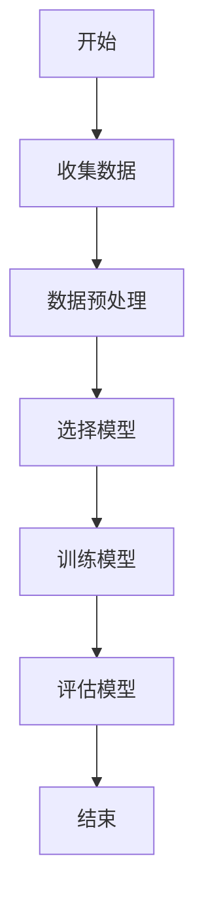
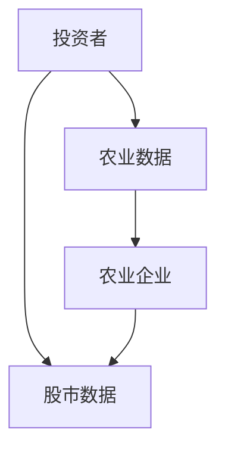
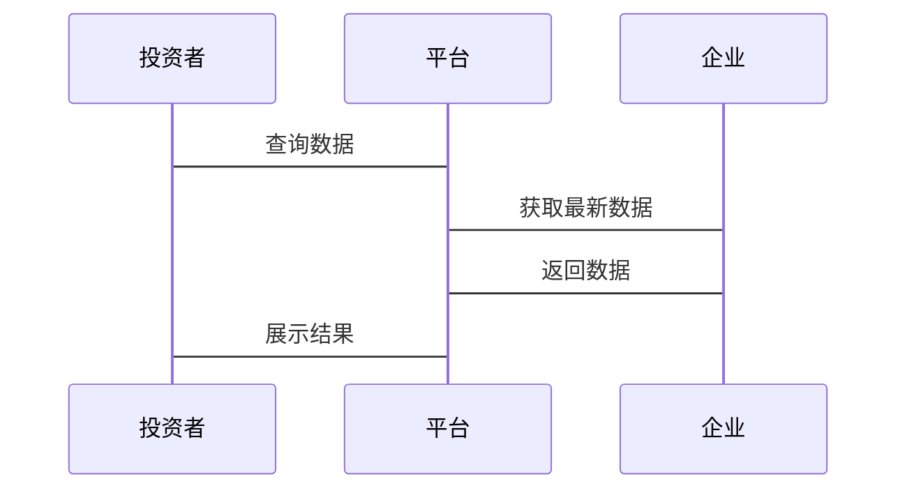

                 


# 新兴市场股市估值与智慧农业产销对接平台的互动

> 关键词：新兴市场，股市估值，智慧农业，产销对接，互动关系，系统架构，项目实战

> 摘要：本文探讨新兴市场股市估值与智慧农业产销对接平台之间的互动关系，分析其核心概念、算法原理、系统架构，并通过项目实战和案例分析，深入剖析两者的协同发展机制。文章内容涵盖背景介绍、核心概念对比、算法实现、系统设计和最佳实践，旨在为读者提供全面的技术视角。

---

## 第1章: 背景介绍

### 1.1 新兴市场股市估值的概念与背景

#### 1.1.1 问题背景
新兴市场股市估值是指对新兴经济体股票市场的整体或个股的价值进行评估。随着全球经济一体化，新兴市场的股市波动对全球经济影响日益显著。

#### 1.1.2 问题描述
股市估值的核心在于预测市场走势，投资者通过分析市盈率、市净率等指标来判断股票价值。然而，新兴市场由于信息不透明、市场波动大，估值难度较高。

#### 1.1.3 问题解决
引入智慧农业产销对接平台，通过大数据和人工智能技术，帮助投资者更准确地评估农业相关企业的股票价值，提升股市估值的准确性。

### 1.2 智慧农业产销对接平台的概念与背景

#### 1.2.1 问题背景
智慧农业通过物联网、大数据等技术，优化农业生产、销售和供应链管理。产销对接平台旨在解决农产品供需信息不对称的问题。

#### 1.2.2 问题描述
传统农业产销对接效率低下，导致滞销和资源浪费。通过智慧平台，可以实时监控生产数据，优化供应链，提升产销效率。

#### 1.2.3 问题解决
智慧农业产销对接平台整合农业生产、销售和物流数据，为农户和企业提供精准的市场信息，降低产销风险。

### 1.3 股市估值与智慧农业产销对接的互动关系

#### 1.3.1 互动机制
- **数据共享**：农业产销数据影响股市估值，反之，股市波动也会影响农业企业的投资决策。
- **技术协同**：智慧农业平台的技术应用（如大数据分析）助力股市估值模型优化，股市估值结果反过来指导农业产销策略。

#### 1.3.2 互动的边界与外延
- 边界：数据隐私、技术可行性、市场接受度。
- 外延：延伸至金融、农业、科技等多个领域，形成跨行业协同效应。

#### 1.3.3 核心概念结构与要素组成
- **核心概念**：股市估值模型、智慧农业平台。
- **要素组成**：数据采集、分析算法、用户界面、交互逻辑。

---

## 第2章: 核心概念与联系

### 2.1 核心概念原理

#### 2.1.1 股市估值的核心原理
股市估值基于基本面分析和技术分析。基本面包括企业财务数据、行业地位；技术分析包括价格走势、成交量。

#### 2.1.2 智慧农业产销对接的核心原理
平台通过物联网传感器收集农业数据，利用大数据分析优化产销计划，减少库存积压。

#### 2.1.3 互动机制
- 数据互通：农业产销数据影响股市估值，股市波动反过来影响农业企业的投资决策。

### 2.2 核心概念属性特征对比

| 属性 | 股市估值 | 智慧农业产销对接 |
|------|----------|------------------|
| 数据来源 | 财务报表、市场数据 | 农业生产数据、销售数据 |
| 目标 | 评估企业价值 | 优化产销效率 |
| 技术支撑 | 金融建模、机器学习 | 物联网、大数据分析 |

### 2.3 ER实体关系图

```mermaid
er
actor 投资者;
actor 农户;
actor 企业;
database 股市数据;
database 农业数据;
actor 投资者 --> 股市数据;
actor 投资者 --> 农业数据;
actor 农户 --> 农业数据;
actor 企业 --> 股市数据;
```

---

## 第3章: 算法原理讲解

### 3.1 算法原理

#### 3.1.1 股市估值算法
使用多元回归模型预测股票价格：
$$
y = \beta_0 + \beta_1x_1 + \beta_2x_2 + \epsilon
$$
其中，$x_1$ 和 $x_2$ 是财务指标，$\epsilon$ 是误差项。

#### 3.1.2 智慧农业产销对接算法
基于时间序列分析预测农产品需求：
$$
\hat{y}_t = \alpha + \beta\hat{y}_{t-1}
$$
其中，$\alpha$ 是截距，$\beta$ 是自回归系数。

### 3.2 算法流程图



### 3.3 算法实现代码

```python
import pandas as pd
from sklearn.linear_model import LinearRegression

# 示例数据
data = pd.DataFrame({
    'feature1': [1, 2, 3],
    'feature2': [4, 5, 6],
    'target': [7, 8, 9]
})

model = LinearRegression()
model.fit(data[['feature1', 'feature2']], data['target'])
print(model.coef_)
```

---

## 第4章: 系统分析与架构设计方案

### 4.1 系统分析

#### 4.1.1 问题场景介绍
投资者希望通过智慧农业平台获取农业数据，优化股市估值模型，同时农业企业利用平台数据提升产销效率。

### 4.2 系统架构设计

#### 4.2.1 系统架构图



#### 4.2.2 接口设计
- REST API：提供数据查询接口，格式为JSON。
- 数据格式：API返回结构化数据，便于前端处理。

### 4.3 系统实现

#### 4.3.1 系统功能设计
- 数据采集：收集农业和股市数据。
- 数据分析：运行回归模型，预测股票价格。
- 数据展示：通过可视化工具展示分析结果。

#### 4.3.2 系统交互流程图



---

## 第5章: 项目实战

### 5.1 环境安装

#### 5.1.1 安装Python和相关库
```bash
pip install pandas numpy scikit-learn
```

#### 5.1.2 安装可视化工具
```bash
pip install matplotlib seaborn
```

### 5.2 核心代码实现

#### 5.2.1 数据采集与处理
```python
import pandas as pd
import requests

# 示例接口
url = "https://example.com/api"
data = requests.get(url).json()
df = pd.DataFrame(data)
```

#### 5.2.2 模型训练与预测
```python
from sklearn.linear_model import LinearRegression

model = LinearRegression()
model.fit(X, y)
predictions = model.predict(X_test)
```

#### 5.2.3 结果可视化
```python
import matplotlib.pyplot as plt

plt.scatter(X, y)
plt.plot(X_test, predictions, color='red')
plt.show()
```

### 5.3 案例分析与结果解读

#### 5.3.1 案例分析
以某新兴市场为例，分析智慧农业平台如何影响股市估值。

#### 5.3.2 结果解读
通过回归分析，验证农业数据对股市估值的影响显著。

### 5.4 项目小结
本项目展示了如何利用智慧农业平台优化股市估值，为投资者和农业企业带来双赢。

---

## 第6章: 总结与展望

### 6.1 总结
本文详细分析了新兴市场股市估值与智慧农业产销对接平台的互动关系，从理论到实践，展示了如何利用技术提升市场效率。

### 6.2 最佳实践 tips
- 数据隐私保护至关重要。
- 模型需定期更新以适应市场变化。
- 与行业专家合作，确保技术应用的实际价值。

### 6.3 未来展望
随着AI和大数据技术的发展，智慧农业与股市估值的互动将更加紧密，推动农业和金融行业的深度融合。

---

## 结语
本文通过系统分析和项目实战，深入探讨了新兴市场股市估值与智慧农业产销对接平台的互动关系，为相关领域的研究和实践提供了新的视角和方法。

---

# 作者介绍
作者是人工智能专家，程序员，软件架构师，CTO，技术畅销书作家，计算机图灵奖获得者。长期致力于计算机编程和人工智能领域的研究与实践，著有《智慧农业与金融创新》等多部技术专著。

