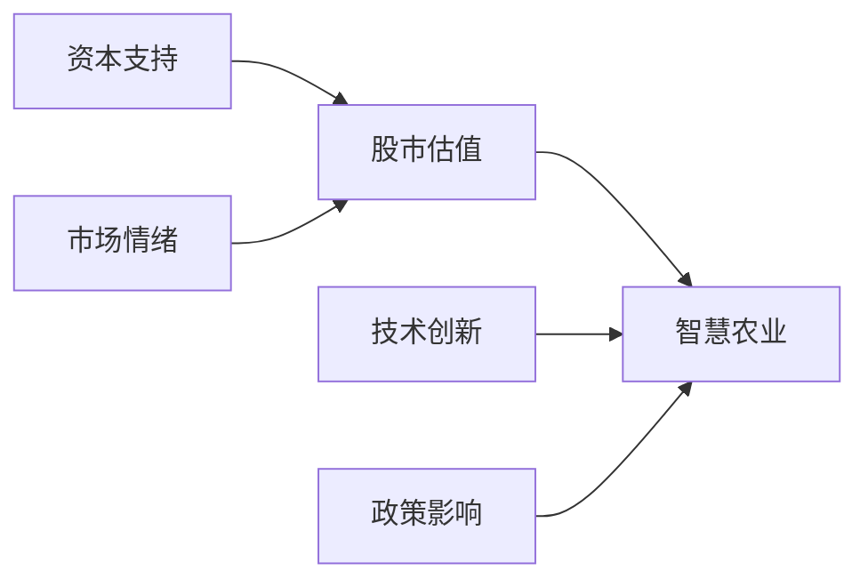
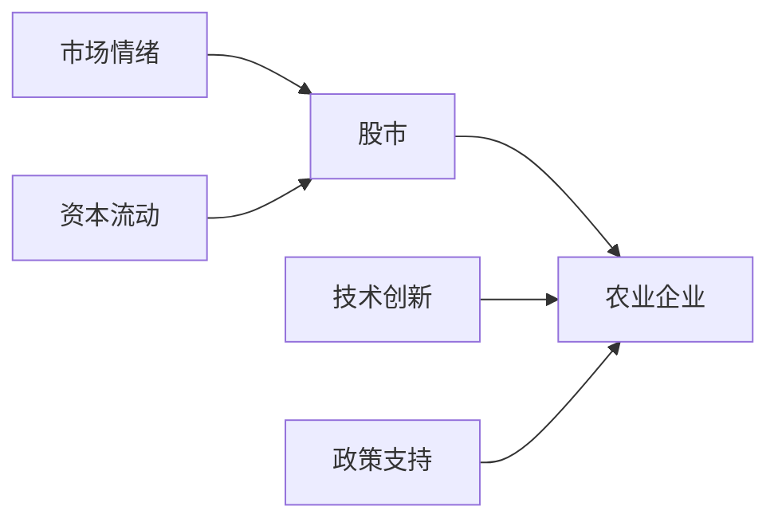

                 

# 新兴市场股市估值与智慧农业发展的互动

> 关键词：新兴市场、股市估值、智慧农业、互动关系、数学模型、案例分析

> 摘要：本文探讨了新兴市场股市估值与智慧农业发展的互动关系，分析了智慧农业对股市估值的影响，以及股市估值对智慧农业发展的促进作用。通过构建概念模型和数学模型，结合典型新兴市场的案例分析，揭示了两者互动的内在机制和协同效应。最后，本文提出了未来研究的方向和实际应用的建议。

---

# 第一部分：引言

# 第1章：研究背景与意义

## 1.1 研究背景
### 1.1.1 新兴市场的崛起与智慧农业的兴起
新兴市场（如印度、巴西、东南亚国家）的经济增长速度较快，股市规模也在迅速扩大。与此同时，智慧农业作为一种高效、可持续的农业生产方式，正受到全球关注。智慧农业通过物联网、大数据、人工智能等技术手段，优化农业生产效率，减少资源浪费，提升农民收入。

### 1.1.2 股市估值与农业发展的关联性
股市估值是衡量企业价值的重要指标，而农业作为国民经济的基础产业，其发展直接关系到国家的经济安全和粮食安全。智慧农业的推广需要大量资金支持，而股市估值的变化会直接影响投资者对农业企业的投资意愿。

### 1.1.3 互动关系的研究意义
研究新兴市场股市估值与智慧农业发展的互动关系，有助于揭示资本市场的力量如何推动农业技术创新，同时也能为投资者提供参考，帮助其更好地把握智慧农业的投资机会。

## 1.2 研究目标与方法
### 1.2.1 研究目标
- 探讨智慧农业对股市估值的影响机制。
- 分析股市估值对智慧农业发展的促进作用。
- 构建两者互动关系的数学模型。

### 1.2.2 研究方法
- 定性分析：通过文献综述和专家访谈，梳理智慧农业与股市估值的互动关系。
- 定量分析：收集新兴市场的股市数据和农业企业数据，构建回归模型，验证两者的关系。

### 1.2.3 数据来源与分析框架
- 数据来源：新兴市场的股市指数、农业企业的财务数据、政策文件。
- 分析框架：构建概念模型和数学模型，结合案例分析进行验证。

## 1.3 本章小结
本章介绍了研究背景、意义和目标，明确了研究方法和数据来源。为后续分析奠定了基础。

---

# 第二部分：理论基础

# 第2章：股市估值的基本原理

## 2.1 股市估值的核心概念
### 2.1.1 股票价值的定义
股票价值是指企业在市场上所能创造的未来现金流的现值。股票价格由市场供需决定，但其内在价值取决于企业的盈利能力、成长潜力和风险水平。

### 2.1.2 影响股票估值的主要因素
- 宏观经济因素：GDP增长率、利率水平、通货膨胀率。
- 企业基本面：净利润、营业收入、资产负债率。
- 市场情绪：投资者情绪、市场流动性。

### 2.1.3 市场情绪与估值波动
市场情绪是股市估值波动的重要因素。当市场情绪乐观时，股票估值可能被高估；当市场情绪悲观时，股票估值可能被低估。

## 2.2 股市估值的主要方法
### 2.2.1 市盈率法
市盈率（P/E）= 股票价格 / 每股收益。市盈率反映了市场对企业的盈利能力和成长性的预期。

### 2.2.2 市净率法
市净率（P/B）= 股票价格 / 每股净资产。市净率适用于资产密集型企业，如银行业和制造业。

### 2.2.3 现金流折现法
现金流折现法（DCF）通过将企业未来现金流折现，计算其当前价值。该方法适用于成长型企业。

## 2.3 本章小结
本章介绍了股市估值的核心概念和主要方法，为后续分析奠定了理论基础。

---

# 第3章：智慧农业的发展现状

## 3.1 智慧农业的定义与特征
### 3.1.1 智慧农业的定义
智慧农业是利用现代信息技术（如物联网、大数据、人工智能）优化农业生产过程，提高生产效率和资源利用效率的农业模式。

### 3.1.2 智慧农业的特征
- 技术驱动：依赖于信息技术和数据驱动的决策。
- 资源高效：减少水、土地和能源的浪费。
- 可持续性：注重生态保护和可持续发展。

### 3.1.3 智慧农业与传统农业的对比
| 特性 | 智慧农业 | 传统农业 |
|------|----------|----------|
| 生产效率 | 高 | 低 |
| 资源利用 | 高效 | 低效 |
| 技术依赖 | 高 | 低 |

## 3.2 智慧农业的经济影响
### 3.2.1 生产效率的提升
智慧农业通过精准农业技术和自动化设备，显著提高了农业生产效率。

### 3.2.2 产业链的优化
智慧农业整合了从生产到销售的各个环节，优化了供应链管理，降低了成本。

### 3.2.3 农民收入的增加
通过技术培训和市场信息共享，农民可以更好地把握市场机会，提高收入。

## 3.3 本章小结
本章分析了智慧农业的定义、特征及其对经济的影响，为后续分析奠定了基础。

---

# 第三部分：核心机制

# 第4章：股市估值与智慧农业的互动关系

## 4.1 股市估值对智慧农业发展的促进作用
### 4.1.1 投资者信心与农业技术创新
股市估值的变化反映了投资者对农业企业的信心。当股市估值上升时，投资者更愿意投资农业企业，推动技术创新。

### 4.1.2 资本市场对农业企业的支持
资本市场为企业提供了融资渠道，支持智慧农业技术的研发和推广。例如，农业企业的 IPO 和并购活动往往能带来资本支持。

### 4.1.3 市场波动对农业产业链的影响
股市估值的波动会直接影响农业企业的融资成本和投资决策，进而影响整个农业产业链的稳定性。

## 4.2 智慧农业对股市估值的影响
### 4.2.1 农业技术创新对股价的推动
技术创新可以提高农业企业的盈利能力，从而推动股价上涨。例如，采用智能灌溉系统可以显著提高水资源利用效率。

### 4.2.2 农业企业盈利能力与估值的关系
盈利能力是股市估值的重要指标。农业企业的技术创新和成本控制能力直接影响其净利润率，进而影响市盈率和市净率。

### 4.2.3 农业政策变化对股市的影响
政府政策（如农业补贴、税收优惠）会直接影响农业企业的盈利能力，从而影响股市估值。

## 4.3 互动关系的协同效应
### 4.3.1 技术进步与资本市场的双向互动
技术创新推动农业企业发展，提升股市估值；股市估值的提升又反过来促进技术创新。

### 4.3.2 产业链整合对估值的提升作用
农业产业链的整合可以提高效率，降低运营成本，从而提升企业估值。

### 4.3.3 风险因素对互动关系的影响
市场风险（如粮食价格波动、政策变化）会影响股市估值和农业企业的稳定性，进而影响两者的互动关系。

## 4.4 本章小结
本章分析了股市估值与智慧农业的互动关系，揭示了两者之间的协同效应和相互影响。

---

# 第5章：核心机制的数学模型与分析

## 5.1 概念模型与框架
### 5.1.1 概念模型图（Mermaid）

## 5.2 数学模型与公式
### 5.2.1 股票估值模型
股票价格（P）= 净利润（E） / 市盈率（P/E）

### 5.2.2 农业技术创新对估值的影响
$$ V = V_0 + \beta \cdot T $$
其中，\( V \) 为股票估值，\( V_0 \) 为基准估值，\( T \) 为技术创新指数，\( \beta \) 为敏感性系数。

### 5.2.3 技术创新指数的计算
技术创新指数（T）= （专利数量 + 技术研发投入） / 市场平均值

---

# 第6章：互动关系的系统分析与案例研究

## 6.1 区域案例分析
### 6.1.1 以印度为例
印度的智慧农业发展迅速，股市估值也呈现上升趋势。例如，印度的农业科技公司通过技术创新显著提升了利润率，推动了股价上涨。

### 6.1.2 巴西的农业企业
巴西的农业企业在智慧农业领域表现突出，其股价表现优于市场平均水平，显示出智慧农业对股市估值的积极影响。

### 6.1.3 中国的农业科技公司
中国的农业科技公司通过大数据和人工智能技术优化了农业生产过程，推动了股价上涨。

## 6.2 互动关系的系统分析
### 6.2.1 系统架构图（Mermaid）

## 6.3 案例分析与结果解读
通过案例分析，验证了智慧农业与股市估值的互动关系。技术创新和政策支持是推动股市估值上升的关键因素。

---

# 第四部分：应用与实践

# 第7章：互动关系的实践应用

## 7.1 智慧农业上市公司的估值分析
### 7.1.1 估值方法
使用市盈率和市净率法对智慧农业上市公司进行估值，比较其与行业平均水平的差异。

### 7.1.2 投资策略
建议投资者关注技术创新能力强、市场前景广阔的农业企业。

## 7.2 互动关系的数学建模
### 7.2.1 建模方法
使用回归分析模型，将股市估值与智慧农业技术指标（如专利数量、研发投入）进行关联。

### 7.2.2 模型验证
通过历史数据验证模型的准确性，并进行前瞻性预测。

## 7.3 本章小结
本章通过实际案例和数学建模，展示了智慧农业与股市估值互动关系的实践应用。

---

# 第五部分：结论与展望

# 第8章：结论与未来研究方向

## 8.1 研究结论
- 智慧农业技术创新对股市估值有显著的正向影响。
- 股市估值的变化会反过来推动智慧农业的发展。
- 政策支持和市场情绪是影响两者互动关系的重要因素。

## 8.2 未来研究方向
- 更深入地研究技术进步对股市估值的长期影响。
- 探讨不同市场环境下互动关系的差异性。
- 提出更完善的数学模型，用于预测股市估值的变化。

## 8.3 结语
本文通过理论分析和案例研究，揭示了新兴市场股市估值与智慧农业发展的互动关系。未来，随着技术进步和政策支持的加强，智慧农业与股市估值的互动关系将更加紧密。

---

# 附录：相关图表与代码

## 附录A：概念模型图

## 附录B：股票估值模型
$$ P = \frac{E}{市盈率} $$

## 附录C：技术创新指数计算
$$ T = \frac{专利数量 + 技术研发投入}{市场平均值} $$

---

通过以上分析，本文系统地探讨了新兴市场股市估值与智慧农业发展的互动关系，为投资者和政策制定者提供了有益的参考。

