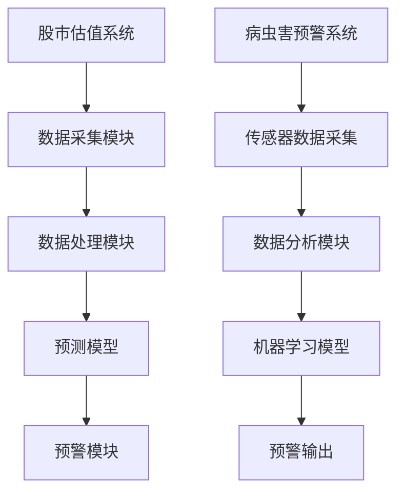
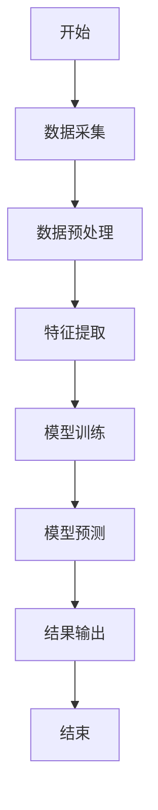
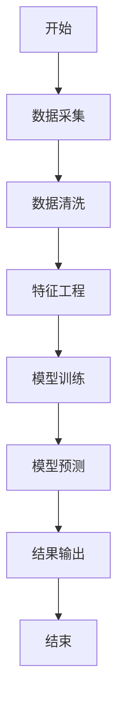
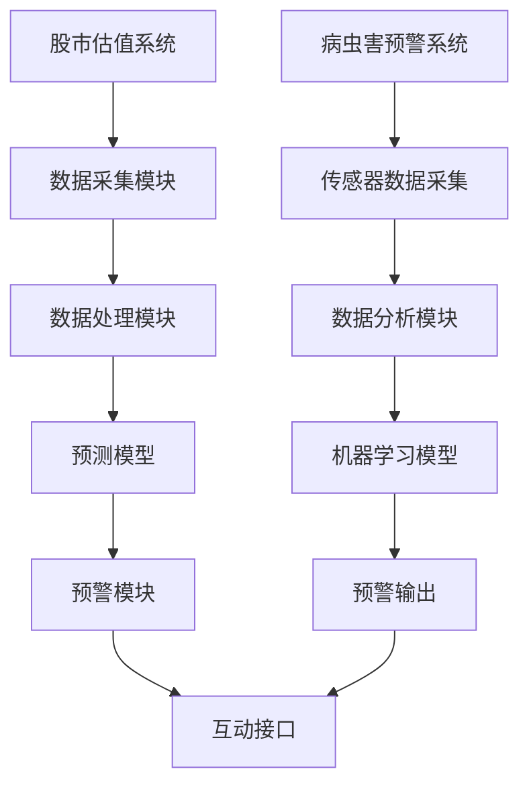

                 


# 新兴市场股市估值与智慧农业病虫害预警系统的互动

> **关键词**：新兴市场股市估值、智慧农业、病虫害预警系统、大数据、机器学习、人工智能、农业经济

> **摘要**：本文探讨了新兴市场股市估值与智慧农业病虫害预警系统之间的互动关系。通过分析股市估值的核心算法与智慧农业病虫害预警系统的技术实现，揭示了两者在数据驱动下的相互作用机制。结合实际案例，本文提出了系统化的解决方案，并展望了未来的发展趋势。

---

## 第一部分：背景介绍

### 第1章：问题背景

#### 1.1 新兴市场股市的现状与挑战
- **新兴市场股市的特点**：新兴市场股市通常波动较大，受宏观经济政策、国际资本流动和市场情绪影响显著。
- **股市估值的重要性**：准确的股市估值有助于投资者做出科学决策，降低投资风险。
- **面临的挑战**：数据获取困难、市场波动剧烈、模型复杂度高等问题亟待解决。

#### 1.2 智慧农业的现状与发展
- **智慧农业的核心技术**：物联网、大数据、人工智能等技术在农业领域的广泛应用。
- **病虫害预警系统的意义**：通过实时监测和数据分析，提前预警病虫害，减少农业损失。
- **农业经济与股市的关联**：农业作为国民经济的重要组成部分，其波动直接影响股市表现。

#### 1.3 问题解决与研究意义
- **问题解决**：通过技术手段，实现股市估值与农业病虫害预警的实时互动。
- **研究意义**：揭示两者之间的动态关系，为政策制定者和投资者提供参考。

#### 1.4 边界与外延
- **边界**：限于股市估值和病虫害预警两个核心领域。
- **外延**：涉及大数据分析、人工智能算法、系统集成等技术。

### 第2章：核心概念与联系

#### 2.1 核心概念的原理
- **股市估值原理**：基于历史数据、市场情绪和宏观经济指标，运用数学模型预测股市走势。
- **病虫害预警原理**：通过传感器数据和历史病虫害数据，结合机器学习模型进行预测。

#### 2.2 概念属性特征对比
| **属性**         | **股市估值**           | **病虫害预警系统**      |
|------------------|-----------------------|-------------------------|
| 数据来源         | 股价、成交量、宏观经济指标 | 气象数据、土壤数据、历史病虫害记录 |
| 数据处理方式     | 时间序列分析、回归模型 | 特征提取、分类算法     |
| 预测目标         | 股价涨跌预测           | 病虫害发生概率预测      |
| 实时性要求       | 高                   | 高                     |
| 系统复杂度       | 中高                 | 中高                   |

#### 2.3 ER实体关系图（Mermaid流程图）


---

## 第二部分：算法原理讲解

### 第3章：算法原理与数学模型

#### 3.1 股市估值算法
- **算法流程**（Mermaid流程图）


- **Python代码示例**
```python
import pandas as pd
from sklearn.linear_model import LinearRegression

# 数据预处理
data = pd.read_csv('stock_data.csv')
X = data[['volume', 'macd', 'rsi']]
y = data['price']

# 模型训练
model = LinearRegression()
model.fit(X, y)

# 模型预测
predicted_price = model.predict(X)
```

- **数学模型与公式**
$$ y = \beta_0 + \beta_1x_1 + \beta_2x_2 + \epsilon $$
其中，$y$ 为目标变量（股价），$x_1$ 和 $x_2$ 是特征变量，$\beta$ 是回归系数。

#### 3.2 病虫害预警算法
- **算法流程**（Mermaid流程图）


- **Python代码示例**
```python
import numpy as np
from sklearn.svm import SVC

# 数据预处理
data = pd.read_csv('agriculture_data.csv')
X = data[['temperature', 'humidity', 'rainfall']]
y = data['pestisease']

# 模型训练
model = SVC()
model.fit(X, y)

# 模型预测
predicted_disease = model.predict(X)
```

- **数学模型与公式**
$$ P(y=1|x) = \frac{1}{1 + e^{-\beta x}} $$
其中，$P(y=1|x)$ 是预测概率，$\beta$ 是模型参数。

---

## 第三部分：系统分析与架构设计

### 第4章：系统架构设计

#### 4.1 系统功能模块
- **股市估值模块**：数据采集、清洗、建模、预测。
- **病虫害预警模块**：数据采集、清洗、建模、预测。
- **互动模块**：实时数据共享、结果互传。

#### 4.2 系统架构图（Mermaid架构图）


---

## 第四部分：项目实战

### 第5章：项目实战与案例分析

#### 5.1 环境安装与数据准备
- **环境搭建**：安装Python、Pandas、Scikit-learn、Mermaid等工具。
- **数据准备**：获取股市数据和农业传感器数据。

#### 5.2 核心代码实现
- **股市估值代码**
```python
import pandas as pd
from sklearn.linear_model import LinearRegression

# 数据预处理
data = pd.read_csv('stock_data.csv')
X = data[['volume', 'macd', 'rsi']]
y = data['price']

# 模型训练
model = LinearRegression()
model.fit(X, y)

# 模型预测
predicted_price = model.predict(X)
print(predicted_price)
```

- **病虫害预警代码**
```python
import numpy as np
from sklearn.svm import SVC

# 数据预处理
data = pd.read_csv('agriculture_data.csv')
X = data[['temperature', 'humidity', 'rainfall']]
y = data['pestisease']

# 模型训练
model = SVC()
model.fit(X, y)

# 模型预测
predicted_disease = model.predict(X)
print(predicted_disease)
```

#### 5.3 案例分析
- **案例1**：股市估值预测案例
  - 数据来源：假设某新兴市场股市的历史数据。
  - 模型预测：预测未来一周的股价走势。
- **案例2**：病虫害预警案例
  - 数据来源：某农业地区的传感器数据。
  - 模型预测：预测未来一周内是否会发生病虫害。

#### 5.4 系统效果评估
- **评估指标**：准确率、召回率、F1分数。
- **效果对比**：对比传统方法与机器学习方法的效果差异。

---

## 第五部分：总结与展望

### 第6章：总结与展望

#### 6.1 总结
- **主要成果**：成功构建了股市估值与病虫害预警系统的互动模型。
- **关键点**：大数据分析、机器学习算法、系统集成。

#### 6.2 注意事项
- **数据质量**：确保数据的准确性和完整性。
- **模型优化**：根据实际效果不断优化模型参数。
- **系统维护**：定期更新数据和模型，确保系统稳定运行。

#### 6.3 拓展阅读
- **推荐书籍**：《机器学习实战》、《大数据分析与挖掘》。
- **推荐阅读论文**：关于股市预测和病虫害预警的经典论文。

---

以上是《新兴市场股市估值与智慧农业病虫害预警系统的互动》的技术博客文章大纲，涵盖了从背景介绍到系统设计再到项目实战的全过程。

