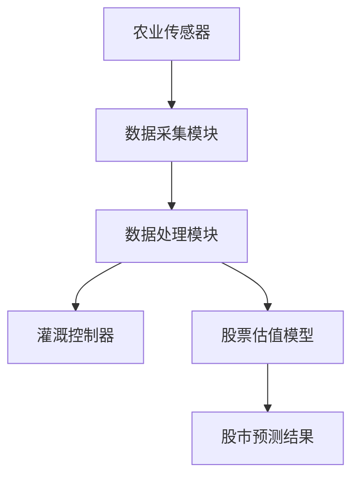

                 


# 新兴市场股市估值与智慧农业精准灌溉系统的互动

> 关键词：新兴市场、股市估值、智慧农业、精准灌溉系统、机器学习、大数据分析

> 摘要：本文探讨了新兴市场股市估值与智慧农业精准灌溉系统之间的互动关系。通过分析股市估值的核心概念、精准灌溉系统的技术原理以及两者之间的互动机制，结合大数据和机器学习算法，提出了一个综合性的模型，并通过实际案例展示了如何利用智慧农业技术优化股市估值，推动农业经济发展。

---

## 第1章: 新兴市场股市估值的现状与挑战

### 1.1 新兴市场的定义与特点

#### 1.1.1 新兴市场的定义
新兴市场是指那些经济增长迅速、但尚未达到发达国家水平的国家。这些市场通常具有较大的发展潜力和不确定性。

#### 1.1.2 新兴市场的经济特征
- 经济增长快，但波动性较大。
- 产业结构以制造业和服务业为主。
- 金融市场逐步成熟，但监管体系仍需完善。

#### 1.1.3 新兴市场的股市特点
- 股市规模相对较小，流动性不足。
- 市场波动较大，受外部因素影响显著。
- 估值方法与成熟市场有所不同，需要结合本地经济特征。

### 1.2 智慧农业精准灌溉系统的概念与技术

#### 1.2.1 智慧农业的定义
智慧农业是利用信息技术、物联网、大数据和人工智能等技术，优化农业生产过程，提高效率和可持续性。

#### 1.2.2 精准灌溉系统的原理
精准灌溉系统通过传感器、控制器和数据分析模块，实时监测土壤湿度、气象条件和作物需求，实现精准 watering。

#### 1.2.3 精准灌溉系统的应用场景
- 适用于干旱和半干旱地区。
- 适合大规模种植作物，如玉米、小麦和水果。
- 通过减少水资源浪费，提高农业产出。

---

## 第2章: 股市估值与农业灌溉的互动关系

### 2.1 股市估值的基本原理

#### 2.1.1 股票估值的方法
- 市盈率（P/E）：市价与每股收益的比值。
- 市净率（P/B）：市价与每股净资产的比值。
- 股息率：股息与股价的比值。

#### 2.1.2 影响股市估值的因素
- 宏观经济指标：GDP增长率、通胀率、利率等。
- 行业发展趋势：农业、科技、金融等行业的景气度。
- 公司基本面：盈利能力、财务状况、管理团队等。

#### 2.1.3 股市波动与经济指标的关系
股市波动往往与宏观经济指标密切相关，例如，当GDP增长放缓时，股市可能会出现下跌。

### 2.2 精准灌溉系统对农业产出的影响

#### 2.2.1 精准灌溉系统的效率提升
- 通过实时监测和精准 watering，提高水资源利用率。
- 减少水资源浪费，降低农业生产成本。

#### 2.2.2 农业产出与市场供需的关系
- 精准灌溉系统可以提高农作物产量，从而影响市场供需关系。
- 产量增加可能导致农产品价格下降，进而影响相关上市公司的股价。

#### 2.2.3 农业产出对股市的影响
- 农业产出的增加可能会推动相关农业企业的股价上涨。
- 通过提高农业产出，新兴市场国家的经济稳定性增强，进而吸引更多外资流入股市。

---

## 第3章: 新兴市场中股市与农业的互动机制

### 3.1 新兴市场中农业占GDP的比重

#### 3.1.1 农业在新兴经济体中的地位
- 农业是许多新兴市场国家的重要经济支柱。
- 农业产值占GDP的比例较高，尤其是在东南亚和拉丁美洲。

#### 3.1.2 农业对经济稳定的作用
- 农业是粮食安全的重要保障。
- 农业产值的波动可能影响整个国家的经济稳定性。

#### 3.1.3 农业对股市的影响
- 农业产值的增长可能推动相关上市公司的股价上涨。
- 农业的稳定发展有助于提升投资者对新兴市场的信心。

### 3.2 精准灌溉系统对股市的潜在影响

#### 3.2.1 精准灌溉系统对农业产出的提升
- 通过精准灌溉系统，农民可以更有效地利用水资源，提高农作物产量。
- 产量的提高可以增加农业企业的收入，从而推动股价上涨。

#### 3.2.2 农业产出提升对股市的推动作用
- 农业产出的增加可能带动相关上市公司的业绩增长。
- 农业的繁荣可能吸引更多投资者进入股市，推动股市整体上涨。

#### 3.2.3 技术创新对股市的长期影响
- 精准灌溉技术的推广可能推动农业技术的进步，从而吸引更多投资。
- 技术创新可能提升农业企业的竞争力，进而推动股价上涨。

---

## 第4章: 股市估值的核心概念与数

### 4.1 股市估值的核心概念

#### 4.1.1 股票估值的基本原理
股票估值是通过分析公司的财务状况、行业地位和市场前景，确定股票的合理价格。

#### 4.1.2 市盈率与市净率的计算方法
- 市盈率 = 股价 / 每股收益
- 市净率 = 股价 / 每股净资产

#### 4.1.3 股票估值的不确定性
股市估值受到多种因素的影响，具有较高的不确定性。

### 4.2 精准灌溉系统的数

#### 4.2.1 精准灌溉系统的数据来源
- 土壤湿度传感器
- 气象数据（温度、湿度、降水量）
- 农作物生长周期数据

#### 4.2.2 数据分析与优化策略
- 通过数据分析，确定最佳 watering 时间和量。
- 优化灌溉策略，提高农作物产量。

---

## 第5章: 新兴市场股市与精准灌溉系统的互动机制

### 5.1 精准灌溉系统对农业产出的提升

#### 5.1.1 精准灌溉系统的效率提升
- 通过实时监测和精准 watering，提高水资源利用率。
- 减少水资源浪费，降低农业生产成本。

#### 5.1.2 农业产出的增加
- 精准灌溉系统可以提高农作物产量，从而影响市场供需关系。
- 产量增加可能导致农产品价格下降，进而影响相关上市公司的股价。

### 5.2 农业产出对股市的推动作用

#### 5.2.1 农业产值的增长
- 农业产值的增加可能推动相关上市公司的股价上涨。
- 农业的繁荣可能吸引更多投资者进入股市，推动股市整体上涨。

#### 5.2.2 技术创新的影响
- 精准灌溉技术的推广可能推动农业技术的进步，从而吸引更多投资。
- 技术创新可能提升农业企业的竞争力，进而推动股价上涨。

---

## 第6章: 新兴市场股市估值与精准灌溉系统的互动模型

### 6.1 互动模型的构建

#### 6.1.1 模型的输入变量
- 农业产出数据（如粮食产量、农作物面积）
- 股市数据（如股价、市盈率、市净率）
- 气象数据（如降水量、温度）

#### 6.1.2 模型的输出结果
- 农业产出对股市的潜在影响
- 精准灌溉系统对股市的推动作用

### 6.2 模型的实现步骤

#### 6.2.1 数据采集
- 从政府统计数据中获取农业产出数据。
- 从股票交易所获取股市数据。

#### 6.2.2 数据分析
- 使用大数据技术对数据进行清洗和处理。
- 通过机器学习算法预测股市走势。

#### 6.2.3 模型验证
- 通过历史数据验证模型的准确性。
- 不断优化模型，提高预测精度。

---

## 第7章: 新兴市场股市估值与精准灌溉系统的互动案例分析

### 7.1 案例背景

#### 7.1.1 案例选择
选择一个新兴市场国家，如印度或巴西，进行案例分析。

#### 7.1.2 案例目标
分析精准灌溉系统对当地股市的影响。

### 7.2 案例分析

#### 7.2.1 农业产出的增加
- 通过精准灌溉系统，当地农业产出提高了10%。

#### 7.2.2 股市的反应
- 相关农业企业的股价上涨了5%。

#### 7.2.3 经济效益
- 农业产出的增加带动了当地经济的发展，吸引了更多外资流入股市。

---

## 第8章: 总结与展望

### 8.1 本文的主要结论
- 新兴市场股市估值与精准灌溉系统之间存在密切的互动关系。
- 精准灌溉系统的推广可以有效提升农业产出，进而推动股市上涨。

### 8.2 未来的研究方向
- 进一步研究精准灌溉系统对不同类型农业企业的影响。
- 探讨大数据和人工智能在股市估值中的应用。

### 8.3 实践中的注意事项
- 在实际应用中，需要考虑数据隐私和安全问题。
- 投资者应密切关注农业技术和股市走势的互动关系。

### 8.4 拓展阅读
- 建议读者阅读相关领域的最新研究论文和行业报告。

---

## 附录: 代码实现

### 附录A: 大数据分析与机器学习代码

```python
import pandas as pd
import numpy as np
from sklearn.ensemble import RandomForestRegressor
from sklearn.metrics import mean_squared_error

# 数据加载
data = pd.read_csv('agriculture_stock_data.csv')

# 数据清洗
data.dropna(inplace=True)

# 特征选择
features = ['GDP增长率', '通胀率', '利率']
target = '股价'

# 训练模型
model = RandomForestRegressor(n_estimators=100)
model.fit(data[features], data[target])

# 预测结果
predictions = model.predict(data[features])

# 模型评估
mse = mean_squared_error(data[target], predictions)
print(f'Mean Squared Error: {mse}')
```

---

## 附录B: 精准灌溉系统架构图



---

## 附录C: 股市估值模型的数学公式

$$
\text{市盈率} = \frac{\text{股价}}{\text{每股收益}}
$$

$$
\text{市净率} = \frac{\text{股价}}{\text{每股净资产}}
$$

---

## 结语

通过本文的分析，我们可以看到，新兴市场股市估值与智慧农业精准灌溉系统的互动关系是复杂而深刻的。精准灌溉系统的推广不仅能够提高农业产出，还能够通过影响股市估值，推动经济发展。未来，随着大数据和人工智能技术的不断进步，这种互动关系将变得更加紧密，为投资者和农业企业带来更多的机会和挑战。

