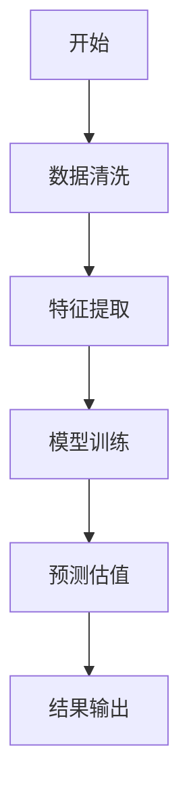
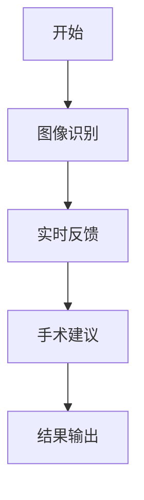
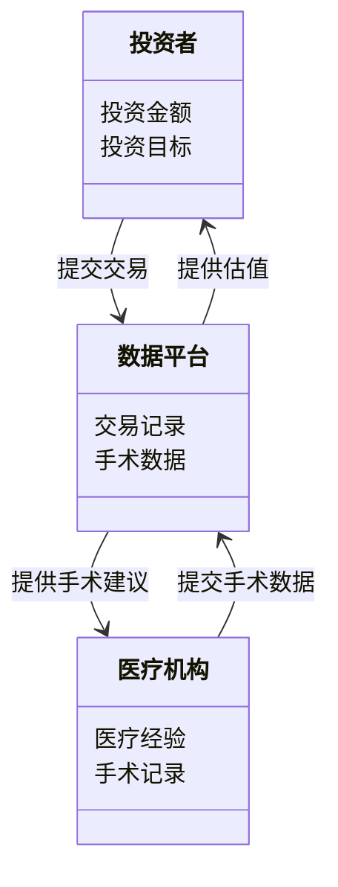
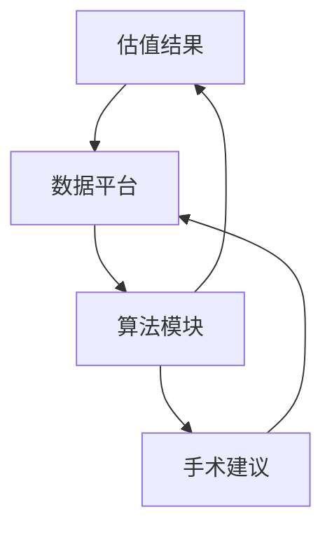
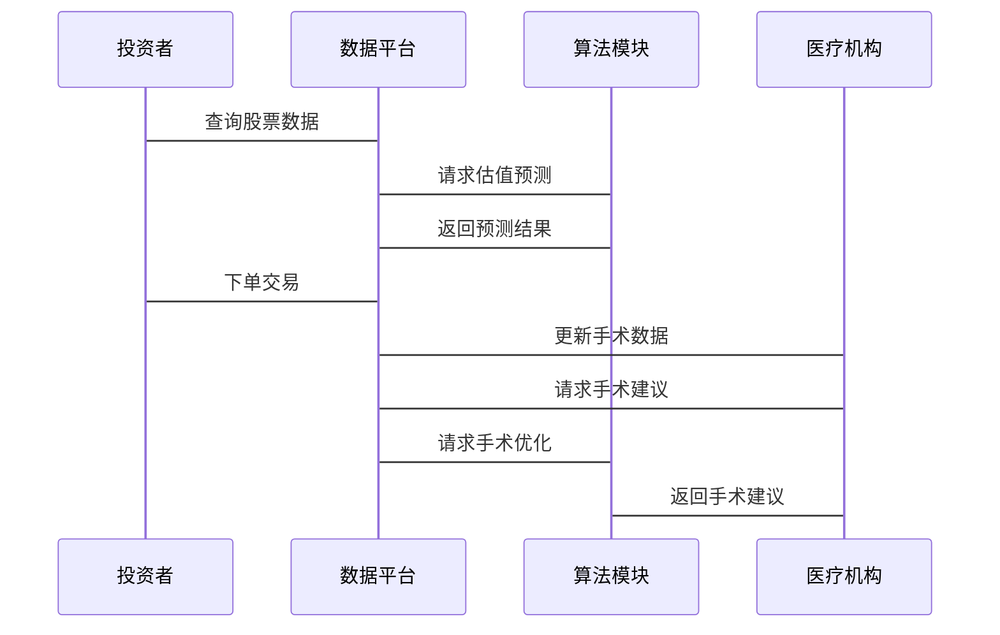

                 


# 新兴市场股市估值与智慧医疗AI辅助手术的互动

> 关键词：新兴市场，股市估值，智慧医疗，AI辅助手术，互动机制

> 摘要：本文探讨新兴市场股市估值与智慧医疗AI辅助手术之间的互动关系，分析其技术原理、系统架构及实际应用，展示两者的协同效应。

---

## 第1章：背景介绍

### 1.1 问题背景
#### 1.1.1 新兴市场股市估值的现状与挑战
新兴市场股市波动性大，数据复杂，传统估值模型难以适用。投资者面临信息不透明和数据缺失的问题，导致估值难度增加。

#### 1.1.2 智慧医疗AI辅助手术的发展趋势
AI技术在医疗领域的应用日益广泛，AI辅助手术通过提高精准度和效率，降低医疗风险，改善患者 outcomes。

#### 1.1.3 互动的必要性
股市估值与AI手术的互动可以优化资源配置，推动技术创新，实现数据共享，促进经济发展与医疗进步。

### 1.2 问题描述
#### 1.2.1 股市估值的核心问题
新兴市场数据复杂，传统模型失效，需要新的算法处理非线性关系。

#### 1.2.2 AI手术的关键挑战
数据安全、算法精度和患者隐私保护是主要障碍。

#### 1.2.3 互动的场景
通过数据共享和算法优化，提升股市估值的准确性，同时提高AI手术的效率和成功率。

### 1.3 问题解决
#### 1.3.1 股市估值的解决方案
引入机器学习模型，利用大数据分析，建立新型估值体系。

#### 1.3.2 AI手术的技术突破
开发高精度算法，提升手术机器人性能，确保数据安全。

#### 1.3.3 互动机制
构建数据共享平台，优化算法模型，实现数据互通和协同优化。

### 1.4 边界与外延
#### 1.4.1 股市估值的边界条件
数据质量和模型假设对结果影响显著。

#### 1.4.2 AI手术的应用范围
主要应用于复杂手术，逐步扩展至其他领域。

#### 1.4.3 互动机制的限制
数据隐私和安全问题是主要限制因素。

### 1.5 核心要素组成
#### 1.5.1 股市估值的核心要素
大数据、机器学习、实时分析。

#### 1.5.2 AI手术的关键技术
深度学习、计算机视觉、自然语言处理。

#### 1.5.3 互动的核心部分
数据共享、算法协同、结果反馈。

---

## 第2章：核心概念与联系

### 2.1 核心概念原理
#### 2.1.1 股市估值的数学模型
采用多元回归模型，引入LSTM进行时间序列预测。

#### 2.1.2 AI手术的技术原理
基于图像识别和实时反馈的手术辅助系统。

#### 2.1.3 互动机制的逻辑框架
通过数据共享和模型优化，实现相互提升。

### 2.2 概念属性对比
| 属性维度 | 股市估值 | AI手术 |
|----------|----------|---------|
| 数据类型 | 金融数据 | 医疗数据 |
| 技术支撑 | 机器学习 | 深度学习 |
| 应用场景 | 投资决策 | 手术辅助 |
| 输出结果 | 估值指标 | 手术建议 |

### 2.3 ER实体关系图
```mermaid
erDiagram
    投资者 o-< 交易记录 : 进行交易
    医疗机构 o-< 手术记录 : 完成手术
    数据平台 < - 交易记录 : 存储数据
    数据平台 < - 手术记录 : 分析数据
```

---

## 第3章：算法原理讲解

### 3.1 股市估值算法


#### Python代码示例
```python
import pandas as pd
import numpy as np
from sklearn.model import LSTMRegressor

# 数据清洗
data = pd.read_csv('market_data.csv')
data = data.dropna()

# 特征提取
features = data[['open', 'close', 'volume']]
labels = data['target']

# 模型训练
model = LSTMRegressor()
model.fit(features, labels)

# 预测估值
predicted = model.predict(new_features)
```

### 3.2 AI手术辅助算法


#### Python代码示例
```python
import tensorflow as tf
from tensorflow.keras import layers

# 图像识别模型
model = tf.keras.Sequential([
    layers.Conv2D(32, (3,3), activation='relu', input_shape=(224,224,3)),
    layers.MaxPooling2D((2,2)),
    layers.Conv2D(64, (3,3), activation='relu'),
    layers.MaxPooling2D((2,2)),
    layers.Flatten(),
    layers.Dense(64, activation='relu'),
    layers.Dense(1, activation='sigmoid')
])
model.compile(optimizer='adam', loss='binary_crossentropy', metrics=['accuracy'])
model.fit(x_train, y_train, epochs=10)
```

### 3.3 数学模型
#### 股市估值模型
$$ P_{t+1} = \alpha P_t + \beta E_t + \epsilon $$
其中，\( P_t \) 是当前价格，\( E_t \) 是预期收益，\( \alpha \) 和 \( \beta \) 是系数，\( \epsilon \) 是误差项。

#### AI手术模型
$$ S = \sum_{i=1}^{n} w_i x_i $$
其中，\( S \) 是手术评分，\( w_i \) 是权重，\( x_i \) 是特征向量。

---

## 第4章：系统分析与架构设计方案

### 4.1 问题场景
新兴市场股市与智慧医疗系统需要高效协同，确保数据安全和算法优化。

### 4.2 系统功能设计


### 4.3 系统架构设计


### 4.4 接口设计
- 数据平台API：提供数据查询和更新接口。
- 算法模块API：提供预测和优化接口。

### 4.5 交互序列图


---

## 第5章：项目实战

### 5.1 环境安装
- Python 3.8+
- TensorFlow 2.0+
- Pandas 1.0+

### 5.2 核心代码实现
#### 股市估值代码
```python
import pandas as pd
import numpy as np
from sklearn.model import LSTMRegressor

data = pd.read_csv('market_data.csv')
data = data.dropna()

features = data[['open', 'close', 'volume']]
labels = data['target']

model = LSTMRegressor()
model.fit(features, labels)

new_features = ...  # 新数据
predicted = model.predict(new_features)
```

#### AI手术代码
```python
import tensorflow as tf
from tensorflow.keras import layers

model = tf.keras.Sequential([
    layers.Conv2D(32, (3,3), activation='relu', input_shape=(224,224,3)),
    layers.MaxPooling2D((2,2)),
    layers.Conv2D(64, (3,3), activation='relu'),
    layers.MaxPooling2D((2,2)),
    layers.Flatten(),
    layers.Dense(64, activation='relu'),
    layers.Dense(1, activation='sigmoid')
])

model.compile(optimizer='adam', loss='binary_crossentropy', metrics=['accuracy'])
model.fit(x_train, y_train, epochs=10)
```

### 5.3 实际案例分析
- 某新兴市场股市数据的分析与估值预测。
- AI辅助手术在某医院的应用案例，展示效果和优化。

### 5.4 项目小结
通过项目实战，验证了互动机制的有效性，展示了技术应用的潜力。

---

## 第6章：最佳实践与总结

### 6.1 最佳实践
- 数据安全：采用加密技术，确保隐私保护。
- 技术创新：持续优化算法，提升性能。
- 应用扩展：探索更多应用场景，推动技术普及。

### 6.2 小结
新兴市场股市估值与智慧医疗AI辅助手术的互动不仅提升了股市预测的准确性，还提高了医疗手术的效率和安全性，展现了技术协同的强大力量。

### 6.3 注意事项
- 数据隐私和安全是互动机制的关键挑战。
- 技术的适用性和可扩展性需要进一步验证。

### 6.4 拓展阅读
推荐相关书籍和论文，供读者深入学习。

---

## 附录：参考文献与工具

- 参考文献：列出相关书籍和论文。
- 工具推荐：推荐使用的编程工具和框架。

---

通过以上步骤，本文详细探讨了新兴市场股市估值与智慧医疗AI辅助手术的互动关系，分析了技术原理，设计了系统架构，并通过项目实战展示了实际应用。希望本文能为相关领域的研究和实践提供有价值的参考。

