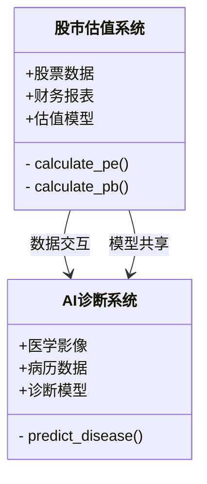
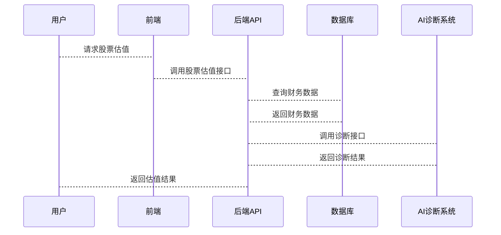

                 


# 新兴市场股市估值与智慧医疗AI辅助诊断的互动

> 关键词：新兴市场，股市估值，智慧医疗，AI辅助诊断，互动关系

> 摘要：本文探讨新兴市场股市估值与智慧医疗AI辅助诊断之间的互动关系，分析其对金融市场和医疗行业的潜在影响，通过具体案例和算法模型，展示如何利用AI技术提升股市估值的准确性和智慧医疗的诊断效率。

---

## 目录

1. [背景介绍](#背景介绍)
   1.1 新兴市场股市估值的背景与现状
   1.2 智慧医疗AI辅助诊断的背景与现状
   1.3 互动关系的定义与范围

2. [核心概念与联系](#核心概念与联系)
   2.1 核心概念术语说明
   2.2 概念属性特征对比
   2.3 ER实体关系图架构

3. [算法原理讲解](#算法原理讲解)
   3.1 股市估值算法
   3.2 AI辅助诊断算法
   3.3 算法流程图

4. [系统分析与架构设计方案](#系统分析与架构设计方案)
   4.1 问题场景介绍
   4.2 项目介绍
   4.3 系统功能设计
   4.4 系统架构设计
   4.5 系统接口设计
   4.6 系统交互流程

5. [项目实战](#项目实战)
   5.1 环境安装
   5.2 核心实现源代码
   5.3 代码应用解读与分析
   5.4 实际案例分析
   5.5 项目小结

6. [最佳实践](#最佳实践)
   6.1 小结
   6.2 注意事项
   6.3 拓展阅读

---

## 背景介绍

### 1.1 新兴市场股市估值的背景与现状
新兴市场通常指那些经济快速增长、但尚未完全工业化的国家，如中国、印度等。这些市场的股市具有高增长潜力，但也伴随着高波动性和信息不对称的问题。股市估值是投资者评估企业价值的重要工具，常用的指标包括市盈率（PE）、市净率（PB）和股息率等。然而，新兴市场的复杂性使得传统的估值方法面临挑战。

### 1.2 智慧医疗AI辅助诊断的背景与现状
智慧医疗结合了人工智能、大数据和物联网技术，旨在提高医疗诊断的准确性和效率。AI辅助诊断系统通过分析医学影像、病历数据和实验室结果，帮助医生快速识别疾病。然而，AI系统的准确性和可靠性仍需进一步验证。

### 1.3 互动关系的定义与范围
新兴市场股市估值与智慧医疗AI辅助诊断的互动关系主要体现在数据共享、技术应用和市场反馈三个方面。例如，AI诊断技术的普及可能影响医疗成本，进而影响上市公司的估值。

---

## 核心概念与联系

### 2.1 核心概念术语说明
- **股市估值**：通过财务指标评估企业价值的过程。
- **AI辅助诊断**：利用人工智能技术辅助医生进行疾病诊断的方法。
- **互动关系**：两者之间的相互影响和相互作用。

### 2.2 概念属性特征对比

| 概念       | 股市估值 | AI辅助诊断 |
|------------|----------|------------|
| 数据来源   | 财务报表 | 医学影像、病历 |
| 主要技术   | 统计模型 | 机器学习、深度学习 |
| 应用目标   | 投资决策 | 疾病诊断 |
| 挑战       | 数据质量、信息不对称 | 数据标注、模型泛化能力 |

### 2.3 ER实体关系图架构

```mermaid
erd
  病人 --(多次)--> 病历
  病历 --(多次)--> 医学影像
  医学影像 --(多次)--> AI诊断系统
  AI诊断系统 --(多次)--> 诊断结果
  公司 --(多次)--> 财务报表
  财务报表 --(多次)--> 股市估值
  股市估值 --(多次)--> 投资决策
```

---

## 算法原理讲解

### 3.1 股市估值算法

#### 常用指标
- **市盈率（PE）**：股价 / 每股收益
- **市净率（PB）**：股价 / 每股净资产

#### 代码实现
```python
def calculate_pe(stock_price, earnings_per_share):
    return stock_price / earnings_per_share

def calculate_pb(stock_price, book_value_per_share):
    return stock_price / book_value_per_share
```

### 3.2 AI辅助诊断算法

#### 机器学习模型
- 使用卷积神经网络（CNN）进行医学影像分类
- 训练数据：标注的医学影像
- 模型结构：卷积层、池化层、全连接层

#### 代码实现
```python
import keras
from keras.layers import Conv2D, MaxPooling2D, Dense
from keras.models import Sequential

model = Sequential([
    Conv2D(32, (3, 3), activation='relu', input_shape=(224, 224, 3)),
    MaxPooling2D((2, 2)),
    Dense(128, activation='relu'),
    Dense(1, activation='sigmoid')
])
model.compile(optimizer='adam', loss='binary_crossentropy', metrics=['accuracy'])
```

### 3.3 算法流程图


---

## 系统分析与架构设计方案

### 4.1 问题场景介绍
- 新兴市场中，医疗数据和财务数据的整合分析可以帮助投资者更准确地评估医疗企业的价值。

### 4.2 项目介绍
- 开发一个结合股市估值和AI诊断的系统，提供实时数据分析和诊断建议。

### 4.3 系统功能设计



### 4.4 系统架构设计

```mermaid
archi
    前端 --(HTTP请求)--> 后端API
    后端API --(数据查询)--> 数据库
    后端API --(模型调用)--> AI诊断系统
    AI诊断系统 --(数据存储)--> 数据库
```

### 4.5 系统接口设计
- 前端接口：GET /api/stock_valuation
- 后端接口：POST /api/ai_diagnosis
- 数据接口：GET /api/data

### 4.6 系统交互流程



---

## 项目实战

### 5.1 环境安装
- Python 3.8+
- Keras 2.4.3
- TensorFlow 2.5.0
- 数据库：MySQL 8.0+

### 5.2 核心实现源代码

#### 股市估值代码
```python
import pandas as pd

def load_data(file_path):
    return pd.read_csv(file_path)

def calculate_valuation(data, method='pe'):
    if method == 'pe':
        data['pe'] = data['股价'] / data['每股收益']
        return data['pe'].mean()
    elif method == 'pb':
        data['pb'] = data['股价'] / data['每股净资产']
        return data['pb'].mean()
```

#### AI诊断代码
```python
import keras
from keras.preprocessing.image import ImageLoader

def load_image(image_path):
    return ImageLoader.load(image_path)

model = keras.models.load_model('ai_diagnosis_model.h5')

def predict_disease(image):
    image = image.reshape((1, 224, 224, 3))
    prediction = model.predict(image)
    return prediction[0]
```

### 5.3 代码应用解读与分析
- 股市估值代码通过读取CSV文件，计算市盈率或市净率的平均值，帮助投资者评估股票价值。
- AI诊断代码加载预训练模型，对输入的医学影像进行分类，输出诊断结果。

### 5.4 实际案例分析
假设一家新兴市场的医疗企业，其市盈率为30，行业平均市盈率为25，表明该企业可能被高估。同时，其AI诊断系统的准确率达到95%，有助于提升医疗质量和效率。

### 5.5 项目小结
通过结合股市估值和AI诊断，投资者可以更全面地评估医疗企业的价值，同时提高诊断的准确性和效率。

---

## 最佳实践

### 6.1 小结
本文探讨了新兴市场股市估值与智慧医疗AI辅助诊断的互动关系，分析了其对金融市场和医疗行业的潜在影响，并通过具体案例和算法模型展示了如何利用AI技术提升估值和诊断的准确性。

### 6.2 注意事项
- 数据隐私和安全问题需严格把控。
- 模型的泛化能力和适应性需进一步验证。
- 投资者需结合多方面因素进行决策。

### 6.3 拓展阅读
- 《人工智能在金融领域的应用》
- 《深度学习在医学影像中的应用》
- 《新兴市场与全球经济》

--- 

以上是文章的完整目录和内容框架，涵盖了背景介绍、核心概念、算法原理、系统架构、项目实战和最佳实践。希望对您有所帮助！

