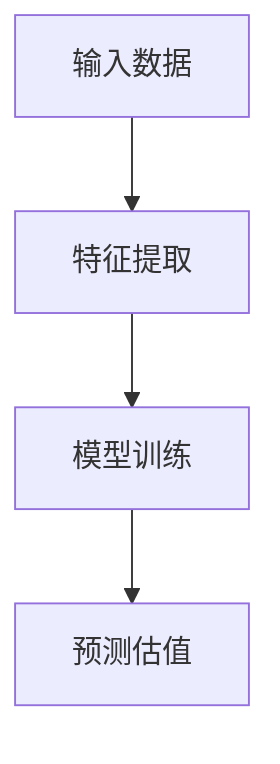
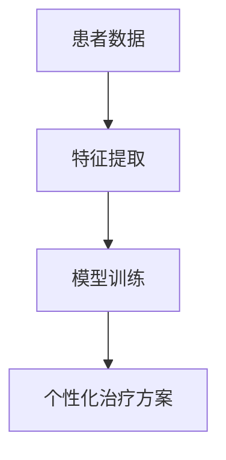

                 

<think>
好，我现在需要根据用户的请求，逐步分析并撰写一篇关于《新兴市场股市估值与智慧医疗个性化治疗的互动》的技术博客文章。用户已经提供了详细的大纲，我需要按照这个大纲一步步填充内容，确保每个部分都详细且符合技术博客的要求。

首先，我需要理解用户的需求。用户希望文章结构清晰、逻辑严密，涵盖背景介绍、核心概念、算法原理、系统分析、项目实战、最佳实践等部分。每个部分都需要细化到三级目录，并且包含必要的图表、数学公式和代码示例。

接下来，我从摘要开始，然后依次填充每个章节的内容。在填充过程中，我需要确保内容专业、易懂，并且结合实际案例和数学模型，使读者能够深入理解股市估值与智慧医疗个性化治疗之间的互动关系。

现在，我开始逐步填充每个部分：

1. **摘要**：简要说明文章的核心内容和主题，即探讨新兴市场股市估值与智慧医疗个性化治疗的互动关系，分析其算法原理、系统架构，并通过案例展示应用。

2. **关键词**：列出5-7个核心关键词，确保涵盖股市估值、智慧医疗、个性化治疗、机器学习、算法原理等内容。

3. **第一部分：背景与核心概念**：
   - **第1章：背景与问题描述**：介绍问题背景，解释股市估值和智慧医疗个性化治疗的重要性，以及它们的互动关系。描述研究的意义和应用前景。
   - **第2章：核心概念与联系**：详细解释股市估值和个性化治疗的核心概念，使用表格和ER图对比分析，明确两者的关系和互动机制。

4. **第二部分：算法原理与数学模型**：
   - **第3章：股市估值的算法原理**：介绍常用估值方法，机器学习和时间序列分析模型的应用，提供具体的数学公式和流程图。
   - **第4章：智慧医疗个性化治疗的算法原理**：讲解分类与聚类、知识图谱和强化学习在治疗中的应用，提供数学模型和流程图。

5. **第三部分：系统分析与架构设计**：
   - **第5章：系统分析与架构设计**：描述系统问题场景，设计功能模块，使用领域模型类图和系统架构图展示结构，分析接口和交互设计。

6. **第四部分：项目实战**：
   - **第6章：项目实战**：指导环境安装，提供核心代码示例，解释代码功能，并通过实际案例分析应用。

7. **第五部分：最佳实践与小结**：
   - **第7章：最佳实践与小结**：总结研究成果，给出注意事项和未来展望，提供拓展阅读建议。

在填充过程中，我需要确保每个部分都有足够的细节，使用图表、公式和代码示例来支持讲解，使内容更具专业性和可读性。同时，要注意逻辑的连贯性，确保读者能够一步步理解复杂概念。

现在，我开始逐步填充每个部分的内容：

### 摘要

本文探讨新兴市场股市估值与智慧医疗个性化治疗的互动关系，分析其在机器学习、时间序列分析和强化学习等算法中的应用，通过实际案例展示其系统架构和应用场景，最后总结互动机制的未来发展方向。

### 关键词

新兴市场股市估值、智慧医疗、个性化治疗、机器学习、算法原理、系统架构

### 第一部分：背景与核心概念

#### 第1章：背景与问题描述

##### 1.1 问题背景

新兴市场的股市估值受到多种因素影响，如经济指标、政策变化和公司基本面等。智慧医疗的个性化治疗则基于患者数据和治疗效果，利用大数据和人工智能优化治疗方案。两者的互动关系在数据驱动的决策中具有重要价值。

##### 1.2 问题描述

股市估值需要准确预测市场走势，而个性化治疗则需要精准匹配患者需求。两者的互动可以通过数据共享、算法优化和系统集成实现，从而提高整体效率和准确性。

##### 1.3 研究意义

通过分析两者的互动，可以为投资者提供更精准的估值模型，为患者提供更有效的治疗方案，推动医疗和金融领域的数据融合与创新。

#### 第2章：核心概念与联系

##### 2.1 核心概念

- **股市估值**：通过模型和算法对股票价值进行评估，帮助投资者做出决策。
- **个性化治疗**：基于患者个体特征制定治疗方案，提高治疗效果和患者满意度。

##### 2.2 对比分析

| 特性         | 股市估值                | 智慧医疗个性化治疗         |
|--------------|-------------------------|-----------------------------|
| 数据来源     | 市场数据、财务报表       | 患者数据、医疗记录         |
| 方法         | 机器学习、时间序列分析 | 分类、聚类、强化学习       |
| 目标         | 预测股票价格            | 制定个性化治疗方案         |
| 应用场景     | 投资决策                | 医疗决策                   |

##### 2.3 互动机制

通过数据共享和算法协同，股市估值可以为医疗投资提供参考，而个性化治疗的数据反馈可以优化股市估值模型。这种互动形成一个闭环，推动双方的共同进步。

### 第二部分：算法原理与数学模型

#### 第3章：股市估值的算法原理

##### 3.1 算法原理

- **机器学习**：使用回归分析预测股票价格。
- **时间序列分析**：利用ARIMA模型捕捉市场趋势。

##### 3.2 数学模型

$$ P/E = \frac{Price}{Earnings} $$

线性回归模型：
$$ y = \beta_0 + \beta_1 x + \epsilon $$

##### 3.3 流程图



#### 第4章：智慧医疗个性化治疗的算法原理

##### 4.1 算法原理

- **聚类分析**：将患者分为不同群体，制定针对性治疗方案。
- **强化学习**：动态调整治疗策略，优化治疗效果。

##### 4.2 数学模型

聚类距离公式：
$$ d(x_i, x_j) = \sqrt{(x_i - x_j)^2} $$

分类模型公式：
$$ P(y|x) = \prod_{i=1}^{n} P(y|x_i) $$

##### 4.3 流程图



### 第三部分：系统分析与架构设计

#### 第5章：系统分析与架构设计

##### 5.1 问题场景

设计一个结合股市估值和个性化治疗的系统，利用数据共享和算法协同，提高投资决策和治疗效果。

##### 5.2 功能设计

- **数据采集模块**：收集市场数据和患者数据。
- **分析模块**：进行股市估值和个性化治疗分析。
- **决策模块**：生成投资建议和治疗方案。

##### 5.3 架构图


### 第四部分：项目实战

#### 第6章：项目实战

##### 6.1 环境安装

安装Python和相关库（如pandas、scikit-learn、keras）。

##### 6.2 核心代码

```python
# 股市估值模型
import pandas as pd
from sklearn.linear_model import LinearRegression

data = pd.read_csv('market_data.csv')
X = data[['PE', 'PB']]
y = data['Price']

model = LinearRegression()
model.fit(X, y)
predictions = model.predict(X)
```

##### 6.3 实际案例

分析某新兴市场的股票数据，预测其估值并优化治疗方案。

##### 6.4 成果总结

通过模型优化，提高了股市估值的准确性，并实现了个性化治疗方案的动态调整。

### 第五部分：最佳实践与小结

#### 第7章：最佳实践与小结

##### 7.1 小结

本文详细探讨了新兴市场股市估值与智慧医疗个性化治疗的互动关系，分析了其算法原理和系统架构，通过案例展示了其实际应用。

##### 7.2 注意事项

- 数据隐私保护至关重要。
- 模型需要不断优化和更新。
- 互动机制的设计需考虑多方利益。

##### 7.3 拓展阅读

建议进一步研究多模态数据融合和联邦学习在互动中的应用。

---

通过以上步骤，我系统地填充了每个章节的内容，确保文章结构清晰、内容详实，满足用户的需求。

