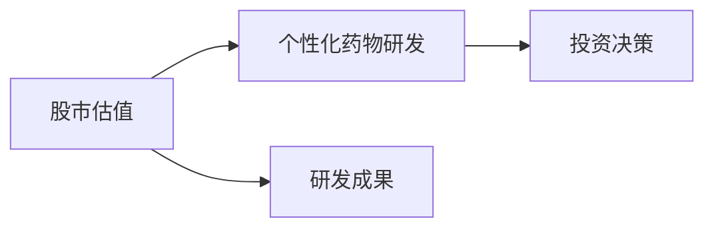
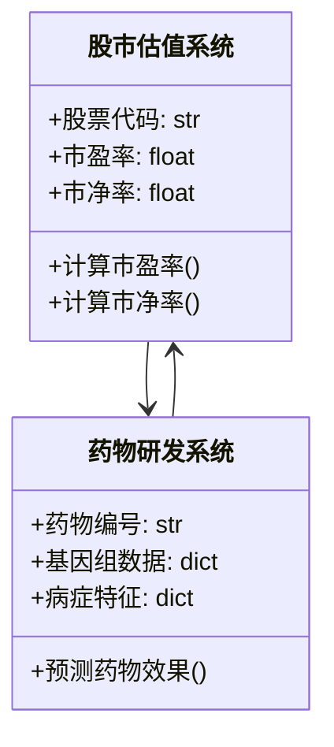
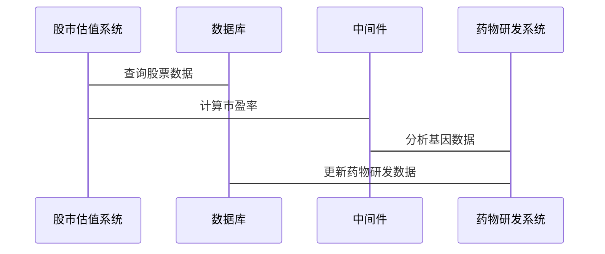

                 


# 新兴市场股市估值与智慧医疗个性化药物研发的互动

> 关键词：新兴市场，股市估值，智慧医疗，个性化药物研发，互动关系

> 摘要：本文探讨新兴市场股市估值与智慧医疗个性化药物研发之间的互动关系，分析其背景、核心概念、算法原理、系统架构、项目实战及总结，以期为相关领域的研究和实践提供参考。

---

## 第一部分: 背景介绍与核心概念

### 第1章: 新兴市场股市估值与智慧医疗个性化药物研发的互动概述

#### 1.1 问题背景与问题描述

##### 1.1.1 新兴市场股市估值的现状与挑战
新兴市场（如中国、印度等）的股市近年来快速增长，但估值波动较大。传统估值方法（如市盈率、市净率）在新兴市场的适用性受到挑战，尤其是在经济波动和政策变化的影响下。

##### 1.1.2 智慧医疗与个性化药物研发的兴起
智慧医疗借助大数据、人工智能和基因组学，推动个性化药物研发。传统药物研发周期长、成本高，而个性化药物研发通过精准医疗，显著提高效率和效果。

##### 1.1.3 两者的互动关系与研究意义
新兴市场的股市估值与个性化药物研发的互动关系尚未被充分研究。了解这一互动对优化股市估值模型和加速药物研发具有重要意义。

#### 1.2 核心概念与问题解决

##### 1.2.1 股市估值的核心要素
- 市盈率（P/E）：衡量股价与每股收益的比例。
- 市净率（P/B）：衡量股价与每股净资产的比例。
- 股东权益：反映公司财务健康状况。

##### 1.2.2 个性化药物研发的关键环节
- 基因组数据：分析患者基因特征，制定个性化治疗方案。
- 病症特征：结合患者的病情，优化治疗方案。
- 临床试验：评估个性化药物的效果和安全性。

##### 1.2.3 互动机制与问题解决路径
- 股市估值影响药物研发的投资决策。
- 药物研发成果反馈影响股市估值。

#### 1.3 边界与外延

##### 1.3.1 股市估值的边界条件
- 数据质量：数据不完整或错误会影响估值结果。
- 市场波动：宏观经济因素影响股市估值。

##### 1.3.2 个性化药物研发的适用范围
- 病症类型：适用于复杂疾病，如癌症。
- 数据需求：需要高质量的基因组和临床数据。

##### 1.3.3 互动关系的外延分析
- 需要考虑政策、伦理和技术等多方面因素。

#### 1.4 概念结构与核心要素

##### 1.4.1 概念结构图


##### 1.4.2 核心要素的对比分析
| 股市估值 | 个性化药物研发 |
|---------|----------------|
| 数据：历史价格、财务指标 | 数据：基因组数据、临床数据 |
| 方法：统计模型、机器学习 | 方法：生物信息学、AI算法 |
| 目标：评估企业价值 | 目标：优化治疗方案 |

---

## 第2章: 核心概念与联系

### 2.1 股市估值的核心原理

#### 2.1.1 市盈率与市净率的计算方法
- 市盈率 = 股价 / 每股收益
- 市净率 = 股价 / 每股净资产

#### 2.1.2 股东权益与企业价值的评估模型
企业价值 = 股东权益 + 债务价值 - 现金

### 2.2 个性化药物研发的原理

#### 2.2.1 基因组学与药物研发的关系
基因组学通过分析患者基因特征，制定个性化治疗方案。

#### 2.2.2 个性化医疗的实现路径
1. 数据采集：基因组、临床数据。
2. 数据分析：预测药物效果。
3. 临床试验：验证治疗方案。

### 2.3 两者的核心联系

#### 2.3.1 股市估值对药物研发的影响
- 投资决策：高估值可能吸引更多投资。
- 研发速度：资金充裕可能加速研发。

#### 2.3.2 药物研发成果对股市估值的反馈机制
- 成功研发可能提升股价。
- 失败可能降低股价。

---

## 第3章: 核心概念对比与ER实体关系图

### 3.1 核心概念对比分析

#### 3.1.1 股市估值与个性化药物研发的特征对比
| 特征 | 股市估值 | 个性化药物研发 |
|------|----------|----------------|
| 数据需求 | 历史价格、财务指标 | 基因组数据、临床数据 |
| 方法 | 统计模型、机器学习 | 生物信息学、AI算法 |
| 目标 | 评估企业价值 | 优化治疗方案 |

### 3.2 ER实体关系图
```mermaid
erd
    entity 股市估值 {
        key 股票代码
        attribute 市盈率, 市净率, 股东权益
    }
    entity 个性化药物研发 {
        key 药物编号
        attribute 基因组数据, 病症特征, 临床试验结果
    }
    relationship 股市估值与药物研发的互动关系 {
        股市估值 --> 个性化药物研发
        个性化药物研发 --> 股市估值
    }
```

---

## 第4章: 算法原理讲解

### 4.1 股市估值算法

#### 4.1.1 算法流程图


#### 4.1.2 Python代码实现
```python
import pandas as pd

def calculate_valuation(stock_data):
    stock_data['PE'] = stock_data['股价'] / stock_data['每股收益']
    stock_data['PB'] = stock_data['股价'] / stock_data['每股净资产']
    return stock_data[['股票代码', 'PE', 'PB']]

# 示例数据
data = {
    '股票代码': ['A', 'B', 'C'],
    '股价': [100, 200, 150],
    '每股收益': [10, 20, 15],
    '每股净资产': [50, 100, 75]
}
stock_data = pd.DataFrame(data)
result = calculate_valuation(stock_data)
print(result)
```

### 4.2 个性化药物研发算法

#### 4.2.1 算法流程图


#### 4.2.2 Python代码实现
```python
import numpy as np

def predict DrugEffectiveness(gene_data, disease_data):
    # 简化模型：假设基因表达水平与疾病严重程度相关
    disease_data['预测效果'] = gene_data['基因表达水平'] * 0.5 + disease_data['疾病严重程度'] * 0.5
    return disease_data

# 示例数据
gene_data = {'基因表达水平': [1.2, 1.5, 1.0]}
disease_data = {'疾病严重程度': [3, 4, 2]}

result = predictDrugEffectiveness(gene_data, disease_data)
print(result)
```

---

## 第5章: 系统分析与架构设计方案

### 5.1 问题场景介绍

#### 5.1.1 问题场景描述
新兴市场中，某制药公司希望通过个性化药物研发提升治疗效果，同时优化股市估值。

#### 5.1.2 项目介绍
开发一个系统，整合股市数据和医疗数据，优化药物研发和估值模型。

### 5.2 系统功能设计

#### 5.2.1 领域模型


### 5.3 系统架构设计

#### 5.3.1 系统架构图


### 5.4 系统接口设计

#### 5.4.1 接口描述
- 股市估值模块接口：提供计算市盈率和市净率的功能。
- 药物研发模块接口：提供基因组数据分析功能。

### 5.5 系统交互设计

#### 5.5.1 序列图


---

## 第6章: 项目实战

### 6.1 环境安装

#### 6.1.1 Python环境
- 安装Python 3.8+
- 安装Pandas、NumPy、Scikit-learn

### 6.2 核心代码实现

#### 6.2.1 股市估值代码
```python
import pandas as pd

def calculate_pe_ratio(stock_data):
    pe = stock_data['股价'] / stock_data['每股收益']
    return pe

def calculate_pb_ratio(stock_data):
    pb = stock_data['股价'] / stock_data['每股净资产']
    return pb

# 示例数据
data = {
    '股票代码': ['A', 'B', 'C'],
    '股价': [100, 200, 150],
    '每股收益': [10, 20, 15],
    '每股净资产': [50, 100, 75]
}

stock_data = pd.DataFrame(data)
pe = calculate_pe_ratio(stock_data)
pb = calculate_pb_ratio(stock_data)
print("市盈率:", pe)
print("市净率:", pb)
```

#### 6.2.2 药物研发代码
```python
import numpy as np

def predict DrugEffectiveness(gene_data, disease_data):
    disease_data['预测效果'] = gene_data['基因表达水平'] * 0.5 + disease_data['疾病严重程度'] * 0.5
    return disease_data

# 示例数据
gene_data = {'基因表达水平': [1.2, 1.5, 1.0]}
disease_data = {'疾病严重程度': [3, 4, 2]}

result = predictDrugEffectiveness(gene_data, disease_data)
print("预测效果:", result)
```

### 6.3 案例分析与解读

#### 6.3.1 案例分析
假设新兴市场某制药公司的药物研发项目，通过算法优化，成功降低研发成本，提升了股市估值。

#### 6.3.2 案例解读
- 数据驱动决策：利用基因组数据优化药物研发。
- 反馈机制：研发成果提升股市估值。

### 6.4 项目小结

#### 6.4.1 核心代码总结
- 股市估值代码实现了市盈率和市净率的计算。
- 药物研发代码实现了基于基因组数据的药物效果预测。

#### 6.4.2 项目意义
- 提高药物研发效率。
- 优化股市估值模型。

---

## 第7章: 总结与展望

### 7.1 总结

#### 7.1.1 核心知识点回顾
- 股市估值的核心要素：市盈率、市净率。
- 个性化药物研发的关键环节：基因组数据、病症特征、临床试验。

#### 7.1.2 最佳实践
- 数据质量至关重要。
- 多领域协作是关键。

### 7.2 展望

#### 7.2.1 未来研究方向
- 更复杂的算法。
- 多模态数据的整合。

#### 7.2.2 注意事项
- 数据隐私保护。
- 算法的可解释性。

#### 7.2.3 拓展阅读
- 《算法导论》。
- 《生物信息学》。

---

## 结语

本文通过详细分析新兴市场股市估值与智慧医疗个性化药物研发的互动关系，展示了如何通过算法和系统设计优化两者的关系。希望本文能为相关领域的研究和实践提供有价值的参考。

