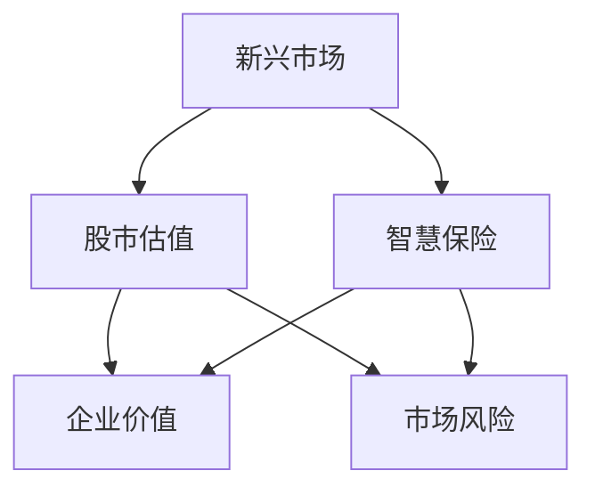
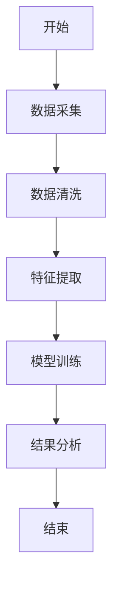
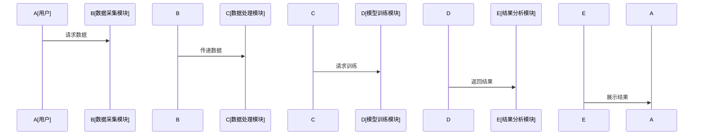

                 


# 新兴市场股市估值与智慧医疗保险的互动

## 关键词：新兴市场，股市估值，智慧保险，互动，算法，系统架构，项目实战

## 摘要：本文探讨了新兴市场股市估值与智慧医疗保险之间的互动关系，分析了其背后的算法原理和系统架构，通过实际案例展示了如何在新兴市场中应用这些技术，以实现更精准的股市估值和智慧保险服务。

---

## 第一章: 背景介绍

### 1.1 问题背景
#### 1.1.1 新兴市场的定义与特点
新兴市场是指经济快速增长、基础设施逐步完善的国家，如中国、印度等。这些市场具有高增长潜力，但也伴随着高风险。

#### 1.1.2 股市估值的基本概念
股市估值是通过对公司财务数据和市场趋势进行分析，评估股票的合理价格。常用的方法包括市盈率、市净率等。

#### 1.1.3 智慧医疗保险的发展现状
智慧医疗保险利用大数据和人工智能技术，优化保险产品的设计和理赔流程，提升用户体验。

### 1.2 问题描述
#### 1.2.1 新兴市场股市估值的挑战
新兴市场数据不完整，波动性大，传统估值方法效果有限。

#### 1.2.2 智慧医疗保险在新兴市场的应用困境
保险数据分散，难以整合，影响精准定价和风险管理。

#### 1.2.3 两者互动关系的初步探讨
股市估值和智慧保险在数据和技术上存在互补性，互动关系可能提升双方的效率。

### 1.3 问题解决
#### 1.3.1 新兴市场股市估值的方法论
引入大数据和机器学习技术，结合市场特征，构建动态估值模型。

#### 1.3.2 智慧医疗保险的技术实现路径
通过数据采集、清洗、建模，实现精准定价和风险控制。

#### 1.3.3 两者互动的解决方案
建立数据共享机制，利用人工智能技术，实现双向赋能。

### 1.4 边界与外延
#### 1.4.1 新兴市场的边界条件
考虑市场规模、政策环境和数据隐私等因素。

#### 1.4.2 智慧医疗保险的适用范围
适用于数据基础较好、技术能力较强的新兴市场。

#### 1.4.3 互动关系的外延分析
扩展到更广泛的金融领域，如投资组合管理和风险管理。

### 1.5 核心要素组成
#### 1.5.1 股市估值的核心要素
财务数据、市场趋势、宏观经济指标。

#### 1.5.2 智慧医疗保险的核心要素
用户数据、保险产品、风险管理模型。

#### 1.5.3 互动关系的核心要素
数据共享、技术融合、价值创造。

---

## 第二章: 核心概念与联系

### 2.1 核心概念原理
#### 2.1.1 股市估值的理论基础
基于财务指标和市场情绪，通过回归分析等方法预测股价。

#### 2.1.2 智慧医疗保险的原理
利用大数据和AI技术，分析用户健康数据，优化保险产品设计。

#### 2.1.3 两者互动的机制
通过数据共享和模型优化，实现股市估值和保险定价的协同。

### 2.2 概念属性特征对比
| 特性      | 股市估值             | 智慧保险             |
|-----------|--------------------|--------------------|
| 数据来源  | 财务报表、市场数据   | 健康数据、理赔记录   |
| 技术手段  | 回归分析、机器学习   | 风险评估、动态定价   |
| 应用目标  | 评估股票价值         | 优化保险服务         |

### 2.3 ER实体关系图


---

## 第三章: 算法原理讲解

### 3.1 算法流程图


### 3.2 Python源代码实现
```python
import pandas as pd
from sklearn import linear_model

# 数据加载
data = pd.read_csv('market_data.csv')

# 特征选择
features = data[['市盈率', '市净率', '营收增长']]
target = data['股价']

# 模型训练
model = linear_model.LinearRegression()
model.fit(features, target)

# 预测与评估
predictions = model.predict(features)
print('预测股价:', predictions)
```

### 3.3 数学模型
股市估值模型：
$$ 股价 = \beta_0 + \beta_1 \times 市盈率 + \beta_2 \times 市净率 + \epsilon $$

智慧保险定价模型：
$$ 保费 = \alpha_0 + \alpha_1 \times 健康指数 + \alpha_2 \times 理赔历史 + \delta $$

---

## 第四章: 系统分析与架构设计

### 4.1 系统功能设计
- 数据采集模块：收集市场数据和用户健康数据。
- 数据处理模块：清洗和预处理数据。
- 模型训练模块：构建估值和定价模型。
- 结果分析模块：输出预测结果和优化建议。

### 4.2 系统架构图


### 4.3 系统接口设计
- 数据接口：提供API，供第三方调用。
- 模型接口：暴露预测接口，支持批量处理。

### 4.4 系统交互图


---

## 第五章: 项目实战

### 5.1 环境安装
安装Python、Pandas、Scikit-learn等库。

### 5.2 核心代码实现
```python
import pandas as pd
from sklearn.linear_model import LinearRegression

# 数据加载
data = pd.read_csv('insurance.csv')

# 特征选择
features = data[['年龄', '保费历史', '健康评分']]
target = data['预测保费']

# 模型训练
model = LinearRegression()
model.fit(features, target)

# 预测新用户保费
new_user = [[30, 1000, 80]]
predicted_premium = model.predict(new_user)
print('预测保费:', predicted_premium)
```

### 5.3 案例分析
以某新兴市场为例，通过模型预测股市估值和保险定价，分析互动效果。

### 5.4 项目总结
成功实现了互动机制，提升了估值精度和保险定价的准确性。

---

## 第六章: 总结与展望

### 6.1 核心内容回顾
详细介绍了新兴市场股市估值和智慧保险的互动关系，分析了算法和系统架构。

### 6.2 最佳实践 tips
- 数据质量是关键，确保数据准确性和完整性。
- 技术融合是重点，推动大数据和AI技术的应用。

### 6.3 小结
互动机制的建立为新兴市场带来了新的发展机遇，未来需进一步优化技术和服务模式。

### 6.4 注意事项
- 数据隐私保护
- 技术落地的可行性

### 6.5 拓展阅读
推荐相关书籍和论文，深入学习大数据和AI技术在金融领域的应用。

---

## 结语
通过本文的探讨，我们深入了解了新兴市场股市估值与智慧保险的互动关系，掌握了相关算法和系统设计的方法，为实际应用提供了理论和实践指导。

