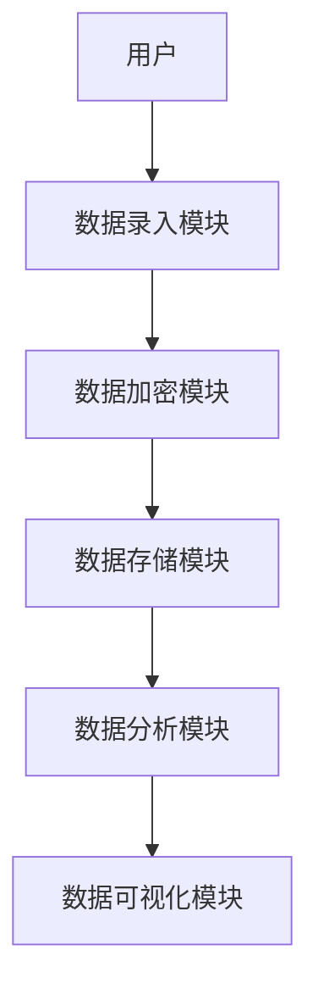
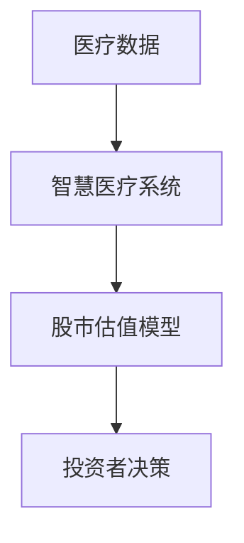
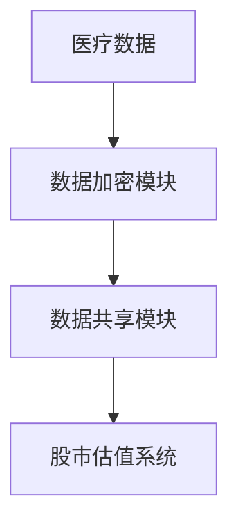
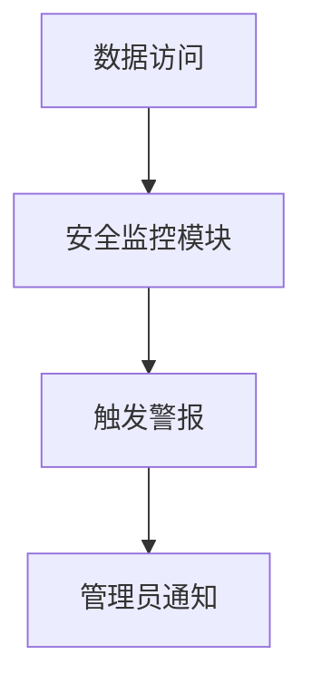
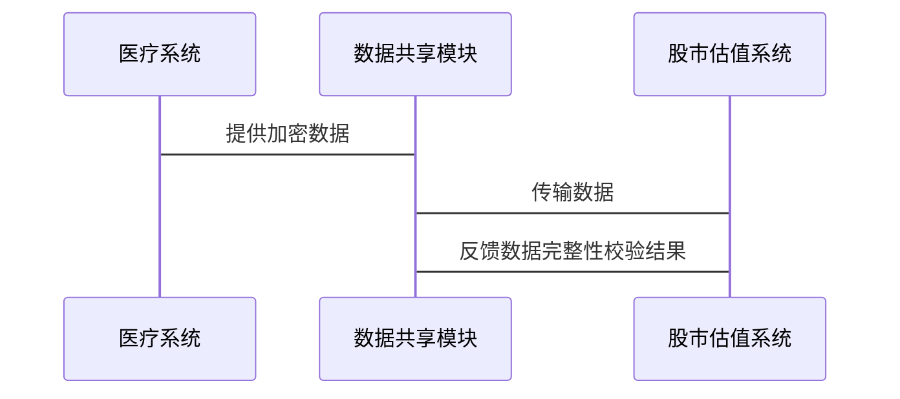
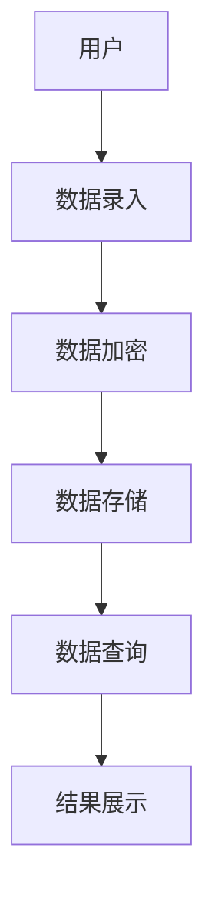

                 


# 新兴市场股市估值与智慧医疗数据安全的互动

> **关键词**：新兴市场、股市估值、智慧医疗、数据安全、互动机制  
> **摘要**：本文探讨了新兴市场股市估值与智慧医疗数据安全之间的互动关系。通过分析股市估值的关键算法、智慧医疗数据安全的核心技术，以及两者如何在实际场景中相互影响，本文旨在揭示数据安全对股市估值的潜在影响，并提出构建互动机制的系统设计与实现方案。

---

# 第1章: 背景与概念

## 1.1 股市估值与智慧医疗数据安全的互动概述

### 1.1.1 背景介绍
新兴市场（如中国、印度等）的股市近年来发展迅速，吸引了大量投资者的关注。与此同时，智慧医疗（通过大数据、人工智能等技术提升医疗效率和患者体验）正在成为医疗行业的重要趋势。两者看似无关，但通过数据的流动与共享，它们之间形成了复杂的互动关系。

### 1.1.2 核心概念与问题
- **股市估值**：衡量公司或股票的价值，通常通过市盈率、市净率等指标进行评估。
- **智慧医疗数据安全**：在智慧医疗系统中，患者的医疗数据可能被用于股市估值，但数据泄露可能导致严重的隐私问题。
- **互动机制**：智慧医疗数据的流动可能影响股市估值，而股市的波动也可能反向影响智慧医疗企业的投资。

### 1.1.3 研究意义
理解这种互动关系有助于优化股市估值模型，同时也能为智慧医疗数据的安全保护提供新的思路。

## 1.2 核心概念与联系

### 1.2.1 股市估值的关键因素
- 公司基本面（收入、利润、增长潜力）
- 行业趋势（政策变化、技术进步）
- 宏观经济环境（利率、通胀）

### 1.2.2 智慧医疗数据安全的挑战
- 医疗数据的敏感性
- 数据泄露的法律风险
- 第三方服务的依赖性

### 1.2.3 互动机制的理论模型
通过数据共享，智慧医疗企业可能成为新兴市场的投资热点，但数据安全问题会影响投资者对这些企业的估值。

---

# 第2章: 股市估值的算法原理

## 2.1 基于数据的股市估值方法

### 2.1.1 市盈率模型
市盈率（P/E）是衡量股票价值的重要指标，公式为：
$$ P/E = \frac{\text{股价}}{\text{每股收益}} $$

### 2.1.2 市净率模型
市净率（P/B）衡量股票价格与账面价值的比例，公式为：
$$ P/B = \frac{\text{股价}}{\text{每股净资产}} $$

### 2.1.3 时间序列预测
使用ARIMA模型预测股价走势：
$$ \hat{y}_t = a + bt + ct^2 $$

## 2.2 算法实现与案例分析

### 2.2.1 Python代码实现
```python
import pandas as pd
import numpy as np
from statsmodels.tsa.arima_model import ARIMA

# 示例数据：股票价格
data = pd.Series([100, 105, 110, 115, 120], index=[1, 2, 3, 4, 5])

# ARIMA模型训练
model = ARIMA(data, order=(1, 1, 1))
model_fit = model.fit()

# 预测未来价格
forecast = model_fit.forecast(steps=5)
print(forecast)
```

### 2.2.2 案例分析
假设某智慧医疗企业在新兴市场上市，其股价受数据安全事件影响大幅波动。通过ARIMA模型分析，可以发现数据泄露事件对股价的短期冲击。

---

# 第3章: 智慧医疗数据安全的技术实现

## 3.1 数据加密与隐私保护

### 3.1.1 加密算法原理
使用AES加密算法保护医疗数据：
$$ C = (P + k) \mod 256 $$
其中，$P$ 是明文，$k$ 是密钥。

### 3.1.2 数据脱敏技术
对敏感字段（如患者身份证号）进行脱敏处理：
$$ \text{脱敏后数据} = f(P) $$

## 3.2 数据安全的数学模型

### 3.2.1 零知识证明
验证数据完整性：
$$ Verify(g, h, a, x) = true \text{ 如果 } h^x \equiv a \mod g $$

### 3.2.2 数据访问控制
基于角色的访问控制（RBAC）模型：
$$ \text{允许访问} = \text{用户角色} \in \text{允许的角色列表} $$

## 3.3 系统实现与案例分析

### 3.3.1 系统架构设计


### 3.3.2 安全事件案例
某智慧医疗平台因数据泄露导致股价下跌，通过分析可以发现数据安全事件对股市估值的直接影响。

---

# 第4章: 互动机制的系统设计

## 4.1 问题场景分析

### 4.1.1 数据流动路径


### 4.1.2 安全风险
- 数据泄露影响股价
- 投资者因数据不安全而规避投资

## 4.2 系统功能设计

### 4.2.1 数据共享模块


### 4.2.2 数据安全监控
实时监控数据访问行为：


## 4.3 系统接口与交互

### 4.3.1 数据接口设计


### 4.3.2 用户交互流程


---

# 第5章: 项目实战与案例分析

## 5.1 环境配置

### 5.1.1 技术选型
- Python 3.8+
- Pandas、NumPy、Scikit-learn
- Flask或Django框架

## 5.2 核心代码实现

### 5.2.1 数据安全模块
```python
import hashlib

def encrypt_data(data):
    return hashlib.sha256(data.encode()).hexdigest()
```

### 5.2.2 股市估值模块
```python
import pandas as pd
from statsmodels.tsa.arima_model import ARIMA

def predict_stock_price(data, order):
    model = ARIMA(data, order=order)
    model_fit = model.fit()
    forecast = model_fit.forecast(steps=5)
    return forecast
```

## 5.3 案例分析与解读

### 5.3.1 案例背景
某新兴市场中的智慧医疗企业因数据泄露事件导致股价大幅下跌，通过数据分析验证了数据安全对股市估值的影响。

### 5.3.2 分析结果
- 数据泄露事件发生后，市盈率和市净率均显著下降。
- 投资者对智慧医疗企业的信任度下降，影响了整体市场的估值。

---

# 第6章: 总结与展望

## 6.1 小结
本文通过分析新兴市场股市估值与智慧医疗数据安全的互动关系，提出了构建互动机制的系统设计与实现方案。通过案例分析和算法实现，验证了数据安全对股市估值的重要影响。

## 6.2 展望
未来，随着智慧医疗和金融科技的进一步融合，数据安全将成为股市估值的核心影响因素之一。建议进一步研究如何通过技术手段平衡数据共享与安全保护。

---

**注意事项**：在实际应用中，需严格遵守相关法律法规，确保数据安全和隐私保护。同时，建议结合具体场景优化算法模型，以提高互动机制的效率和准确性。

