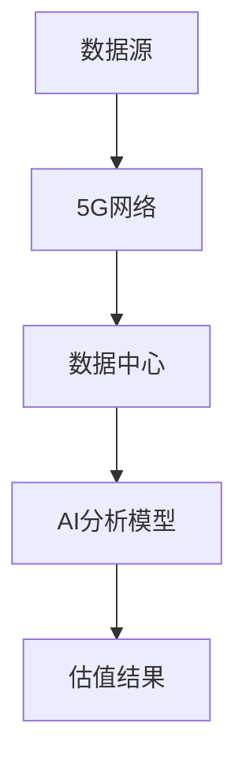
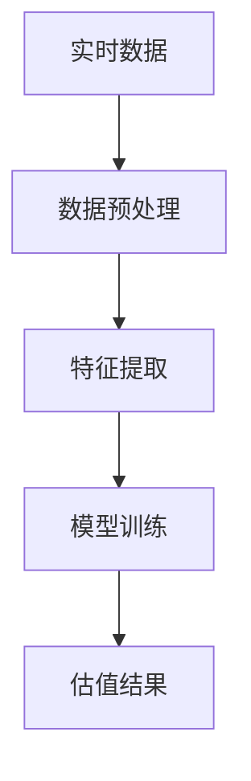
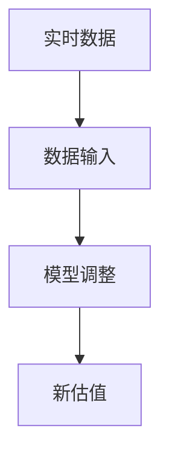

                 

# 《新兴市场股市估值与智慧城市5G+AI应用的互动》

> 关键词：新兴市场，股市估值，智慧城市，5G，AI，数据驱动，动态调整，投资策略，技术应用，经济影响

> 摘要：本文深入探讨新兴市场股市估值与智慧城市中5G和AI应用的互动关系。通过分析股市估值的核心概念、5G和AI在智慧城市中的应用场景，以及它们如何相互影响，本文揭示了新兴市场中技术进步对经济估值的深远影响。结合数学模型、算法流程图和实际案例，本文为读者提供了全面的视角，帮助理解5G+AI如何改变股市估值的计算方式和投资策略。

---

## 第1章：新兴市场股市估值与智慧城市5G+AI应用的背景介绍

### 1.1 新兴市场股市估值的重要性

#### 1.1.1 股市估值的基本概念
股市估值是通过分析公司财务状况、市场环境和经济指标，对股票价格进行合理评估的过程。常用的估值方法包括市盈率（P/E）、市净率（P/B）和现金流折现法（DCF）。

#### 1.1.2 新兴市场的独特性
新兴市场通常具有高增长潜力，但同时也伴随着更高的风险。这些市场的波动性较大，受到政策、经济和地缘政治因素的影响。

#### 1.1.3 股市估值对经济发展的意义
股市估值不仅是投资者决策的依据，也是衡量经济健康状况的重要指标。在新兴市场中，合理的估值能够吸引外资流入，促进经济发展。

### 1.2 智慧城市的基本概念与特点

#### 1.2.1 智慧城市的定义
智慧城市是通过智能化技术（如5G、AI、物联网等）优化城市资源配置、提升居民生活质量的城市发展模式。

#### 1.2.2 智慧城市的组成部分
智慧城市包括智能交通、智能安防、智能能源、智能医疗等多个组成部分，这些系统的协同运作能够提升城市的运行效率。

#### 1.2.3 智慧城市的发展趋势
随着技术的进步，智慧城市将更加依赖于实时数据的采集和分析，5G和AI技术的应用将推动智慧城市的进一步发展。

### 1.3 5G与AI在智慧城市中的作用

#### 1.3.1 5G技术的核心优势
- **高速率**：5G的传输速度远超4G，能够支持大量数据的实时传输。
- **低延迟**：5G的低延迟特性使其在实时应用中具有显著优势，如自动驾驶和远程医疗。
- **大规模连接**：5G能够支持海量设备的连接，为物联网应用提供了基础。

#### 1.3.2 AI在智慧城市中的应用场景
- **智能交通管理**：通过AI算法优化交通流量，减少拥堵。
- **智能安防**：利用AI进行视频监控，实时识别潜在风险。
- **智能能源管理**：通过AI分析能源消耗数据，优化能源分配。

#### 1.3.3 5G+AI的协同效应
5G提供了高速、低延迟的数据传输通道，而AI则通过数据分析和模式识别，提升了系统的智能化水平。两者的结合使得智慧城市中的数据处理更加高效和精准。

---

## 第2章：新兴市场股市估值的核心概念与分析框架

### 2.1 股市估值的基本原理

#### 2.1.1 股票价值的决定因素
股票价值由公司的盈利能力、成长潜力、行业地位和市场环境等因素决定。常用的财务指标包括净利润、营业收入、资产负债率等。

#### 2.1.2 市场情绪与股价波动
市场情绪是影响股价波动的重要因素。投资者的心理预期和市场 sentiment 可能会导致股价的短期波动。

#### 2.1.3 财务指标在估值中的应用
通过分析公司的财务报表，可以评估公司的盈利能力和财务健康状况。常用的财务指标包括市盈率（P/E）、市净率（P/B）和股息率等。

### 2.2 新兴市场的特殊性与挑战

#### 2.2.1 新兴市场的经济特征
新兴市场通常具有较高的经济增长率，但同时也伴随着较高的波动性和不确定性。

#### 2.2.2 新兴市场的政策环境
新兴市场的政策环境可能不够稳定，政府政策的变化可能对股市估值产生重大影响。

#### 2.2.3 新兴市场的风险因素
新兴市场可能面临经济波动、政治风险和市场流动性不足等风险。

### 2.3 智慧城市5G+AI应用的互动机制

#### 2.3.1 数据驱动的估值模型
通过实时数据的采集和分析，可以构建更加动态的估值模型。5G和AI技术为数据的实时传输和分析提供了技术支持。

#### 2.3.2 5G+AI在数据采集与分析中的作用
- **数据采集**：5G技术提供了高速数据传输通道，使得实时数据的采集成为可能。
- **数据分析**：AI技术通过机器学习算法，对海量数据进行分析和挖掘，提取有价值的信息。

#### 2.3.3 互动机制的核心逻辑
通过5G和AI技术，可以实现数据的实时采集和分析，从而动态调整股市估值模型。这种互动机制能够提高估值的准确性和实时性。

---

## 第3章：新兴市场股市估值的数学模型与公式

### 3.1 常用估值方法概述

#### 3.1.1 市盈率（P/E）法
市盈率是股票价格与每股收益的比率，公式为：
$$P/E = \frac{Price}{Earnings\ per\ share}$$

#### 3.1.2 市净率（P/B）法
市净率是股票价格与每股净资产的比率，公式为：
$$P/B = \frac{Price}{Book\ value\ per\ share}$$

#### 3.1.3 现金流折现法（DCF）
现金流折现法是通过将未来现金流折现，计算其现值。公式为：
$$DCF = \sum_{t=1}^{n} \frac{CF_t}{(1+r)^t}$$
其中，$CF_t$ 是第 $t$ 年的现金流，$r$ 是折现率。

### 3.2 新兴市场的调整系数

#### 3.2.1 市场流动性调整
在新兴市场中，由于市场流动性不足，股票估值可能需要进行调整。调整系数可以表示为：
$$\text{调整系数} = \text{流动性调整因子} \times \text{基础估值}$$

#### 3.2.2 风险溢价调整
新兴市场的风险溢价较高，因此需要在估值中加入风险溢价。公式为：
$$\text{调整后估值} = \text{基础估值} + \text{风险溢价}$$

#### 3.2.3 经济周期影响
经济周期对股市估值有重要影响。在经济繁荣时期，股市估值可能被高估；在经济衰退时期，股市估值可能被低估。

### 3.3 5G+AI驱动的动态估值模型

#### 3.3.1 数据流驱动的动态调整
通过5G技术实时采集数据，并利用AI算法进行动态调整。公式为：
$$\text{动态估值} = \text{基础估值} + \text{数据驱动的调整项}$$

#### 3.3.2 AI算法在估值模型中的应用
AI算法可以通过机器学习模型，对历史数据进行分析，预测未来的股票价格。常用的算法包括线性回归、支持向量机（SVM）和神经网络等。

#### 3.3.3 5G技术对数据实时性的提升
5G技术的低延迟特性使得实时数据的采集和分析成为可能，从而提高了估值模型的实时性和准确性。

---

## 第4章：5G与AI在股市估值中的应用

### 4.1 数据流驱动的估值模型

#### 4.1.1 数据流的采集与传输
通过5G技术，可以实现数据的实时采集和传输。数据流的示意图如下：

#### 4.1.2 数据分析与处理
AI分析模型对数据进行处理，提取有价值的信息，并生成估值结果。常用的AI算法包括：
- **线性回归**：用于预测股票价格。
- **支持向量机（SVM）**：用于分类和回归分析。
- **神经网络**：用于复杂的数据模式识别。

#### 4.1.3 估值结果的输出
通过AI分析模型生成的估值结果可以实时反馈给投资者，帮助他们做出投资决策。

### 4.2 互动机制的实现

#### 4.2.1 实时数据处理
通过5G和AI技术，可以实现数据的实时处理和分析。数据处理的流程如下：

#### 4.2.2 动态调整模型
根据实时数据的变化，动态调整估值模型。调整过程如下：

---

## 第5章：实际案例分析

### 5.1 某新兴市场股市估值的案例

#### 5.1.1 案例背景
以某新兴市场为例，分析5G和AI技术在股市估值中的应用。

#### 5.1.2 数据分析
通过5G技术采集实时数据，并利用AI算法进行分析。

#### 5.1.3 估值结果
根据分析结果，生成动态估值，并与实际股价进行对比。

### 5.2 智慧城市中的5G+AI应用

#### 5.2.1 智能交通管理
通过5G和AI技术，实现交通流量的实时监控和优化。

#### 5.2.2 智能安防
利用5G和AI技术，实现视频监控和风险识别。

---

## 第6章：未来趋势与投资策略

### 6.1 技术创新的驱动
随着5G和AI技术的进一步发展，股市估值的计算方式和投资策略将变得更加智能化。

### 6.2 政策支持的作用
政府政策的支持是新兴市场股市估值和智慧城市发展的重要推动力。

### 6.3 投资机会的展望
在5G和AI技术的推动下，新兴市场中将涌现出更多的投资机会。

---

## 第7章：总结与展望

### 7.1 本章总结
本文深入分析了新兴市场股市估值与智慧城市5G+AI应用的互动关系，探讨了5G和AI技术在股市估值中的应用，以及它们对智慧城市发展的推动作用。

### 7.2 展望未来
随着技术的不断进步，5G和AI在股市估值和智慧城市中的应用将更加广泛和深入。未来的研究可以进一步探讨5G和AI技术在股市估值中的具体应用案例，以及它们对全球经济的影响。

---

## 第8章：最佳实践与注意事项

### 8.1 投资者注意事项
- **技术应用**：投资者应关注5G和AI技术在股市估值中的应用。
- **风险管理**：新兴市场风险较高，投资者需谨慎决策。
- **政策环境**：政策变化可能对股市估值产生重大影响。

### 8.2 开发者的建议
- **技术整合**：开发者应注重5G和AI技术的整合，提升系统的智能化水平。
- **数据安全**：在数据采集和分析过程中，需注重数据安全和隐私保护。

### 8.3 未来研究方向
- **技术优化**：进一步优化5G和AI技术在股市估值中的应用。
- **跨学科研究**：结合经济学、计算机科学等多学科，开展更深入的研究。

---

以上是《新兴市场股市估值与智慧城市5G+AI应用的互动》的完整目录大纲和详细内容。通过分章节的深入分析和具体案例的探讨，本文为读者提供了全面的视角，帮助理解5G和AI技术在股市估值和智慧城市中的互动关系。

