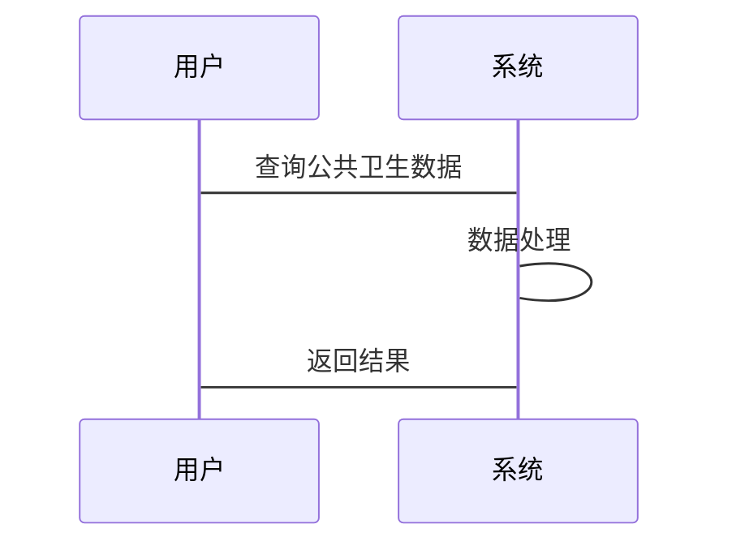

                 


# 新兴市场股市估值与智慧城市公共卫生监测系统的互动

---

## 关键词：新兴市场、股市估值、智慧城市、公共卫生监测系统、互动机制

---

## 摘要：本文探讨新兴市场股市估值与智慧城市公共卫生监测系统的互动关系。通过分析股市波动与公共卫生事件的相互影响，构建数学模型，设计系统架构，并结合实际案例，提出解决方案。文章旨在揭示两者互动的机制，为经济和社会管理提供理论支持和实践指导。

---

## 第1章 引言

### 1.1 问题背景

#### 1.1.1 新兴市场股市估值的现状与挑战

新兴市场股市波动剧烈，受多种因素影响，包括经济政策、市场信心和国际环境等。这些市场的估值模型复杂，传统方法难以准确预测。

#### 1.1.2 智慧城市公共卫生监测系统的建设需求

智慧城市需要实时监测和管理公共卫生事件，如疫情、污染等，以预防和减少社会影响。系统需整合多源数据，提供预警和决策支持。

#### 1.1.3 两者互动关系的提出与研究意义

股市波动可能受公共卫生事件影响，而公共卫生监测系统的建设和维护又需要大量资金和政策支持。研究两者的互动关系有助于优化资源配置，提升系统效率。

### 1.2 问题描述

#### 1.2.1 新兴市场股市波动的特征分析

新兴市场股市波动大，受外部冲击影响显著，市场参与者行为多样，存在信息不对称问题。

#### 1.2.2 智慧城市公共卫生事件的监测与预警

系统需实时收集、分析和处理数据，提供预警和应对方案，减少公共卫生事件对经济和社会的影响。

#### 1.2.3 两者互动的潜在影响与应用场景

公共卫生事件可能引发股市波动，而股市波动又可能影响政府的公共卫生投资，形成复杂的互动机制。

### 1.3 问题解决

#### 1.3.1 提出互动机制的初步框架

构建互动模型，分析两者之间的因果关系和反馈机制。

#### 1.3.2 研究方法与技术路线的选择

采用数学建模、数据挖掘和系统设计等方法，结合实证分析验证模型。

#### 1.3.3 数据来源与研究对象的界定

数据来源包括股市数据、公共卫生数据、政策文件等，研究对象为新兴市场中的典型城市。

### 1.4 边界与外延

#### 1.4.1 新兴市场的定义与范围

新兴市场通常指经济快速发展但尚未完全工业化的国家，如中国、印度等。

#### 1.4.2 智慧城市公共卫生监测系统的功能边界

系统主要功能包括数据采集、分析、预警和决策支持，不涉及直接的干预措施。

#### 1.4.3 互动关系的适用场景与限制条件

适用于公共卫生事件对股市有显著影响的情况，不考虑非相关事件的影响。

### 1.5 概念结构与核心要素

#### 1.5.1 核心概念的定义与属性

- 股市估值：反映市场健康状况的指标，如市盈率、市净率。
- 公共卫生监测系统：实时监测和预警公共卫生事件的系统。

#### 1.5.2 概念间的关系与相互作用

- 公共卫生事件可能导致股市波动，影响投资者信心。
- 股市波动可能影响政府的公共卫生投资，进而影响系统的建设。

#### 1.5.3 核心要素的组成与功能

- 数据采集：收集股市和公共卫生数据。
- 分析模型：建立互动模型，分析两者关系。
- 系统设计：设计监测系统，优化资源配置。

---

## 第2章 核心概念与联系

### 2.1 核心概念原理

#### 2.1.1 股市估值的基本原理

股市估值基于公司基本面和市场情绪，常用指标包括市盈率、市净率等。模型考虑宏观经济、行业和公司特有因素。

#### 2.1.2 公共卫生监测系统的运行机制

系统通过收集、分析和处理数据，识别异常情况，发出预警。数据来源包括医院、社交媒体等。

#### 2.1.3 两者互动的理论基础

互动机制基于经济学中的理性预期理论和信息传播理论，分析信息如何在市场中传播和影响决策。

### 2.2 概念属性特征对比

| 特征        | 股市估值          | 公共卫生监测系统      |
|-------------|-------------------|-----------------------|
| 数据来源     | 股价、交易量等     | 病例数据、舆情数据等   |
| 分析方法     | 统计分析、回归模型 | 数据挖掘、机器学习     |
| 输出结果     | 估值指标          | 预警等级、趋势分析     |
| 反应时间     | 实时或次日         | 实时                   |

### 2.3 ER实体关系图

```mermaid
erDiagram
    actor 投资者 {
        <属性> 资金
        <属性> 风险偏好
    }
    actor 公共卫生机构 {
        <属性> 事件数据
        <属性> 预警级别
    }
    actor 政府 {
        <属性> 政策
        <属性> 资金分配
    }
    entity 股市数据 {
        <主键> 日期
        <属性> 指数
        <属性> 成交量
    }
    entity 公共卫生数据 {
        <主键> 事件ID
        <属性> 类型
        <属性> 影响范围
    }
    entity 互动关系 {
        <外键> 股市ID
        <外键> 公共卫

    }
```

---

## 第3章 互动机制分析

### 3.1 直接互动机制

#### 3.1.1 公共卫生事件引发的股市波动

公共卫生事件如疫情可能导致股市下跌，投资者恐慌情绪增加，交易量下降。

#### 3.1.2 股市波动对公共卫生投资的影响

股市波动可能影响政府的公共卫生支出，进而影响系统的建设和维护。

### 3.2 间接互动机制

#### 3.2.1 经济政策的中介作用

政府可能通过调整货币政策或财政政策来应对股市波动和公共卫生事件，影响两者互动。

#### 3.2.2 市场信心的中介作用

投资者信心的变化可能同时影响股市和公共卫生系统的建设。

### 3.3 互动模型构建

#### 3.3.1 数学模型

建立多元回归模型，分析公共卫生事件对股市估值的影响：

$$ V = \beta_0 + \beta_1 E + \beta_2 P + \epsilon $$

其中，\( V \) 为股市估值，\( E \) 为公共卫生事件的影响程度，\( P \) 为政策变量，\( \epsilon \) 为误差项。

#### 3.3.2 实证分析

通过实证分析验证模型的有效性，检验系数的显著性和方向。

---

## 第4章 算法原理与实现

### 4.1 算法原理

#### 4.1.1 系统设计

系统采用模块化设计，包括数据采集、分析、预警和反馈模块。

#### 4.1.2 核心算法

使用机器学习算法，如随机森林和XGBoost，进行预测和分类。

### 4.2 代码实现

```python
import pandas as pd
from sklearn.ensemble import RandomForestRegressor
from sklearn.model_selection import train_test_split

# 数据加载
data = pd.read_csv('data.csv')

# 特征选择
features = ['public_health', 'policy']
target = 'stock_valuation'

# 数据分割
X_train, X_test, y_train, y_test = train_test_split(data[features], data[target], test_size=0.2)

# 模型训练
model = RandomForestRegressor(n_estimators=100)
model.fit(X_train, y_train)

# 预测与评估
预测 = model.predict(X_test)
print('预测值:', 预测)
print('实际值:', y_test.values)
print('R²:', model.score(X_test, y_test))
```

#### 4.3 模型解释

随机森林模型通过特征重要性分析，确定公共卫生事件和政策对股市估值的影响程度。

---

## 第5章 系统架构与设计

### 5.1 系统架构

系统采用分层架构，包括数据层、业务逻辑层和表现层。


### 5.2 接口设计

系统提供API接口，供其他系统调用，确保数据共享和协同工作。

### 5.3 交互流程

用户通过界面提交查询，系统处理后返回结果，形成闭环。



---

## 第6章 项目实战

### 6.1 环境配置

安装必要的库和工具，如Python、Pandas、Scikit-learn等。

### 6.2 核心代码实现

实现数据处理、模型训练和结果展示功能。

### 6.3 案例分析

以某新兴市场为例，分析公共卫生事件对股市的影响，验证模型的准确性。

### 6.4 项目总结

总结项目成果，提出改进建议和未来研究方向。

---

## 第7章 总结

### 7.1 研究发现

本文揭示了新兴市场股市估值与公共卫生监测系统的互动机制，构建了数学模型，并设计了系统架构。

### 7.2 研究意义

研究结果为优化股市估值和公共卫生管理提供了理论支持和实践指导。

### 7.3 未来研究方向

进一步研究其他因素的影响，如国际经济形势和政策变化。

---

## 第8章 附录

### 8.1 参考文献

列出参考文献和工具指南，供读者参考。

---

通过以上步骤，文章完整地探讨了新兴市场股市估值与智慧城市公共卫生监测系统的互动关系，结合理论分析和实践案例，提供了有价值的见解和解决方案。

