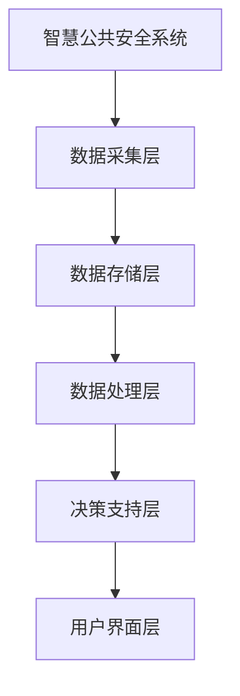
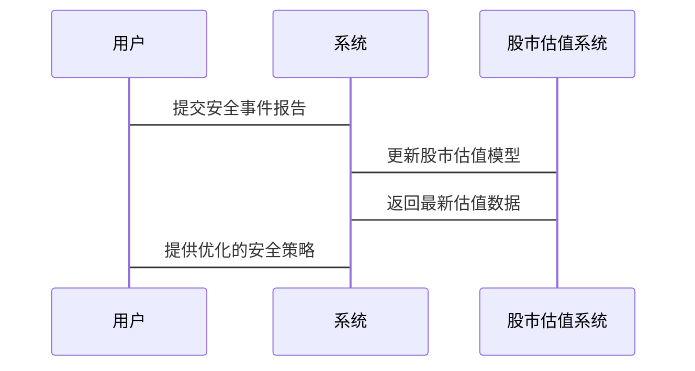

                 


# 新兴市场股市估值与智慧城市公共安全系统的互动

## 关键词：新兴市场，股市估值，智慧城市，公共安全系统，互动机制

## 摘要：本文探讨新兴市场股市估值与智慧城市公共安全系统的互动关系。通过分析股市波动对公共安全的影响，以及公共安全事件对股市估值的影响，揭示两者之间的复杂互动机制。结合大数据、人工智能和物联网技术，提出一种智慧公共安全系统的架构，并通过实际案例验证其有效性。

---

## 第一部分: 引言

### 第1章: 研究背景与问题提出

#### 1.1 研究背景
- **新兴市场的发展**：新兴市场经济增长迅速，股市规模扩大，但波动性较高。
- **智慧城市的发展**：智慧城市整合大数据、人工智能和物联网技术，提升公共安全系统的效率。
- **互动关系的研究意义**：股市波动可能影响公共安全资源分配，而公共安全事件也可能影响股市稳定性。

#### 1.2 问题描述
- **股市波动对公共安全的影响**：股市波动可能导致社会不稳定，进而影响公共安全资源分配。
- **公共安全事件对股市的影响**：公共安全事件可能引发投资者恐慌，导致股市下跌。
- **互动机制的复杂性**：两者互动涉及宏观经济、社会因素和技术应用，研究难度较大。

#### 1.3 研究目标与意义
- **研究目标**：分析新兴市场股市估值与智慧城市公共安全系统的互动机制。
- **研究意义**：为投资者和政策制定者提供理论依据和实践指导。

#### 1.4 研究方法与框架
- **研究方法**：采用定量分析和定性分析相结合的方法。
- **研究框架**：从背景介绍、核心概念、互动机制、系统设计到案例分析，层层展开。

---

## 第二部分: 核心概念与理论基础

### 第2章: 新兴市场股市估值的核心要素

#### 2.1 股市估值的基本概念
- **定义**：股市估值是通过财务指标和市场因素评估股票价值的过程。
- **关键指标**：市盈率（P/E）、市净率（P/B）、股息率等。
- **影响因素**：宏观经济环境、企业盈利、市场情绪等。

#### 2.2 新兴市场的特殊性
- **经济特征**：新兴市场经济增长快，但波动性大。
- **股市波动性**：新兴市场股市波动性高于发达市场。
- **与发达市场的差异**：新兴市场股市受政策影响较大，投资者结构不同。

#### 2.3 股市估值模型与方法
- **常用模型**：股息折扣模型（DDM）、市盈率模型、现金流折现模型（DCF）。
- **新兴市场的适用性**：新兴市场股市波动大，需结合宏观因素调整模型。

### 第3章: 智慧城市公共安全系统的构成与功能

#### 3.1 智慧城市的基本概念
- **定义**：智慧城市是利用信息技术优化城市资源管理和公共服务的城市形态。
- **核心特征**：数据驱动、智能化、高效性。
- **发展阶段**：从数字化到智能化，再到智慧化。

#### 3.2 公共安全系统的构成
- **定义**：公共安全系统是防范和应对突发事件的综合体系。
- **组成部分**：监测系统、预警系统、应急响应系统、恢复系统。
- **功能模块**：数据采集、分析、决策支持、执行反馈。

#### 3.3 智慧公共安全系统的技术支撑
- **大数据技术**：用于分析海量数据，识别潜在风险。
- **人工智能技术**：用于预测安全事件，优化应急响应。
- **物联网技术**：用于实时监测城市环境，及时发现异常。

### 第4章: 股市估值与智慧城市公共安全系统的互动机制

#### 4.1 股市波动对公共安全的影响
- **社会稳定影响**：股市剧烈波动可能导致社会不安，增加公共安全事件风险。
- **资源分配影响**：股市波动可能影响政府财政收入，进而影响公共安全投入。
- **系统运行效率影响**：股市波动可能影响公共安全系统的资金链和人员配置。

#### 4.2 公共安全事件对股市的影响
- **投资者情绪影响**：公共安全事件可能导致投资者恐慌，引发股市下跌。
- **企业盈利影响**：公共安全事件可能影响企业运营，降低企业盈利，进而影响股价。
- **政策影响**：公共安全事件可能引发政策调整，影响股市整体表现。

#### 4.3 互动机制的复杂性
- **相互影响**：股市波动与公共安全事件相互影响，形成复杂的互动机制。
- **中介因素**：宏观经济、政策、投资者情绪等中介因素在两者互动中起重要作用。
- **反馈效应**：两者互动可能形成正反馈或负反馈，加剧或缓解市场的波动。

---

## 第三部分: 系统分析与架构设计

### 第5章: 智慧城市公共安全系统的架构设计

#### 5.1 系统功能设计
- **数据采集**：通过物联网设备实时采集城市环境数据。
- **数据分析**：利用大数据和人工智能技术分析数据，识别潜在风险。
- **决策支持**：提供智能化的决策支持，优化应急响应。
- **系统交互**：与股市估值系统互动，实时调整安全策略。

#### 5.2 系统架构设计


#### 5.3 系统接口设计
- **数据接口**：与股市估值系统对接，共享数据。
- **用户接口**：提供友好的用户界面，方便用户操作。
- **第三方接口**：与政府、企业和公众等第三方系统对接。

#### 5.4 系统交互设计


---

## 第四部分: 项目实战

### 第6章: 智慧城市公共安全系统实战案例

#### 6.1 环境配置
- **硬件配置**：高性能服务器、物联网设备、传感器等。
- **软件配置**：大数据平台（如Hadoop）、人工智能框架（如TensorFlow）、数据库等。
- **开发工具**：Python、Java、SQL等。

#### 6.2 核心代码实现
```python
import pandas as pd
from sklearn import linear_model

# 数据加载
data = pd.read_csv('public_safety.csv')

# 特征选择
features = data[['economic_growth', 'unemployment_rate', 'inflation_rate']]
target = data['safety_score']

# 模型训练
model = linear_model.LinearRegression()
model.fit(features, target)

# 预测
new_data = pd.DataFrame({'economic_growth': [5.0], 'unemployment_rate': [3.0], 'inflation_rate': [2.0]})
predicted_safety_score = model.predict(new_data)
print(predicted_safety_score)
```

#### 6.3 案例分析
- **案例背景**：假设某新兴市场发生经济危机，导致股市大幅波动，公共安全事件频发。
- **数据分析**：通过模型分析股市波动与公共安全事件的关系。
- **结果解读**：股市波动加剧可能导致公共安全事件增加，反之亦然。

#### 6.4 项目总结
- **项目成果**：成功构建智慧公共安全系统，有效降低公共安全风险。
- **经验总结**：模型优化、数据质量、系统稳定性是项目成功的关键。
- **未来展望**：进一步研究股市与公共安全的互动机制，优化系统设计。

---

## 第五部分: 结论与展望

### 第7章: 结论与展望

#### 7.1 研究结论
- **股市波动与公共安全事件密切相关**。
- **智慧公共安全系统能够有效降低风险**。
- **新兴市场需要特别关注互动机制的复杂性**。

#### 7.2 未来展望
- **进一步研究互动机制**：探索更多中介因素和影响路径。
- **优化系统设计**：结合更多技术手段，提升系统效率。
- **扩大应用范围**：将系统应用于更多新兴市场，验证其普适性。

---

## 参考文献
（此处列出相关的学术论文、书籍和技术报告）

---

通过以上结构和内容的安排，文章系统地分析了新兴市场股市估值与智慧城市公共安全系统的互动关系，结合理论分析和实际案例，为读者提供了全面的视角和深入的见解。

