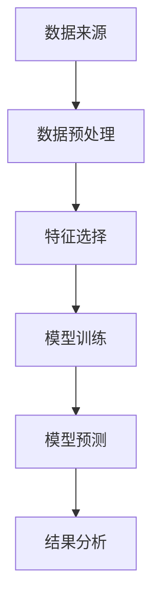
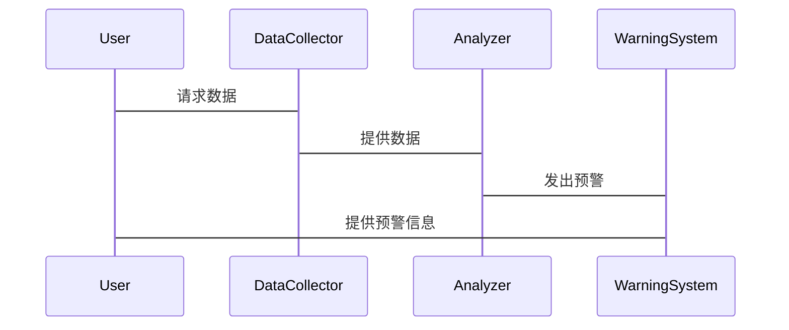

                 


# 新兴市场股市估值与智慧城市安全的互动

## 关键词：新兴市场、股市估值、智慧城市、安全、互动

## 摘要：
本文探讨新兴市场股市估值与智慧城市安全之间的互动关系。通过分析股市波动对智慧城市安全的影响，以及智慧城市安全对股市估值的反馈效应，揭示两者之间的动态平衡。结合数据驱动的方法和智能化技术，提出解决新兴市场股市估值与智慧城市安全互动问题的系统性方案。

---

## 第一部分: 背景介绍

### 第1章: 新兴市场股市估值与智慧城市安全的互动概述

#### 1.1 问题背景
- **新兴市场的定义与特点**：新兴市场是指经济快速发展、市场机制逐步完善但尚未完全成熟的国家和地区。这些市场通常具有高增长潜力，但也伴随着较高的波动性和不确定性。
- **智慧城市的核心概念**：智慧城市是指通过物联网、大数据、人工智能等技术手段，优化城市资源分配、提升居民生活质量的城市发展模式。其核心在于数据的高效利用和系统的智能化管理。
- **互动关系的重要性**：新兴市场的股市波动可能影响智慧城市建设的资金投入，而智慧城市的安全性又可能反过来影响投资者对市场的信心。

#### 1.2 问题描述
- **股市波动的复杂性**：新兴市场股市受宏观经济、政策变化和国际环境等多种因素影响，具有较高的不确定性和波动性。
- **智慧城市安全的挑战**：随着城市数字化程度的提高，智慧城市面临的数据安全、网络安全和物理安全威胁也在增加。
- **互动关系的潜在影响**：股市波动可能影响智慧城市的资金链，而智慧城市的安全性则可能影响股市投资者的信心。

#### 1.3 问题解决
- **数据驱动的方法**：通过收集和分析股市数据与智慧城市安全相关的数据，建立两者之间的关联模型。
- **智能化技术的应用**：利用机器学习、人工智能等技术，预测股市波动对智慧城市安全的影响，并提出应对策略。
- **多学科交叉研究**：结合金融学、计算机科学、城市规划等多学科知识，系统性地研究新兴市场股市估值与智慧城市安全的互动关系。

#### 1.4 边界与外延
- **新兴市场的边界**：主要关注新兴市场内部的经济和政策因素，同时考虑国际市场的联动效应。
- **智慧城市安全的边界**：聚焦于智慧城市的网络安全、数据安全和物理安全，不涉及传统城市安全问题。
- **互动关系的外延**：从直接的经济影响扩展到社会、技术和政策等多个层面的互动。

#### 1.5 核心概念与要素
- **股市估值的核心要素**：宏观经济指标、企业盈利能力、市场情绪、政策环境。
- **智慧城市安全的核心要素**：数据安全、网络安全、物理安全、系统韧性。
- **互动关系的关键要素**：数据共享、技术融合、风险传递。

---

## 第二部分: 核心概念与联系

### 第2章: 核心概念原理

#### 2.1 股市估值的原理
- **市场情绪分析**：投资者情绪通过新闻、社交媒体和市场交易数据反映出来，影响股市估值。
- **财务指标分析**：企业盈利能力和财务状况是股市估值的重要依据。
- **宏观经济影响**：GDP增长率、通货膨胀率、利率等宏观经济指标对股市估值有直接影响。

#### 2.2 智慧城市安全的原理
- **数据安全**：智慧城市依赖于数据的收集和处理，数据泄露可能引发严重的经济损失。
- **网络安全**：智慧城市中的物联网设备和信息系统容易成为网络攻击的目标。
- **物理安全**：智慧城市的基础设施（如智能交通系统、能源系统）可能面临物理破坏的风险。

#### 2.3 互动关系的原理
- **数据共享与隐私保护**：智慧城市的安全依赖于数据共享，但数据共享可能引发隐私泄露风险，影响股市投资者的信心。
- **技术融合与协同效应**：新兴市场通过技术融合推动智慧城市发展，但技术的不成熟可能引发股市波动。
- **风险传递与应对**：智慧城市的安全风险可能通过供应链和金融市场传递到股市，股市波动也可能影响智慧城市的资金链。

---

## 第三部分: 算法原理讲解

### 第3章: 算法原理与实现

#### 3.1 数据驱动的方法
- **数据来源**：收集新兴市场股市数据和智慧城市安全相关的数据（如网络安全事件、数据泄露事件）。
- **数据预处理**：清洗数据、处理缺失值、标准化数据。
- **特征选择**：筛选影响股市估值和智慧城市安全的关键特征。

#### 3.2 机器学习模型
- **算法选择**：使用线性回归、随机森林等算法，预测股市波动对智慧城市安全的影响。
- **模型训练**：通过历史数据训练模型，验证模型的准确性和稳定性。
- **模型优化**：通过调整参数和特征工程优化模型性能。

#### 3.3 实现步骤
1. 数据收集与预处理：
   ```python
   import pandas as pd
   data = pd.read_csv('market_data.csv')
   data.dropna(inplace=True)
   data = data[['date', 'close', 'volume', 'security_events']]
   ```
2. 特征选择与模型训练：
   ```python
   from sklearn.ensemble import RandomForestRegressor
   model = RandomForestRegressor(n_estimators=100, random_state=42)
   X = data[['volume', 'security_events']]
   y = data['close']
   model.fit(X, y)
   ```
3. 模型预测与评估：
   ```python
   y_pred = model.predict(X)
   print('R² Score:', model.score(X, y))
   ```

#### 3.4 算法流程图


---

## 第四部分: 数学模型与公式

### 第4章: 数学模型与公式

#### 4.1 时间序列分析
- **ARIMA模型**：用于预测股市指数。
  $$ ARIMA(p, d, q) $$
  其中，p为自回归阶数，d为差分阶数，q为移动平均阶数。

#### 4.2 风险评估模型
- **VaR模型**：用于评估股市波动对智慧城市安全的潜在风险。
  $$ VaR = \mu + z \cdot \sigma $$
  其中，$\mu$为均值，$z$为标准正态分布的分位数，$\sigma$为标准差。

#### 4.3 协方差矩阵
- **协方差矩阵**：用于衡量股市波动与智慧城市安全风险之间的相关性。
  $$ \text{Cov}(X, Y) = E[(X - \mu_X)(Y - \mu_Y)] $$

---

## 第五部分: 系统分析与架构设计

### 第5章: 系统设计与实现

#### 5.1 系统功能设计
- **数据采集模块**：实时采集股市数据和智慧城市安全数据。
- **数据分析模块**：通过机器学习模型分析数据，预测股市波动对智慧城市安全的影响。
- **安全预警模块**：根据分析结果，向相关部门发出预警。

#### 5.2 系统架构设计


#### 5.3 系统交互设计


---

## 第六部分: 项目实战

### 第6章: 项目实现与分析

#### 6.1 环境安装
- **Python环境**：安装Python 3.8及以上版本。
- **依赖库安装**：
  ```bash
  pip install pandas scikit-learn matplotlib
  ```

#### 6.2 核心代码实现
```python
import pandas as pd
from sklearn.ensemble import RandomForestRegressor
import matplotlib.pyplot as plt

# 数据加载与预处理
data = pd.read_csv('market_data.csv')
data.dropna(inplace=True)
X = data[['volume', 'security_events']]
y = data['close']

# 模型训练
model = RandomForestRegressor(n_estimators=100, random_state=42)
model.fit(X, y)

# 模型预测
y_pred = model.predict(X)
plt.scatter(y, y_pred)
plt.xlabel('Actual Price')
plt.ylabel('Predicted Price')
plt.title('Actual vs Predicted Stock Price')
plt.show()
```

#### 6.3 实际案例分析
- **案例背景**：某新兴市场股市因网络安全事件引发波动。
- **分析结果**：模型预测股市波动将对智慧城市安全造成负面影响。
- **应对策略**：加强网络安全防护，减少数据泄露风险。

---

## 第七部分: 最佳实践与总结

### 第7章: 最佳实践与总结

#### 7.1 小结
- 本文通过数据驱动的方法和智能化技术，系统性地研究了新兴市场股市估值与智慧城市安全的互动关系。
- 提出了基于机器学习的解决方案，为投资者和城市管理者提供了重要的参考。

#### 7.2 注意事项
- 数据质量和模型选择对结果影响较大，需谨慎处理。
- 智慧城市安全问题复杂，需多学科协同解决。

#### 7.3 拓展阅读
- 推荐阅读《金融数据分析与机器学习》和《智慧城市建设与安全管理》。

---

# 结语
本文通过理论分析和实践验证，揭示了新兴市场股市估值与智慧城市安全之间的互动关系，并提出了可行的解决方案。未来的研究可以进一步探索两者的动态平衡，为新兴市场的可持续发展提供支持。

