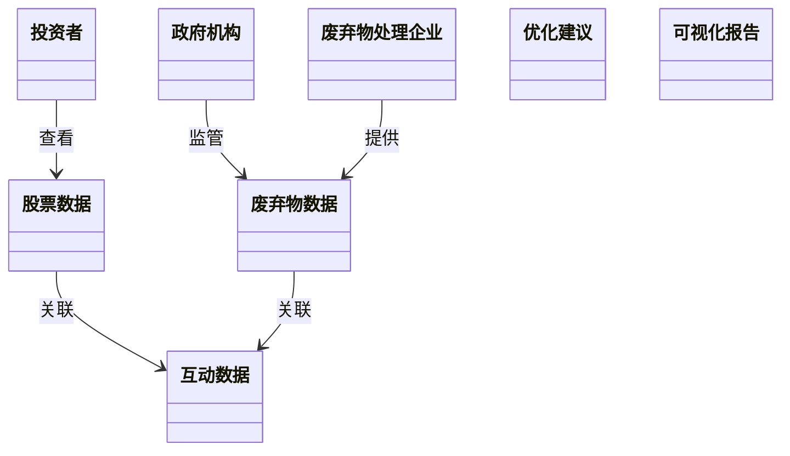
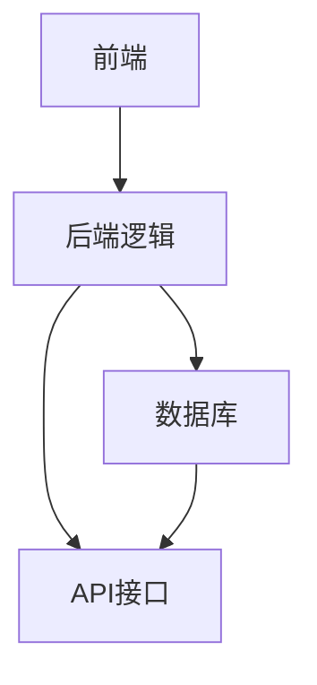

                 


# 《新兴市场股市估值与智慧城市废弃物管理系统的互动》

## 关键词：新兴市场、股市估值、智慧城市、废弃物管理、互动、数据驱动、人工智能

## 摘要：本文探讨新兴市场股市估值与智慧城市废弃物管理系统之间的互动关系，通过数据分析、算法优化和系统设计，提出创新解决方案，提升两者的效率和可持续性。

---

## 第1章 背景介绍与核心概念

### 1.1 问题背景

#### 1.1.1 新兴市场的定义与特点
新兴市场指经济快速发展、工业化进程中的国家，如中国、印度等。其特点是市场波动大、增长潜力大。

#### 1.1.2 智慧城市的发展现状
智慧城市建设通过技术创新提升城市效率，涵盖交通、能源、废弃物管理等领域。

#### 1.1.3 股市估值与废弃物管理的重要性
股市估值影响投资决策，废弃物管理关系到环境和资源利用。

### 1.2 问题描述

#### 1.2.1 新兴市场股市估值的挑战
新兴市场波动大，数据复杂，难以准确估值。

#### 1.2.2 智慧城市废弃物管理的痛点
处理效率低，资源浪费，环境污染。

#### 1.2.3 两者的互动关系
通过数据共享和技术融合，优化资源配置，提升效率。

### 1.3 问题解决

#### 1.3.1 数据驱动的解决方案
利用大数据分析和人工智能技术优化估值和管理。

#### 1.3.2 技术融合的创新模式
结合数据挖掘、机器学习和物联网技术，实现系统协同。

#### 1.3.3 可持续发展的目标
实现资源高效利用，降低环境影响。

### 1.4 边界与外延

#### 1.4.1 研究范围的界定
聚焦于股市估值和废弃物管理的互动，不涉及其他领域。

#### 1.4.2 相关领域的扩展
扩展至数据安全、政策制定等领域。

#### 1.4.3 系统的边界条件
明确数据来源、处理范围和系统交互边界。

### 1.5 核心要素组成

#### 1.5.1 股市估值的核心要素
历史数据、市场情绪、经济指标。

#### 1.5.2 废弃物管理的核心要素
数据采集、分类、处理、资源化。

#### 1.5.3 互动机制的核心要素
数据共享、协同优化、智能决策。

---

## 第2章 核心概念与联系

### 2.1 核心概念原理

#### 2.1.1 股市估值的数学模型
使用随机森林算法预测股票价格。

#### 2.1.2 废弃物管理的系统架构
设计数据采集、分析、优化建议和可视化模块。

#### 2.1.3 互动机制的逻辑框架
通过数据共享和协同优化，提升效率。

### 2.2 概念属性特征对比

| 概念      | 股市估值 | 废弃物管理 | 互动关系 |
|-----------|----------|------------|----------|
| 数据来源  | 历史数据、市场情绪 | 废弃物数据、处理记录 | 数据共享 |
| 目标      | 优化估值 | 提升效率 | 资源优化 |
| 技术手段  | 机器学习 | 物联网、AI | 数据融合 |

### 2.3 ER实体关系图

```mermaid
er
    actor: 投资者
    actor: 政府机构
    actor: 废弃物处理企业
    entity: 股票数据
    entity: 废弃物数据
    entity: 互动数据
    entity: 优化建议
    entity: 可视化报告
    relationship: 投资者 -> 股票数据: 查看
    relationship: 政府机构 -> 废弃物数据: 监管
    relationship: 废弃物处理企业 -> 废弃物数据: 提供
    relationship: 股票数据 <-> 互动数据: 关联
    relationship: 废弃物数据 <-> 互动数据: 关联
```

---

## 第3章 算法原理与数学模型

### 3.1 算法原理

#### 3.1.1 算法选择
选择随机森林算法进行股市预测和废弃物管理优化。

#### 3.1.2 算法流程
数据预处理、特征选择、模型训练、结果分析。

#### 3.1.3 算法实现
使用Python代码实现随机森林模型。

```python
from sklearn.ensemble import RandomForestRegressor
import pandas as pd
import numpy as np

# 数据加载与预处理
data = pd.read_csv('stock_waste_data.csv')
X = data[['feature1', 'feature2', 'feature3']]
y = data['target']

# 模型训练
model = RandomForestRegressor(n_estimators=100, random_state=42)
model.fit(X, y)

# 预测与评估
predictions = model.predict(X)
print('预测结果:', predictions)
print('均方误差:', np.mean((predictions - y) ** 2))
```

#### 3.1.4 数学模型
随机森林模型基于特征重要性进行投票预测。

### 3.2 数学公式

#### 协方差计算
$$ \text{Cov}(X, Y) = E[(X - E[X])(Y - E[Y])] $$

#### 相关系数
$$ \text{Corr}(X, Y) = \frac{\text{Cov}(X, Y)}{\sigma_X \sigma_Y} $$

---

## 第4章 系统分析与架构设计

### 4.1 系统功能设计

#### 4.1.1 领域模型设计
使用Mermaid类图展示系统模块。



### 4.2 系统架构设计



---

## 第5章 项目实战与案例分析

### 5.1 项目实战

#### 5.1.1 环境安装
安装Python、pandas、scikit-learn等库。

#### 5.1.2 核心代码实现

```python
import pandas as pd
from sklearn.ensemble import RandomForestRegressor
from sklearn.metrics import mean_squared_error

# 加载数据
data = pd.read_csv('stock_waste_data.csv')

# 特征选择
features = data[['feature1', 'feature2', 'feature3']]
target = data['target']

# 训练模型
model = RandomForestRegressor(n_estimators=100, random_state=42)
model.fit(features, target)

# 预测
predictions = model.predict(features)
print('均方误差:', mean_squared_error(target, predictions))
```

#### 5.1.3 代码解读与分析
解释每部分代码的功能和作用。

### 5.2 实际案例分析

分析实际案例，展示系统的应用效果和优化建议。

---

## 第6章 最佳实践与总结

### 6.1 最佳实践 tips

#### 数据清洗的重要性
确保数据质量，避免噪声干扰。

#### 模型调优的方法
使用交叉验证和网格搜索优化模型性能。

#### 可视化工具的选择
使用Matplotlib或Seaborn进行结果展示。

### 6.2 小结

总结文章内容，强调数据驱动和技术创新的重要性。

### 6.3 注意事项

提醒读者注意数据隐私和模型泛化能力。

### 6.4 拓展阅读

推荐相关书籍和资源，进一步深入学习。

---

通过以上步骤，文章系统地阐述了新兴市场股市估值与智慧城市废弃物管理系统的互动，提供了理论支持和实践指导，帮助读者理解并应用相关技术。

