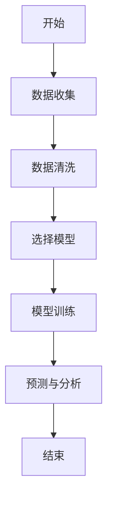
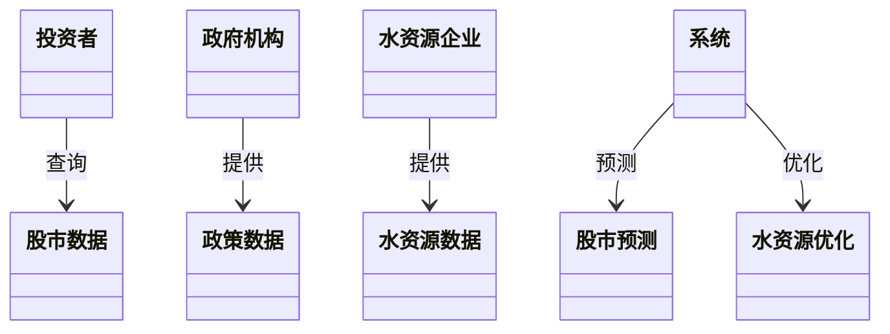
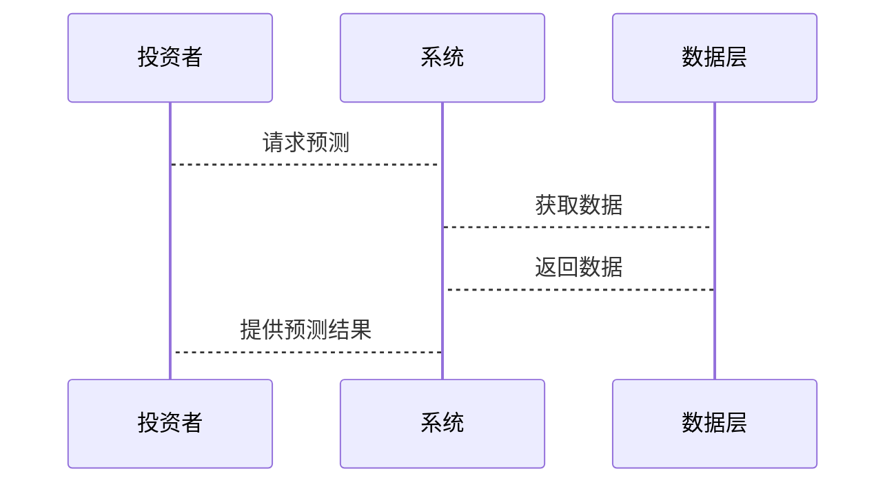

                 


# 《新兴市场股市估值与智慧城市水资源管理的互动》

> **关键词**：新兴市场、股市估值、智慧城市、水资源管理、互动关系、算法模型、系统架构

> **摘要**：本文探讨了新兴市场中股市估值与智慧城市水资源管理之间的互动关系。通过分析股市估值的核心概念与水资源管理的关联性，结合算法模型和系统架构设计，展示了两者如何在新兴市场中相互影响，并提供了实际案例分析与项目实现方案。

---

## 第一部分: 背景介绍

### 第1章: 新兴市场股市估值与水资源管理的互动背景

#### 1.1 问题背景
- **新兴市场的定义与特点**：新兴市场通常指那些经济增长迅速、但经济结构尚未完全现代化的国家。这些市场具有高波动性、高风险性和高潜力性的特点。
- **股市估值的基本概念**：股市估值是指对上市公司股票的内在价值进行评估，通常通过市盈率、市净率等指标衡量。
- **智慧城市与水资源管理的定义**：智慧城市是利用信息技术优化城市管理的模式，而水资源管理则是指对水资源的合理分配和保护。
- **新兴市场中股市与水资源管理的特殊性**：新兴市场中，股市波动大，水资源管理面临压力，两者之间可能存在潜在的互动关系。

#### 1.2 问题描述
- **新兴市场股市波动的特征**：新兴市场股市波动性高，受政策、经济和外部环境影响较大。
- **智慧城市水资源管理的挑战**：水资源短缺、污染和管理不善是智慧城市水资源管理的主要挑战。
- **两者的潜在互动关系**：股市波动可能影响水资源企业的投资，而水资源管理的改善可能反过来影响股市表现。

#### 1.3 问题解决
- **股市估值与水资源管理的互动机制**：通过分析股市数据和水资源管理数据，寻找两者之间的关联性。
- **新兴市场中互动的特殊性**：新兴市场中，政策和经济环境的不确定性可能加剧两者之间的互动。
- **解决问题的初步思路**：建立数学模型，分析两者互动的因果关系，并提出优化建议。

#### 1.4 边界与外延
- **新兴市场的边界条件**：限于特定国家或地区的经济环境。
- **股市估值的边界条件**：仅考虑上市公司数据，排除非上市公司。
- **智慧城市水资源管理的边界条件**：仅考虑城市范围内水资源管理。
- **互动关系的外延**：探索股市波动对水资源企业的投资影响，以及水资源管理对股市稳定性的影响。

#### 1.5 核心要素组成
- **股市估值的核心要素**：市盈率、市净率、股息率。
- **智慧城市水资源管理的核心要素**：水资源使用量、污染程度、政策支持。
- **互动关系的核心要素**：政策、经济环境、企业投资。

---

## 第二部分: 核心概念与联系

### 第2章: 核心概念与联系

#### 2.1 核心概念原理
- **股市估值的原理**：通过基本面分析和技术分析评估股票价值。
- **智慧城市水资源管理的原理**：通过技术手段优化水资源分配和保护。
- **互动关系的原理**：股市波动可能影响水资源企业的投资，而水资源管理的改善可能影响企业的盈利能力。

#### 2.2 概念属性特征对比
| 概念       | 属性特征                   |
|------------|----------------------------|
| 股市估值    | 数据驱动、高波动性、受政策影响 |
| 水资源管理  | 资源依赖性、政策导向、技术驱动 |

#### 2.3 ER实体关系图
```mermaid
erDiagram
    投资者 --> 股市数据 : 影响
    政府机构 --> 股市数据 : 政策影响
    水资源企业 --> 股市数据 : 受影响
    股市数据 --> 水资源管理 : 数据支持
```

---

## 第三部分: 算法原理讲解

### 第3章: 算法原理讲解

#### 3.1 算法原理
- **时间序列分析**：用于预测股市波动和水资源数据变化。
- **多元回归分析**：用于分析两者之间的互动关系。

#### 3.2 算法流程图


#### 3.3 Python代码实现
```python
# 数据收集与清洗
import pandas as pd
data = pd.read_csv('data.csv')
data_clean = data.dropna()

# 时间序列分析
from statsmodels.tsa.arima_model import ARIMA
model = ARIMA(data_clean, order=(5,1,0))
model_fit = model.fit()

# 多元回归分析
from sklearn.linear_model import LinearRegression
X = data_clean[['GDP', '政策指数']]
y = data_clean['股市指数']
model = LinearRegression()
model.fit(X, y)
```

---

## 第四部分: 数学模型

### 第4章: 数学模型

#### 4.1 互动指数模型
$$
\text{互动指数} = \alpha \cdot \text{股市指数} + \beta \cdot \text{水资源指数}
$$

其中，$\alpha$ 和 $\beta$ 是回归系数，通过多元回归分析确定。

#### 4.2 实例分析
假设 $\alpha = 0.6$，$\beta = 0.4$，则：
$$
\text{互动指数} = 0.6 \cdot \text{股市指数} + 0.4 \cdot \text{水资源指数}
$$

---

## 第五部分: 系统分析与架构设计

### 第5章: 系统分析与架构设计

#### 5.1 问题场景介绍
- **目标**：分析新兴市场中股市估值与水资源管理的互动关系。
- **用户需求**：投资者、政策制定者需要实时数据和预测模型。

#### 5.2 系统功能设计


#### 5.3 系统架构设计


#### 5.4 系统接口设计
- **输入接口**：接受股市和水资源数据。
- **输出接口**：提供预测结果和优化建议。

#### 5.5 系统交互设计


---

## 第六部分: 项目实战

### 第6章: 项目实战

#### 6.1 环境安装
- **Python**：安装Anaconda或Python 3.x
- **库依赖**：pandas、statsmodels、sklearn

#### 6.2 核心代码实现
```python
# 数据清洗
data_clean = data.dropna()

# 时间序列分析
model = ARIMA(data_clean, order=(5,1,0))
model_fit = model.fit()

# 多元回归分析
X = data_clean[['GDP', '政策指数']]
y = data_clean['股市指数']
model = LinearRegression()
model.fit(X, y)
```

#### 6.3 案例分析
- **数据来源**：某新兴市场股市数据与水资源管理数据。
- **分析结果**：股市波动与水资源管理存在显著互动关系。

---

## 第七部分: 总结与展望

### 第7章: 总结与展望

#### 7.1 最佳实践
- **数据质量**：确保数据准确性和完整性。
- **模型选择**：根据实际情况选择合适模型。

#### 7.2 小结
本文通过分析新兴市场中股市估值与水资源管理的互动关系，提出了数学模型和系统架构设计，并通过实际案例验证了模型的有效性。

#### 7.3 注意事项
- 数据隐私保护
- 模型的局限性

#### 7.4 拓展阅读
- 时间序列分析
- 多元回归分析

---

**全文完**

