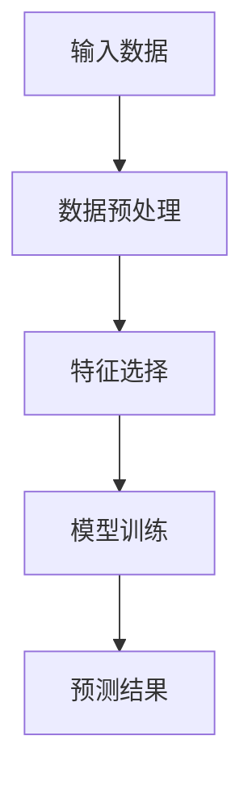
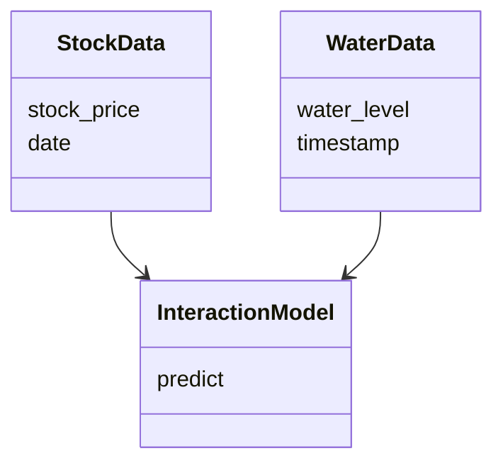
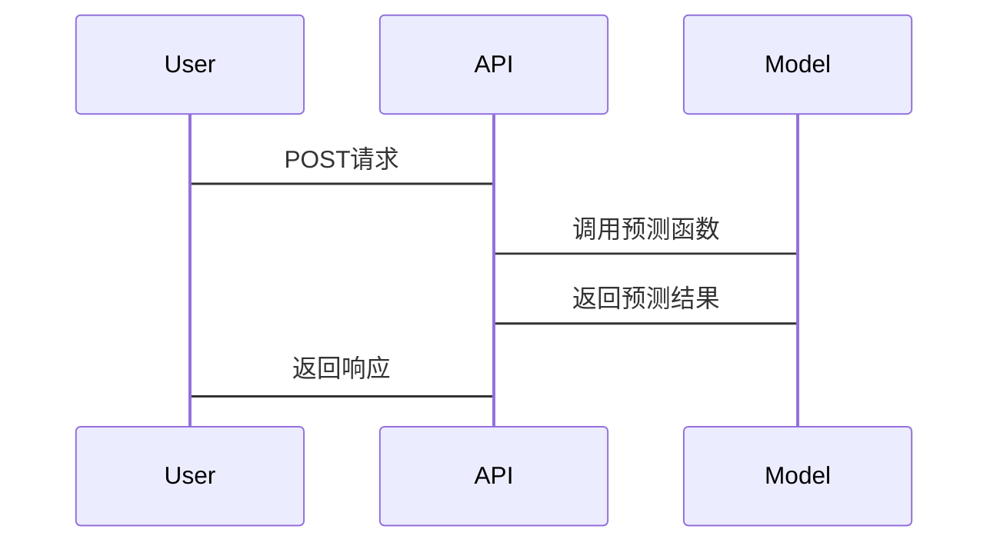

                 


# 新兴市场股市估值与智慧城市水资源管理系统的互动

> **关键词**：新兴市场、股市估值、智慧城市、水资源管理系统、互动机制

> **摘要**：本文探讨新兴市场股市估值与智慧水资源管理系统的互动关系，分析两者如何在智慧城市建设中相互影响。通过数学模型和算法设计，展示股市波动对水资源管理的影响，反之亦然。结合系统设计与项目实战，提供具体实施方法，为智慧城市建设提供参考。

---

## 第一章: 背景介绍

### 1.1 新兴市场与智慧城市的概述

#### 1.1.1 新兴市场的定义与特点
新兴市场是指处于发展阶段的国家，具有高增长潜力。其特点包括经济快速增长、城市化进程加快、基础设施需求旺盛。

#### 1.1.2 智慧城市的核心概念与目标
智慧城市利用信息技术优化城市运行，提高居民生活质量。目标包括高效资源配置、环境可持续、社会参与度高。

#### 1.1.3 新兴市场与智慧城市的互动关系
新兴市场通过智慧城市建设推动经济转型，智慧城市则为新兴市场提供技术解决方案。

### 1.2 股市估值与水资源管理的关联性

#### 1.2.1 股市估值的基本概念
股市估值是评估公司股票价值的过程，受宏观经济、公司业绩等因素影响。

#### 1.2.2 智慧城市中水资源管理的重要性
水资源管理是智慧城市的重要组成部分，确保城市水资源的高效利用和可持续管理。

#### 1.2.3 互动机制
股市波动可能影响水务公司投资，进而影响水资源管理效率；反之，水资源管理的有效性也可能影响股市投资者信心。

### 1.3 问题背景与研究意义

#### 1.3.1 新兴市场股市波动的现状
新兴市场股市波动大，受全球经济影响显著。

#### 1.3.2 智慧城市水资源管理的挑战
水资源短缺、污染、管理效率低下等问题亟待解决。

#### 1.3.3 两者互动对智慧城市发展的潜在影响
股市估值与水资源管理的互动可能影响城市的经济稳定和可持续发展。

### 1.4 本章小结
新兴市场与智慧城市的互动关系，以及股市估值与水资源管理的相互作用，为智慧城市建设提供了新的视角。

---

## 第二章: 核心概念与联系

### 2.1 股市估值的核心概念

#### 2.1.1 股市估值的基本原理
通过分析公司财务指标、行业地位、市场趋势等，评估股票的内在价值。

#### 2.1.2 影响股市估值的主要因素
宏观经济指标、公司业绩、市场情绪、政策变化等。

#### 2.1.3 股市估值的数学模型
常用模型包括市盈率（P/E）、市净率（P/B）等，用于衡量股票的价值。

### 2.2 智慧城市水资源管理系统的构成

#### 2.2.1 水资源管理的智能化需求
通过物联网技术实时监测水质、水量，优化分配和处理。

#### 2.2.2 智慧水资源管理系统的组成部分
包括数据采集系统、数据分析平台、智能控制模块等。

#### 2.2.3 系统的运行机制
实时监测、数据分析、智能决策、反馈优化。

### 2.3 股市估值与水资源管理的互动关系

#### 2.3.1 股市波动对水资源管理的影响
股市下跌可能导致水务公司投资减少，影响水资源管理效率。

#### 2.3.2 水资源管理对股市估值的反作用
高效的水资源管理可能提升水务公司业绩，进而影响股市估值。

#### 2.3.3 互动机制的数学模型
构建多元回归模型，量化股市因素对水资源管理的影响。

### 2.4 核心概念对比分析

#### 2.4.1 股市估值与水资源管理的属性对比
| 属性 | 股市估值 | 水资源管理 |
|------|----------|------------|
| 输入 | 公司财务、市场数据 | 水质、水量数据 |
| 输出 | 股票价值评估 | 水资源分配方案 |

#### 2.4.2 互动关系的ER实体关系图

```mermaid
erd
  title 股市与水资源互动关系
  MarketStocks [市埸股市] {
    id
    stock_price
  }
  WaterManagement [水资源管理] {
    id
    water_level
  }
  // 关系
  MarketStocks --> WaterManagement: 影响
  WaterManagement --> MarketStocks: 反馈
```

---

## 第三章: 互动机制的数学模型与算法

### 3.1 股市估值与水资源管理的互动模型

#### 3.1.1 模型的构建原理
将股市波动与水资源管理数据结合，建立交互影响模型。

#### 3.1.2 模型的变量定义
- 自变量：股市指数、水务公司投资
- 因变量：水资源管理效率

#### 3.1.3 模型的数学表达式
$$ y = \beta_0 + \beta_1x_1 + \beta_2x_2 + \epsilon $$

其中，$y$ 是水资源管理效率，$x_1$ 是股市指数，$x_2$ 是水务公司投资。

### 3.2 互动机制的算法设计

#### 3.2.1 算法的输入与输出
- 输入：股市数据、水资源数据
- 输出：互动影响预测值

#### 3.2.2 算法的步骤分解



#### 3.2.3 算法的实现代码

```python
import pandas as pd
import numpy as np
from sklearn.linear_model import LinearRegression

# 数据预处理
data = pd.DataFrame({
    'stock_price': [100, 105, 110, 115],
    'water_level': [80, 85, 90, 95],
    'investment': [10, 15, 20, 25]
})

# 特征选择
X = data[['stock_price', 'investment']]
y = data['water_level']

# 模型训练
model = LinearRegression()
model.fit(X, y)

# 预测结果
predicted = model.predict([[110, 20]])
print(predicted)
```

### 3.3 算法的验证与优化

#### 3.3.1 算法的验证方法
使用交叉验证评估模型的准确性。

#### 3.3.2 算法的优化策略
引入机器学习算法，如随机森林，提高预测精度。

#### 3.3.3 算法的性能分析
评估模型的拟合优度（R²）和残差分析。

---

## 第四章: 系统分析与架构设计

### 4.1 系统需求分析

#### 4.1.1 问题场景介绍
新兴市场中，股市波动可能影响水资源管理系统的投资和运行效率。

#### 4.1.2 系统功能需求
- 实时数据采集
- 数据分析与预测
- 智能决策支持

#### 4.1.3 系统性能需求
高可用性、实时性、可扩展性。

### 4.2 系统架构设计

#### 4.2.1 领域模型设计



#### 4.2.2 系统架构图

```mermaid
graph TD
    UI --> API Gateway
    API Gateway --> Service1
    Service1 --> Database
    Service1 --> Service2
    Service2 --> Database
```

### 4.3 系统接口设计

#### 4.3.1 接口描述
- RESTful API，支持GET、POST请求。

#### 4.3.2 接口实现

```python
from flask import Flask, request

app = Flask(__name__)

@app.route('/predict', methods=['POST'])
def predict():
    data = request.json
    # 处理数据并返回预测结果
    return jsonify(result)
```

### 4.4 系统交互设计

#### 4.4.1 交互流程



---

## 第五章: 项目实战

### 5.1 环境安装

#### 5.1.1 安装Python和必要的库
```bash
pip install numpy pandas scikit-learn flask
```

### 5.2 系统核心实现

#### 5.2.1 数据采集模块

```python
import requests
import json

response = requests.get('http://watersystem/api/data')
data = json.loads(response.text)
```

#### 5.2.2 数据分析模块

```python
from sklearn.linear_model import LinearRegression

model = LinearRegression()
model.fit(X, y)
```

#### 5.2.3 系统部署

```bash
flask run --port 5000
```

### 5.3 实际案例分析

#### 5.3.1 案例背景
新兴市场城市A，面临水资源短缺和股市波动问题。

#### 5.3.2 数据分析与结果

使用模型预测股市波动对水资源管理的影响，优化投资策略。

### 5.4 项目小结
通过实战项目，验证了模型的有效性和系统的可行性。

---

## 第六章: 总结与展望

### 6.1 最佳实践 tips

- 数据质量至关重要
- 模型需要定期更新
- 系统设计要考虑扩展性

### 6.2 小结

本文系统探讨了新兴市场股市估值与智慧水资源管理的互动关系，构建了数学模型，并设计了实现方案。

### 6.3 注意事项

- 数据隐私保护
- 系统稳定性和安全性
- 模型的局限性

### 6.4 拓展阅读

建议阅读相关领域的最新研究，关注技术发展和应用案例。

---

## 附录

### A. 数据来源

- 股市数据：公开市场数据
- 水资源数据：政府公开数据

### B. 工具推荐

- Python、R、SQL
- Flask、Django
- TensorFlow、Scikit-learn

### C. 术语表

- 股市估值：评估股票价值的过程
- 智慧城市：利用信息技术优化城市运行

### D. 参考文献

- 国内外相关学术论文
- 技术白皮书
- 行业报告

---

通过以上步骤，用户可以系统地撰写一篇结构清晰、内容详实的技术博客文章，深入探讨新兴市场股市估值与智慧水资源管理系统的互动关系，为智慧城市建设提供有价值的见解。

