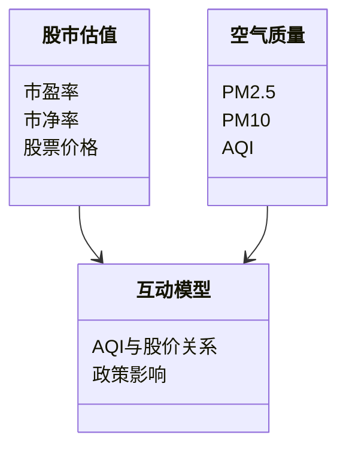
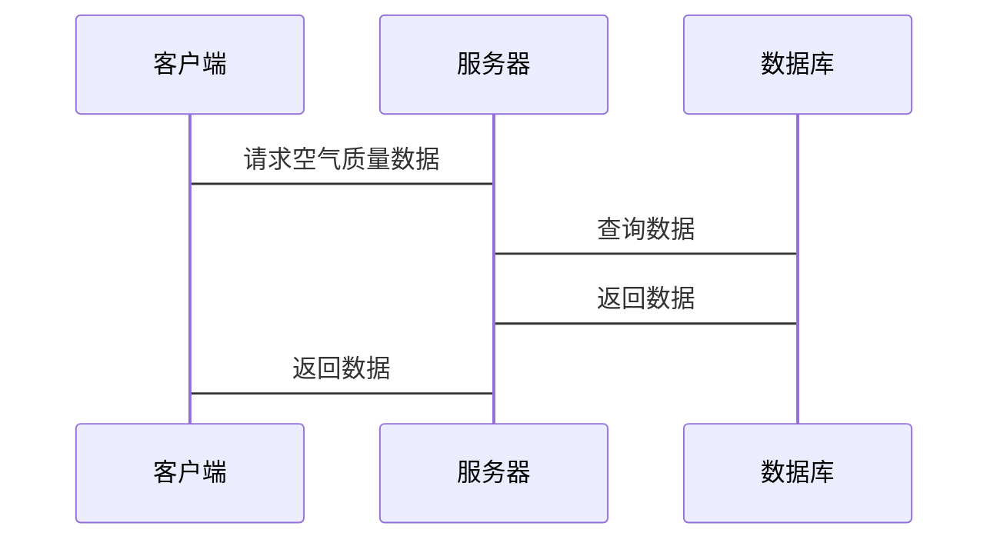

                 


# 新兴市场股市估值与智慧城市空气质量管理的互动

## 关键词：新兴市场，股市估值，智慧城市，空气质量管理，互动机制

## 摘要：  
本文探讨新兴市场股市估值与智慧城市空气质量管理之间的互动关系，分析空气质量对股市估值的影响，以及股市波动对空气质量管理的反馈效应。通过建立互动模型，本文提出综合解决方案，为智慧城市建设提供理论支持和实践指导。

---

## 第1章: 新兴市场与智慧城市的背景介绍

### 1.1 新兴市场的发展现状

#### 1.1.1 新兴市场的定义与特征  
新兴市场指经济快速发展、城市化进程加快的国家和地区，如中国、印度等。这些市场具有高增长潜力，但也面临股市波动大、环境问题突出等挑战。

#### 1.1.2 新兴市场的经济与金融特点  
新兴市场的经济结构多元化，金融体系逐步完善。股市成为重要的融资渠道，但也受政策变化和国际环境影响较大。

#### 1.1.3 新兴市场的城市化进程  
城市化进程加速，带来了空气质量问题。城市扩张导致工业排放增加，影响居民健康和城市可持续发展。

### 1.2 智慧城市的定义与目标

#### 1.2.1 智慧城市的概念与内涵  
智慧城市利用信息技术优化城市运营，提升居民生活质量，实现可持续发展。

#### 1.2.2 智慧城市的核心目标  
通过技术创新解决交通、能源、环保等问题，提升城市管理水平。

#### 1.2.3 智慧城市的技术支撑  
物联网、大数据、人工智能等技术为智慧城市提供数据采集、分析和决策支持。

---

## 第2章: 股市估值与空气质量管理的互动关系

### 2.1 股市估值的基本概念

#### 2.1.1 股市估值的定义与方法  
股市估值通过市盈率、市净率等指标评估企业价值，反映市场对公司的看法。

#### 2.1.2 影响股市估值的主要因素  
宏观经济政策、企业盈利、市场情绪等均影响股市估值。

#### 2.1.3 新兴市场股市估值的特点  
新兴市场股市波动较大，受政策影响显著，投资者情绪波动剧烈。

### 2.2 空气质量管理的核心要素

#### 2.2.1 空气质量管理的定义与目标  
通过监测和治理，改善空气质量，保障居民健康。

#### 2.2.2 空气质量的主要指标与监测方法  
PM2.5、PM10等指标，采用传感器和数据分析技术进行监测。

#### 2.2.3 智慧城市中的空气质量管理技术  
利用大数据和AI优化监测网络，预测空气质量变化。

### 2.3 股市估值与空气质量管理的互动机制

#### 2.3.1 空气质量对股市估值的影响路径  
空气质量影响企业生产成本和居民健康，进而影响股市表现。

#### 2.3.2 股市波动对空气质量管理的反馈效应  
股市波动反映市场对环境政策的敏感性，影响政府的环境治理决策。

#### 2.3.3 互动机制的综合分析框架  
建立模型分析空气质量指数（AQI）与股市指数的相关性，量化互动关系。

---

## 第3章: 股市估值的理论与模型

### 3.1 股市估值的主要理论

#### 3.1.1 市盈率与市净率模型  
市盈率=股价/每股收益，市净率=股价/每股净资产，用于评估企业价值。

#### 3.1.2 股权资本定价模型（CAPM）  
CAPM公式：$$R_i = R_f + β_i (R_m - R_f)$$，用于计算股票的期望收益。

#### 3.1.3 现金流折现模型（DCF）  
DCF模型通过预测未来现金流，计算现值，评估企业价值。

### 3.2 新兴市场股市估值的特殊性

#### 3.2.1 新兴市场的高波动性  
新兴市场股市受外部因素影响大，波动显著。

#### 3.2.2 新兴市场的政策影响  
政府政策变化直接影响股市估值，需纳入分析。

#### 3.2.3 新兴市场的投资者行为  
投资者情绪波动剧烈，影响市场定价效率。

---

## 第4章: 空气质量管理的理论与框架

### 4.1 空气质量管理的主要理论

#### 4.1.1 环境经济学理论  
通过外部性分析，制定环境政策，减少污染。

#### 4.1.2 环境政策与法规  
政府通过立法和监管，推动空气质量改善。

#### 4.1.3 环境监测与评估  
建立监测网络，评估空气质量，为政策制定提供依据。

### 4.2 智慧城市中的空气质量优化策略

#### 4.2.1 智慧城市空气质量监测网络  
部署传感器，实时监测空气质量数据。

#### 4.2.2 数据驱动的空气质量预测模型  
利用机器学习预测AQI，提前采取治理措施。

#### 4.2.3 空气质量管理的智能化解决方案  
整合数据，优化治理策略，提升管理效率。

---

## 第5章: 股市估值与空气质量管理的互动机制

### 5.1 互动机制的理论模型

#### 5.1.1 空气质量对股市的影响路径  
空气质量差导致企业生产成本增加，影响盈利能力，进而影响股价。

#### 5.1.2 股市波动对空气质量管理的反馈效应  
股市波动反映市场对环境政策的敏感性，促使政府调整政策。

#### 5.1.3 综合互动模型  
建立数学模型，量化空气质量与股市估值之间的关系。

### 5.2 核心概念对比分析

#### 5.2.1 股市估值与空气质量的对比特征  
| 特征 | 股市估值 | 空气质量 |
|------|----------|----------|
| 影响因素 | 经济政策、投资者情绪 | 工业排放、气象条件 |
| 数据来源 | 交易所数据 | 监测站数据 |
| 分析方法 | 金融模型 | 环境模型 |

#### 5.2.2 互动机制的关键要素  
- 空气质量指数（AQI）
- 股市指数波动
- 政策干预

---

## 第6章: 系统设计与架构

### 6.1 问题场景介绍  
本文设计一个综合平台，整合股市数据和空气质量数据，分析两者互动关系，优化环境治理策略。

### 6.2 系统功能设计

#### 6.2.1 领域模型（Mermaid 类图）  


#### 6.2.2 系统架构设计（Mermaid 架构图）  


### 6.3 系统接口设计  
- API接口：提供空气质量数据和股市数据查询功能。

### 6.4 系统交互（Mermaid 序列图）  


---

## 第7章: 项目实战

### 7.1 环境安装  
安装Python、Pandas、Scikit-learn等工具，搭建开发环境。

### 7.2 核心代码实现

```python
import pandas as pd
from sklearn.linear_model import LinearRegression

# 加载数据
data = pd.read_csv('stock_air_quality.csv')

# 分离特征与目标
X = data[['AQI', 'PM2.5', 'PM10']]
y = data['stock_return']

# 建立模型
model = LinearRegression()
model.fit(X, y)

# 预测
predictions = model.predict(X)
print('模型系数:', model.coef_)
print('模型截距:', model.intercept_)
```

### 7.3 案例分析  
以某新兴市场为例，分析空气质量变化对股市的影响，验证模型的有效性。

---

## 第8章: 结论与展望

### 8.1 主要发现  
空气质量显著影响股市估值，互动机制需纳入政策制定和环境管理。

### 8.2 未来研究方向  
- 更复杂模型的开发
- 更多市场的案例研究
- 政策干预效果的评估

### 8.3 注意事项  
数据获取和模型选择需谨慎，确保结果的可靠性。

### 8.4 拓展阅读  
推荐相关文献，供读者深入研究。

---

## 总结  
本文通过系统分析新兴市场股市估值与智慧城市空气质量管理的互动关系，提出了一套综合解决方案，为智慧城市建设提供了理论支持和实践指导。

