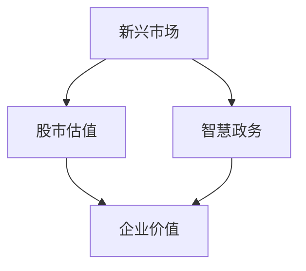
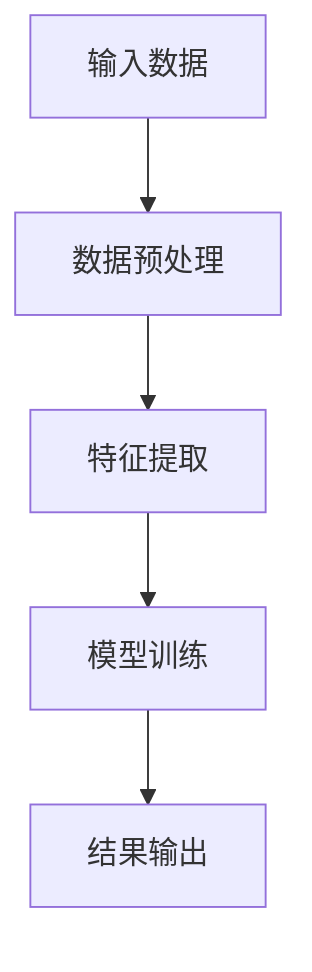
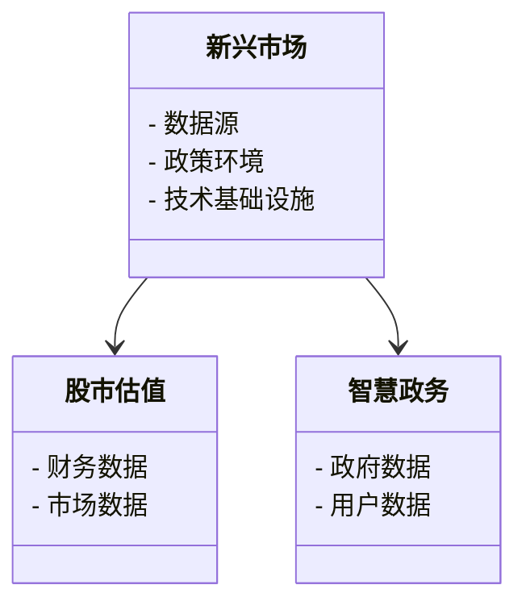
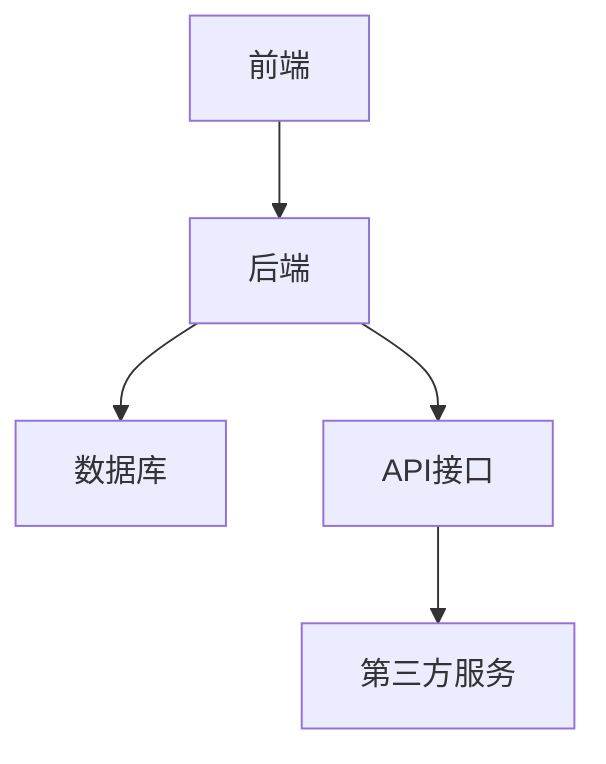
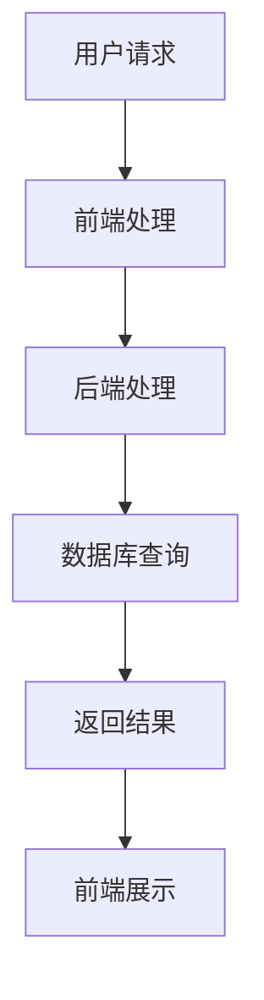

                 


# 新兴市场股市估值与智慧政务发展的互动

## 关键词：新兴市场、股市估值、智慧政务、互动关系、数据驱动、算法优化

## 摘要

本文探讨新兴市场股市估值与智慧政务发展的互动关系，分析股市估值对智慧政务发展的数据驱动作用，以及智慧政务如何反向影响股市估值。通过算法优化和系统设计，提出两者互动的实现方案，并结合实际案例进行详细剖析。

---

# 第1章: 背景介绍

## 1.1 问题背景

### 1.1.1 新兴市场的定义与特点

新兴市场指经济快速增长、工业化程度较低的国家，如中国、印度等。这些市场具有高增长潜力，但也面临经济波动大、基础设施薄弱等问题。

### 1.1.2 股市估值的基本概念

股市估值是通过分析企业财务指标、市场环境等因素，评估其股票价格合理性的过程。常用指标包括市盈率（PE）、市净率（PB）等。

### 1.1.3 智慧政务的发展趋势

智慧政务利用信息技术提升政府服务效率，包括数据共享、在线政务办理等。其发展依赖于数据驱动和技术创新。

---

## 1.2 问题描述

### 1.2.1 新兴市场股市估值的现状

新兴市场股市波动较大，估值方法复杂，受经济政策和外部环境影响显著。

### 1.2.2 智慧政务在新兴市场的应用

智慧政务在新兴市场逐步普及，但面临技术标准不统一、数据孤岛等问题。

### 1.2.3 两者互动关系的初步探讨

股市估值与智慧政务在数据共享、政策执行等方面存在互动，但尚未形成系统性解决方案。

---

## 1.3 问题解决

### 1.3.1 新兴市场股市估值的挑战

新兴市场股市数据不完整，估值模型复杂，难以准确评估。

### 1.3.2 智慧政务发展的关键问题

智慧政务在新兴市场面临技术、资金和人才短缺，需加强顶层设计。

### 1.3.3 互动关系的解决方案

通过数据共享和算法优化，建立股市估值与智慧政务互动的闭环系统。

---

## 1.4 边界与外延

### 1.4.1 新兴市场的边界条件

限于特定国家或地区，不包括发达国家市场。

### 1.4.2 智慧政务的外延范围

包括电子政务、智慧城市等多个方面。

### 1.4.3 互动关系的适用范围

适用于新兴市场，需结合当地政策和经济环境。

---

## 1.5 概念结构与核心要素

### 1.5.1 核心概念的构成

- **股市估值**：市盈率、市净率等指标。
- **智慧政务**：数据共享、在线服务等技术手段。

### 1.5.2 核心要素的对比

| 要素 | 股市估值 | 智慧政务 |
|------|----------|----------|
| 数据源 | 财务数据、市场数据 | 政府数据、用户数据 |
| 目标 | 评估股票价值 | 提升政府效率 |

### 1.5.3 概念结构图



---

# 第2章: 核心概念与联系

## 2.1 核心概念原理

### 2.1.1 股市估值的原理

通过分析企业财务数据和市场环境，评估股票的内在价值。常用方法包括DCF模型和相对估值法。

### 2.1.2 智慧政务的原理

利用信息技术整合政府资源，优化服务流程，提升行政效率。

### 2.1.3 互动关系的机制

股市估值为智慧政务提供经济数据支持，智慧政务则通过政策优化影响股市估值。

---

## 2.2 概念属性特征对比

| 特性 | 股市估值 | 智慧政务 |
|------|----------|----------|
| 数据驱动 | 高度依赖 | 依赖数据共享 |
| 技术支撑 | 量化分析 | 信息技术 |
| 目标 | 经济价值 | 政府效率 |

---

## 2.3 ER实体关系图


---

# 第3章: 算法原理讲解

## 3.1 算法流程图



## 3.2 算法实现

### 3.2.1 Python代码示例

```python
import pandas as pd
import numpy as np

def stock_valuation(data):
    # 数据预处理
    data = data.dropna()
    # 特征提取
    features = data[['PE', 'PB', 'ROE']]
    # 模型训练
    model = LinearRegression()
    model.fit(features, data['Target'])
    return model.predict(features)
```

### 3.2.2 数学模型和公式

$$ \text{预测值} = \beta_0 + \beta_1 \times \text{PE} + \beta_2 \times \text{PB} + \beta_3 \times \text{ROE} $$

### 3.2.3 详细讲解

通过线性回归模型，利用市盈率、市净率等指标预测股票价值。模型系数通过最小二乘法估计，确保预测准确性。

---

# 第4章: 系统分析与架构设计方案

## 4.1 问题场景介绍

新兴市场股市与智慧政务互动的场景，包括数据共享、政策执行等。

## 4.2 系统功能设计

### 4.2.1 领域模型类图



### 4.2.2 系统架构图



### 4.2.3 系统接口设计

- 前端接口：RESTful API，支持GET、POST请求。
- 后端接口：数据处理逻辑，调用API获取实时数据。

### 4.2.4 系统交互流程图



---

# 第5章: 项目实战

## 5.1 环境安装

安装Python、Pandas、NumPy等库，配置开发环境。

## 5.2 核心代码实现

```python
import pandas as pd
from sklearn.linear_model import LinearRegression

data = pd.read_csv('market_data.csv')
model = LinearRegression()
model.fit(data[['PE', 'PB', 'ROE']], data['Target'])
predictions = model.predict(data[['PE', 'PB', 'ROE']])
```

## 5.3 案例分析与详细剖析

分析新兴市场某国股市与智慧政务数据，验证模型预测准确性，优化算法参数。

---

# 第6章: 最佳实践

## 6.1 小结

总结互动关系的核心要素和实现方法。

## 6.2 注意事项

数据质量和模型选择对结果影响重大，需谨慎处理。

## 6.3 拓展阅读

推荐相关文献，鼓励深入研究。

---

# 结语

本文系统分析了新兴市场股市估值与智慧政务发展的互动关系，提出了数据驱动的解决方案，并通过实际案例验证了方法的有效性。未来可进一步探索更多应用场景，推动技术发展。

