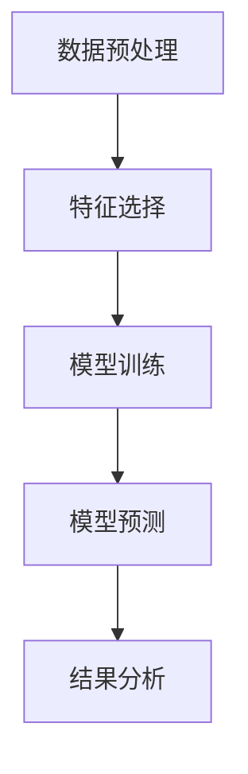
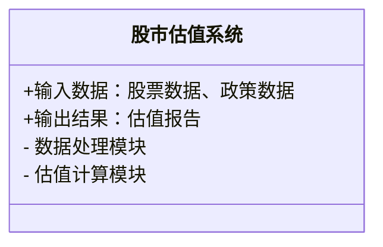
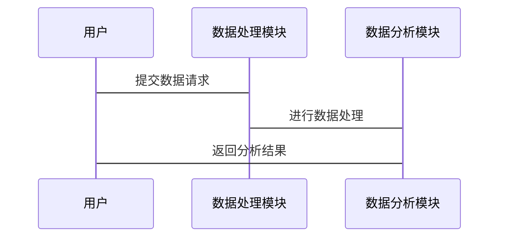

                 


# 新兴市场股市估值与智慧政务大数据应用的互动

> 关键词：新兴市场，股市估值，智慧政务，大数据应用，互动机制，算法模型，系统架构

> 摘要：本文探讨新兴市场股市估值与智慧政务大数据应用之间的互动关系，分析大数据技术在股市估值中的应用，以及智慧政务中大数据的实践。通过理论分析和案例研究，揭示两者如何协同影响经济发展，并提出互动机制下的系统架构与实现方案。

---

## 第一章：引言

### 1.1 背景与意义
#### 1.1.1 新兴市场股市估值的重要性
- 新兴市场股市的波动性和增长潜力使其成为全球关注的焦点。
- 通过大数据分析，可以更准确地评估股市价值，为投资者提供参考。

#### 1.1.2 智慧政务大数据应用的必要性
- 政府利用大数据优化决策，提升公共服务效率。
- 大数据在政务中的应用已成为提升治理能力的关键。

#### 1.1.3 互动关系与研究价值
- 股市数据与政务数据的互动能够提供更全面的经济分析。
- 研究这种互动有助于理解大数据在经济与社会治理中的双重作用。

### 1.2 研究目标与内容
#### 1.2.1 研究目标
- 探讨大数据技术在股市估值中的应用。
- 分析智慧政务中的大数据实践。
- 探索两者互动机制及其对经济和社会的影响。

#### 1.2.2 核心内容
- 股市估值方法与大数据技术结合。
- 智慧政务系统的架构与功能设计。
- 互动机制的数学模型与算法实现。

---

## 第二章：股市估值基础

### 2.1 核心概念与理论
#### 2.1.1 股市估值的基本原理
- 市盈率、市净率等传统估值方法。
- 股票内在价值的计算公式：
  $$ V = \frac{D}{k} $$
  其中，$D$为预期股息，$k$为折现率。

#### 2.1.2 新兴市场的特殊性
- 新兴市场波动性高，受政策和外部因素影响大。
- 数据来源多样，包括市场交易数据、政策文件和社交媒体。

### 2.2 数据驱动的估值方法
#### 2.2.1 大数据分析在股市估值中的应用
- 使用回归分析预测股价：
  $$ y = a x + b $$
  其中，$y$为目标变量（股价），$x$为自变量（如市盈率）。

#### 2.2.2 时间序列分析与预测
- ARIMA模型用于股票价格预测：
  $$ ARIMA(p, d, q) $$

---

## 第三章：智慧政务大数据应用基础

### 3.1 大数据在政务中的应用
#### 3.1.1 数据收集与处理
- 数据来源包括政府数据库、传感器数据和社会媒体。
- 数据清洗和预处理步骤：
  1. 数据清洗：去除重复和异常值。
  2. 数据转换：标准化和归一化处理。

#### 3.1.2 数据分析与决策支持
- 利用机器学习模型进行政策评估：
  $$ y = f(x_1, x_2, \dots, x_n) $$
  其中，$x_i$为输入特征，$y$为政策效果。

#### 3.1.3 数据可视化与公众服务
- 可视化工具如Tableau用于展示政务数据。
- 公众服务平台提供实时信息查询功能。

### 3.2 大数据技术在智慧政务中的作用
#### 3.2.1 数据挖掘与预测
- 使用决策树模型进行政策效果预测：
  $$ decision\ tree\ model $$

#### 3.2.2 实时数据分析
- 基于流数据处理技术进行实时监控：
  $$ Apache\ Flink $$

#### 3.2.3 数据安全与隐私保护
- 数据加密和匿名化处理确保隐私安全。

---

## 第四章：股市估值与智慧政务大数据的互动机制

### 4.1 大数据对股市估值的影响
#### 4.1.1 数据驱动的股市预测
- 使用 LSTM 神经网络预测股价：
  $$ LSTM\ model $$

#### 4.1.2 政策数据对股市的影响
- 政府政策变化通过大数据分析及时反映到股市估值中。

#### 4.1.3 社会数据的反馈作用
- 社交媒体情绪分析影响市场信心：
  $$ sentiment\ analysis $$

### 4.2 股市数据对智慧政务的反哺作用
#### 4.2.1 股市数据在政策制定中的应用
- 将股市数据作为政策评估的重要指标。

#### 4.2.2 股市波动对政务决策的影响
- 通过大数据分析，政府可以根据股市波动调整政策。

#### 4.2.3 协同分析与风险预警
- 股市与政务数据的协同分析用于风险预警：
  $$ risk\ warning\ system $$

---

## 第五章：基于大数据的股市估值模型

### 5.1 大数据分析算法
#### 5.1.1 线性回归模型
- 用于预测股价：
  $$ y = \beta_0 + \beta_1 x + \epsilon $$

#### 5.1.2 支持向量机模型
- 用于分类问题，如判断股价涨跌。

#### 5.1.3 随机森林模型
- 用于特征重要性分析和预测。

### 5.2 算法实现与代码示例
#### 5.2.1 Python 实现线性回归
```python
import numpy as np
from sklearn.linear_model import LinearRegression

# 示例数据
X = np.array([[1], [2], [3], [4]])
y = np.array([2, 4, 5, 6])

# 模型训练
model = LinearRegression()
model.fit(X, y)

# 预测
print(model.predict([[5]]))  # 输出：[[7]]
```

#### 5.2.2 算法流程图


---

## 第六章：系统架构与设计

### 6.1 系统功能设计
#### 6.1.1 领域模型设计


#### 6.1.2 系统架构设计


### 6.2 系统交互设计
#### 6.2.1 系统接口设计
- API 接口用于数据传输和结果查询。

#### 6.2.2 系统交互流程


---

## 第七章：项目实战

### 7.1 环境配置与数据获取
- 使用 Python 和相关库（如 Pandas、Scikit-learn）。
- 数据来源包括新兴市场股市数据和政务公开数据。

### 7.2 核心代码实现
#### 7.2.1 数据处理代码
```python
import pandas as pd

# 数据加载
data = pd.read_csv('stock_data.csv')

# 数据清洗
data.dropna(inplace=True)
data['date'] = pd.to_datetime(data['date'])
```

#### 7.2.2 模型训练与预测
```python
from sklearn.model_selection import train_test_split
from sklearn.linear_model import LinearRegression

# 划分训练集和测试集
X_train, X_test, y_train, y_test = train_test_split(X, y, test_size=0.2)

# 模型训练
model = LinearRegression()
model.fit(X_train, y_train)

# 模型预测
y_pred = model.predict(X_test)
```

### 7.3 案例分析与结果解读
- 通过具体案例展示模型的预测效果和实际应用。
- 分析结果对智慧政务决策的启示。

---

## 第八章：结论与展望

### 8.1 研究总结
- 大数据技术在股市估值和智慧政务中的应用取得了显著成效。
- 股市与政务数据的互动机制为经济和社会治理提供了新思路。

### 8.2 应用价值与意义
- 提高股市估值的准确性，为投资者提供更好的决策支持。
- 优化政府决策过程，提升公共服务效率。

### 8.3 未来研究方向
- 探索更先进的算法，如深度学习在复杂数据中的应用。
- 结合实时数据流处理技术，提升系统的实时性和准确性。

---

## 总结

本文系统地探讨了新兴市场股市估值与智慧政务大数据应用的互动关系，通过理论分析和实践案例，展示了大数据技术在经济与社会治理中的巨大潜力。未来，随着技术的不断发展，这种互动将进一步深化，为经济和社会发展带来更多的创新机会。

