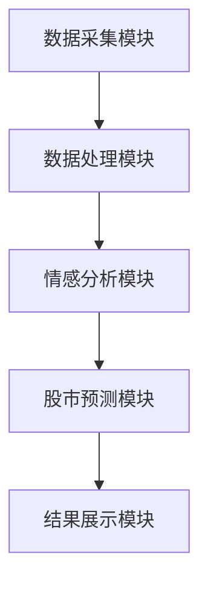
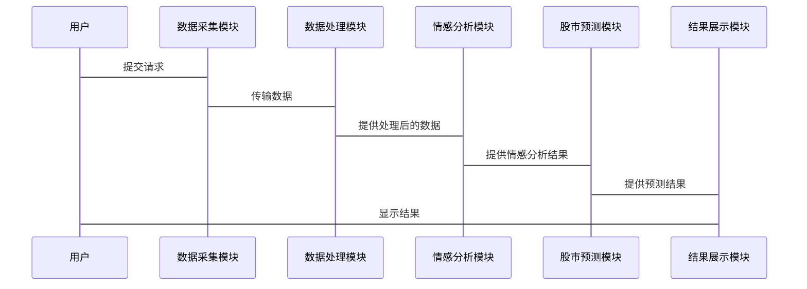

                 


```markdown
# 新兴市场股市估值与智慧校园情感计算应用的互动

> 关键词：新兴市场，股市估值，智慧校园，情感计算，互动机制

> 摘要：本文探讨了新兴市场股市估值与智慧校园情感计算应用之间的互动关系。通过分析情感计算在股市估值中的应用，以及智慧校园中的情感数据如何影响股市情绪，提出了两者的互动机制，并通过系统架构和项目实战展示了具体实现方法。

---

## 第1章: 背景与概述

### 1.1 新兴市场股市估值的背景

#### 1.1.1 新兴市场的定义与特点
- 新兴市场：指经济快速发展但尚未完全工业化的国家，如中国、印度等。
- 特点：高增长率、较大的市场波动性、受政策影响大。

#### 1.1.2 股市估值的基本概念与重要性
- 股市估值：通过财务指标和市场因素评估股票价格。
- 重要性：帮助投资者做出决策，影响市场稳定性。

#### 1.1.3 新兴市场股市的独特性与挑战
- 独特性：市场波动大，投资者情绪影响显著。
- 挑战：数据不透明，政策风险高。

### 1.2 智慧校园情感计算的背景

#### 1.2.1 智慧校园的概念与发展
- 智慧校园：利用信息技术优化教育资源配置，提升校园管理效率。
- 发展：基于物联网、大数据和人工智能技术。

#### 1.2.2 情感计算的基本原理与应用
- 情感计算：分析文本、语音和图像中的情感信息。
- 应用：情感监测、个性化教学。

#### 1.2.3 情感计算在教育领域的潜力
- 情感支持系统：帮助学生和教师应对情绪问题。
- 个性化学习：根据情感数据调整教学策略。

### 1.3 两者的互动关系

#### 1.3.1 新兴市场股市与智慧校园的关联性
- 情感因素：市场参与者的情绪影响股市波动。
- 教育影响：智慧校园中的情绪数据反映社会情绪。

#### 1.3.2 情感计算在股市估值中的潜在应用
- 情感分析：捕捉市场情绪，辅助估值模型。
- 数据融合：将情感数据与传统估值指标结合。

#### 1.3.3 互动机制的初步探讨
- 数据共享：智慧校园中的情感数据用于股市分析。
- 反馈机制：股市情绪反馈影响校园情感支持系统。

---

## 第2章: 新兴市场股市估值的核心概念与模型

### 2.1 股市估值的基本原理

#### 2.1.1 市场情绪对股价的影响
- 情绪指标：如恐慌指数，反映市场参与者的情绪状态。
- 影响机制：情绪波动影响投资者决策，进而影响股价。

#### 2.1.2 财务指标与估值方法
- 财务指标：市盈率、市净率等。
- 估值方法：DCF模型、相对估值法。

#### 2.1.3 宏观经济因素对股市的影响
- 宏观经济指标：GDP、通胀率。
- 政策因素：政府政策和法规变化。

### 2.2 情感计算在股市估值中的应用

#### 2.2.1 情感分析的基本流程
- 数据采集：从社交媒体、新闻中获取文本数据。
- 预处理：分词、去停用词。
- 情感分类：使用机器学习或深度学习模型进行分类。

#### 2.2.2 基于文本的情感计算模型
- 方法：使用词袋模型或词嵌入模型提取特征。
- 模型：SVM、随机森林、LSTM等。

#### 2.2.3 情感数据对股市预测的贡献
- 预测模型：将情感数据与传统指标结合，构建混合模型。
- 案例：利用社交媒体数据预测市场波动。

### 2.3 新兴市场股市估值的特殊性

#### 2.3.1 新兴市场的波动性分析
- 市场波动：新兴市场受情绪影响更大。
- 数据特点：非线性、噪声多。

#### 2.3.2 文化差异对股市情绪的影响
- 文化因素：不同文化背景下的投资者反应不同。
- 情感表达：语言和文化差异影响情感分析的准确性。

#### 2.3.3 政治经济环境对估值的影响
- 政治风险：政策变化对市场的影响。
- 经济环境：通胀、汇率变化对股市估值的影响。

---

## 第3章: 智慧校园情感计算的技术实现

### 3.1 情感计算的关键技术

#### 3.1.1 自然语言处理（NLP）的基础
- 分词：将文本分割成词语或短语。
- 做情感分析：使用词典或模型进行情感分类。

#### 3.1.2 情感分析的算法原理
- 传统方法：使用词袋模型和情感词典。
- 深度学习：使用CNN、RNN、LSTM等模型。

#### 3.1.3 情感计算的特征提取方法
- 词频-逆文档频率（TF-IDF）。
- 词嵌入：如Word2Vec、GloVe。

### 3.2 情感计算的模型构建

#### 3.2.1 基于机器学习的情感分类模型
- 数据准备：收集校园相关的文本数据。
- 特征工程：提取情感相关特征。
- 模型训练：使用SVM或随机森林进行分类。

#### 3.2.2 基于深度学习的情感分析模型
- 模型选择：使用LSTM进行序列建模。
- 模型训练：利用标注数据进行端到端训练。

#### 3.2.3 情感计算的优化与调优
- 参数调整：如学习率、批量大小。
- 模型评估：准确率、召回率、F1分数。

### 3.3 智慧校园中的情感计算应用

#### 3.3.1 学生情感监测与分析
- 数据来源：学生论坛、聊天记录。
- 应用场景：识别学生压力，提供情感支持。

#### 3.3.2 教师情感支持系统
- 数据来源：教师反馈、课堂互动。
- 应用场景：优化教学方法，提升教师幸福感。

#### 3.3.3 校园情感氛围的可视化
- 数据可视化：用图表展示校园整体情感状态。
- 应用场景：校园管理决策，如课程调整。

---

## 第4章: 情感计算与股市估值的互动机制

### 4.1 情感数据在股市预测中的应用

#### 4.1.1 情感数据的采集与处理
- 数据来源：社交媒体、新闻网站。
- 数据预处理：清洗、去噪、分词。

#### 4.1.2 情感数据对股价波动的影响
- 市场情绪指标：如情感强度、情感趋势。
- 预测模型：将情感数据与传统指标结合，构建混合模型。

#### 4.1.3 基于情感计算的混合估值模型
- 混合模型：结合情感数据和财务指标进行估值。
- 案例：利用社交媒体数据预测新兴市场股市波动。

### 4.2 智慧校园情感数据对股市的间接影响

#### 4.2.1 校园情感数据的社会反映
- 校园情绪与社会情绪的相关性。
- 数据来源：学生和教师的情感数据反映整体社会情绪。

#### 4.2.2 情感数据的社会影响力
- 社会影响：校园情绪可能影响社会整体情绪，进而影响股市。
- 机制：通过情感数据预测社会情绪，进而影响股市估值。

### 4.3 互动机制的具体实现

#### 4.3.1 数据融合与分析
- 数据融合：将校园情感数据与股市数据结合。
- 数据分析：使用统计方法和机器学习模型分析数据间的关联性。

#### 4.3.2 智能系统设计
- 系统设计：构建一个实时监测和分析的系统，整合校园情感数据和股市数据。
- 实现步骤：数据采集、特征提取、模型训练、结果可视化。

#### 4.3.3 系统应用与优化
- 应用场景：实时监测市场情绪，辅助投资决策。
- 模型优化：通过反馈机制不断优化情感分析模型和股市预测模型。

---

## 第5章: 系统架构与项目实战

### 5.1 系统架构设计

#### 5.1.1 系统功能设计
- 数据采集模块：采集校园情感数据和股市数据。
- 数据处理模块：清洗、预处理数据。
- 情感分析模块：分析数据中的情感倾向。
- 股市预测模块：结合情感数据和传统指标进行估值。

#### 5.1.2 系统架构图


#### 5.1.3 系统交互设计


### 5.2 项目实战

#### 5.2.1 环境安装
- 安装Python、Jupyter Notebook、Scikit-learn、TensorFlow、NLTK。

#### 5.2.2 核心实现代码
```python
import numpy as np
import pandas as pd
from sklearn.svm import SVC
from sklearn.metrics import accuracy_score
from sklearn.model_selection import train_test_split

# 示例情感分析代码
def preprocess(text):
    # 分词和预处理代码
    pass

def train_model(X, y):
    model = SVC()
    model.fit(X, y)
    return model

# 示例股市预测代码
def predict_stock(model, new_data):
    prediction = model.predict(new_data)
    return prediction
```

#### 5.2.3 代码解读与分析
- 预处理函数：对文本数据进行分词、去停用词等处理。
- 模型训练：使用支持向量机进行情感分类。
- 股市预测：利用训练好的模型对新数据进行预测。

#### 5.2.4 案例分析
- 数据来源：新兴市场的股市数据和校园情感数据。
- 数据分析：结合情感数据和传统指标，构建混合模型进行预测。
- 结果展示：可视化预测结果，分析模型准确性。

---

## 第6章: 结论与展望

### 6.1 结论
- 情感计算在股市估值中的应用潜力巨大，尤其是在新兴市场。
- 智慧校园中的情感数据可以为股市分析提供新的视角。
- 两者的互动机制可以通过数据融合和系统集成进一步探索。

### 6.2 展望
- 情感计算与股市估值的结合将推动金融分析的智能化。
- 智慧校园中的情感计算将促进教育领域的智能化和个性化。
- 未来研究方向：更复杂的情感分析模型，多模态数据融合，实时互动系统。

### 6.3 注意事项
- 数据隐私：处理情感数据时需注意隐私保护。
- 模型优化：不断优化情感分析和预测模型，提升准确性。

### 6.4 拓展阅读
- 推荐书籍和论文，进一步了解情感计算和股市分析。

---

## 附录

### 附录A: 数据集
- 新兴市场股市数据来源：提供具体的数据集链接。
- 智慧校园情感数据来源：提供具体的数据集链接。

### 附录B: 工具安装指南
- 安装Python环境：详细步骤。
- 安装相关库：如scikit-learn、TensorFlow的安装方法。

### 附录C: 参考文献
- 列出主要参考的书籍和论文。

---

通过以上结构，本文系统地探讨了新兴市场股市估值与智慧校园情感计算应用的互动关系，结合理论分析和项目实战，展示了情感计算在股市分析中的应用潜力。
</think>

# 新兴市场股市估值与智慧校园情感计算应用的互动

## 关键词：新兴市场，股市估值，智慧校园，情感计算，互动机制

## 摘要：本文探讨了新兴市场股市估值与智慧校园情感计算应用之间的互动关系。通过分析情感计算在股市估值中的应用，以及智慧校园中的情感数据如何影响股市情绪，提出了两者的互动机制，并通过系统架构和项目实战展示了具体实现方法。

---

## 第1章: 背景与概述

### 1.1 新兴市场股市估值的背景

#### 1.1.1 新兴市场的定义与特点
- 新兴市场：指经济快速发展但尚未完全工业化的国家，如中国、印度等。
- 特点：高增长率、较大的市场波动性、受政策影响大。

#### 1.1.2 股市估值的基本概念与重要性
- 股市估值：通过财务指标和市场因素评估股票价格。
- 重要性：帮助投资者做出决策，影响市场稳定性。

#### 1.1.3 新兴市场股市的独特性与挑战
- 独特性：市场波动大，投资者情绪影响显著。
- 挑战：数据不透明，政策风险高。

### 1.2 智慧校园情感计算的背景

#### 1.2.1 智慧校园的概念与发展
- 智慧校园：利用信息技术优化教育资源配置，提升校园管理效率。
- 发展：基于物联网、大数据和人工智能技术。

#### 1.2.2 情感计算的基本原理与应用
- 情感计算：分析文本、语音和图像中的情感信息。
- 应用：情感监测、个性化教学。

#### 1.2.3 情感计算在教育领域的潜力
- 情感支持系统：帮助学生和教师应对情绪问题。
- 个性化学习：根据情感数据调整教学策略。

### 1.3 两者的互动关系

#### 1.3.1 新兴市场股市与智慧校园的关联性
- 情感因素：市场参与者的情绪影响股市波动。
- 教育影响：智慧校园中的情绪数据反映社会情绪。

#### 1.3.2 情感计算在股市估值中的潜在应用
- 情感分析：捕捉市场情绪，辅助估值模型。
- 数据融合：将情感数据与传统估值指标结合。

#### 1.3.3 互动机制的初步探讨
- 数据共享：智慧校园中的情感数据用于股市分析。
- 反馈机制：股市情绪反馈影响校园情感支持系统。

---

## 第2章: 新兴市场股市估值的核心概念与模型

### 2.1 股市估值的基本原理

#### 2.1.1 市场情绪对股价的影响
- 情绪指标：如恐慌指数，反映市场参与者的情绪状态。
- 影响机制：情绪波动影响投资者决策，进而影响股价。

#### 2.1.2 财务指标与估值方法
- 财务指标：市盈率、市净率等。
- 估值方法：DCF模型、相对估值法。

#### 2.1.3 宏观经济因素对股市的影响
- 宏观经济指标：GDP、通胀率。
- 政策因素：政府政策和法规变化。

### 2.2 情感计算在股市估值中的应用

#### 2.2.1 情感分析的基本流程
- 数据采集：从社交媒体、新闻中获取文本数据。
- 预处理：分词、去停用词。
- 情感分类：使用机器学习或深度学习模型进行分类。

#### 2.2.2 基于文本的情感计算模型
- 方法：使用词袋模型或词嵌入模型提取特征。
- 模型：SVM、随机森林、LSTM等。

#### 2.2.3 情感数据对股市预测的贡献
- 预测模型：将情感数据与传统指标结合，构建混合模型。
- 案例：利用社交媒体数据预测市场波动。

### 2.3 新兴市场股市估值的特殊性

#### 2.3.1 新兴市场的波动性分析
- 市场波动：新兴市场受情绪影响更大。
- 数据特点：非线性、噪声多。

#### 2.3.2 文化差异对股市情绪的影响
- 文化因素：不同文化背景下的投资者反应不同。
- 情感表达：语言和文化差异影响情感分析的准确性。

#### 2.3.3 政治经济环境对估值的影响
- 政治风险：政策变化对市场的影响。
- 经济环境：通胀、汇率变化对股市估值的影响。

---

## 第3章: 智慧校园情感计算的技术实现

### 3.1 情感计算的关键技术

#### 3.1.1 自然语言处理（NLP）的基础
- 分词：将文本分割成词语或短语。
- 做情感分析：使用词典或模型进行情感分类。

#### 3.1.2 情感分析的算法原理
- 传统方法：使用词袋模型和情感词典。
- 深度学习：使用CNN、RNN、LSTM等模型。

#### 3.1.3 情感计算的特征提取方法
- 词频-逆文档频率（TF-IDF）。
- 词嵌入：如Word2Vec、GloVe。

### 3.2 情感计算的模型构建

#### 3.2.1 基于机器学习的情感分类模型
- 数据准备：收集校园相关的文本数据。
- 特征工程：提取情感相关特征。
- 模型训练：使用SVM或随机森林进行分类。

#### 3.2.2 基于深度学习的情感分析模型
- 模型选择：使用LSTM进行序列建模。
- 模型训练：利用标注数据进行端到端训练。

#### 3.2.3 情感计算的优化与调优
- 参数调整：如学习率、批量大小。
- 模型评估：准确率、召回率、F1分数。

### 3.3 智慧校园中的情感计算应用

#### 3.3.1 学生情感监测与分析
- 数据来源：学生论坛、聊天记录。
- 应用场景：识别学生压力，提供情感支持。

#### 3.3.2 教师情感支持系统
- 数据来源：教师反馈、课堂互动。
- 应用场景：优化教学方法，提升教师幸福感。

#### 3.3.3 校园情感氛围的可视化
- 数据可视化：用图表展示校园整体情感状态。
- 应用场景：校园管理决策，如课程调整。

---

## 第4章: 情感计算与股市估值的互动机制

### 4.1 情感数据在股市预测中的应用

#### 4.1.1 情感数据的采集与处理
- 数据来源：社交媒体、新闻网站。
- 数据预处理：清洗、去噪、分词。

#### 4.1.2 情感数据对股价波动的影响
- 市场情绪指标：如情感强度、情感趋势。
- 预测模型：将情感数据与传统指标结合，构建混合模型。

#### 4.1.3 基于情感计算的混合估值模型
- 混合模型：结合情感数据和财务指标进行估值。
- 案例：利用社交媒体数据预测新兴市场股市波动。

### 4.2 智慧校园情感数据对股市的间接影响

#### 4.2.1 校园情感数据的社会反映
- 校园情绪与社会情绪的相关性。
- 数据来源：学生和教师的情感数据反映整体社会情绪。

#### 4.2.2 情感数据的社会影响力
- 社会影响：校园情绪可能影响社会整体情绪，进而影响股市。
- 机制：通过情感数据预测社会情绪，进而影响股市估值。

### 4.3 互动机制的具体实现

#### 4.3.1 数据融合与分析
- 数据融合：将校园情感数据与股市数据结合。
- 数据分析：使用统计方法和机器学习模型分析数据间的关联性。

#### 4.3.2 智能系统设计
- 系统设计：构建一个实时监测和分析的系统，整合校园情感数据和股市数据。
- 实现步骤：数据采集、特征提取、模型训练、结果可视化。

#### 4.3.3 系统应用与优化
- 应用场景：实时监测市场情绪，辅助投资决策。
- 模型优化：通过反馈机制不断优化情感分析模型和股市预测模型。

---

## 第5章: 系统架构与项目实战

### 5.1 系统架构设计

#### 5.1.1 系统功能设计
- 数据采集模块：采集校园情感数据和股市数据。
- 数据处理模块：清洗、预处理数据。
- 情感分析模块：分析数据中的情感倾向。
- 股市预测模块：结合情感数据和传统指标进行估值。

#### 5.1.2 系统架构图


#### 5.1.3 系统交互设计


### 5.2 项目实战

#### 5.2.1 环境安装
- 安装Python、Jupyter Notebook、Scikit-learn、TensorFlow、NLTK。

#### 5.2.2 核心实现代码
```python
import numpy as np
import pandas as pd
from sklearn.svm import SVC
from sklearn.metrics import accuracy_score
from sklearn.model_selection import train_test_split

# 示例情感分析代码
def preprocess(text):
    # 分词和预处理代码
    pass

def train_model(X, y):
    model = SVC()
    model.fit(X, y)
    return model

# 示例股市预测代码
def predict_stock(model, new_data):
    prediction = model.predict(new_data)
    return prediction
```

#### 5.2.3 代码解读与分析
- 预处理函数：对文本数据进行分词、去停用词等处理。
- 模型训练：使用支持向量机进行情感分类。
- 股市预测：利用训练好的模型对新数据进行预测。

#### 5.2.4 案例分析
- 数据来源：新兴市场的股市数据和校园情感数据。
- 数据分析：结合情感数据和传统指标，构建混合模型进行预测。
- 结果展示：可视化预测结果，分析模型准确性。

---

## 第6章: 结论与展望

### 6.1 结论
- 情感计算在股市估值中的应用潜力巨大，尤其是在新兴市场。
- 智慧校园中的情感数据可以为股市分析提供新的视角。
- 两者的互动机制可以通过数据融合和系统集成进一步探索。

### 6.2 展望
- 情感计算与股市估值的结合将推动金融分析的智能化。
- 智慧校园中的情感计算将促进教育领域的智能化和个性化。
- 未来研究方向：更复杂的情感分析模型，多模态数据融合，实时互动系统。

### 6.3 注意事项
- 数据隐私：处理情感数据时需注意隐私保护。
- 模型优化：不断优化情感分析和预测模型，提升准确性。

### 6.4 拓展阅读
- 推荐书籍和论文，进一步了解情感计算和股市分析。

---

## 附录

### 附录A: 数据集
- 新兴市场股市数据来源：提供具体的数据集链接。
- 智慧校园情感数据来源：提供具体的数据集链接。

### 附录B: 工具安装指南
- 安装Python环境：详细步骤。
- 安装相关库：如scikit-learn、TensorFlow的安装方法。

### 附录C: 参考文献
- 列出主要参考的书籍和论文。

---

通过以上结构，本文系统地探讨了新兴市场股市估值与智慧校园情感计算应用的互动关系，结合理论分析和项目实战，展示了情感计算在股市分析中的应用潜力。

