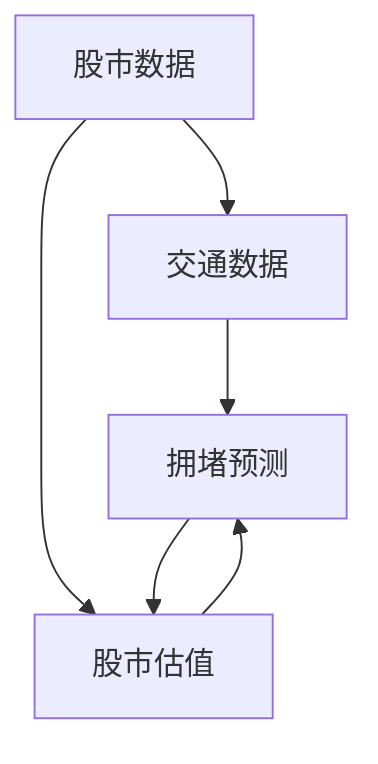
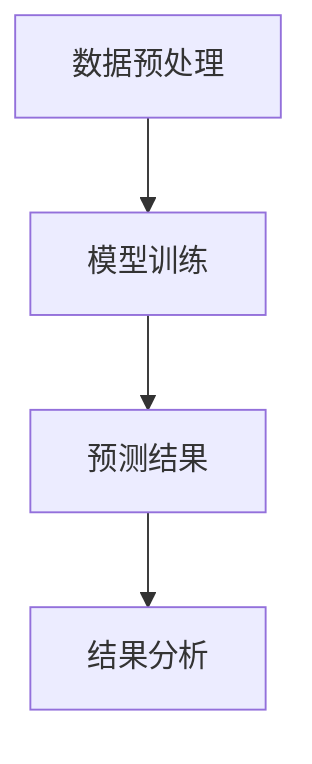
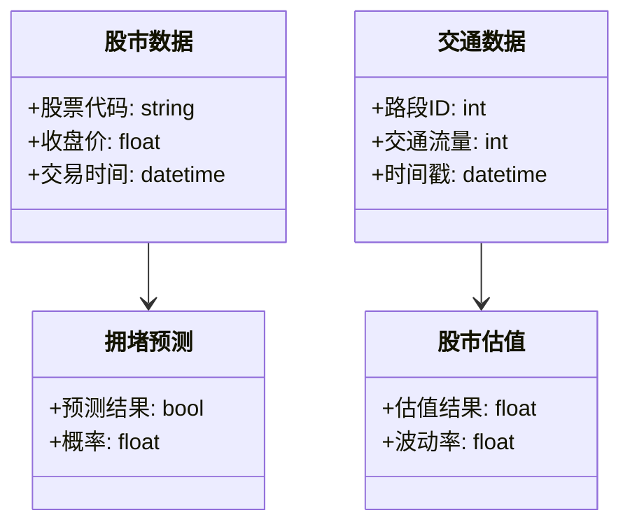
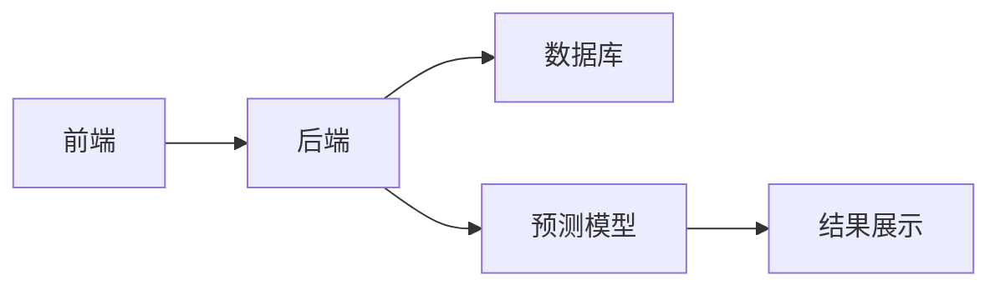
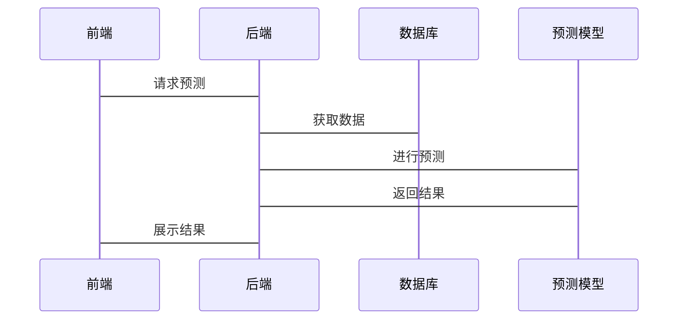

                 


# 新兴市场股市估值与智能交通拥堵预测的互动

## 关键词：新兴市场、股市估值、智能交通、拥堵预测、数据共享、模型融合、互动关系

## 摘要：本文探讨新兴市场股市估值与智能交通拥堵预测之间的互动关系，分析两者在数据、算法和系统层面的互动机制，并通过具体案例展示如何利用数据共享和模型融合实现互动预测，为智能交通和金融领域提供新的研究方向和实践指导。

---

# 第一部分: 引言

## 第1章: 互动主题概述

### 1.1 新兴市场股市估值与智能交通拥堵预测的互动背景

#### 1.1.1 新兴市场的定义与特点
新兴市场是指经济快速发展但尚未完全成熟的国家或地区，如中国、印度、巴西等。这些市场具有高增长潜力，但也面临股市波动大、交通基础设施不足等问题。

#### 1.1.2 智能交通系统的发展现状
智能交通系统（ITS）通过大数据、人工智能等技术优化交通管理，减少拥堵。然而，交通拥堵问题在新兴市场尤为突出，城市化进程加快导致道路资源紧张。

#### 1.1.3 互动主题的提出与研究意义
股市估值与交通拥堵看似无关，但两者都涉及数据驱动的预测与优化。本文提出将两者结合，通过数据共享和模型融合，探索新兴市场中交通与经济的互动关系。

---

## 第2章: 核心概念与背景介绍

### 2.1 新兴市场股市估值的背景

#### 2.1.1 股市估值的定义与方法
股市估值是通过分析公司基本面、市场趋势等，估算股票的合理价格。常用方法包括市盈率、市净率、现金流折现法等。

#### 2.1.2 新兴市场的特殊性与挑战
新兴市场股市波动大，受政策、经济和外部环境影响显著。投资者需考虑货币风险、流动性风险等因素。

#### 2.1.3 股市估值的核心要素与边界
核心要素包括公司财务数据、行业竞争状况、宏观经济指标等。边界包括数据的实时性、模型的适用性等。

### 2.2 智能交通拥堵预测的背景

#### 2.2.1 交通拥堵的定义与影响
交通拥堵指交通流量超过道路容量，导致通行效率降低。其影响包括时间成本增加、能源消耗上升、环境污染加剧等。

#### 2.2.2 智能交通系统的定义与特点
智能交通系统利用传感器、摄像头、大数据和AI技术，实时监测和优化交通流量。

#### 2.2.3 拥堵预测的核心要素与边界
核心要素包括交通流量数据、天气状况、节假日因素等。边界包括数据的实时性、模型的预测精度等。

### 2.3 互动关系的定义与外延

#### 2.3.1 互动关系的定义
互动关系指股市估值与交通拥堵预测之间存在数据共享和模型融合的可能性，通过相互作用优化预测结果。

#### 2.3.2 互动关系的外延与应用场景
应用场景包括城市交通优化、股市风险评估、政策制定等。

#### 2.3.3 互动关系的核心要素与概念结构
核心要素包括数据共享机制、模型融合方法、反馈机制等。

---

## 第3章: 核心概念与联系

### 3.1 核心概念原理

#### 3.1.1 股市估值的核心原理
股市估值通过分析公司财务数据、市场情绪和宏观经济指标，预测股票价格的变化趋势。

#### 3.1.2 拥堵预测的核心原理
拥堵预测通过分析交通流量、天气和事件数据，利用机器学习模型预测拥堵发生的时间和地点。

#### 3.1.3 互动关系的数学模型
$$
\text{互动模型} = \text{股市数据} \times \text{交通数据} + \text{权重因子}
$$

### 3.2 核心概念属性特征对比

#### 3.2.1 股市估值与拥堵预测的属性对比
| 属性       | 股市估值          | 拥堵预测          |
|------------|-------------------|-------------------|
| 数据类型    | 数值型、文本型    | 数值型、时间序列型 |
| 预测目标    | 股价变化          | 拥堵程度          |
| 影响因素    | 宏观经济、公司基本面 | 交通流量、天气    |

#### 3.2.2 互动关系的属性对比
| 属性       | 互动关系          |
|------------|-------------------|
| 数据依赖    | 高                |
| 预测难度    | 中高              |
| 应用场景    | 城市交通优化、经济预测 |

### 3.3 ER实体关系图



---

## 第4章: 算法原理讲解

### 4.1 股市估值算法

#### 4.1.1 股市估值的常用算法
常用算法包括ARIMA、LSTM和随机森林等。

#### 4.1.2 基于ARIMA的股市预测模型
ARIMA（自回归积分滑动平均模型）适用于时间序列数据的预测。

#### 4.1.3 算法流程图



#### 4.1.4 Python代码实现

```python
import pandas as pd
from statsmodels.tsa.arima.model import ARIMA

# 数据预处理
data = pd.read_csv('stock_data.csv')
data = data['price'].diff().dropna()

# 模型训练
model = ARIMA(data, order=(5, 1, 0))
model_fit = model.fit()

# 预测结果
forecast = model_fit.forecast(steps=5)
```

### 4.2 拥堵预测算法

#### 4.2.1 拥堵预测的常用算法
常用算法包括支持向量机（SVM）、随机森林和LSTM等。

#### 4.2.2 基于LSTM的拥堵预测模型
LSTM（长短期记忆网络）适用于时间序列数据的预测。

#### 4.2.3 算法流程图


#### 4.2.4 Python代码实现

```python
import numpy as np
from tensorflow.keras.models import Sequential
from tensorflow.keras.layers import LSTM, Dense

# 数据预处理
data = np.array(stock_data).reshape(-1, 1, 1)

# 模型训练
model = Sequential()
model.add(LSTM(50, input_shape=(1, 1)))
model.add(Dense(1))
model.compile(optimizer='adam', loss='mean_squared_error')
model.fit(data, labels, epochs=50, batch_size=32)
```

---

## 第5章: 系统分析与架构设计方案

### 5.1 问题场景介绍

#### 5.1.1 问题描述
新兴市场中，交通拥堵和股市波动相互影响，需要通过数据共享和模型融合实现互动预测。

#### 5.1.2 项目介绍
本项目旨在设计一个综合系统，实现股市估值与交通拥堵预测的互动预测。

### 5.2 系统功能设计

#### 5.2.1 领域模型类图



#### 5.2.2 系统架构设计



#### 5.2.3 系统交互序列图



---

## 第6章: 项目实战

### 6.1 环境安装

#### 6.1.1 安装Python环境
安装Python 3.8及以上版本，安装pip。

#### 6.1.2 安装依赖库
```bash
pip install numpy pandas statsmodels tensorflow
```

### 6.2 核心实现

#### 6.2.1 股市估值实现

```python
import pandas as pd
from statsmodels.tsa.arima.model import ARIMA

# 数据预处理
data = pd.read_csv('stock_data.csv')
data = data['price'].diff().dropna()

# 模型训练
model = ARIMA(data, order=(5, 1, 0))
model_fit = model.fit()

# 预测结果
forecast = model_fit.forecast(steps=5)
```

#### 6.2.2 拥堵预测实现

```python
import numpy as np
from tensorflow.keras.models import Sequential
from tensorflow.keras.layers import LSTM, Dense

# 数据预处理
data = np.array(stock_data).reshape(-1, 1, 1)

# 模型训练
model = Sequential()
model.add(LSTM(50, input_shape=(1, 1)))
model.add(Dense(1))
model.compile(optimizer='adam', loss='mean_squared_error')
model.fit(data, labels, epochs=50, batch_size=32)
```

### 6.3 案例分析

#### 6.3.1 案例背景
分析某新兴市场城市，结合股市数据和交通数据，预测交通拥堵和股市波动的互动关系。

#### 6.3.2 数据分析
通过数据可视化工具展示股市波动与交通拥堵的关系。

#### 6.3.3 模型评估
评估模型的准确率、召回率等指标，优化模型参数。

---

## 第7章: 总结与展望

### 7.1 总结

#### 7.1.1 核心内容回顾
本文探讨了新兴市场股市估值与智能交通拥堵预测的互动关系，分析了数据共享和模型融合的实现方法。

#### 7.1.2 主要结论
通过数据共享和模型融合，可以实现股市估值与交通拥堵预测的互动预测，优化城市交通和经济表现。

### 7.2 展望

#### 7.2.1 未来研究方向
进一步研究数据共享的安全性和隐私保护，探索更高效的模型融合方法。

#### 7.2.2 实际应用价值
本文提出的方法可应用于城市交通优化和经济预测，具有重要的理论和实践意义。

### 7.3 最佳实践 tips

#### 7.3.1 数据处理建议
确保数据的实时性和准确性，合理处理缺失值和异常值。

#### 7.3.2 模型优化建议
根据具体场景选择合适的模型，通过交叉验证优化模型参数。

#### 7.3.3 系统设计建议
合理设计系统架构，确保系统的可扩展性和可维护性。

---

通过本文的分析与实践，读者可以深入了解新兴市场股市估值与智能交通拥堵预测的互动关系，并将其应用于实际场景中。

