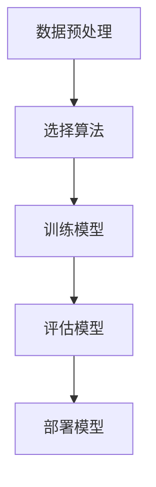
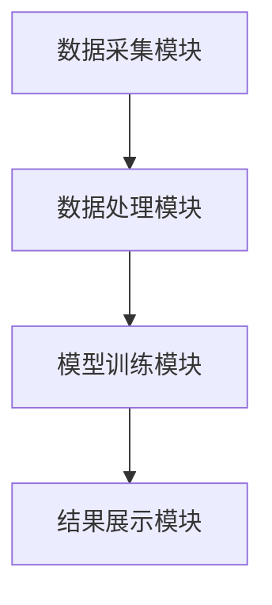

                 


# 新兴市场股市估值与智能制造Predictive Maintenance的互动

## 关键词：  
股市估值、智能制造、预测性维护、机器学习、数据驱动决策、系统架构

## 摘要：  
本文探讨了新兴市场股市估值与智能制造中的预测性维护（Predictive Maintenance，简称PM）之间的互动关系。通过分析两者的核心概念、算法原理、系统架构以及项目实战，本文揭示了如何通过数据驱动的方法优化股市估值模型，并将其与预测性维护系统相结合，以实现企业价值的最大化。本文适合对人工智能、数据分析和智能制造感兴趣的读者阅读。

---

## 第一部分：背景与概念

### 第1章：新兴市场股市估值概述

#### 1.1 股市估值的基本概念  
股市估值是通过对公司财务数据、市场趋势和宏观经济指标的分析，估算公司股票的合理价格区间。在新兴市场中，股市估值受到政策、经济波动和市场参与度等多种因素的影响。  

- **重要性**：股市估值是投资者决策的核心依据，也是企业价值评估的重要指标。  
- **影响因素**：包括公司盈利能力、行业竞争格局、宏观经济环境、政策支持等。  

#### 1.2 智能制造与预测性维护的概念  
智能制造是通过数字化技术优化生产流程，实现高效、灵活的生产模式。预测性维护是智能制造中的关键技术，通过实时数据分析预测设备故障，从而减少停机时间并降低维护成本。  

- **预测性维护的技术基础**：基于传感器数据和机器学习算法，构建设备健康状态模型。  
- **价值**：通过预测性维护，企业可以显著提高设备利用率，降低维护成本，并优化生产计划。  

---

### 第2章：股市估值与智能制造的互动关系

#### 2.1 互动的背景与问题描述  
新兴市场的股市估值与智能制造的预测性维护之间存在潜在的互动关系。例如，股市估值模型可以通过分析智能制造企业的设备维护数据，更准确地评估企业的运营效率和盈利能力。同时，预测性维护系统的优化可以为企业带来更高的收益，从而影响股市估值。  

- **数据共享的可能性**：智能制造企业可以通过共享设备数据，为股市估值模型提供更丰富的数据源。  
- **模型的相互影响**：股市估值模型的优化可以为预测性维护系统提供参考，反之亦然。  

#### 2.2 核心概念对比表  
以下是股市估值与预测性维护的核心概念对比：  

| 概念 | 股市估值 | 预测性维护 |
|------|----------|------------|
| 数据来源 | 市场数据、财务数据 | 设备传感器数据 |
| 分析目标 | 股价预测、企业价值评估 | 设备故障预测、维护计划优化 |
| 技术工具 | 机器学习、时间序列分析 | 机器学习、统计分析 |

#### 2.3 ER实体关系图  
以下是股市估值与预测性维护的实体关系图：  

```mermaid
entity Relationship {
    股市数据 --> 股价预测模型
    设备数据 --> 预测性维护模型
    股价预测模型 --> 企业价值评估
    预测性维护模型 --> 生产优化
}
```

---

## 第二部分：算法原理

### 第3章：预测性维护的算法实现

#### 3.1 算法选择与数据预处理  
在预测性维护中，常用的算法包括随机森林、XGBoost和LSTM。以下是一个典型的预测性维护算法流程：  



##### 数据预处理  
数据预处理是预测性维护的关键步骤，包括：  
1. 数据清洗：去除噪声数据和异常值。  
2. 特征工程：提取有意义的特征，例如设备运行时间、振动频率等。  

##### 算法选择  
根据数据类型和任务目标选择算法。例如，使用XGBoost进行分类任务，使用LSTM进行时间序列预测。  

#### 3.2 模型训练与评估  
模型训练需要使用训练数据进行参数优化，并通过验证数据评估模型性能。常用的评估指标包括精确率、召回率和F1分数。  

##### 代码实现  
以下是一个使用XGBoost进行预测性维护的代码示例：  

```python
import xgboost as xgb

# 数据准备
train_data = ...
test_data = ...

# 模型训练
model = xgb.XGBClassifier()
model.fit(train_data)

# 预测与评估
y_pred = model.predict(test_data)
print("F1分数:", f1_score(y_true, y_pred))
```

---

### 第4章：股市估值的算法实现

#### 4.1 算法选择与数据预处理  
股市估值常用的算法包括时间序列分析（如ARIMA）和机器学习模型（如随机森林）。  

##### 数据预处理  
- 数据清洗：去除缺失值和异常值。  
- 特征工程：提取技术指标（如移动平均线、相对强弱指数）。  

#### 4.2 模型训练与评估  
模型训练需要使用历史股价数据，并通过交叉验证评估模型性能。  

##### 代码实现  
以下是一个使用LSTM进行股市预测的代码示例：  

```python
import keras

# 定义LSTM模型
model = keras.Sequential()
model.add(keras.layers.LSTM(64, input_shape=(timesteps, features)))
model.add(keras.layers.Dense(1))
model.compile(optimizer='adam', loss='mean_squared_error')

# 训练模型
model.fit(X_train, y_train, epochs=100, batch_size=32)
```

---

## 第三部分：系统分析与架构设计

### 第5章：系统架构设计

#### 5.1 系统功能设计  
预测性维护与股市估值的互动系统包括以下功能模块：  
1. 数据采集：从设备和市场获取数据。  
2. 数据处理：清洗和预处理数据。  
3. 模型训练：训练预测性维护和股市估值模型。  
4. 结果展示：可视化模型输出结果。  

#### 5.2 系统架构图  
以下是系统的架构图：  



---

## 第四部分：项目实战

### 第6章：项目实现

#### 6.1 环境安装  
需要安装以下工具：  
- Python 3.8+  
- Pandas、NumPy、Scikit-learn  
- XGBoost、Keras  

#### 6.2 核心代码实现  
以下是一个预测性维护与股市估值互动的代码示例：  

```python
import pandas as pd
import numpy as np

# 数据加载
df = pd.read_csv('data.csv')

# 数据预处理
X = df.drop('target', axis=1)
y = df['target']

# 模型训练
from sklearn.ensemble import RandomForestClassifier
model = RandomForestClassifier()
model.fit(X, y)

# 预测与评估
y_pred = model.predict(X)
print("准确率:", accuracy_score(y, y_pred))
```

---

## 第五部分：总结与展望

### 第7章：总结与展望

#### 7.1 总结  
本文探讨了新兴市场股市估值与智能制造预测性维护的互动关系，分析了两者的核心概念、算法原理和系统架构。通过数据驱动的方法，可以实现企业价值的最大化。  

#### 7.2 展望  
未来的研究可以进一步探索如何通过深度学习技术优化模型，并结合边缘计算实现实时互动。  

---

通过本文的分析，读者可以深入了解股市估值与预测性维护的互动关系，并将其应用于实际场景中。

