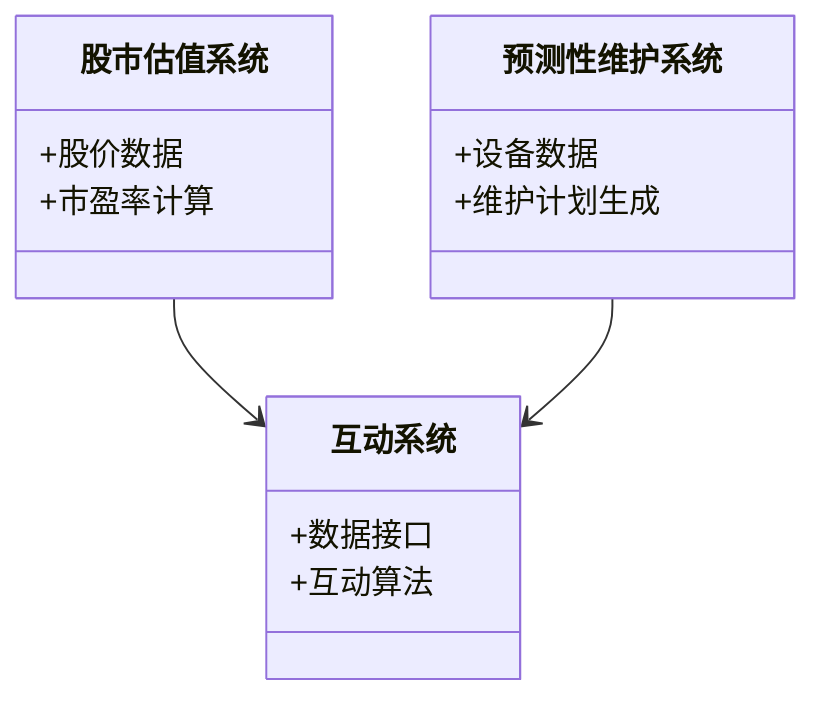
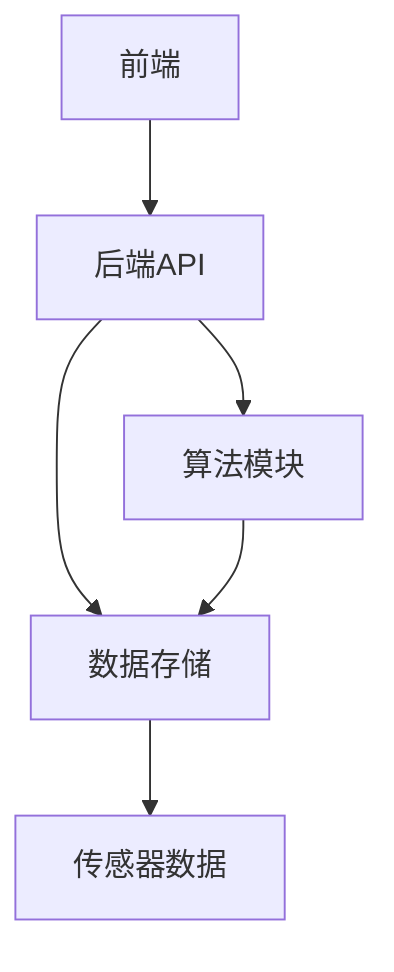
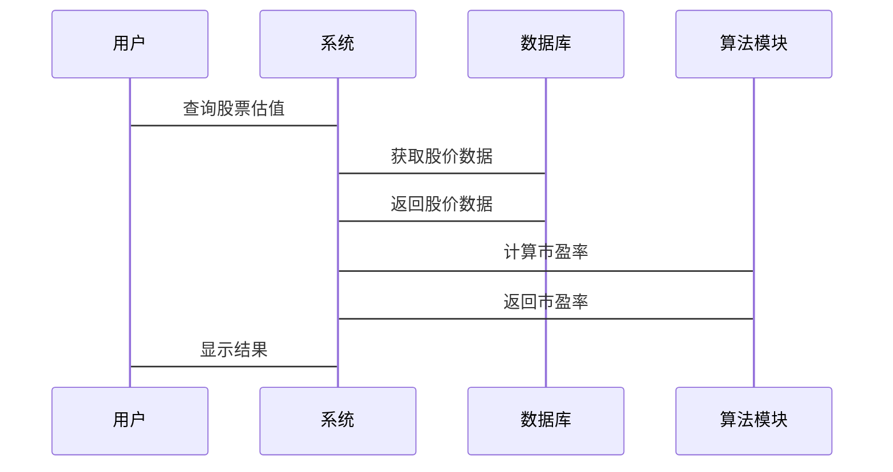

                 


# 新兴市场股市估值与智能制造预测性维护的互动

> 关键词：新兴市场，股市估值，智能制造，预测性维护，机器学习，系统架构

> 摘要：本文探讨了新兴市场股市估值与智能制造预测性维护之间的互动关系。通过分析两者的核心概念、算法原理、系统架构以及实际案例，展示了如何利用技术手段实现两者的深度融合，为企业决策提供支持。

---

## 第1章：背景介绍与问题定义

### 1.1 问题背景

#### 1.1.1 新兴市场股市估值的重要性
新兴市场通常具有较高的增长潜力，但其股市估值波动较大。准确的股市估值可以帮助投资者做出更明智的决策，避免因市场波动带来的损失。

#### 1.1.2 智能制造预测性维护的必要性
智能制造通过预测性维护可以减少设备故障，降低维护成本，提高生产效率。预测性维护的核心在于利用传感器数据和算法预测设备的健康状态。

#### 1.1.3 两者的互动关系与潜在价值
股市估值与智能制造的互动体现在数据共享、技术融合和价值创造。例如，股市估值模型可以利用智能制造的设备数据，而智能制造的维护策略可以参考股市估值的波动情况。

---

## 第2章：核心概念与联系

### 2.1 核心概念与问题描述

#### 2.1.1 股市估值的基本概念
股市估值是通过分析公司财务数据、市场趋势和宏观经济指标来评估股票的内在价值。常用指标包括市盈率（P/E）、市净率（P/B）等。

#### 2.1.2 预测性维护的基本概念
预测性维护是通过传感器数据和算法预测设备的故障风险，从而制定最优的维护计划。这种方法可以减少停机时间，降低维护成本。

#### 2.1.3 互动机制的定义与边界
互动机制是指通过数据共享和算法融合，将股市估值与预测性维护结合起来，优化企业决策。例如，利用股市估值模型预测企业盈利变化，调整预测性维护策略。

### 2.2 核心概念对比与ER图

#### 2.2.1 核心概念属性特征对比表
| 概念       | 股市估值 | 预测性维护 |
|------------|----------|------------|
| 核心目标   | 评估股票价值 | 减少设备故障 |
| 数据来源   | 财务数据、市场指标 | 设备传感器数据 |
| 应用场景   | 投资决策 | 制造业维护 |

#### 2.2.2 ER实体关系图
```mermaid
er
    entity 股市估值 {
        key 股票代码
        attribute 市盈率, 市净率
    }
    entity 预测性维护 {
        key 设备ID
        attribute 故障率, 维护周期
    }
    relationship 股市估值与预测性维护 {
        股票代码 --> 设备ID
    }
```

---

## 第3章：算法原理与数学模型

### 3.1 算法原理

#### 3.1.1 股市估值预测算法
常用机器学习算法包括线性回归、随机森林和LSTM。例如，使用LSTM模型预测股票价格波动。

#### 3.1.2 预测性维护算法
常用算法包括回归分析、时间序列分析和神经网络。例如，使用XGBoost模型预测设备故障概率。

#### 3.1.3 互动机制算法
将股市估值和预测性维护的数据进行融合，使用协同过滤或图神经网络进行跨领域的关联分析。

### 3.2 数学模型与公式

#### 3.2.1 股市估值模型
$$ P/E = \frac{股价}{每股收益} $$

#### 3.2.2 预测性维护模型
$$ MTBF = \frac{总运行时间}{故障次数} $$

#### 3.2.3 互动模型
$$ I = \alpha \cdot P + \beta \cdot M $$

### 3.3 举例说明

#### 3.3.1 股市估值案例
假设某公司的市盈率为20，每股收益为5元，则股价为100元。

#### 3.3.2 预测性维护案例
某设备的故障率为5%，维护周期为100小时，则建议在运行500小时后进行维护。

---

## 第4章：系统分析与架构设计

### 4.1 系统分析

#### 4.1.1 问题场景介绍
新兴市场中，企业需要同时优化股市估值和智能制造的预测性维护，以提高整体竞争力。

#### 4.1.2 项目介绍
本项目旨在构建一个集成系统，将股市估值与预测性维护的数据和算法进行融合，提供实时的决策支持。

### 4.2 系统功能设计

#### 4.2.1 领域模型


#### 4.2.2 系统架构设计


#### 4.2.3 系统接口设计
接口1：从股市数据源获取股价数据。
接口2：从设备传感器获取设备数据。

### 4.3 系统交互设计

#### 4.3.1 交互流程
1. 用户输入查询条件。
2. 系统从数据源获取数据。
3. 算法模块进行计算。
4. 系统生成结果并返回给用户。

#### 4.3.2 交互示例


---

## 第5章：项目实战

### 5.1 环境安装

#### 5.1.1 安装Python环境
使用Anaconda安装Python 3.8及以上版本。

#### 5.1.2 安装依赖库
安装numpy、pandas、scikit-learn、xgboost等库。

### 5.2 系统核心实现

#### 5.2.1 股市估值模型代码
```python
import pandas as pd
from sklearn.linear_model import LinearRegression

# 数据预处理
data = pd.read_csv('stock_data.csv')
X = data[['PE', 'PB']]
y = data['Price']

# 模型训练
model = LinearRegression()
model.fit(X, y)

# 预测
new_data = pd.DataFrame({'PE': [20], 'PB': [5]})
prediction = model.predict(new_data)
print(prediction)
```

#### 5.2.2 预测性维护模型代码
```python
import xgboost as xgb

# 数据预处理
data = pd.read_csv('equipment_data.csv')
X = data[['运行时间', '故障率']]
y = data['故障状态']

# 模型训练
model = xgb.XGBClassifier()
model.fit(X, y)

# 预测
new_data = pd.DataFrame({'运行时间': [1000], '故障率': [5]})
prediction = model.predict(new_data)
print(prediction)
```

### 5.3 案例分析

#### 5.3.1 股市估值案例分析
通过模型预测某股票的市盈率，评估其投资价值。

#### 5.3.2 预测性维护案例分析
通过模型预测设备的故障概率，制定最优的维护计划。

---

## 第6章：总结与展望

### 6.1 总结
本文通过分析新兴市场股市估值与智能制造预测性维护的互动关系，展示了如何利用技术手段实现两者的深度融合，为企业决策提供支持。

### 6.2 最佳实践
- 数据隐私保护
- 系统兼容性设计
- 持续优化算法

### 6.3 注意事项
- 数据质量控制
- 系统稳定性保障
- 用户培训与支持

### 6.4 拓展阅读
推荐相关文献，如《机器学习在金融领域的应用》和《智能制造中的预测性维护技术》。

---

## 关键词索引
新兴市场，股市估值，智能制造，预测性维护，机器学习，系统架构

